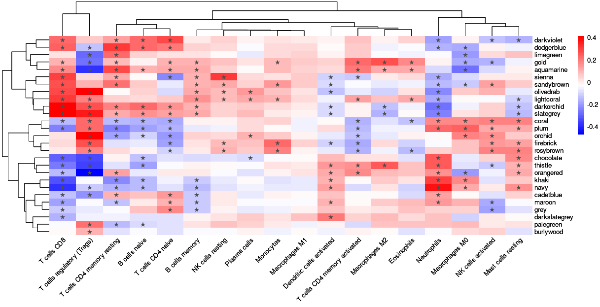
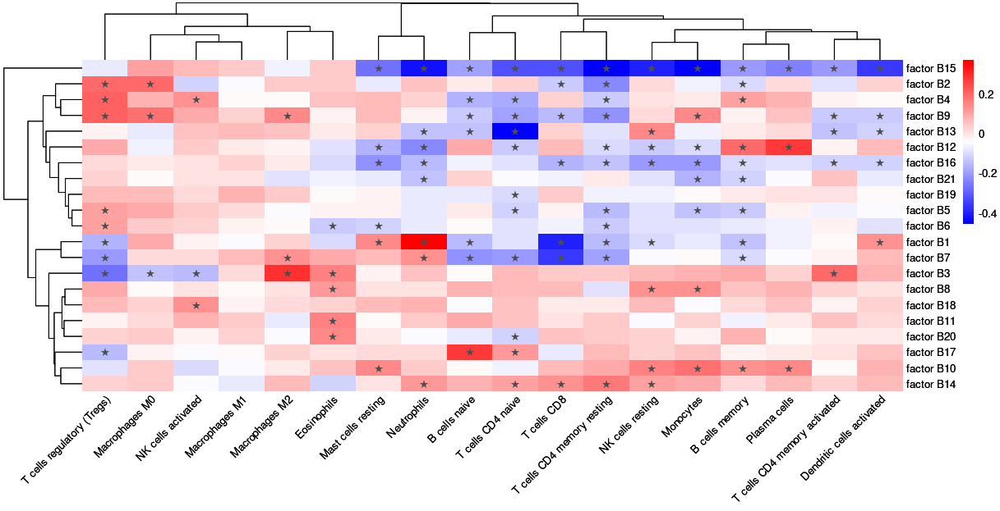
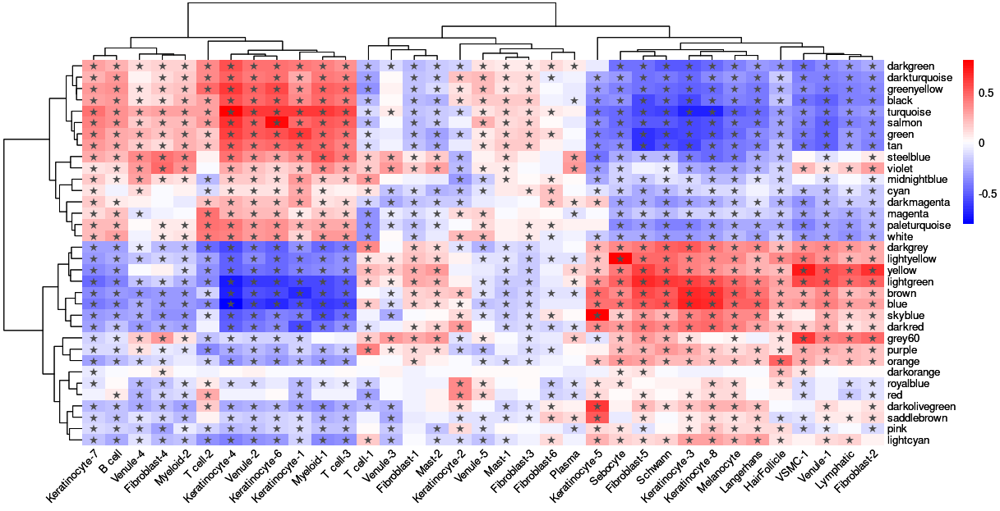
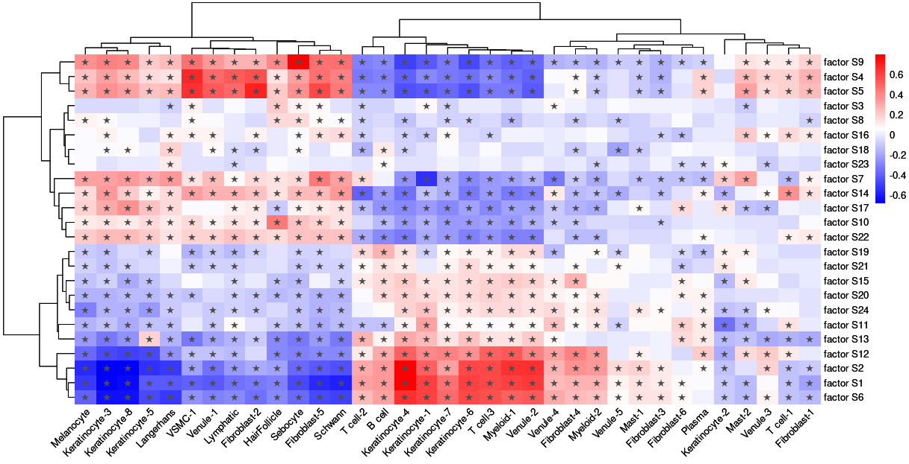

PSORT: Correlation heatmaps
===========================

<!-- ## libraries ---- -->

```r
library(tidyverse)
library(pheatmap)

```

## Generating cell type fractions

Abundance of cell types was inferred using the CibersortX online tool <https://doi.org/10.1038/s41587-019-0114-2>.

To infer cell types in blood, the LM22 signature matrix provided by CibersortX was used. The mixture file was generated from PSORT blood RNA-Seq data. Cell fractions were imputed using recommended CibersortX settings.

To infer cell types in skin, a single-cell reference matrix was generated using single-cell RNA-Sequencing data from the Single Cell portal developed by the Broad Institute of MIT and Harvard <https://singlecell.broadinstitute.org/single_cell>. The reference matrix was downsampled to a maximum of 200 cells per cell-type. The reference matrix was used to generate a Signature Matrix file using recommended CibersortX settings. Bulk RNA-Seq data for both PSORT discovery and replication cohorts was used to generate the mixture file. Cell fractions were imputed in absolute mode using 'B-mode' batch correction.

## Correlations of cell type fractions with latent factors and module eigengenes

Per-sample imputed absolute cell fractions for each cell type were tested for association with per-sample WGCNA module eigengene loadings and with per-sample Latent Factor loadings using the cor.test function from the R statistical computing environment. Correlation tests used Kendall's tau coefficient. Adjusted p-values were calculated with the p.adjust function using the method of Benjamini & Hochberg.


```r

# Function to get cell type correlations
get_cell_type_correlations = function(row_data, col_data, cor_method = "kendall", padj_method = "BH"){
  
  # Make blank matrices
  cor_mat = matrix(ncol = ncol(col_data)-1, nrow = ncol(row_data)-1,
                   dimnames = list(colnames(row_data)[-1], colnames(col_data)[-1]))
  pval_mat = cor_mat
  # Populate with correlations and p-values
  for(i in colnames(row_data)[-1]){
    for(j in colnames(col_data)[-1]){
      cor_res = cor.test(row_data[[i]], col_data[[j]], method = cor_method)
      cor_mat[i,j] = cor_res$estimate
      pval_mat[i,j] = cor_res$p.value
    }
  }
  # Adjust p-values
  padj_mat = matrix(p.adjust(pval_mat, method = padj_method), nrow = nrow(pval_mat))
  colnames(padj_mat) = colnames(pval_mat)
  rownames(padj_mat) = rownames(pval_mat)
  
  return(list(cor_mat = cor_mat, padj_mat = padj_mat))
}


# Function to draw correlation heatmap
draw_heatmap = function(cor_df, padj_df){
  
  # Write an asterisk in cell if cor.test passed adjusted p-value < 0.05
  cell_stars = ifelse(padj_df < 0.05, "\u2605", "")
  # Make heatmap
  p = pheatmap(mat = cor_df,
               display_numbers = cell_stars,
               fontsize_number = 10,
               color = colorRampPalette(c("blue", "white", "red"))(64),
               scale = "none",
               show_colnames = TRUE,
               show_rownames = TRUE,
               angle_col = 45,
               border_color = NA,
               treeheight_row = 70)
  
  return(p)
}

```

```r

# Load input data: Blood
blood_cb_fractions = readRDS(file = "paper_data/blood_cb_fractions.RData")
blood_eigengenes = readRDS(file = "paper_data/blood_eigengenes.RData")
blood_factors = readRDS(file = "paper_data/blood_factors.RData")

# Load input data: Skin
skin_cb_fractions = readRDS(file = "paper_data/skin_cb_fractions.RData")
skin_eigengenes = readRDS(file = "paper_data/skin_eigengenes.RData")
skin_factors = readRDS(file = "paper_data/skin_factors.RData")

```


### Blood module correlations


```r

blood_module_corrs = get_cell_type_correlations(row_data = blood_eigengenes,
                                                col_data = blood_cb_fractions,
                                                cor_method = "kendall",
                                                padj_method = "BH")

draw_heatmap(cor_df = blood_module_corrs$cor_mat,
             padj_df = blood_module_corrs$padj_mat)

```

<!-- -->


### Blood factor correlations


```r

blood_factor_corrs = get_cell_type_correlations(row_data = blood_factors,
                                                 col_data = blood_cb_fractions,
                                                 cor_method = "kendall",
                                                 padj_method = "BH")

draw_heatmap(cor_df = blood_factor_corrs$cor_mat,
             padj_df = blood_factor_corrs$padj_mat)

```

<!-- -->


### Skin module correlations


```r

skin_module_corrs = get_cell_type_correlations(row_data = skin_eigengenes,
                                               col_data = skin_cb_fractions,
                                               cor_method = "kendall",
                                               padj_method = "BH")

draw_heatmap(cor_df = skin_module_corrs$cor_mat,
             padj_df = skin_module_corrs$padj_mat)

```

<!-- -->


### Skin factor correlations


```r

skin_factor_corrs = get_cell_type_correlations(row_data = skin_factors,
                                               col_data = skin_cb_fractions,
                                               cor_method = "kendall",
                                               padj_method = "BH")

draw_heatmap(cor_df = skin_factor_corrs$cor_mat,
             padj_df = skin_factor_corrs$padj_mat)

```

<!-- -->


```r

sessionInfo()

```

    ## R version 4.2.2 Patched (2022-11-10 r83330)
    ## Platform: x86_64-pc-linux-gnu (64-bit)
    ## Running under: Ubuntu 22.04.1 LTS
    ## 
    ## Matrix products: default
    ## BLAS:   /usr/lib/x86_64-linux-gnu/blas/libblas.so.3.10.0
    ## LAPACK: /usr/lib/x86_64-linux-gnu/lapack/liblapack.so.3.10.0
    ## 
    ## locale:
    ## [1] LC_CTYPE=en_US.UTF-8       LC_NUMERIC=C               LC_TIME=en_US.UTF-8        LC_COLLATE=en_US.UTF-8    
    ## [5] LC_MONETARY=en_US.UTF-8    LC_MESSAGES=en_US.UTF-8    LC_PAPER=en_US.UTF-8       LC_NAME=C                 
    ## [9] LC_ADDRESS=C               LC_TELEPHONE=C             LC_MEASUREMENT=en_US.UTF-8 LC_IDENTIFICATION=C       
    ## 
    ## attached base packages:
    ## [1] stats     graphics  grDevices utils     datasets  methods   base     
    ## 
    ## other attached packages:
    ## [1] pheatmap_1.0.12 forcats_0.5.2   stringr_1.5.0   dplyr_1.1.4     purrr_1.0.0     readr_2.1.3     tidyr_1.2.1
    ## [8] tibble_3.2.1    ggplot2_3.5.1   tidyverse_1.3.2
    ## 
    ## loaded via a namespace (and not attached):
    ## [1] xfun_0.35           tidyselect_1.2.0    haven_2.5.1         gargle_1.2.1        colorspace_2.0-3   
    ## [6] vctrs_0.6.5         generics_0.1.3      htmltools_0.5.4     yaml_2.3.6          utf8_1.2.2         
    ## [11] rlang_1.1.4         pillar_1.9.0        glue_1.6.2          withr_2.5.0         DBI_1.1.3          
    ## [16] dbplyr_2.2.1        RColorBrewer_1.1-3  modelr_0.1.10       readxl_1.4.1        lifecycle_1.0.3    
    ## [21] munsell_0.5.0       gtable_0.3.1        cellranger_1.1.0    rvest_1.0.3         evaluate_0.19      
    ## [26] knitr_1.41          tzdb_0.3.0          fastmap_1.1.0       fansi_1.0.3         broom_1.0.2        
    ## [31] scales_1.3.0        backports_1.4.1     googlesheets4_1.0.1 jsonlite_1.8.4      fs_1.5.2           
    ## [36] hms_1.1.2           digest_0.6.31       stringi_1.7.8       grid_4.2.2          cli_3.5.0          
    ## [41] tools_4.2.2         magrittr_2.0.3      crayon_1.5.2        pkgconfig_2.0.3     ellipsis_0.3.2     
    ## [46] xml2_1.3.3          reprex_2.0.2        googledrive_2.0.0   lubridate_1.9.3     timechange_0.1.1   
    ## [51] assertthat_0.2.1    rmarkdown_2.19      httr_1.4.4          rstudioapi_0.14     R6_2.5.1           
    ## [56] compiler_4.2.2     

