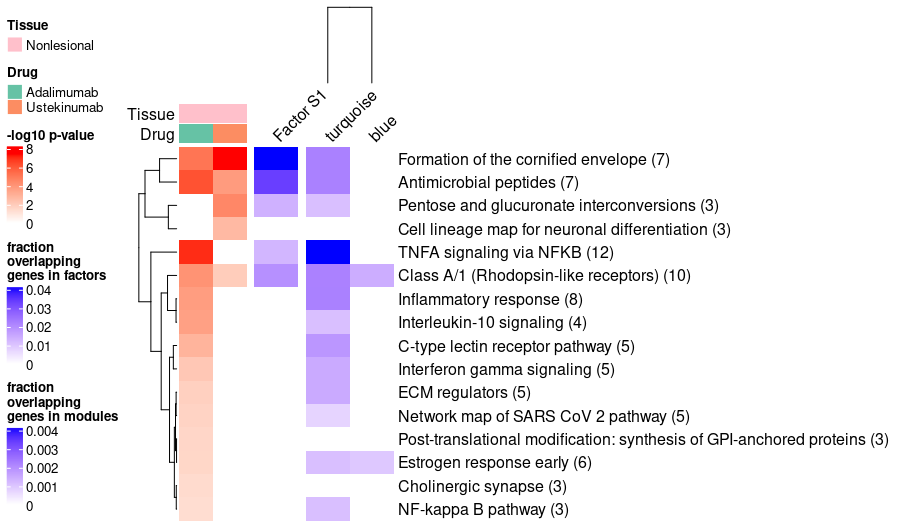

DE Analysis (Nonlesional Skin, fig 7) II: Make Metascape Heatmaps
================
Graham R Smith
04 February 2025

Makes WGCNA module- and ICA factor-annotated heatmaps, derived from
[Metascape](https://metascape.org) annotations of DE analysis of NL
skin.

### Load libraries

``` r
library(tidyverse)
library(mgsub)
library(ComplexHeatmap)
library(circlize)
library(RColorBrewer)
library(readxl)
library(UpSetR)
library(stringr)
library(splines)
# library(annotables)
source("functions/get_modules.R")
source("functions/reload_factors.R")
```

final version - includes factors as well as modules

### Set variables

``` r
# library(annotables)

# options(bitmapType="cairo")

short_tissues <- c("Lesional" = "LS", "Nonlesional" = "NL", "Blood" = "BL")

options(stringsAsFactors = F)

mydebug = FALSE
# print file names of top table files when being read in in comp_dot 
verbose = FALSE

# use this to pause between gene heatmaps so can look at them 
interact <- FALSE
# change sign of signed fit range to match convention elsewhere
flip_sign <- TRUE


# base file path is set in main prog
```

# Declare Functions

``` r
# to get modules - prob move to another file?

factor_alignment <- 4
factors_of_interest <- c("factor_1", "factor_2", "factor_6", "factor_9", "factor_18", "factor_21")

get_anno_data <- function() {
  datad <- "/data/ngrs2/PSORT/data/"  
  annofile <- file.path(datad, "Hs.anno.csv")
  ad <- read_csv(annofile)
  ad$Description <- sub(" \\[Source.*", "", ad$Description)
  ad
}

# try to fix description strings THAT ARE ALL UPPERCASE
fix_metascape_strings <- function(strarr) {
  thisfn_debug <- FALSE
  outarr <- c()
  for (stx in strarr) {
    # Does the word have any runs of lowercase letters? look for runs of 3 lowercase at end of word(s)
    # otherwise could be something like "UTM-SGCE-DAG1-CAV1-NOS3 complex" , which you should leave alone.
    # Don't use \\b (word boundary) at start of string, or misses names where all words are capitalised
    if (str_count(stx, "[a-z]{3,}\\b") == 0) {
#    if (str_count(stx, "\\b[A-Z0-9]{3,}") == 0) {
      if (thisfn_debug)
        cat("lowercasing ", stx,"\n")
      stx <- tolower(stx)
    }
    # various replacements 
    repl_str = c("G2M", "IL6", "JAK", "STAT3", "PID","NFKB", "KRAS","PLK", "TNFA", "ECM", "IL2", "STAT5")
    names(repl_str) = tolower(repl_str)
    stx <- str_replace_all(stx, repl_str)
    # stx <- str_replace(stx, "g2m", "G2M") %>% str_replace("il6", "IL6") %>% str_replace("jak", "JAK") %>%
    #   str_replace("stat3", "STAT3") %>% str_replace("pid", "PID") %>% str_replace("nfkb", "NFKB")   %>%
    #   str_replace("kras", "KRAS") %>% str_replace("plk", "PLK") %>% str_replace("tnfa", "TNFA") %>%
    #   str_replace("ecm", "ECM")
    stx <- gsub("hallmark ", "", stx, ignore.case = TRUE)
    stx <- gsub("Naba ", "", stx, ignore.case = TRUE) #for Naba Matrisome/ECM
    stx <- gsub("signaling pathway", "pathway", stx, ignore.case = TRUE)
    stx <- gsub("NFE2L2 (NRF2) survival", "NRF2", stx, fixed = TRUE)
    stx <- gsub("Chronic hyperglycemia", "Hyperglycemia", stx, fixed = TRUE)
    stx <- gsub("bile salts and organic", "bile salts, organic", stx, fixed = TRUE)
    stx <- gsub("metal ions and amine compounds", "metals and amines", stx, fixed = TRUE)
    # put first letter back to capital 
    substr(stx,1,1) <- toupper(substr(stx,1,1))
    outarr <- c(outarr, stx)
  }
  outarr
}

make_descriptions_unique <- function(meta_groups, dt = "group") {
  # don't consider cases where descr is just duplicated between type = "Member" or type = "Summary" 
  # but if it's dplicated within one of those, paste together term and description
  if (dt == "group") {
    mgtemp <- add_count(meta_groups, paste(Type, Description))
    mgtemp <- mutate(mgtemp, Description = ifelse(n>1, paste0(Description,"(",Term,")"), Description)) 
  } else { #meta_dat
    mgtemp <- add_count(meta_groups, Description)
    mgtemp <- mutate(mgtemp, Description = ifelse(n>1, paste0(Description,"(",GO,")"), Description))     
  }
  return(mgtemp)
}

# Load metascape data
load_data <- function(result_set,  file_path = file.path(base_file_path, "metascape/LS/splinedf3/downloads/"), 
                      include_go_labels = FALSE){
  # Path to metascape data
  cat(file_path,"\n")
  # Load metascape annotation file
  meta_anno <- as.data.frame(read_excel(paste0(file_path,"/",result_set,"/metascape_result.xlsx"), sheet = 1))
  # # sometimes starts 
  # A_assoc_all_NL_splinedf3 U_assoc_all_NL_splinedf3 Gene ID            Type
  # 1          ENSG00000196639          ENSG00000244122    3269 ensembl_gene_id
  # # sometimes starts 
  # Gene     original_id A_assoc_all_LS_splinedf3 U_assoc_all_LS_splinedf3
  # 1 57650 ENSG00000163507                        1                        1
  # 
  if (names(meta_anno)[1] == "Gene") {
    meta_anno <- meta_anno[,c("Gene", "original_id")]
    colnames(meta_anno) <- c("Gene", "EnsemblID")
  } else {
    meta_anno <- meta_anno[,1:3] %>% pivot_longer(cols = 1:2) %>% select(`Gene ID`, value) %>% unique() %>% drop_na()
    colnames(meta_anno) <- c("Gene", "EnsemblID")    
  }
  
  # Load metascape group file - designates summary and member terms
  meta_groups <- as.data.frame(read_excel(paste0(file_path,"/",result_set,"/metascape_result.xlsx"), sheet = 2))
  meta_groups <- meta_groups[,c("GroupID", "Term", "Description")]
  meta_groups <- separate(meta_groups, col = "GroupID", into = c("Group", "Type"), sep = "_")
  meta_groups$Group <- paste0("G", meta_groups$Group)
  temp_descr <- fix_metascape_strings(meta_groups$Description)
  if(include_go_labels)
    meta_groups$ID <- paste0(meta_groups$Term," ", temp_descr)
  else
    meta_groups$ID <- temp_descr 
  meta_groups$Term <- NULL
  meta_groups$Description <- NULL
  # Load metascape log p-values 
  meta_dat <- read.delim(paste0(file_path,"/",result_set,"/Enrichment_GO/_FINAL_GO.csv"), sep = ",")
  logp_cols <- colnames(meta_dat)[grep("X_LogP", colnames(meta_dat))]
  meta_dat <- meta_dat[,c("GO", "Description", logp_cols, "GeneID")]
  colnames(meta_dat) <- gsub("X_LogP_", "", colnames(meta_dat))
  temp_descr <- fix_metascape_strings(meta_dat$Description)
  if(include_go_labels)
    meta_dat <- add_column(meta_dat, ID = paste0(meta_dat$GO," ", temp_descr), .before = 1)
  else
    meta_dat <- add_column(meta_dat, ID = temp_descr, .before = 1)
  meta_dat$GO <- NULL
  meta_dat$Description <- NULL
  return(list(meta_anno = meta_anno, meta_groups = meta_groups, meta_dat = meta_dat))
}


make_id_gene_table <- function(grp, meta_dat, meta_groups, meta_anno){
  # make table of ID .. Gene .. EnsemblID .. symbol for group grp given in input
  # IDs are pathways ; 
  sel_ID = filter(meta_groups, Group == paste0("G", grp) & Type == "Member") %>% pull(ID)
  out_df = NULL
  ad = get_anno_data()
  for (this_ID in sel_ID) {
    # GeneID are Ensembl
    ent_ids = filter(meta_dat, ID == this_ID) %>% pull(GeneID) %>% strsplit(., "|", fixed = T) %>% unlist()
    # join on first ensembl from meta_anno, then Symbol from ad
    this_df = tibble(ID = this_ID, Gene = ent_ids) %>% left_join(., meta_anno, by = "Gene") %>% 
      left_join(., ad[, c(1,2)], by = "EnsemblID") %>% rename(symbol = GeneSymbol)
    out_df = bind_rows(out_df, this_df)
  }
  # sometimes symbol might be NA in this verion of annotation - use ensemblID in that case, like Ashley does 
  out_df <- within(out_df, symbol[is.na(symbol)] <- EnsemblID[is.na(symbol)])
  out_df <- add_count(out_df, Gene, name = "n_ens_Gene")
  # would be good to have the modules in here too 
  skin_mod <- reload_modules("skin")$mod_df %>% select(EnsemblID, Module)
  out_df <- left_join(out_df, skin_mod, by = "EnsemblID")
  out_df
}


# comp heatmap as dotplot 
# Make FC dot plot
# comp_dot <- function(toptables, sig, sig_thresh, fc_sign = NULL, row_font_size = 10, cell_font_size = 10){

comp_dot <- function(tissue = "Lesional", cohort = "Both", model_type = "splinedf3", typestr = "all",
                outd, ids, i_in, fig_height = 6, rad_scale = 1) {
# 
  # rad_scale scales all the circles manually
  this_id <- ids[i_in]
  # -- reload mod data
  
  if (tissue == "Lesional" | tissue == "Nonlesional") {
    tmp <- reload_modules("skin") 
    jg_facts <- reload_factors( tissue = "skin")
  } else {
    tmp <- reload_modules("blood")   
    jg_facts <- reload_factors( tissue = "blood")
  }
  mod_df = tmp$mod_df
  mod_list_d = tmp$mod_list_d

  # Overlap of term genes and modules 
  # dimensions should be about 20x36?
  # not sure I need this, but it's quick and do need id_genes_d
  index <- which(meta_dat$ID %in% ids)
  meta_dat <- meta_dat[index,]
  mod_overlap <- matrix(data = NA, nrow = length(meta_dat$ID), ncol = length(mod_list_d))

  rownames(mod_overlap) <- meta_dat$ID
  colnames(mod_overlap) <- names(mod_list_d)
  id_genes_d = list()
  for(i in 1:nrow(mod_overlap)){
    id_genes <- strsplit(meta_dat$GeneID[which(meta_dat$ID == this_id)], split = "|", fixed = T)[[1]]
    id_genes <- meta_anno$EnsemblID[which(meta_anno$Gene %in% id_genes)]
    for(j in 1:ncol(mod_overlap)){
      id <- meta_dat$ID[i]
      module <- names(mod_list_d)[j]
      module_genes <- mod_list_d[[j]]$EnsemblID
      mod_overlap[i, j] <- length(intersect(id_genes, module_genes))
    }
    id_genes_d[[id]] <- id_genes
  }
  # dataframe of metascape pw 
  id_genes_df <- NULL
  for (mod in names(id_genes_d)) {
    this_pw <- data.frame(EnsemblID = id_genes_d[[mod]], Metascape = mod)
    id_genes_df <- bind_rows(id_genes_df, this_pw)
  }
  # go back to annot data to get lookup for pway genes 
  ad <- get_anno_data()

  id_genes_df <- left_join(id_genes_df, select(ad, EnsemblID, GeneSymbol))
  id_genes_df <- within(id_genes_df, GeneSymbol[is.na(GeneSymbol)] <- EnsemblID[is.na(GeneSymbol)])
  # filter to metascape pway of interest 
  # d_genes_df <- filter(id_genes_df, Metascape == ids[2])

  id_genes_df <- filter(id_genes_df, Metascape == this_id)
  pw_genes <- id_genes_df$GeneSymbol
  #g have to be careful not to throw away all lines from mod_overlap - need  at least two!

  ###- end reload mods 
  
  ### reload toptables
  # Path to DE results
  toptables = list()
  for (drug in c("A", "U")) {
    dir <- paste(cohort, drug, tissue, sep = "_")
    de_file_path <- file.path(base_file_path,dir, model_type) 
    # typestr unique or all,  get intput from files A_unique or A_responsive
    if (typestr == "unique") {
      input_de_ftype1 <- "only"
    } else if (typestr == "all") {
      input_de_ftype1 <- "responsive_genes"
    } else {
      stop("invalid typestr")
    }
    #for making file names
    iftarr <- c(input_de_ftype1, "all_genes")
    dextarr <- c("", "_all")
    for (ift in 1:2) {
      input_de_ftype <- iftarr[ift]
      ttname <- paste0(drug, dextarr[ift])
      # Load toptable
      de_res_file <- file.path(de_file_path, paste0(drug, "_", input_de_ftype, ".txt"))
      if (verbose)
        cat("reading", de_res_file,"\n")
      tt <- read.delim(de_res_file, sep = "\t")
      # change NA tt GeneSymbols to EnsemblID
      tt <- within(tt, GeneSymbol[is.na(GeneSymbol)] <- EnsemblID[is.na(GeneSymbol)])
      if (flip_sign)
        tt$signed_fit_range <- -1 * tt$signed_fit_range  
      toptables[[ttname]] <- tt
    }
  }
  
  
  
  # if read from responsive_genes files already have |effect size| > 1 and qvalue < 0.05
  # toptables$log_p <- -log10(toptables$P.Value)

  genes <- unique(c(toptables[["A"]]$EnsemblID, toptables[["U"]]$EnsemblID))
  
  # replace the read_in "A" and "U" with the union of DE in both 
  for (drug in c("A", "U"))
    toptables[[drug]] <- filter(toptables[[paste0(drug, "_all")]], EnsemblID %in% genes)
  
  tt_fc <- select(toptables[["A"]], GeneSymbol, signed_fit_range) %>% rename(ADA = signed_fit_range)
  tt_fc <- select(toptables[["U"]], GeneSymbol, signed_fit_range) %>% rename(UST = signed_fit_range) %>% full_join(tt_fc, . , by = "GeneSymbol")
  tt_fc <- data.matrix(column_to_rownames(tt_fc, var = "GeneSymbol")) 
  idx <- rownames(tt_fc) %in% pw_genes
  tt_fc <- tt_fc[idx, ]
  
  tt_logp <- select(toptables[["A"]], GeneSymbol, P.Value) %>% rename(ADA = P.Value)
  tt_logp <- select(toptables[["U"]], GeneSymbol, P.Value) %>% rename(UST = P.Value) %>% full_join(tt_logp, . , by = "GeneSymbol")
  tt_logp <- data.matrix(column_to_rownames(tt_logp, var = "GeneSymbol")) 
  idx <- rownames(tt_logp) %in% pw_genes
  tt_logp <- tt_logp[idx, ]
  tt_logp <- -log10(tt_logp)
  
  sig_thresh = 0.05
  
  # sig is one of various significances, presumably p.value, adj.p.value, q.value .. 
  tt_sig <- select(toptables[["A"]], GeneSymbol, q.value) %>% rename(ADA = q.value)
  tt_sig <- select(toptables[["U"]], GeneSymbol, q.value) %>% rename(UST = q.value) %>% full_join(tt_sig, .  , by = "GeneSymbol")
  tt_sig <- data.matrix(column_to_rownames(tt_sig, var = "GeneSymbol")) 
  tt_sig[tt_sig <= sig_thresh] <- "*"
  tt_sig[tt_sig != "*"] <- ""
  idx <- rownames(tt_sig) %in% pw_genes
  tt_sig <- tt_sig[idx, ]
  

  tt_modules <- mod_df[,c("GeneSymbol", "Module")] %>% rename(label = GeneSymbol)
  tt_modules <- tt_modules[!duplicated(tt_modules$label),]
  rownames(tt_modules) <- tt_modules$label
  tt_modules <- tt_modules[rownames(tt_fc),]
  tt_modules$label <- NULL
  
  # remove grey module genes
  gridx <- tt_modules != "grey"
  tt_modules <- tt_modules[gridx, ,drop = FALSE] 
  tt_sig <- tt_sig[gridx,]
  tt_fc <- tt_fc[gridx,]  
  tt_logp <- tt_logp[gridx,]  
  # end remove
  
  # counts of the different modules, that you can use to split hm
  table(tt_modules$Module)
  # how to divide up
  tt_moddata <- tt_modules %>% count(Module) %>% arrange(n) %>% 
    mutate(cumsum = cumsum(n)) %>% mutate(half = cumsum < 0.7*max(cumsum))
  
  # how to split up the heatmaps 
  modsplit = list()
  if (nrow(tt_fc) > 130){
    modsplit[[1]] <- tt_moddata$Module[!tt_moddata$half]  
    modsplit[[2]] <- tt_moddata$Module[tt_moddata$half]  
    ihmax <- 2
  } else {
    modsplit[[1]] <- tt_moddata$Module
    ihmax <- 1
  }
  
  # df to return with file name and type 
  stopifnot(all(rownames(tt_modules) == rownames(tt_fc)))
  
  df = NULL
  for (ih in 1:ihmax) {
    idx = tt_modules$Module %in% modsplit[[ih]]
    ngene = sum(idx)
    # this to set heatmap and annotation cell size (in mm)
    row_width = 4 
    
    col_vector = unique(tt_modules$Module)
    names(col_vector) <- unique(tt_modules$Module)
    col_vector <- col_vector[!is.na(col_vector)]
    # was used when geom was transposed  
    #  side_anno = rowAnnotation(df = tt_modules,
    #                            width = unit(6, "cm"),
    #                            col = list(Module = col_vector),
    #                            border = F)
    # don't just [idx,] this, because it reduces dimensions from 1-col df to vector
    tt_modules_plot <- filter(tt_modules, Module %in% modsplit[[ih]])
    
    bottom_anno = columnAnnotation(df = tt_modules_plot,
                                   width = nrow(tt_modules_plot)*unit(row_width,"mm"),
                                   annotation_legend_param = list( Module = list(ncol = 2)), 
                                   col = list(Module = col_vector),
                                   border = F)
    
    max_val <- max(abs(c(min(tt_fc, na.rm = T), max(tt_fc, na.rm = T))))
    if(sign(min(tt_fc, na.rm = T)) == -1 & sign(max(tt_fc, na.rm = T)) == 1){
      col_ramp <- colorRamp2(
        breaks = c(-max_val, 0, max_val),
        colors = c("blue", "white", "orange")
      )
    }else if(sign(min(tt_fc, na.rm = T)) == -1 & sign(max(tt_fc, na.rm = T)) == -1){
      col_ramp <- colorRamp2(
        breaks = c(-max_val, 0),
        colors = c("blue", "white")
      )
    }else if(sign(min(tt_fc, na.rm = T)) == 1 & sign(max(tt_fc, na.rm = T)) == 1){
      col_ramp <- colorRamp2(
        breaks = c(0, max_val),
        colors = c("white", "orange")
      )
    }
    
    tt_fc_plot = tt_fc[idx,]
    tt_logp_plot = tt_logp[idx,]
    row_font_size = 12
    col_font_size = 8
    hm <- Heatmap(t(tt_fc_plot),
                  rect_gp = gpar(type = "none"),
                  col = col_ramp,
                  bottom_annotation = bottom_anno,
                  width = ncol(t(tt_fc_plot))*unit(row_width,"mm"),
                  height = unit(fig_height, "cm"),
                  cluster_rows = FALSE, 
                  cluster_columns = TRUE,
                  row_names_side = "left",
                  row_names_max_width = unit(18, "cm"),
                  column_names_max_height = unit(1, "cm"),
                  column_names_rot = 45,
                  column_names_side = "top",
                  show_column_names = T,
                  border = F,
                  heatmap_legend_param = list(title = "signed_fit_range"),
                  row_names_gp = gpar(fontsize = row_font_size),
                  column_names_gp = gpar(fontsize = col_font_size),
                  cell_fun = function(j, i, x, y, w, h, col){
                    grid.circle(x = x, y = y, r = t(tt_logp_plot)[i, j]/8 * min(unit.c(w, h)) * rad_scale, 
                                gp = gpar(fill = col_ramp(t(tt_fc_plot)[i, j]), col = "black", alpha = 0.75))
                  }
    )
    hmd = ComplexHeatmap::draw(hm, padding = unit(c(0, 0, 0, 3), "cm"), heatmap_legend_side = "left")
    ComplexHeatmap:::width(hmd) ;   ComplexHeatmap:::height(hmd)
  
    mm2in = 1/25.4
    outfile = file.path(outd, paste(tissue, "meti", i_in, typestr, ih, "dp.svg", sep = "_"))
    
   svg(outfile, h = ComplexHeatmap:::height(hmd)*mm2in, width = ComplexHeatmap:::width(hmd)*mm2in)
    ComplexHeatmap::draw(hm, padding = unit(c(0, 0, 0, 3), "cm"), heatmap_legend_side = "left")
    dev.off()
    df = bind_rows(df, tibble(MetaScape = this_id, Meta_index = i_in, File = outfile, sub_index = ih,  ngene = ngene, 
                                       Cohort = cohort, tissue = tissue, model_type = model_type, type = typestr))
    
  }
  outfile <- file.path(outd, paste(tissue, "meti", i_in, typestr, "all.tsv", sep = "_"))
  mean_df <- data.frame(Gene = rownames(tt_modules), Module = pull(tt_modules, Module), 
                       av_FC = rowMeans(tt_fc), av_logp = rowMeans(tt_logp))
  write_tsv(mean_df, file = outfile)
  return(list(df = df, gene_data = (tt_modules %>% rownames_to_column(var = "Gene")) ))
  # tried this but doesnt work unless nr of cols is the same ComplexHeatmap::draw(hmlist[[1]] %v% hmlist[[2]], padding = unit(c(0, 0, 0, 3), "cm"), heatmap_legend_side = "left")
}


# Comparison heatmap function
# g: modify to return the filtered data (to be output later). add_numbers means to draw the numbers on the heatmap cells 
# outd , width , height for figure (w and h given in px but use inches below)
# overlap_norm should be "none", "jaccard"
comp_hm <- function(grp, only_sig, add_numbers = TRUE, add_counts_to_colnames = TRUE, 
                    outd = "", typestr = "", width = 100, height = 100, same_heamap_maxima = TRUE, 
                    overlap_norm = "none", modules_to_force_in = NULL, factors_of_interest = NULL){
  
  ad <- get_anno_data()
  
  # for clustering columns in overlap heatmap (=ohm)
  cluster_ohm_cols = TRUE
   
  if (! dir.exists(outd))
    dir.create(outd, recursive = TRUE)
  
  # Filter metascape terms by group or show just summary terms
  if(grp == "Summary"){
    meta_dat <- meta_dat %>% dplyr::filter(
      ID %in% meta_groups$ID[which(meta_groups$Type == "Summary")]
    )
  }else{
    meta_dat <- meta_dat %>% dplyr::filter(
      ID %in% meta_groups$ID[which(meta_groups$Group == grp)]
    )
  }
  # Load module genes: in result_set -> outd
  network_type = "signed" 
  cor_func = "pearson"
  var_func = "none"
  if(grepl("LS", outd)){
    tissue <- "Skin"
  }else if(grepl("NL", outd)){
    tissue <- "Skin"
  }else if(grepl("BL", outd)){
    tissue <- "Blood"
  }
  # Path to WGCNA data
#  if (tissue == "Lesional" | tissue == "Nonlesional") {
#    tmp <- reload_modules("skin") 
#  } else {
#        
#  }
  # reload Ashley's WGCNA modules and calculate overlaps with metascape pathways, 
  # both using number of genes (mod_overlap) and jaccard similarity (mod_overlap_frac).
  tmp <- reload_modules(tolower(tissue)) 
  mod_df = tmp$mod_df
  mod_list_d = tmp$mod_list_d
  # and factors 
  factor_info <- reload_factors( tissue = tolower(tissue), factor_alignment = factor_alignment,
                                 factors_of_interest = factors_of_interest)
  jg_facts <- factor_info$factors
  jg_genes <- factor_info$genes
  # old versionjg_facts <- reload_factors( tissue = tolower(tissue))
  
  # Overlap of term genes and modules
  mod_overlap <- matrix(data = NA, nrow = length(meta_dat$ID), ncol = length(mod_list_d))
  # have to make row names unique (make.unique) -  might not be unique if not including GO ID!
  rownames(mod_overlap) <- make.unique(meta_dat$ID)
  colnames(mod_overlap) <- names(mod_list_d)
  mod_overlap_frac <- mod_overlap
  max_overlap <- 0
  id_gene_lengths <- c()
  pw_mod_gene_df <- NULL  # will end up as big DF of pwayID, module, Ens gene ID
  for(i in 1:nrow(mod_overlap)){
    for(j in 1:ncol(mod_overlap)){
      id <- meta_dat$ID[i]
      module <- names(mod_list_d)[j]
      id_genes <- strsplit(meta_dat$GeneID[which(meta_dat$ID == id)], split = "|", fixed = T)[[1]]
      id_genes <- meta_anno$EnsemblID[which(meta_anno$Gene %in% id_genes)]
      id_gene_lengths <- c(id_gene_lengths, length(id_genes)) 
      module_genes <- mod_list_d[[j]]$EnsemblID
      mod_overlap[i, j] <- length(intersect(id_genes, module_genes))
      if (mod_overlap[i, j] > 0) 
        pw_mod_gene_df <- bind_rows(pw_mod_gene_df, data.frame(ID = id, Module = module, 
                                                             EnsemblID = intersect(id_genes, module_genes)))
      if (overlap_norm == "jaccard")
        mod_overlap_frac[i, j] <- mod_overlap[i, j]/(0.001+length(union(id_genes, module_genes)))
      else
        mod_overlap_frac[i, j] <- mod_overlap[i, j]
      if (mod_overlap_frac[i, j] > max_overlap)
        max_overlap <- mod_overlap_frac[i, j]
    }
  }
  #g have to be careful not to throw away all lines from mod_overlap - need  at least two!
  if (overlap_norm == "none") {
    nmatcol <- sapply(X=1:5, FUN=function(x)sum(colSums(mod_overlap > x) > 0))
    if (nmatcol[5] >= 2) {
      cidx <- which(colSums(mod_overlap > 5) > 0)
      cidx <- union(cidx, which(colnames(mod_overlap) %in% modules_to_force_in))
      #cidx <- c(cidx, which(colnames(mod_overlap)=="tan"))
      mod_overlap <- mod_overlap[, cidx]
    } else if (any(nmatcol >= 2)) {
      # use the largest x you can
      csmax <- max(which(nmatcol >= 2))
      cidx <- which(colSums(mod_overlap > csmax) > 0)
      cidx <- union(cidx, which(colnames(mod_overlap) %in% modules_to_force_in))
      #cidx <- c(cidx, which(colnames(mod_overlap)=="tan"))
      mod_overlap <- mod_overlap[, cidx, drop = FALSE]
    } else {
      cat("cannot reduce mod_overlap successfully\n")
      return(0)
    }
    total_gene_overlaps <- colSums(mod_overlap) # have already reduced matrix with cidx 
    # mod_overlap <- mod_overlap_frac
  } else {
    # jaccard overlap 
    # don't want to consider even a high fractional overlap if underlying # genes = 1 
    o_idx <- mod_overlap <= 1
    mod_overlap_frac[o_idx] <- 0 
    
    # introduce scaling factor nf which roughly goes back from the jaccard similarity to the number of overlapping
    # genes, as we originally wanted to keep columns only if the total number of overlapping genes in the col (csmax)
    # was >= 5. In fact calculate nmatcol, which is the number of cols that would be kept if the nr of 
    # overlapping genes was 1,2,..5, and use the largest nr you can 
    #   - for lesional, nf = about 300 , nmatcol 19 16 14 12  9, csmax=5
    # for nl, nf about 350, nmatcol 2 1 1 0 0  csmax=1
    # for bl, nf aout 165, nmatcol 3 3 1 0 0, csmax=2
    nf <- mean(id_gene_lengths)*0.5/max(mod_overlap_frac)
    nmatcol <- sapply(X=1:5, FUN=function(x)sum(colSums(mod_overlap_frac *nf > x) > 0))
    if (nmatcol[5] >= 2) {
      # if get here, we have at least 2 cols in the heatmap using the criterion of 5 overlapping genes
      cidx <- which(colSums(mod_overlap_frac*nf > 5) > 0)
      cidx <- union(cidx, which(colnames(mod_overlap) %in% modules_to_force_in))
      mod_overlap_frac <- mod_overlap_frac[, cidx, drop = FALSE]
    } else { 
      # if here, keep at least a couple of columns no matter how small the number of overlapping genes 
      # though if its less than 3, print a warning 
      max_nmatcol = max(nmatcol)
      if (max_nmatcol < 3)
        cat(" allowing smallest value for overlap of pathway and module/factor to be", max_nmatcol, " (preferably at least 3)\n")
      if (any(nmatcol >= max_nmatcol)) {
        # use the largest x you can
        csmax <- max(which(nmatcol >= max_nmatcol))
        cidx <- which(colSums(mod_overlap_frac) *nf  > csmax)
        cidx <- union(cidx, which(colnames(mod_overlap) %in% modules_to_force_in))
        # cidx <- which(colSums(mod_overlap_frac* nf > csmax) > 0)
        #cidx <- c(cidx, which(colnames(mod_overlap)=="tan"))
        mod_overlap_frac <- mod_overlap_frac[, cidx, drop = FALSE]
      } else {
        cat("cannot reduce mod_overlap successfully\n")
        return(0)
      }
    }
    total_gene_overlaps <- colSums(mod_overlap)[cidx]
    mod_overlap <- mod_overlap_frac
  }
  
  # Overlap of term genes and factors
  fact_list_d <- list()
  for (fact in names(jg_facts)) {
     fact_list_d[[fact]] <- data.frame(EnsemblID = jg_facts[[fact]]) %>% left_join(ad)  
  }
  fact_overlap <- matrix(data = NA, nrow = length(meta_dat$ID), ncol = length(fact_list_d))
  # have to make row names unique (make.unique) -  might not be unique if not including GO ID!
  rownames(fact_overlap) <- make.unique(meta_dat$ID)
  colnames(fact_overlap) <- names(fact_list_d)
  fact_overlap_frac <- fact_overlap
  max_overlap <- 0
  id_gene_lengths <- c()
  pw_fact_gene_df <- NULL  # will end up as big DF of pwayID, module, Ens gene ID
  for(i in 1:nrow(fact_overlap)){
    for(j in 1:ncol(fact_overlap)){
      id <- meta_dat$ID[i]
      module <- names(fact_list_d)[j]
      id_genes <- strsplit(meta_dat$GeneID[which(meta_dat$ID == id)], split = "|", fixed = T)[[1]]
      id_genes <- meta_anno$EnsemblID[which(meta_anno$Gene %in% id_genes)]
      id_gene_lengths <- c(id_gene_lengths, length(id_genes)) 
      module_genes <- fact_list_d[[j]]$EnsemblID
      fact_overlap[i, j] <- length(intersect(id_genes, module_genes))
      if (fact_overlap[i, j] > 0) 
        pw_fact_gene_df <- bind_rows(pw_fact_gene_df, data.frame(ID = id, Module = module, 
                                                               EnsemblID = intersect(id_genes, module_genes)))
      if (overlap_norm == "jaccard")
        fact_overlap_frac[i, j] <- fact_overlap[i, j]/(0.001+length(union(id_genes, module_genes)))
      else
        fact_overlap_frac[i, j] <- fact_overlap[i, j]
      if (fact_overlap_frac[i, j] > max_overlap)
        max_overlap <- fact_overlap_frac[i, j]
    }
  }
  #g have to be careful not to throw away all lines from fact_overlap - need  at least two!
  if (overlap_norm == "none") {
    nmatcol <- sapply(X=1:5, FUN=function(x)sum(colSums(fact_overlap > x) > 0))
    if (nmatcol[5] >= 2) {
      cidx <- which(colSums(fact_overlap > 5) > 0)
      cidx <- union(cidx, which(colnames(fact_overlap) %in% modules_to_force_in))
      #cidx <- c(cidx, which(colnames(fact_overlap)=="tan"))
      fact_overlap <- fact_overlap[, cidx]
    } else if (any(nmatcol >= 2)) {
      # use the largest x you can
      csmax <- max(which(nmatcol >= 2))
      cidx <- which(colSums(fact_overlap > csmax) > 0)
      cidx <- union(cidx, which(colnames(fact_overlap) %in% modules_to_force_in))
      #cidx <- c(cidx, which(colnames(fact_overlap)=="tan"))
      fact_overlap <- fact_overlap[, cidx, drop = FALSE]
    } else {
      cat("cannot reduce fact_overlap successfully\n")
      return(0)
    }
    total_gene_overlaps <- colSums(fact_overlap) # have already reduced matrix with cidx 
    # fact_overlap <- fact_overlap_frac
  } else {
    # jaccard overlap 
    # don't want to consider even a high fractional overlap if underlying # genes = 1 
    o_idx <- fact_overlap <= 1
    fact_overlap_frac[o_idx] <- 0 
    
    # introduce scaling factor nf which roughly goes back from the jaccard similarity to the number of overlapping
    # genes, as we originally wanted to keep columns only if the total number of overlapping genes in the col (csmax)
    # was >= 5. In fact calculate nmatcol, which is the number of cols that would be kept if the nr of 
    # overlapping genes was 1,2,..5, and use the largest nr you can 
    #   - for lesional, nf = about 300 , nmatcol 19 16 14 12  9, csmax=5
    # for nl, nf about 350, nmatcol 2 1 1 0 0  csmax=1
    # for bl, nf aout 165, nmatcol 3 3 1 0 0, csmax=2
    nf <- mean(id_gene_lengths)*0.5/max(fact_overlap_frac)
    nmatcol <- sapply(X=1:5, FUN=function(x)sum(colSums(fact_overlap_frac *nf > x) > 0))
    if (nmatcol[5] >= 2) {
      # if get here, we have at least 2 cols in the heatmap using the criterion of 5 overlapping genes
      cidx <- which(colSums(fact_overlap_frac*nf > 5) > 0)
      cidx <- union(cidx, which(colnames(fact_overlap) %in% modules_to_force_in))
      fact_overlap_frac <- fact_overlap_frac[, cidx]
    } else { 
      # if here, keep at least a couple of columns no matter how small the number of overlapping genes 
      # though if its less than 3, print a warning 
      max_nmatcol = max(nmatcol)
      if (max_nmatcol < 3)
        cat("using nmatcol cutoff ", max_nmatcol, " (should be at least 3)\n")
      if (any(nmatcol >= max_nmatcol)) {
        # use the largest x you can
        csmax <- max(which(nmatcol >= max_nmatcol))
        cidx <- which(colSums(fact_overlap_frac) *nf  > csmax)
        cidx <- union(cidx, which(colnames(fact_overlap) %in% modules_to_force_in))
        # cidx <- which(colSums(fact_overlap_frac* nf > csmax) > 0)
        #cidx <- c(cidx, which(colnames(fact_overlap)=="tan"))
        fact_overlap_frac <- fact_overlap_frac[, cidx, drop = FALSE]
      } else {
        cat("cannot reduce fact_overlap successfully\n")
        return(0)
      }
    }
    total_gene_overlaps <- colSums(fact_overlap)[cidx]
    fact_overlap <- fact_overlap_frac
  }
  
  
  
  
  # Matrix of log p-values 
  ## again have to make row names unique (make.unique) -  might not be unique if not including GO ID! (wont affect meta_dat outside function)
  meta_dat$ID = make.unique(meta_dat$ID)
  P_mat <- meta_dat
  rownames(P_mat) <- P_mat$ID

  P_mat$ID <- NULL
  P_mat$GeneID <- NULL
  P_mat <- data.matrix(P_mat)
  P_mat <- P_mat * -1
  # Color scale
  col_ramp <- colorRamp2(
    breaks = c(0, max(P_mat, na.rm = T)), 
    colors = c("white", "red")
  )
  # Top annotation
  anno_df <- data.frame(
    ID = colnames(P_mat),
    Tissue = NA,
    Drug = NA
  )

  anno_df$Tissue[which(grepl("LS", anno_df$ID))] <- "Lesional"
  anno_df$Tissue[which(grepl("NL", anno_df$ID))] <- "Nonlesional"
  anno_df$Tissue[which(grepl("BL", anno_df$ID))] <- "Blood"
  anno_df$Tissue[which(grepl("pasizero", anno_df$ID))] <- "LS-NL at PASI=0" #g
  anno_df$Drug[which(grepl("^A_", anno_df$ID))] <- "Adalimumab"  #g
  anno_df$Drug[which(grepl("^U_", anno_df$ID))] <- "Ustekinumab"  #g
  rownames(anno_df) <- anno_df$ID
  anno_df$ID <- NULL
  anno_col <- list(
    "Tissue" = c("Lesional" = "purple", "Nonlesional" = "pink", "Blood" = "red", "LS-NL at PASI=0" = "olivedrab1"),
    "Drug" = c("Adalimumab" = "#66C2A5", "Ustekinumab" = "#FC8D62")
  )
  top_anno = HeatmapAnnotation(
    df = anno_df, 
    col = anno_col, 
    show_annotation_name = TRUE,
    annotation_name_side = "left",
    border = F
  )
  # Add gene numbers to rownames
  for(i in 1:nrow(P_mat)){
    genes <- strsplit(meta_dat$GeneID[which(meta_dat$ID == rownames(P_mat)[i])], "|", fixed = T)[[1]]
    genes <- meta_anno$EnsemblID[which(meta_anno$Gene %in% genes)]
    rownames(P_mat)[i] <- paste0(rownames(P_mat)[i]," (", length(genes),")")
  }
  # log p-value heatmap
  if (add_numbers){
  P_hm <- Heatmap(P_mat, top_annotation = top_anno, width = ncol(P_mat)*unit(9,"mm"),
                  #height = nrow(P_mat)*unit(7,"mm"),
                  col = col_ramp, cluster_rows = T, cluster_columns = F, show_row_names = F,
                  #row_names_side = "left",
                  row_names_max_width = unit(18, "cm"), column_names_max_height = unit(12, "cm"),
                  column_names_rot = 45, column_names_side = "top", show_column_names = FALSE,
                  border = F,
                  heatmap_legend_param = list(title = "-log10 p-value", max_height = unit(Inf, "cm")),
                  cell_fun = function(j, i, x, y, w, h, col){
                    grid.text(signif(P_mat[i, j], 2), x, y)
                  }
  )
  } else {
    P_hm <- Heatmap(P_mat, top_annotation = top_anno, width = ncol(P_mat)*unit(9,"mm"),
                    #height = nrow(P_mat)*unit(7,"mm"),
                    col = col_ramp, cluster_rows = T, cluster_columns = F, show_row_names = F,
                    #row_names_side = "left",
                    row_names_max_width = unit(18, "cm"), column_names_max_height = unit(12, "cm"),
                    column_names_rot = 45, column_names_side = "top", show_column_names = FALSE,
                    border = F,
                    heatmap_legend_param = list(title = "-log10 p-value", max_height = unit(Inf, "cm"))
    )
    
  }
  # Module and factor overlap color scales
  max_maxes <- max(max(mod_overlap, na.rm = T), max(fact_overlap, na.rm = T))
  if(same_heamap_maxima) {
    max_factor_hm = max_maxes
    max_module_hm = max_maxes
  } else {
    max_factor_hm = max(fact_overlap, na.rm = T)
    max_module_hm = max(mod_overlap, na.rm = T)
  }
  overlap_col_ramp <- colorRamp2(
    breaks = c(0, max_module_hm), 
    colors = c("white", "blue")
  )
  fact_overlap_col_ramp <- colorRamp2(
    breaks = c(0, max_factor_hm), 
    colors = c("white", "blue")
  )
  # Add gene numbers rownames and colnames
  for(i in 1:nrow(mod_overlap)){
    genes <- strsplit(meta_dat$GeneID[which(meta_dat$ID == rownames(mod_overlap)[i])], "|", fixed = T)[[1]]
    genes <- meta_anno$EnsemblID[which(meta_anno$Gene %in% genes)]
    rownames(mod_overlap)[i] <- paste0(rownames(mod_overlap)[i]," (", length(genes),")")
  }
  if(add_counts_to_colnames) {
    for(i in 1:ncol(mod_overlap)){
      genes <- mod_list_d[[colnames(mod_overlap)[i]]]$EnsemblID
      overlapping_genes <- total_gene_overlaps[i]
      colnames(mod_overlap)[i] <- paste0(colnames(mod_overlap)[i]," (", overlapping_genes, "/", length(genes),")")
    }
  }
  # Module overlap heatmap
  #g changed row_names_max_width = unit(2, "cm") , used to be (18, "cm")
  if (overlap_norm == "none") {
    overlap_hm_legend_title = "N overlapping\ngenes in modules"
  } else {
    overlap_hm_legend_title = "fraction\noverlapping\ngenes in modules"
  }
  cdht <- ifelse (cluster_ohm_cols, 2, 0)
  if(add_numbers) {
  overlap_hm <- Heatmap(mod_overlap,
                        #width = ncol(P_mat)*unit(7,"mm"),
                        #height = nrow(P_mat)*unit(7,"mm"),
                        col = overlap_col_ramp, cluster_rows = F, cluster_columns = cluster_ohm_cols, 
                        column_dend_height = unit(cdht, "cm"), row_names_side = "right",
                        row_names_max_width = unit(18, "cm"), column_names_max_height = unit(12, "cm"),
                        column_names_rot = 45, column_names_side = "top", show_column_names = T,
                        border = F,
                        heatmap_legend_param = list(title = overlap_hm_legend_title, 
                                                    max_height = unit(Inf,"cm")),
                        cell_fun = function(j, i, x, y, w, h, col){
                          grid.text(signif(mod_overlap[i, j], 1), x, y)
                        }
  )
  } else  {
    overlap_hm <- Heatmap(mod_overlap,
                          #width = ncol(P_mat)*unit(7,"mm"),
                          #height = nrow(P_mat)*unit(7,"mm"),
                          col = overlap_col_ramp, cluster_rows = F, cluster_columns = cluster_ohm_cols, 
                          column_dend_height = unit(cdht, "cm"), row_names_side = "right",
                          row_names_max_width = unit(18, "cm"), column_names_max_height = unit(12, "cm"),
                          column_names_rot = 45, column_names_side = "top", show_column_names = T,
                          border = F,
                          heatmap_legend_param = list(title = overlap_hm_legend_title, 
                                                      max_height = unit(Inf,"cm"))
    )
  }
  
  # factor heatmap 
  if (overlap_norm == "none") {
    fact_overlap_hm_legend_title = "N overlapping\ngenes in factors"
  } else {
    fact_overlap_hm_legend_title = "fraction\noverlapping\ngenes in factors"
  }
  if(add_numbers) {
    fact_overlap_hm <- Heatmap(fact_overlap,
                          #width = ncol(P_mat)*unit(7,"mm"),
                          #height = nrow(P_mat)*unit(7,"mm"),
                          col = fact_overlap_col_ramp, cluster_rows = F, cluster_columns = cluster_ohm_cols, 
                          column_dend_height = unit(cdht, "cm"), row_names_side = "right",
                          row_names_max_width = unit(18, "cm"), column_names_max_height = unit(12, "cm"),
                          column_names_rot = 45, column_names_side = "top", show_column_names = T,
                          border = F,
                          heatmap_legend_param = list(title = fact_overlap_hm_legend_title, 
                                                      max_height = unit(Inf,"cm")),
                          cell_fun = function(j, i, x, y, w, h, col){
                            grid.text(signif(mod_overlap[i, j], 1), x, y)
                          }
    )
  } else  {
    fact_overlap_hm <- Heatmap(fact_overlap,
                          #width = ncol(P_mat)*unit(7,"mm"),
                          #height = nrow(P_mat)*unit(7,"mm"),
                          col = fact_overlap_col_ramp, cluster_rows = F, cluster_columns = cluster_ohm_cols, 
                          column_dend_height = unit(cdht, "cm"), row_names_side = "right",
                          row_names_max_width = unit(18, "cm"), column_names_max_height = unit(12, "cm"),
                          column_names_rot = 45, column_names_side = "top", show_column_names = T,
                          border = F,
                          heatmap_legend_param = list(title = fact_overlap_hm_legend_title, 
                                                      max_height = unit(Inf,"cm"))
    )
  }
  
  
  
  # Join heatmaps and draw
  hm <- P_hm + fact_overlap_hm + overlap_hm
  ComplexHeatmap::draw(hm, heatmap_legend_side = "left",
                       annotation_legend_side = "left", merge_legends = TRUE)
  # file output - add extra name for jaccard and if it is a particular group
  if (overlap_norm == "none") {
    typestr_out = typestr
  } else {
    typestr_out = paste0(typestr, "_", overlap_norm)
  }
  if (grp != "Summary") {
    typestr_out = paste0(typestr_out, "_", grp)
  }
  # file output name - for factors - add fm as well 
  typestr_out = paste0(typestr_out, "_fm")
  
  
  outfile = file.path(outd, paste0("metascape_module_", typestr_out, "_comp_hm.svg"))
  px2in = 1.0/72
  svg(outfile, h = height*px2in, w = width * px2in)
  ComplexHeatmap::draw(hm, heatmap_legend_side = "left",
                       annotation_legend_side = "left", merge_legends = TRUE)
  dev.off()
  cat(" made", outfile, "\n")
  outfile = file.path(outd, paste0("metascape_module_", typestr_out, "_comp_hm.png"))
  png(outfile, h = height, w = width)
  ComplexHeatmap::draw(hm, heatmap_legend_side = "left",
                       annotation_legend_side = "left", merge_legends = TRUE)
  dev.off()
  cat(" made", outfile, "\n")
# g return the filtered data that was used - just pway and genes
  outfile = file.path(outd, paste0("metascape_module_", typestr_out, "_pw_mod_gene.csv"))
  anno_output_pmg(pw_mod_gene_df, outfile)
  cat(" MODULE n GENE: made", outfile, "\n")
  return(select(meta_dat, c("ID", "GeneID")))

}

anno_output_pmg <- function(df, outfile){
  # ad annotation data, 
  # I also joined on opentargets data in df ot here - not essential so take it out. ot opentargets 
  # df2 <- left_join(df, ad) %>% left_join(ot)
  
  ad <- get_anno_data()
    
  df2 <- left_join(df, ad) 
  
  # get the toptable output back 
  # col_types = cols() makes read_tsv work silently 
  # toptd <- file.path(outd_base, paste0(cohort, "_", drug,"_",tissue), model_type)
  # toptf <- file.path(toptd, paste0(drug, "_all_genes.txt"))
  # agenes <- read_tsv(toptf, col_types = cols())
  # df2 <- left_join(df2, agenes, by = "EnsemblID")
  
  write_tsv(df2, file = outfile)
  cat("made ", outfile, "\n")
}

# Gene heatmap function
# g modif arg list to pass tissue, cohort, model type, and drug rather than splitting de
# gene_hm(idx = i , id = id, module = module, de = "Lesional_Both_splinedf3", drug = "A", hm_split = T, row_font_size = NULL, row_annot_hm = F, clin_anno = F, typestr = "all")
# id is name of pway eg "GO:0000902 cell morphogenesis", i its index, eg 2, just used in output fname 
# g modif idx and id could be either scalars or vectors of the same length
# g modif calculate row_font_size if set null
gene_hm <- function(idx, id, module, tissue, cohort, model_type, drug, hm_split, 
                    row_font_size=NULL, row_annot_hm = T, clin_anno, typestr){
  
  # typestr unique or all,  get intput from files A_unique or A_responsive
  if (typestr == "unique") {
    input_de_ftype <- "only"
  } else if (typestr == "all") {
    input_de_ftype <- "responsive_genes"
  } else {
    stop("invalid typestr")
  }
  
  de <- paste(tissue, cohort, model_type, sep = "_")
    
    # select drug 
  longdrugs = list(A = "Adalimumab", U = "Ustekinumab")
  ldrug = longdrugs[[drug]]

  # Base file path (eg ../de_DR/02_4/) set above 

  # Path to limma fit data
  file_path <- paste0(base_file_path,"Fits/")
  dirs <- list.files(file_path)
  dirs <- dirs[grep(cohort, dirs)]
  # g my voom mat is the Elist, need to extract the E part 
  voom_mat <- readRDS(file.path(file_path, paste0(de, "_mat.rds")))
  voom_mat <- voom_mat$E
  datad <-  "/data/ngrs2/PSORT/data/"
  clinfile <- file.path(datad,"AR", "clin_d_r_lnb.txt")
  # g filter clin to drop missing PASI; also need it as ordinary df not tibble, otherwise causes problems when making hm annot 
  clin <- read_tsv(clinfile) %>% filter(!is.na(PASI)) %>% as.data.frame() 
  


  
  # g modif - select samples for this drug etc 
  clin <- clin %>% dplyr::filter(Drug == ldrug & Tissue == tissue)
  voom_mat <- voom_mat[,clin$Sample_id]
  
  # Path to DE results
  dir <- paste(cohort, drug, tissue, sep = "_")
  de_file_path <- file.path(base_file_path,dir, model_type) 
  # put gene heatmaps_here
  de_file_path_ghm <- file.path(de_file_path, "gene_heatmaps")
  if (! dir.exists(de_file_path_ghm))
    dir.create(de_file_path_ghm)

  # Load toptable
  de_res_file <- file.path(de_file_path, paste0(drug, "_", input_de_ftype, ".txt"))
  cat("reading", de_res_file,"\n")
  tt <- read.delim(de_res_file, sep = "\t")
  #
  # change NA tt GeneSymbols to EnsemblID
  tt <- within(tt, GeneSymbol[is.na(GeneSymbol)] <- EnsemblID[is.na(GeneSymbol)])
  
  # get A data if drug is U and Vice Versa
  
  get_other_fname <- function(drug, typestr) {
    # gene X that is SDE in one drug cohort may not be in the other,so look up all genes 
    #if (typestr == "unique") {
    #  input_de_ftype <- "only"
    #} else if (typestr == "all") {
    #  input_de_ftype <- "responsive_genes"
    #}
    input_de_ftype <- "all_genes"
    
    #"something wrong getting odrug"
    stopifnot(drug %in% c("A","U"))
    if (drug == "A"){
      odrug <- "U"
    } else {
      odrug <- "A"
    } 
    dir <- paste(cohort, odrug, tissue, sep = "_")
    de_file_path <- file.path(base_file_path,dir, model_type)
    de_res_file <- file.path(de_file_path, paste0(odrug, "_", input_de_ftype, ".txt"))
    de_res_file
  }
  
  de_ores_file <- get_other_fname(drug,typestr)
  cat("reading", de_ores_file,"\n")
  tt_other <- read.delim(de_ores_file, sep = "\t")
  tt_other <- within(tt_other, GeneSymbol[is.na(GeneSymbol)] <- EnsemblID[is.na(GeneSymbol)])  
  
  # Load module genes
  network_type = "signed" 
  cor_func = "pearson"
  var_func = "none"

  # Path to WGCNA data
  mod_file_path <- "../shared_data/WGCNA_module_genes_ACR_16-Jun-22/Discovery"
  files <- list.files(mod_file_path) #g 
  mod_list_d <- vector(mode = "list", length = length(files))
  for(i in 1:length(files)){
    #g mod_list_d[[i]] <- read.delim(paste0(file_path,dirs,"/modules/",files[i]))
    modfile <- file.path(mod_file_path, files[i]) #g
    mod_list_d[[i]] <- read.delim(modfile) #g
    names(mod_list_d)[i] <- gsub("_.*","",files[i])
  }
  
  
  
  # g file_path <- "C:/Users/b6054775A/Documents/PhD/analysis/WGCNA_multi/"
  # g dirs <- list.files(file_path)
  # g dirs <- dirs[grep(paste(network_type, cor_func, var_func, tissue, sep = "_"), dirs)]
  # Load modules
  # g files <- list.files(paste0(file_path, dirs, "/modules/"))
  # g files <- files[grep(".txt", files)]
  # g mod_list_d <- vector(mode = "list", length = length(files))
  # g for(i in 1:length(files)){
  # g mod_list_d[[i]] <- read.delim(paste0(file_path,dirs,"/modules/",files[i]))
  # g names(mod_list_d)[i] <- gsub("_.*","",files[i])
  # g }
  # Filter toptable: changed by g to allow multiple gene sets
  genes <- c()
  for (igx in 1:length(id))
    genes <- c(genes, strsplit(meta_dat$GeneID[which(meta_dat$ID %in% id)], split = "|", fixed = T)[[igx]])
  genes <- meta_anno$EnsemblID[which(meta_anno$Gene %in% genes)]
  genes <- intersect(
    genes,
    mod_list_d[[module]]$EnsemblID
  )
  cat("genes: ", length(genes), "\n")
  if (mydebug)
    cat(genes, "\n")
  tt_sub <- tt %>% dplyr::filter(EnsemblID %in% genes)
  tt_osub <- tt_other %>% dplyr::filter(EnsemblID %in% genes)
  # g - exit early if there are no overlapping genes (might happen if doing both drugs in a loop)
  if (nrow(tt_sub) == 0) {
    cat("\nno overlapping genes\n")
    return(1)
  }
  # g - also exit early if there is only one overlapping gene (might happen if doing both drugs in a loop)
  # seems to cause problems in matrix selection (->vector?) 
  if (nrow(tt_sub) == 1) {
    cat("\nonly one overlapping gene", genes, "\n")
    return(1)
  }
  fix_tt <- function(ttdat) {
    ttdat$label <- ttdat$GeneSymbol
    ttdat$label <- ifelse(is.na(ttdat$label), ttdat$EnsemblID, ttdat$label)
    ttdat <- ttdat[!duplicated(ttdat$EnsemblID),]
    ttdat <- ttdat[!duplicated(ttdat$label),]
    ttdat
  }
  tt_sub <- fix_tt(tt_sub) 
  tt_osub <- fix_tt(tt_osub)
  # Filter expression data
  voom_mat <- voom_mat[tt_sub$EnsemblID,]
  rownames(voom_mat) <- tt_sub$label
  cat("anno", nrow(tt_sub), "expr", nrow(voom_mat), "\n")
  
  # Clinical annotation
  # g remove "Drug.Time", from select list below
  # g for some reason dexpDeltaPASI might be NA even if DeltaPASI isn't at wk 4. Fix that
  fix_idx <- which(is.na(clin$dexpDeltaPASI))
  if (length(fix_idx) > 0)
    clin$dexpDeltaPASI[fix_idx] <- exp(exp(clin$DeltaPASI[fix_idx]))
  anno_df <- clin %>% dplyr::select("Sample_id", "Time", "PASI", "dexpDeltaPASI", 
                                    "Biologic_Naive", 
                                    "Gender", "Height", "Weight", "BMI", 
                                    "Diastollic", "Systollic", 
                                    "Flexural",
                                    "Scalp", "Palms", "Soles", "Nails", 
                                    "FitzpatrickScore", 
                                    "Age_of_onset", "Age", 
                                    "Have_you_ever_smoked", 
                                    "Psoriatic_Arthritis",
                                    "Drink_Alcohol",
                                    "Cw6_PosNeg", "HLA_C_0602")
  colnames(anno_df) <- c("Sample_id", "Time", "PASI", "Response",
                         "Biologic naive",
                         "Sex", "Height", "Weight", "BMI",
                         "Diastollic", "Systollic",
                         "Flexural",
                         "Scalp", "Palms", "Soles", "Nails",
                         "Fitzpatrick score",
                         "Age of onset", "Age",
                         "Ever smoked",
                         "PsA",
                         "Drink alcohol",
                         "Cw6 status", "Cw6 dosage")
  anno_df$`Cw6 dosage` <- as.character(anno_df$`Cw6 dosage`)
  rownames(anno_df) <- anno_df$Sample_id
  anno_df$Sample_id <- NULL
  
  # is dimensionality (number of samples) right?
  gplots::venn(list(Anno_rows=rownames(anno_df), Expr_cols=colnames(voom_mat)))
 
  # Heatmap column annotation colours
  anno_col=list(
    "Time" = c("wk00" = "#1F77B4FF",
               "wk01" = "#2CA02CFF",
               "wk04" = "#D62728FF",
               "wk12" = "#FF7F0EFF"
    ),
    "PASI" = colorRamp2(
      breaks = c(0, max(anno_df$PASI, na.rm = T)), 
      colors = c("white", "purple")
    ),
    "Response" = colorRamp2(seq(0,15,2.5), rev(brewer.pal(name = "YlOrBr", n = 7))),
    "Biologic naive" = c("Yes" = "turquoise", "No" = "white"),
    "Sex" = c("M" = "cadetblue", "F" = "coral"),
    "Height" = colorRamp2(
      breaks = c(min(anno_df$Height, na.rm = T), max(anno_df$Height, na.rm = T)), 
      colors = c("white", "magenta")
    ),
    "Weight" = colorRamp2(
      breaks = c(min(anno_df$Weight, na.rm = T), max(anno_df$Weight, na.rm = T)), 
      colors = c("white", "magenta")
    ),
    "BMI" = colorRamp2(
      breaks = c(min(anno_df$BMI, na.rm = T), max(anno_df$BMI, na.rm = T)), 
      colors = c("white", "magenta")
    ),
    "Diastollic" = colorRamp2(
      breaks = c(min(anno_df$Diastollic, na.rm = T), max(anno_df$Diastollic, na.rm = T)), 
      colors = c("white", "darkgreen")
    ),
    "Systollic" = colorRamp2(
      breaks = c(min(anno_df$Systollic, na.rm = T), max(anno_df$Systollic, na.rm = T)), 
      colors = c("white", "darkgreen")
    ), 
    "Flexural" = c("Yes" = "pink", "No" = "white"),
    "Scalp" = c("Yes" = "pink", "No" = "white"), 
    "Palms" = c("Yes" = "pink", "No" = "white"), 
    "Soles" = c("Yes" = "pink", "No" = "white"), 
    "Nails" = c("Yes" = "pink", "No" = "white"),
    "Fitzpatrick score" = colorRamp2(
      breaks = c(1, 6), 
      colors = c("white", "deeppink4")
    ),
    "Age of onset" = colorRamp2(
      breaks = c(min(anno_df$`Age of onset`, na.rm = T), max(anno_df$Age, na.rm = T)), 
      colors = c("white", "blue")
    ),
    "Age" = colorRamp2(
      breaks = c(min(anno_df$`Age of onset`, na.rm = T), max(anno_df$Age, na.rm = T)), 
      colors = c("white", "blue")
    ),
    "Ever smoked" = c("Yes" = "brown", "No" = "white"),
    "PsA" = c("Positive" = "tomato", "Negative" = "white"),
    "Drink alcohol" = c("Yes" = "orange", "No" = "white"),
    "Cw6 status" = c("Positive" = "seagreen4", "Negative" = "white"),
    "Cw6 dosage" = c("2" = "seagreen4", "1" = "seagreen1", "0" = "white")
  )
  # Assemble annotation object
  top_vars <- c("Time", "PASI", "Response")
  # Top annotation
  top_anno = HeatmapAnnotation(
    df = anno_df[,c(top_vars)], 
    col = anno_col[top_vars], 
    show_annotation_name = TRUE,
    annotation_name_side = "left",
    border = F
  )
  # Bottom annotation
  bottom_anno = HeatmapAnnotation(
    df = anno_df[,colnames(anno_df)[!colnames(anno_df) %in% c(top_vars, "Drug.Time")]], 
    col = anno_col[names(anno_col)[!names(anno_col) %in% c(top_vars, "Drug.Time")]], 
    show_annotation_name = TRUE,
    annotation_name_side = "left",
    border = F
  )
  # Make row annotation
  
  # g get barplot matrix
  if (drug == "A") {
    ttsub_A = tt_sub ; ttsub_U = tt_osub
    bpdf <- left_join(dplyr::select(ttsub_A, label, signed_fit_range)  %>% rename(signed_fit_range_A = signed_fit_range), 
                      dplyr::select(ttsub_U, label, signed_fit_range) %>% rename(signed_fit_range_U = signed_fit_range))
  } else {
    ttsub_A = tt_osub ; ttsub_U = tt_sub
    bpdf <- left_join(dplyr::select(ttsub_U, label, signed_fit_range) %>% rename(signed_fit_range_U = signed_fit_range),
                      dplyr::select(ttsub_A, label, signed_fit_range)  %>% rename(signed_fit_range_A = signed_fit_range)) %>%
                      select(label, signed_fit_range_A, signed_fit_range_U)
    
  }
 
  
  bpmat <- column_to_rownames(bpdf, var = "label") %>% as.matrix
  # NA causes problems here
  bpmat[is.na(bpmat)] <- 0
  cat("anno_mat_dim", dim(bpmat), "expr mat dim", dim(voom_mat), "\n")
  cat("in anno not exprmat", setdiff(rownames(bpmat), rownames(voom_mat)), "\n")
  cat("in exprmat not anno", setdiff(rownames(voom_mat), rownames(bpmat)), "\n")
  
  # another error you can get from this 
  # Error: Since `x` is a matrix, the sign of each row should be either all
  #positive or all negative.
  #Execution halted
  # have to alter this by hand - change the one that disagrees with the "current" drug to zero
  ridx <- which(rowSums(sign(bpmat)) == 0 )
  if(length(ridx) > 0)
    cat("having to fix heatmap effect size matrix by setting some other-drug entries to 0")
  if(drug == "A")
    cidx <- 2 
  else
    cidx <- 1
  bpmat[ridx,cidx] <- 0
  
  
  
  #if (mean(bpmat) < 0 )
  #  barplot_bl <- "max"
  #else 
  #  barplot_bl <- "min"
   barplot_bl <- 0 
  
  # g need to sort out Sig group and log fold change 
  tt_sub <- mutate(tt_sub, logFC = signed_fit_range, Sig_group = "Not Significant")
  tt_sub$Sig_group[tt_sub$P.value <= 0.05] <- "P-value <= 0.05"
  tt_sub$Sig_group[tt_sub$q.value <= 0.05] <- "Q-value <= 0.05"
  tt_sub <- tt_sub %>% dplyr::select("label","logFC","Sig_group")
  rownames(tt_sub) = tt_sub$label
  tt_sub$label <- NULL

    # g
  # overall scale factor
  s = 1.25
  
 # 
  single_barplot = (getRversion() == "4.0.3")
  if (single_barplot) {
    if (row_annot_hm) {
      side_anno = rowAnnotation(signed_effect_size = anno_barplot(tt_sub$logFC), 
                                "DEG significance" = tt_sub$Sig_group, 
                                width = unit(2.5*s, "cm"),
                                col = list("DEG significance" = c("Not significant" = "gray47",
                                                                  "P-value <= 0.05" = "blue",
                                                                  "Q-value <= 0.05" = "red")),
                                border = TRUE)
    } else {
      side_anno = rowAnnotation(signed_effect_size = anno_barplot(tt_sub$logFC), 
                                width = unit(2.5*s, "cm"),
                                border = TRUE)
    }
  } else {
    # two barplots side by side 
    # note: it uses palette by position not name, so need to make sure fit range matrix bpmat is A, U not U,A 
    mypal = c(signed_fit_range_A = "#66C2A5", signed_fit_range_U = "#FC8D62") # brewer.pal(3,"Set2")[1:2]
    side_anno = rowAnnotation(signed_effect_size = anno_barplot(bpmat, beside = TRUE, baseline = barplot_bl, 
                                                   gp = gpar(fill = mypal, col = mypal)),  #beside = TRUE, attach = TRUE
                              width = unit(2.5*s, "cm"),
                              border = TRUE)
  }
  
  # Convert voom expression values to z-scores
  voom_mat <- t(scale(t(voom_mat)))
  
  res = 150
  # g get font sizes - scale w nr rows, with threshold at large/small values 
  if (is.null(row_font_size)) {
    row_font_size <- 100/nrow(voom_mat)
    if(row_font_size > 16*s) row_font_size <- 16*s
    if(row_font_size < 4*s) row_font_size <- 4*s
  }
  
  # Make heatmap  (de_coef -> model_type)
  column_title_pways = paste0(paste(id, collapse = ",\n")," in ", module, " module")
  column_title = paste0(column_title_pways, "\n",
                        "Cohort: ", cohort, ", tissue: ", tissue, ", drug: ", ldrug, "; ", typestr, " genes")

  ct_font_size = s * 14 * (85/as.numeric(max_text_width(column_title)))
  if(hm_split == T){
    hm = Heatmap(voom_mat,
                 col = colorRamp2(seq(-4,4,length.out = 11), 
                                  rev(RColorBrewer::brewer.pal(length(seq(-4,4,length.out = 11)), 'RdBu'))),
                 column_split = anno_df[[1]], cluster_column_slices = F, top_annotation = top_anno,
                 right_annotation = side_anno,
                 heatmap_legend_param = list(title = "z-score",legend_direction = "vertical", max_height = unit(Inf, "cm")),
                 cluster_rows = T, cluster_columns = T, column_title_side = "top", show_column_names = F,
                 show_row_names = T, show_row_dend = T, clustering_method_rows = "average",
                 clustering_method_columns = "average", column_dend_height = unit(2*s, "cm"),
                 row_dend_width = unit(1.1*s, "cm"), column_names_gp = gpar(fontsize = 6*s),
                 border = T, row_names_gp = gpar(fontsize = row_font_size), 
                 column_title = column_title, column_title_gp = gpar(fontsize = ct_font_size) )
  }else{
    hm = Heatmap(voom_mat,
                 col = colorRamp2(seq(-4,4,length.out = 11), 
                                  rev(RColorBrewer::brewer.pal(length(seq(-4,4,length.out = 11)), 'RdBu'))),
                 top_annotation = top_anno,
                 right_annotation = side_anno,
                 heatmap_legend_param = list(title = "z-score",legend_direction = "vertical", max_height = unit(Inf, "cm")),
                 cluster_rows = T, cluster_columns = T, column_title_side = "top", show_column_names = F,
                 show_row_names = T, show_row_dend = T, clustering_method_rows = "average",
                 clustering_method_columns = "average", column_dend_height = unit(2*s, "cm"),
                 row_dend_width = unit(1.1*s, "cm"), column_names_gp = gpar(fontsize = 6*s),
                 border = T, row_names_gp = gpar(fontsize = row_font_size), 
                 column_title = column_title, column_title_gp = gpar(fontsize = ct_font_size))
  }
  # Draw
  meti <- paste0("meta", paste(idx, collapse="."))
  outf = paste(drug, de, meti, module, typestr, "hm.png", sep = "_") 
  if(clin_anno == T){
    ComplexHeatmap::draw(hm %v% bottom_anno, heatmap_legend_side = "right", annotation_legend_side = "right")
    png(file.path(de_file_path_ghm, outf), h = s*775, w = s*950, res = res) 
    ComplexHeatmap::draw(hm %v% bottom_anno, heatmap_legend_side = "right", annotation_legend_side = "right")
    dev.off()
  }else{
    ComplexHeatmap::draw(hm, heatmap_legend_side = "right", annotation_legend_side = "right", merge_legends = TRUE)
    # g the cat("got here ", file.path(de_file_path, outf), "\n") 
    png(file.path(de_file_path_ghm, outf), h = s*825, w = s*1000, res = res) 
    ComplexHeatmap::draw(hm, heatmap_legend_side = "right", annotation_legend_side = "right", merge_legends = TRUE)
    dev.off()
  }
  meti2 <- meti # just so can debug here
  
  # ADA/ust legend 
  AU_cols <- c("#66C2A5","#FC8D62") # A = , U = ;brewer.pal(3,"Set2")[1:2]
  L <- Legend(labels = c("Adalimumab", "Ustekinumab"), legend_gp = gpar(fill = AU_cols) , title = "Drug", 
         labels_gp = gpar(fontsize = 12))
  if (interact)
    draw(L)
         
  # return info about the modules and so on 
  tibble(MetaScape = column_title_pways, File = outf, module = module, 
         Cohort = cohort, tissue = tissue, drug = ldrug, type = typestr)
}

# new eigengene function
eigengene_comp <- function(idx, id, module, tissue, cohort, model_type, drug, hm_split, 
                    row_font_size=NULL, row_annot_hm = T, clin_anno, typestr){
  
  # typestr unique or all,  get intput from files A_unique or A_responsive
  if (typestr == "unique") {
    input_de_ftype <- "only"
  } else if (typestr == "all") {
    input_de_ftype <- "responsive_genes"
  } else {
    stop("invalid typestr")
  }
  
  de <- paste(tissue, cohort, model_type, sep = "_")
  
  # select drug 
  longdrugs = list(A = "Adalimumab", U = "Ustekinumab")
  ldrug = longdrugs[[drug]]
  
  # Base file path (eg ../de_DR/02_4/) set above 
  
  # Path to limma fit data
  file_path <- paste0(base_file_path,"Fits/")
  dirs <- list.files(file_path)
  dirs <- dirs[grep(cohort, dirs)]
  # g my voom mat is the Elist, need to extract the E part 
  voom_mat <- readRDS(file.path(file_path, paste0(de, "_mat.rds")))
  voom_mat <- voom_mat$E
  datad <-  "/data/ngrs2/PSORT/data/"
  clinfile <- file.path(datad,"AR", "clin_d_r_lnb.txt")
  # g filter clin to drop missing PASI; also need it as ordinary df not tibble, otherwise causes problems when making hm annot 
  clin <- read_tsv(clinfile) %>% filter(!is.na(PASI)) %>% as.data.frame() 
  
  
  
  
  # g modif - select samples for this drug etc # at this point changed 
  clin <- clin %>% dplyr::filter(Tissue == tissue)
  voom_mat <- voom_mat[,clin$Sample_id]
  
  # Path to DE results
  dir <- paste(cohort, drug, tissue, sep = "_")
  de_file_path <- file.path(base_file_path,dir, model_type) 
  # put gene heatmaps_here
  de_file_path_ghm <- file.path(de_file_path, "gene_heatmaps")
  ##if (! dir.exists(de_file_path_ghm))
   # dir.create(de_file_path_ghm)
  
  # Load toptable
  de_res_file <- file.path(de_file_path, paste0(drug, "_", input_de_ftype, ".txt"))
  cat("reading", de_res_file,"\n")
  tt <- read.delim(de_res_file, sep = "\t")
  #
  # change NA tt GeneSymbols to EnsemblID
  tt <- within(tt, GeneSymbol[is.na(GeneSymbol)] <- EnsemblID[is.na(GeneSymbol)])
  
  # get A data if drug is U and Vice Versa
  
  get_other_fname <- function(drug, typestr) {
    # gene X that is SDE in one drug cohort may not be in the other,so look up all genes 
    #if (typestr == "unique") {
    #  input_de_ftype <- "only"
    #} else if (typestr == "all") {
    #  input_de_ftype <- "responsive_genes"
    #}
    input_de_ftype <- "all_genes"
    
    #"something wrong getting odrug"
    stopifnot(drug %in% c("A","U"))
    if (drug == "A"){
      odrug <- "U"
    } else {
      odrug <- "A"
    } 
    dir <- paste(cohort, odrug, tissue, sep = "_")
    de_file_path <- file.path(base_file_path,dir, model_type)
    de_res_file <- file.path(de_file_path, paste0(odrug, "_", input_de_ftype, ".txt"))
    de_res_file
  }
  
  de_ores_file <- get_other_fname(drug,typestr)
  cat("reading", de_ores_file,"\n")
  tt_other <- read.delim(de_ores_file, sep = "\t")
  tt_other <- within(tt_other, GeneSymbol[is.na(GeneSymbol)] <- EnsemblID[is.na(GeneSymbol)])  
  
  # Load module genes
  network_type = "signed" 
  cor_func = "pearson"
  var_func = "none"
  
  # Path to WGCNA data # grs - note there must be another fn to read these
  mod_file_path <- "../shared_data/WGCNA_module_genes_ACR_16-Jun-22/Discovery"
  files <- list.files(mod_file_path) #g 
  mod_list_d <- vector(mode = "list", length = length(files))
  for(i in 1:length(files)){
    #g mod_list_d[[i]] <- read.delim(paste0(file_path,dirs,"/modules/",files[i]))
    modfile <- file.path(mod_file_path, files[i]) #g
    mod_list_d[[i]] <- read.delim(modfile) #g
    names(mod_list_d)[i] <- gsub("_.*","",files[i])
  }
  modfile <- file.path(mod_file_path, files[i]) #g
  
  # g file_path <- "C:/Users/b6054775A/Documents/PhD/analysis/WGCNA_multi/"
  # g dirs <- list.files(file_path)
  # g dirs <- dirs[grep(paste(network_type, cor_func, var_func, tissue, sep = "_"), dirs)]
  # Load modules
  # g files <- list.files(paste0(file_path, dirs, "/modules/"))
  # g files <- files[grep(".txt", files)]
  # g mod_list_d <- vector(mode = "list", length = length(files))
  # g for(i in 1:length(files)){
  # g mod_list_d[[i]] <- read.delim(paste0(file_path,dirs,"/modules/",files[i]))
  # g names(mod_list_d)[i] <- gsub("_.*","",files[i])
  # g }
  # Filter toptable: changed by g to allow multiple gene sets
  genes <- c()
  for (igx in 1:length(id))
    genes <- c(genes, strsplit(meta_dat$GeneID[which(meta_dat$ID %in% id)], split = "|", fixed = T)[[igx]])
  genes <- meta_anno$EnsemblID[which(meta_anno$Gene %in% genes)]
  genes <- intersect(
    genes,
    mod_list_d[[module]]$EnsemblID
  )
  cat("genes: ", length(genes), "\n")
  if (mydebug)
    cat(genes, "\n")
  tt_sub <- tt %>% dplyr::filter(EnsemblID %in% genes)
  tt_osub <- tt_other %>% dplyr::filter(EnsemblID %in% genes)
  # g - exit early if there are no overlapping genes (might happen if doing both drugs in a loop)
  if (nrow(tt_sub) == 0) {
    cat("\nno overlapping genes\n")
    return(1)
  }
  # g - also exit early if there is only one overlapping gene (might happen if doing both drugs in a loop)
  # seems to cause problems in matrix selection (->vector?) 
  if (nrow(tt_sub) == 1) {
    cat("\nonly one overlapping gene", genes, "\n")
    return(1)
  }
  fix_tt <- function(ttdat) {
    ttdat$label <- ttdat$GeneSymbol
    ttdat$label <- ifelse(is.na(ttdat$label), ttdat$EnsemblID, ttdat$label)
    ttdat <- ttdat[!duplicated(ttdat$EnsemblID),]
    ttdat <- ttdat[!duplicated(ttdat$label),]
    ttdat
  }
  tt_sub <- fix_tt(tt_sub) 
  tt_osub <- fix_tt(tt_osub) 
  # all aPASI associated genes
  all_ensid <- union(tt_sub$EnsemblID, tt_osub$EnsemblID)
  # select expression data
  voom_mat <- voom_mat[all_ensid,]
  # calculate eigengene 
  eigengene <- svd(voom_mat)$v[,1] * -1 
  names(eigengene) <- colnames(voom_mat)
  lmdata <- left_join(clin, enframe(eigengene, name = "Sample_id", value = "Eigengene")) %>% arrange(PASI)

  # PASI only spline model
  lmod <- lm(Eigengene ~ ns(PASI, df = 3), lmdata)
  plot(Eigengene ~ PASI, lmdata, main = paste(module, "Eigengene"))
  lines(predict(lmod) ~ PASI, lmdata, lty = 2 )
  # drug dependent spline model 
  lmod2 <- lm(Eigengene ~ Drug + ns(PASI, df = 3):Drug, lmdata)
  lines(predict(lmod2) ~ PASI, lmdata, lty = 3 )
  
  print(summary(lmod2))
  print(anova(lmod, lmod2))
  print(car::linearHypothesis(lmod2, c("DrugAdalimumab:ns(PASI, df = 3)1 - DrugUstekinumab:ns(PASI, df = 3)1", 
                                 "DrugAdalimumab:ns(PASI, df = 3)2 - DrugUstekinumab:ns(PASI, df = 3)2",
                                 "DrugAdalimumab:ns(PASI, df = 3)3 - DrugUstekinumab:ns(PASI, df = 3)3"))  )
  return(lmdata)
  # Convert voom expression values to z-scores
  # voom_mat <- t(scale(t(voom_mat)))
  
}


# original Eigengene function
gene_score <- function(id, module, de, score = "Eigengene"){
  if(grepl("Disc", de)){
    cohort <- "Discovery"
  }else if(grepl("Rep", de)){
    cohort <- "Replication"
  }else{
    cohort <- "Both"
  }
  if(grepl("LS", de)){
    tissue <- "Lesional"
  }else if(grepl("NL", de)){
    tissue <- "Nonlesional"
  }else if(grepl("BL", de)){
    tissue <- "Blood"
  }
  if(grepl("vs", de)){
    de_model <- "Treatment"
  }else if(grepl("Resp", de)){
    de_model <- "DeltaPASI"
  }
  if(grepl("ADA", de)){
    drug <- "Adalimumab"
  }else if(grepl("UST", de)){
    drug <- "Ustekinumab"
  }
  if(de_model == "Treatment"){
    if(grepl("wk01", de)){
      de_coef <- paste0(drug,".wk01_vs_",drug,".wk00")
    }else if(grepl("wk04", de)){
      de_coef <- paste0(drug,".wk04_vs_",drug,".wk00")
    }else if(grepl("wk12", de)){
      de_coef <- paste0(drug,".wk12_vs_",drug,".wk00")
    }
  }else if(de_model == "DeltaPASI"){
    if(grepl("wk00", de)){
      de_coef <- paste0(drug,".wk00_dexpDeltaPASI")
    }else if(grepl("wk01", de)){
      de_coef <- paste0(drug,".wk01_dexpDeltaPASI")
    }else if(grepl("wk04", de)){
      de_coef <- paste0(drug,".wk04_dexpDeltaPASI")
    }else if(grepl("wk12", de)){
      de_coef <- paste0(drug,".wk12_dexpDeltaPASI")
    }
  }
  # Base file path
  base_file_path <- "C:/Users/b6054775A/Documents/PhD/"
  # Path to limma fit data
  file_path <- paste0(base_file_path,"analysis/limma_fits/")
  dirs <- list.files(file_path)
  dirs <- dirs[grep(cohort, dirs)]
  dirs <- dirs[grep(tissue, dirs)]
  #  Linear model fit object, voom-transformed expression matrix, and clinical data
  if(de_model == "Treatment"){
    if(grepl("Adalimumab", de_coef) == T){
      voom_mat <- readRDS(paste0(file_path,dirs,"/Treatment_Adalimumab_voom_mat.rds"))
      clin <- read.delim(paste0(file_path,dirs,"/Treatment_Adalimumab_clin.txt")) 
    }else if(grepl("Ustekinumab", de_coef) == T){
      voom_mat <- readRDS(paste0(file_path,dirs,"/Treatment_Ustekinumab_voom_mat.rds"))
      clin <- read.delim(paste0(file_path,dirs,"/Treatment_Ustekinumab_clin.txt"))
    }
  }else{
    voom_mat <- readRDS(paste0(file_path,dirs,"/",de_model,"_voom_mat.rds"))
    clin <- read.delim(paste0(file_path,dirs,"/",de_model,"_clin.txt"))
  }
  # Add Drug.Time column to clinical data
  clin$Drug.Time <- paste0(clin$Drug,".",clin$Time)
  # Change "Not Done" to NA in clinical data
  clin[clin == "Not Done"] <- NA
  # Drug.Time(s) for this de_coef
  if(de_model == "Treatment"){
    Drug.Times <- strsplit(de_coef,"_")[[1]][c(1, 3)]
  }else{
    Drug.Times <- strsplit(de_coef,"_")[[1]][c(1)]
  }
  # Samples for this de_coef
  clin <- clin %>% dplyr::filter(Drug.Time %in% Drug.Times)
  voom_mat <- voom_mat[,clin$Sample_id]
  # Path to DE results
  file_path <- paste0(base_file_path,"analysis/de_results/individual_coefs/")
  dirs <- list.files(file_path)
  dirs <- dirs[grep(cohort, dirs)]
  dirs <- dirs[grep(tissue, dirs)]
  # Load toptable
  tt <- read.delim(paste0(file_path,dirs,"/",de_coef,"/toptable.txt"), sep = "\t")
  # change NA tt GeneSymbols to EnsemblID
  tt <- within(tt, GeneSymbol[is.na(GeneSymbol)] <- EnsemblID[is.na(GeneSymbol)])
  # Load module genes
  network_type = "signed" 
  cor_func = "pearson"
  var_func = "none"
  if(grepl("LS", result_set)){
    tissue <- "Skin"
  }else if(grepl("NL", result_set)){
    tissue <- "Skin"
  }else if(grepl("BL", result_set)){
    tissue <- "Blood"
  }
  # Path to WGCNA data
  file_path <- "C:/Users/b6054775A/Documents/PhD/analysis/WGCNA_multi/"
  dirs <- list.files(file_path)
  dirs <- dirs[grep(paste(network_type, cor_func, var_func, tissue, sep = "_"), dirs)]
  # Load modules
  files <- list.files(paste0(file_path, dirs, "/modules/"))
  files <- files[grep(".txt", files)]
  mod_list_d <- vector(mode = "list", length = length(files))
  for(i in 1:length(files)){
    mod_list_d[[i]] <- read.delim(paste0(file_path,dirs,"/modules/",files[i]))
    names(mod_list_d)[i] <- gsub("_.*","",files[i])
  }
  # Filter toptable
  genes <- strsplit(meta_dat$GeneID[which(meta_dat$ID == id)], split = "|", fixed = T)[[1]]
  genes <- meta_anno$EnsemblID[which(meta_anno$Gene %in% genes)]
  genes <- intersect(
    genes,
    mod_list_d[[module]]$EnsemblID
  )
  tt_sub <- tt %>% dplyr::filter(EnsemblID %in% genes)
  # Filter expression data
  voom_mat <- voom_mat[tt_sub$EnsemblID,]
  # Convert voom expression values to z-scores
  voom_mat <- t(scale(t(voom_mat)))
  # Get mean z-score across gene set for each sample
  mod_score <- data.frame(rowMeans(t(voom_mat)))
  mod_score$Sample_id <- rownames(mod_score)
  colnames(mod_score) <- c("Mean z-score", "Sample_id")
  rownames(mod_score) <- NULL
  # Get eigengene for each sample
  mod_score$Eigengene <- svd(voom_mat)$v[,1]
  # Rationalise eigengene sign
  mod_score$Eigengene <- mod_score$Eigengene * sign(cor(mod_score$`Mean z-score`, mod_score$Eigengene))
  # Get single sample scores
  mod_score$Score <- mod_score[[score]]
  # Merge with clinical data
  p_data <- merge(mod_score[,c("Sample_id", "Score")], clin, by = "Sample_id")
  p_data$Response <- p_data$dexpDeltaPASI
  # Test difference
  if(de_model == "Treatment"){
    # Data for each time point
    dat_1 <- p_data %>% dplyr::filter(Drug.Time == Drug.Times[1])
    dat_2 <- p_data %>% dplyr::filter(Drug.Time == Drug.Times[2])
    # For paired test can only use matched samples
    dat_1 <- dat_1 %>% dplyr::filter(Patient_id %in% intersect(dat_1$Patient_id, dat_2$Patient_id))
    dat_2 <- dat_2 %>% dplyr::filter(Patient_id %in% intersect(dat_1$Patient_id, dat_2$Patient_id))
    # Match row order
    dat_1 <- dat_1[order(match(dat_1$Patient_id, dat_2$Patient_id)),]
    # Bind
    dat <- rbind(dat_1, dat_2)
    # Test
    test <- t.test(Score ~ Drug.Time, data = dat, paired = TRUE)
    pval <- signif(test$p.value, 2)
  }else if(de_model == "DeltaPASI"){
    test <- summary(lm(Score ~ Response, data = p_data))
    pval <- signif(test$coefficients[2, 4], 2)
  }
  
  # Plot
  if(de_model == "Treatment"){
    p_data$Drug.Time <- factor(p_data$Drug.Time, levels = rev(Drug.Times))
    p_data$Drug.Time <- gsub("Adalimumab.", "", p_data$Drug.Time)
    p_data$Drug.Time <- gsub("Ustekinumab.", "", p_data$Drug.Time)
    p <- ggplot(data = p_data, aes(x = Drug.Time, y = Score, fill = Drug.Time)) +
      geom_boxplot(width = 0.3, outlier.size = -1, color = "black", alpha = 0.5) +
      geom_point(aes(group = Patient_id), position = position_dodge(0.2), shape = 21,size=3.5, color="black",alpha=0.5) + 
      geom_line(aes(group = Patient_id), position = position_dodge(0.2), alpha = 0.25) +
      scale_fill_manual(values = c("wk00" = "#1F77B4FF",
                                   "wk01" = "#2CA02CFF",
                                   "wk04" = "#D62728FF",
                                   "wk12" = "#FF7F0EFF"
      )) +
      labs(title = paste0("p-value = ",pval),
           x = "Time",
           y = score,
           fill = "Time") +
      theme_bw() +
      theme(text = element_text(size = 17),
            legend.position = "none",
            axis.text = element_text(size = 20))
  }else if(de_model == "DeltaPASI"){
    p_data$Response_class <- "Non-responder"
    p_data$Response_class[p_data$DeltaPASI >= 0.5] <- "PASI 50"
    p_data$Response_class[p_data$DeltaPASI >= 0.75] <- "PASI 75"
    p_data$Response_class[p_data$DeltaPASI >= 0.9] <- "PASI 90"
    p <- ggplot(data = p_data, aes(x = Response, y = Score, fill = Response_class)) +
      geom_smooth(method = "lm", formula = y ~ x, aes(group = 1), color = "black") +
      geom_point(shape = 21, color = "black", size = 3.5) +
      scale_fill_manual(values = c(
        "Non-responder" = "red",
        "PASI 50" = "orange",
        "PASI 75" = "green",
        "PASI 90" = "dodgerblue"
      )) +
      labs(title = paste0("p-value = ",pval),
           y = score,
           fill = "Response class") +
      theme_bw() +
      theme(text = element_text(size = 17),
            axis.text = element_text(size = 20))
  }
  print(p)
}
```

# Main program —–

### Nonlesional

``` r
### 02_5
##  02_5 runs section: ------

base_file_path <- "../de_DR/02_5/"
# just for input, files downloaded from Metascape (can be the same)
base_file_meta <- "../de_DR/02_5/"

# -- Both Cohorts - Nonlesional - Disease Activity - df3 - All Associated ----

tissue = "Nonlesional"; cohort = "Both"; model_type = "splinedf3"; typestr = "all"
shtiss <- short_tissues[tissue]
outd <- file.path(base_file_path, paste0("comparisons_", shtiss), cohort, model_type)


# Load data - grs 
result_set <- "both_assoc_all"
file_path <- file.path(base_file_meta, paste0("metascape/",shtiss,"/splinedf3/downloads/"))
dat <- load_data(result_set = result_set, file_path = file_path)
```

    ## ../de_DR/02_5//metascape/NL/splinedf3/downloads/

``` r
meta_anno <- dat$meta_anno
meta_groups <- dat$meta_groups
meta_dat <- dat$meta_dat
rm(dat)
# Comparison heatmap of summary annotations, for some reason annots come out in two cols 
# when output to fig only, used to copy to clipboard and show about 850 wide x 520 high
factors_of_interest <- c("Factor S1")
filt_mdat <- comp_hm(grp = "Summary", only_sig = TRUE, add_numbers = FALSE, 
                     add_counts_to_colnames = FALSE, overlap_norm = "jaccard",
                     typestr = "all", modules_to_force_in = "blue",
                     outd = outd, width = 750, height = 340, same_heamap_maxima = FALSE,
                     factors_of_interest = factors_of_interest)
```

    ## factor alignment 4  :  146  genes, of which  0  duplicated
    ##  allowing smallest value for overlap of pathway and module/factor to be 1  (preferably at least 3)
    ## using nmatcol cutoff  1  (should be at least 3)

    ##  made ../de_DR/02_5//comparisons_NL/Both/splinedf3/metascape_module_all_jaccard_fm_comp_hm.svg

<!-- -->

    ##  made ../de_DR/02_5//comparisons_NL/Both/splinedf3/metascape_module_all_jaccard_fm_comp_hm.png 
    ## made  ../de_DR/02_5//comparisons_NL/Both/splinedf3/metascape_module_all_jaccard_fm_pw_mod_gene.csv 
    ##  MODULE n GENE: made ../de_DR/02_5//comparisons_NL/Both/splinedf3/metascape_module_all_jaccard_fm_pw_mod_gene.csv

``` r
sessionInfo()
```

    ## R version 4.2.2 Patched (2022-11-10 r83330)
    ## Platform: x86_64-pc-linux-gnu (64-bit)
    ## Running under: Ubuntu 22.04.1 LTS
    ## 
    ## Matrix products: default
    ## BLAS:   /usr/lib/x86_64-linux-gnu/blas/libblas.so.3.10.0
    ## LAPACK: /usr/lib/x86_64-linux-gnu/lapack/liblapack.so.3.10.0
    ## 
    ## locale:
    ##  [1] LC_CTYPE=en_US.UTF-8       LC_NUMERIC=C              
    ##  [3] LC_TIME=en_US.UTF-8        LC_COLLATE=en_US.UTF-8    
    ##  [5] LC_MONETARY=en_US.UTF-8    LC_MESSAGES=en_US.UTF-8   
    ##  [7] LC_PAPER=en_US.UTF-8       LC_NAME=C                 
    ##  [9] LC_ADDRESS=C               LC_TELEPHONE=C            
    ## [11] LC_MEASUREMENT=en_US.UTF-8 LC_IDENTIFICATION=C       
    ## 
    ## attached base packages:
    ## [1] splines   grid      stats     graphics  grDevices utils     datasets 
    ## [8] methods   base     
    ## 
    ## other attached packages:
    ##  [1] UpSetR_1.4.0          readxl_1.4.3          RColorBrewer_1.1-3   
    ##  [4] circlize_0.4.15       ComplexHeatmap_2.14.0 mgsub_1.7.3          
    ##  [7] lubridate_1.9.3       forcats_1.0.0         stringr_1.5.1        
    ## [10] dplyr_1.1.4           purrr_1.0.2           readr_2.1.4          
    ## [13] tidyr_1.3.0           tibble_3.2.1          ggplot2_3.4.4        
    ## [16] tidyverse_2.0.0      
    ## 
    ## loaded via a namespace (and not attached):
    ##  [1] Rcpp_1.0.11         png_0.1-8           digest_0.6.33      
    ##  [4] foreach_1.5.2       utf8_1.2.4          R6_2.5.1           
    ##  [7] cellranger_1.1.0    plyr_1.8.9          stats4_4.2.2       
    ## [10] evaluate_0.23       highr_0.10          pillar_1.9.0       
    ## [13] GlobalOptions_0.1.2 rlang_1.1.2         rstudioapi_0.15.0  
    ## [16] magick_2.8.1        S4Vectors_0.36.2    GetoptLong_1.0.5   
    ## [19] rmarkdown_2.25      bit_4.0.5           munsell_0.5.0      
    ## [22] compiler_4.2.2      xfun_0.41           pkgconfig_2.0.3    
    ## [25] BiocGenerics_0.44.0 shape_1.4.6         htmltools_0.5.7    
    ## [28] tidyselect_1.2.0    gridExtra_2.3       IRanges_2.32.0     
    ## [31] codetools_0.2-18    matrixStats_1.2.0   fansi_1.0.6        
    ## [34] crayon_1.5.2        tzdb_0.4.0          withr_2.5.2        
    ## [37] gtable_0.3.4        lifecycle_1.0.4     magrittr_2.0.3     
    ## [40] scales_1.3.0        vroom_1.6.5         cli_3.6.2          
    ## [43] stringi_1.8.3       doParallel_1.0.17   generics_0.1.3     
    ## [46] vctrs_0.6.5         rjson_0.2.21        Cairo_1.6-0        
    ## [49] iterators_1.0.14    tools_4.2.2         bit64_4.0.5        
    ## [52] glue_1.6.2          hms_1.1.3           parallel_4.2.2     
    ## [55] fastmap_1.1.1       yaml_2.3.8          timechange_0.2.0   
    ## [58] clue_0.3-65         colorspace_2.1-0    cluster_2.1.4      
    ## [61] knitr_1.45
