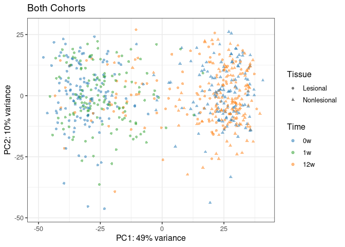
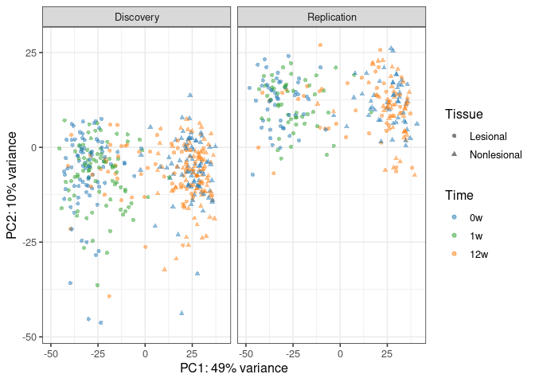
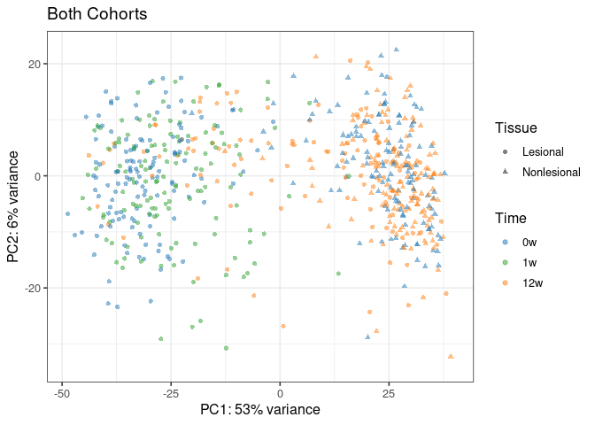
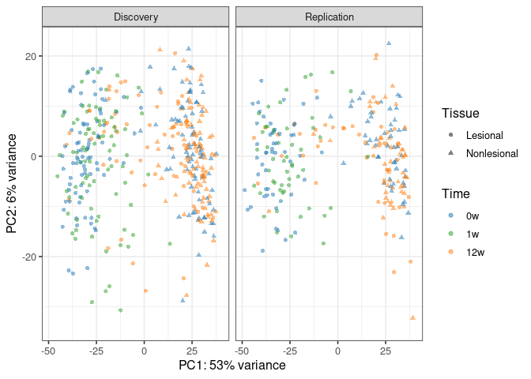

PCA Comparison of Discovery and Replication Cohorts
================
Graham R Smith
01 July 2025

Read data back in, remove outlier Patients and Samples and filter genes
by expression (cpm \> 1 in a fraction \> 0.5 of samples)

Numbers of samples and genes

    ## after this, number of patients 133

    ## number of genes 14139

    ## number of samples 648

    ## distribution of samples over cohorts (D,R): 400 248

Define a function to do PCA

``` r
pca_fn <- function(inputvdat) {
  
  logexpr <- rowMeans(inputvdat)
  nk = 5000
  to_keep = head(sort(logexpr,decreasing=TRUE), n = nk)
  topE = inputvdat[names(to_keep),]
  pca = prcomp(t(topE))
  percentVar <- pca$sdev^2/sum(pca$sdev^2)
  
  
  ds <- keep_samp
  pd <- data.frame(PC1 = pca$x[, 1], PC2 = pca$x[, 2], PC3 = pca$x[, 3], PC4 = pca$x[, 4],
                   Patient_id = as.character(ds$Patient_id), 
                   PASI = ds$PASI, Cohort = ds$Cohort, Drug = ds$Drug,
                   Time = ds$Time, Tissue = ds$Tissue)
  
  percentVar <- pca$sdev^2/sum(pca$sdev^2)
  #these_dat <- pd %>% filter(Patient_id %in% int_p) %>% arrange(Patient_id)
  #cat(as.character(these_p),"\n")
  xlim=c(round(min(pd$PC1)),round(max(pd$PC1)))
  ylim=c(round(min(pd$PC2)),round(max(pd$PC2)))
  
  mycols <- pal_d3()(4)
  mycols <- mycols[c(1,3,4,2)]
  names(mycols) <- c("0w","1w","4w","12w")
  
  
  p <- ggplot(data = pd, aes(x = PC1, y = PC2, color = Time, Patient_id = Patient_id)) +
    geom_point(size = 1.5, alpha = 0.5, aes(shape = Tissue)) + 
    xlab(paste0("PC1: ", round(percentVar[1] * 100), "% variance")) + 
    ylab(paste0("PC2: ", round(percentVar[2] * 100), "% variance")) +
    scale_colour_manual(values = mycols) + 
    scale_x_continuous(limits = xlim) + 
    scale_y_continuous(limits = ylim) + ggtitle("Both Cohorts") + 
    guides(size = FALSE, alpha = FALSE) + theme_bw(base_size = 12)
  show(p)
  # show(ggplotly(p))
  

    p <- ggplot(data = pd, aes(x = PC1, y = PC2, color = Time, Patient_id = Patient_id)) +
      geom_point(size = 1.5, alpha = 0.5, aes(shape = Tissue)) + 
      xlab(paste0("PC1: ", round(percentVar[1] * 100), "% variance")) + 
      ylab(paste0("PC2: ", round(percentVar[2] * 100), "% variance")) +
      scale_colour_manual(values = mycols) + 
      scale_x_continuous(limits = xlim) + 
      scale_y_continuous(limits = ylim) + 
      facet_grid(.~Cohort) +
      guides(size = FALSE, alpha = FALSE) + theme_bw(base_size = 12)

  show(p)
  #grid.arrange( grobs = gl, ncol = 2)
  print(summary(lm(PC2 ~ Cohort, data = pd)))
  print(var.test(PC2 ~ Cohort, data = pd))
  
  pd
}
```

## PCA of Combined Discovery and Replicatiion Cohorts

Do PCA on top 5000 genes by expression (using both cohorts). Also show
stats for lm (t-test) and var.test (F-test of variance) on PC2

The lower plots are from the same PCA analysis, filtered to display data
points from only one cohort

``` r
pca1 <- pca_fn(voomed_data$E)
```

<!-- --><!-- -->

    ## 
    ## Call:
    ## lm(formula = PC2 ~ Cohort, data = pd)
    ## 
    ## Residuals:
    ##     Min      1Q  Median      3Q     Max 
    ## -41.246  -4.080   1.080   5.667  20.710 
    ## 
    ## Coefficients:
    ##                   Estimate Std. Error t value Pr(>|t|)    
    ## (Intercept)        -6.9519     0.4205  -16.53   <2e-16 ***
    ## CohortReplication  18.1645     0.6797   26.72   <2e-16 ***
    ## ---
    ## Signif. codes:  0 '***' 0.001 '**' 0.01 '*' 0.05 '.' 0.1 ' ' 1
    ## 
    ## Residual standard error: 8.41 on 646 degrees of freedom
    ## Multiple R-squared:  0.525,  Adjusted R-squared:  0.5243 
    ## F-statistic: 714.1 on 1 and 646 DF,  p-value: < 2.2e-16
    ## 
    ## 
    ##  F test to compare two variances
    ## 
    ## data:  PC2 by Cohort
    ## F = 1.7571, num df = 399, denom df = 247, p-value = 1.789e-06
    ## alternative hypothesis: true ratio of variances is not equal to 1
    ## 95 percent confidence interval:
    ##  1.399073 2.193516
    ## sample estimates:
    ## ratio of variances 
    ##            1.75711

## Apply removeBatchEffect

limma::removeBatchEffect fits a linear model with design matrix \~Cohort
to the expression matrix E , and returns E - beta %\*% design_matrix. It
brings the two cohorts as much into register as possible, so that there
is no longer any significant difference in the mean of PC2 between
Discovery and Replication cohorts, and also much reduces the apparent
difference in variance between them.

This strongly suggests that, in performing Differential Expression
analysis on the combined D + R cohorts, a main effect for the Cohort
should be included.

``` r
voomed_data2 <- removeBatchEffect(voomed_data$E, batch = keep_samp$Cohort)
pca2 <- pca_fn(voomed_data2)
```

<!-- --><!-- -->

    ## 
    ## Call:
    ## lm(formula = PC2 ~ Cohort, data = pd)
    ## 
    ## Residuals:
    ##     Min      1Q  Median      3Q     Max 
    ## -34.210  -5.813   0.758   6.295  23.105 
    ## 
    ## Coefficients:
    ##                     Estimate Std. Error t value Pr(>|t|)
    ## (Intercept)        2.095e-14  4.749e-01       0        1
    ## CohortReplication -5.438e-14  7.677e-01       0        1
    ## 
    ## Residual standard error: 9.499 on 646 degrees of freedom
    ## Multiple R-squared:  8.854e-30,  Adjusted R-squared:  -0.001548 
    ## F-statistic: 5.72e-27 on 1 and 646 DF,  p-value: 1
    ## 
    ## 
    ##  F test to compare two variances
    ## 
    ## data:  PC2 by Cohort
    ## F = 1.5087, num df = 399, denom df = 247, p-value = 0.0004452
    ## alternative hypothesis: true ratio of variances is not equal to 1
    ## 95 percent confidence interval:
    ##  1.201264 1.883383
    ## sample estimates:
    ## ratio of variances 
    ##           1.508679
