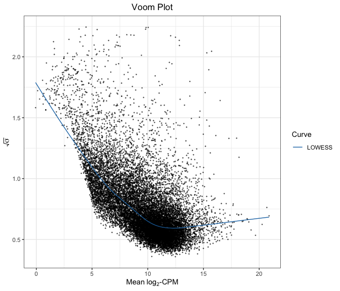
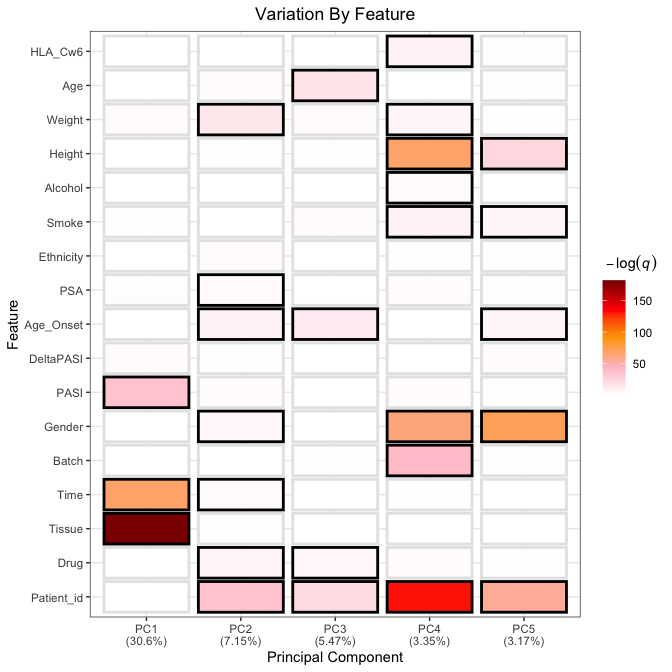

PSORT Analysis
================

All analysis was conducted in R version 4.0.2 using the following
script. Computations were performed on a MacBook Pro with 16GB of RAM
and an i7 quad-core processor.

If you haven’t already installed the `bioplotr` package, you’ll need to
do so to reproduce the figures below.

``` r
# Install bioplotr
devtools::install_github('dswatson/bioplotr')

# Load libraries, register cores
library(bioplotr)
library(data.table)
library(limma)
library(edgeR)
library(splines)
library(qvalue)
library(tidyverse)
library(ggsci)
library(doMC)
registerDoMC(8)
```

# Preliminaries

Following RNA-seqencing of all samples, reads were pseudo-aligned using
kallisto ([Bray et
al., 2016](http://www.nature.com/nbt/journal/v34/n5/full/nbt.3519.html)).
Our reference genome was
[GRCh38.p10](http://dec2017.archive.ensembl.org/index.html), Ensembl
version 91. Transcript-level reads were aggregated to gene-level using
the `tximport` package ([Soneson et
al., 2015](https://f1000research.com/articles/4-1521/v2)). We save the
raw count matrix for later use.

``` r
# Load data
anno <- fread('./Data/Hs.anno.csv')
clin <- fread('./Data/clinical_samples.csv')
t2g <- readRDS('./Data/Hs91.t2g.rds')
files <- file.path('./Aligned', clin$Sample_id, 'abundance.tsv')
txi <- tximport(files, type = 'kallisto', tx2gene = t2g, importer = fread, 
                countsFromAbundance = 'lengthScaledTPM')

# Export counts
cnts <- txi$counts
saveRDS(cnts, 'cnts.rds')
```

## Clinical Exploratory Data Analysis (EDA)

Before examining the transcriptomic data, we analyse the clinical data.
Our goal here is to get a sense for general trends in PASI trajectories
for patients, as well as to compare performance by drug and check for
potential outliers.

Close inspection by our colleagues in Newcastle has revealed mislabelled
samples for one patient, whose lesional and nonlesional samples were
swapped. We correct the mistake before running EDA or DEA.

``` r
# Relabel mislabelled samples
clin[Sample_id %in% c('006041-0005', '023012-1205'), Tissue := 'Nonlesional'
  ][Sample_id %in% c('006041-0006', '023012-1206'), Tissue := 'Lesional']
```

### Baseline vs. 12 Week PASI

One helpful way to visualise the study’s results is with a baseline
vs. 12 week PASI scatterplot. We include a black line of equality as
well as zero-intercept regression lines for each drug. A perfect
treatment would have a horizontal best fit line at \(y = 0\),
representing full improvement regardless of baseline PASI; a completely
ineffectual treatment would have a best fit line of \(45^{\circ}\),
representing no improvement over the course of the study.

``` r
# Load patient-level clinical data
df <- fread('./Data/clinical_patients.csv')

# Regress 12 week PASI on baseline for each drug
m_a <- lm(PASI_wk12 ~ 0 + PASI_wk00, data = df[Drug == 'Adalimumab'])
m_u <- lm(PASI_wk12 ~ 0 + PASI_wk00, data = df[Drug == 'Ustekinumab'])

# Plot results
cols <- pal_d3()(2)
ggplot(df, aes(PASI_wk00, PASI_wk12, colour = Drug)) + 
  geom_point(size = 1) + 
  geom_abline(intercept = 0, slope = 1) + 
  geom_abline(intercept = 0, slope = coef(m_a), colour = cols[1]) + 
  geom_abline(intercept = 0, slope = coef(m_u), colour = cols[2]) + 
  xlim(0, 35) + ylim(0, 35) + 
  labs(title = 'Baseline vs. 12 Week PASI',
           x = 'Baseline PASI',
           y = '12 Week PASI') + 
  theme_bw() + 
  theme(plot.title = element_text(hjust = .5)) + 
  scale_color_d3()
```

<p align='center'>

</p>

This plot reveals several a couple of interesting points. First of all,
two patients appear to have gotten worse over the course of study.
Second, there are a number of high leverage points among the adalimumab
patients that increase the slope of their regression line. This is why
ustekinumab appears to be the more effective treatment according to a
least squares estimate.

# Transcriptomic EDA

Before conducting transcriptomic EDA, we merge counts with gene-level
annotation data and remove probes with less than one count per million
(CPM) in at least 20 libraries. This ensures that every probe is
expressed in at least 5% of all samples. Counts are then TMM normalised
prior to modelling ([Robinson &
Oshlack, 2010](https://genomebiology.biomedcentral.com/articles/10.1186/gb-2010-11-3-r25)).
See the extensive `edgeR` [package
vignette](https://www.bioconductor.org/packages/3.3/bioc/vignettes/edgeR/inst/doc/edgeRUsersGuide.pdf)
for more details.

``` r
# Gene-level annotations 
gene_idx <- tibble(EnsemblID = rownames(cnts)) %>%
  inner_join(anno, by = 'EnsemblID') %>%
  select(EnsemblID, GeneSymbol)
cnts <- cnts[gene_idx$EnsemblID, clin$Sample_id]
y <- DGEList(cnts, genes = gene_idx)

# Filter genes
keep <- rowSums(cpm(y) > 1) >= 20  
y <- DGEList(y[keep, ])
y <- calcNormFactors(y)

# Check dimensionality
dim(y)
```

    ## [1] 16172   400

The analysis will proceed with 16,172 probes. We use diagnostic plots
and dimensionality reduction techniques to check for outliers, validate
our preprocessing pipeline, and search for unsupervised clusters.

## Mean-Variance

We begin by examining the data’s mean-variance trend. With this plot, we
can examine the relationship between the first two moments of the
transriptomic data and visually inspect for outlying probes. The shape
of the curve is especially important for RNA-seq data analysed using
`limma::voom`, as results from this LOWESS regression are used to fit
weighted least squares models in subsequent differential expression
tests ([Law et
al., 2014](https://genomebiology.biomedcentral.com/articles/10.1186/gb-2014-15-2-r29)).

``` r
plot_voom(y)
```

<p align='center'>

</p>

This mean-variance trend looks about right for these data. The trend is
as expected and no clear outliers emerge from this figure.

For the remaining plots, we conduct EDA on the log2-CPM scale of the
normalised count matrix. We add 1 to all counts to avoid taking the
logarithm of 0.

``` r
# Transform counts
mat <- cpm(y, log = TRUE, prior.count = 1)

# Save output
saveRDS(mat, './Data/lcpm_mat.rds')
```

## Density Plot

Plotting expression densities for all samples is a good way to evaluate
the overall skew of the data and visually inspect for outlying samples.
We color the curves by tissue type to observe potential transcriptomic
variation by tissue.

``` r
plot_density(mat, group = list(Tissue = clin$Tissue),  
             xlab = expression(log[2]*'-CPM'))
```

<p align='center'>

</p>

These sample-wise densities look exceptionally clean, and approximately
symmetric under log2-CPM transform. The slight kink in the low end of
the spectrum is common with count data, and there appears to be some
systematic variation by tissue type, as we would expect.

## Subject Similarity Matrix

We build a subject similarity matrix by calculating the [pairwise
Euclidean
distance](https://en.wikipedia.org/wiki/Euclidean_distance_matrix)
between all samples in the data. This matrix can then be visualised as a
heatmap and used to build a [hierarchical
clustering](https://en.wikipedia.org/wiki/Hierarchical_clustering)
dendrogram. We annotate the plot with phenotypic information to see if
the unsupervised clusters track known clinical groupings.

``` r
plot_similarity(mat, group = list(Tissue = clin$Tissue, 
                                    Drug = clin$Drug,
                                    Time = clin$Time), 
                covar = list(PASI = clin$PASI))
```

<p align='center'>

</p>

Once again, we find systematic variation by tissue type. Differences by
other phenotypic markers are considerably less pronounced. For a more
informative visualisation, we should probably look within tissue type.
We leave that for later, however, as our goal here is simply to confirm
overall data quality.

## Drivers Plot

Another way to visualise clinical drivers of transcriptomic variation is
a drivers plot. To create this figure, we perform a [principal component
analysis
(PCA)](https://en.wikipedia.org/wiki/Principal_component_analysis) of
the log2-CPM matrix. We then test associations between principal
components of the data and individual clinical features.

``` r
plot_drivers(mat, select(clin, -Sample_id, Patient_id, -outcome), 
             alpha = 0.05, p_adj = 'fdr')
```

<p align='center'>

</p>

We find here that tissue is the overwhelming driver of variation in the
first principal component, which accounts for nearly a third of all
variation in the transcriptomic data. Time and PASI are also major
drivers. Fortunately, it looks like there are little or no batch effects
to speak of in these data, which is reassuring. Also note that Drug does
not appear to be a major source of variation, which suggests that there
was no confounding between omic markers and treatment assignment.

## Principal Component Analysis

We plot the samples in a two-dimensional space defined by the first two
principal components. This projection allows us to visually inspect for
outliers and unsupervised clustering effects. We mark the samples by
tissue type and
time.

``` r
plot_pca(mat, group = list(Tissue = clin$Tissue, Time = clin$Time), size = 2)
```

<p align='center'>

</p>

Once again, we find a nice separation between lesional and nonlesional
samples, although the boundary between the two is not perfectly linear.
Note, however, that the areas of apparent overlap tend to occur in week
12, suggesting that effective treatment has blurred the distinction
between the two tissue types.

## Kernel PCA

Kernel PCA (KPCA) is a nonlinear variant of PCA that uses a Gaussian
radial basis function (RBF) kernel to reweight the samples. For details,
see [Schölkopf et
al., 1998](https://www.mitpressjournals.org/doi/abs/10.1162/089976698300017467).
This transformation is designed to preserve local structure, capturing
some interactions in the feature space that cannot be captured by linear
combinations of the input
variables.

``` r
plot_kpca(mat, group = list(Tissue = clin$Tissue, Time = clin$Time), size = 2)
```

<p align='center'>

</p>

This plot once again demonstrates some decent segregation between tissue
types along the first PC. There is evidently greater variation among
nonlesional samples than lesional samples, as they fan out across the
second PC. Note that one baseline nonlesional sample appears somewhat
stranded in a sea of lesional points, suggesting possible mislabelling.

## t-SNE

Another popular embedding technique is [t-distributed stochastic
neighbour embedding
(t-SNE)](https://en.wikipedia.org/wiki/T-distributed_stochastic_neighbor_embedding).
This method, originally developed by [van der Maaten & Hinton
(2008)](http://www.jmlr.org/papers/volume9/vandermaaten08a/vandermaaten08a.pdf),
explicitly attempts to preserve local structure when mapping a large
matrix onto a low-dimensional subspace. It is therefore ideal for
unsupervised cluster
detection.

``` r
plot_tsne(mat, group = list(Tissue = clin$Tissue, Time = clin$Time), size = 2)
```

<p align='center'>

</p>

This plot shows even neater separation between lesional and nonlesional
samples across opposing quadrants of the Cartesian plane. Once again, a
single nonlesional sample appears to be potentially mislabelled.
