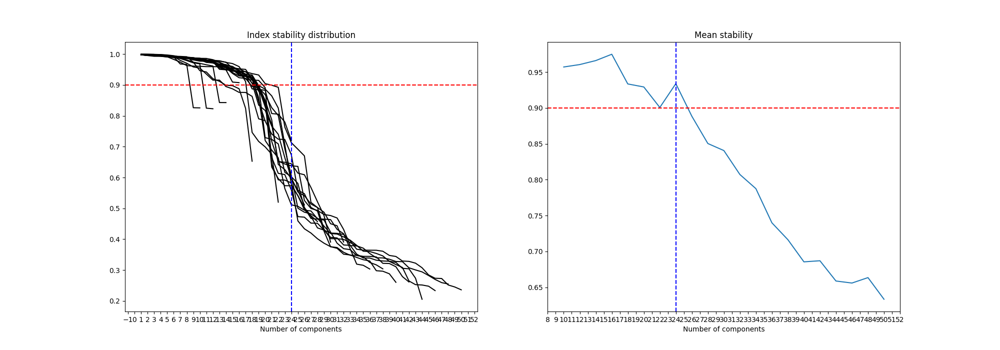
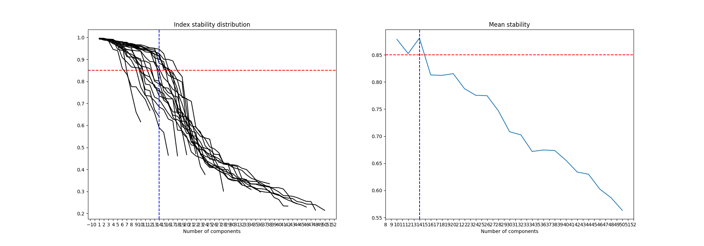

# Introduction

This notebook and associated scripts replicate the estimation of factors and some of the key related analyses (BMI, HLA) in the PSORT transcriptomics paper.

```{r setup, include = FALSE}
knitr::opts_chunk$set(warning = FALSE)

library(SummarizedExperiment)
library(limma)
library(readxl)

# Used development version of ReducedExperiment from GitHub (v0.99)
# devtools::install_github("jackgisby/ReducedExperiment")
library(ReducedExperiment)

# plotting style
library(ggplot2)
library(ggpubr)
library(ggrepel)

theme_set(theme_pubr(border = TRUE))
theme_update(text = element_text(size = 8))
```

# Running factor analysis

Below, we load and process the expression and factor data.

```{r load_data}
# Load the ICA results and expression data - see scripts directory for the code that generated these
ica_skin_d <- readRDS("../20230907_run_ica_both_tissues/ica_skin_d.rds")
ica_skin_r <- readRDS("../20230907_run_ica_both_tissues/ica_skin_r.rds")
ica_blood <- readRDS("../20230907_run_ica_both_tissues/ica_blood.rds")

# Convert to FactorisedExperiment objects for manipulation/analysis
skin_d_fe <- FactorisedExperiment(
    assays = list("X" = t(ica_skin_d$X)), 
    loadings=ica_skin_d$S, reduced=ica_skin_d$M, 
    colData=ica_skin_d$sample_data, 
    rowData=ica_skin_d$feature_data, 
    stability=ica_skin_d$vafs
)
skin_r_fe <- FactorisedExperiment(
    assays = list("X" = t(ica_skin_r$X)), 
    loadings=ica_skin_r$S, 
    reduced=ica_skin_r$M, 
    colData=ica_skin_r$sample_data,
    rowData=ica_skin_r$feature_data, 
    stability=ica_skin_r$vafs
)
blood_fe <- FactorisedExperiment(
    assays = list("X" = t(ica_blood$X)), 
    loadings=ica_blood$S, 
    reduced=ica_blood$M, 
    colData=ica_blood$sample_data, 
    rowData=ica_blood$feature_data, 
    stability=ica_blood$vafs
)

# Use ENSEMBL ID where gene symbol unavailable
rowData(skin_d_fe)$gene_id[rowData(skin_d_fe)$gene_id == ""] <- rowData(skin_d_fe)$ensembl_id[rowData(skin_d_fe)$gene_id == ""]
rowData(skin_r_fe)$gene_id[rowData(skin_r_fe)$gene_id == ""] <- rowData(skin_r_fe)$ensembl_id[rowData(skin_r_fe)$gene_id == ""]
rowData(blood_fe)$gene_id[rowData(blood_fe)$gene_id == ""] <- rowData(blood_fe)$ensembl_id[rowData(blood_fe)$gene_id == ""]

# Correct gender variable
skin_r_fe$Gender[skin_r_fe$Patient_id == "P.5035"] <- "M"
skin_r_fe$Gender[skin_r_fe$Patient_id == "P.5036"] <- "F"

# Log PASI
skin_d_fe$log_PASI <- log(skin_d_fe$PASI)
skin_r_fe$log_PASI <- log(skin_r_fe$PASI)
blood_fe$log_PASI <- log(blood_fe$PASI)
```

We estimated factors using the ICA algorithm by running the files in the scripts/ directory. We then loaded the results and converted them to FactorisedExperiment objects, from the ReducedExperiment package. These objects are like SummarizedExperiment objects, but with additional slots for the ICA results.

We used the maximally stable transcriptome dimension (MSTD) algorithm to estimate the number of factors. The factor stability plots are shown below, which we used to estimate the optimal number of factors.





Below, we show a summary of the factor objects for each cohort.

```{r show_discovery_skin_factors}
skin_d_fe
```

```{r show_replication_skin_factors}
skin_r_fe
```

```{r show_blood_factors}
blood_fe
```

# BMI analysis

Get the non-lesional data for the BMI analysis.

```{r get_bmi_data}
# Get SummarizedExperiment for non-lesional tissue
skin_d_se <- as(skin_d_fe[, which(skin_d_fe$Tissue == "Nonlesional")], "SummarizedExperiment")
skin_r_se <- as(skin_r_fe[, which(skin_r_fe$Tissue == "Nonlesional")], "SummarizedExperiment")
```

In this analysis we adjust for age and sex. Sex in particular is a problematic confounder - BMI is associated with sex, so if we run the analysis without correction we find very strong associations between BMI and y-linked genes. Seems unlikely that these associations are directly relevant to BMI.

We use duplicateCorrelation to deal with the fact we have repeated measurements from each individual. We apply lmFit to apply models to the logCPM data.

```{r bmi_discovery_diffexp}
apply_diffexp <- function(se_obj, coef = "BMI", suffix = "") {
  # Filter out NA values for BMI and Age
  se_filtered <- se_obj[, which(!is.na(se_obj$BMI) & !is.na(se_obj$Age))]
  
  # Create design matrix, adjust for sex and age
  design <- model.matrix(~ BMI + Gender + Age, 
                        data = data.frame(colData(se_filtered)))
  
  # Estimate correlation structure
  dupcor <- duplicateCorrelation(assay(se_filtered, 1), 
                                design, 
                                block = factor(se_filtered$Patient_id))
  
  # Fit the model
  fit <- lmFit(assay(se_filtered, 1), 
               design, 
               block = factor(se_filtered$Patient_id), 
               correlation = dupcor$consensus)
  fit <- eBayes(fit)
  
  # Get results for the BMI variable
  tt <- topTable(fit, coef = coef, number = Inf)
  
  # Add suffix to column names if specified
  if (suffix != "") {
    colnames(tt) <- paste0(colnames(tt), suffix)
  }
  
  # Add ensembl IDs and join with row data
  tt$ensembl_id <- rownames(tt)
  tt <- dplyr::left_join(tt, 
                         data.frame(rowData(se_filtered)), 
                         by = c("ensembl_id" = "ensembl_id"))
  
  return(tt)
}

# Differential expression in discovery
skin_d_tt <- apply_diffexp(skin_d_se)
head(skin_d_tt)
```

We can visualise these data as a volcano plot.

```{r bmi_discovery_volc, warning=FALSE}
tt_volcano_plot <- function(tt, fc_col = "logFC", de_p_cutoff = 0.05, n_pos_fc = 8, n_neg_fc = n_pos_fc, n_pos_pval = n_pos_fc, n_neg_pval = n_pos_pval) {
    colnames(tt) <- gsub("adj_p", "adj.P.Val", colnames(tt))
    colnames(tt) <- gsub("pval", "P.Value", colnames(tt))
    colnames(tt) <- gsub("term_id", "gene_id", colnames(tt))
    
    # prepare colouring
    tt$de_col <- mapply(tt$adj.P.Val, tt[[fc_col]], FUN = function(adj_p, fc) {
        if (adj_p < de_p_cutoff) {
            if (fc > 0) {
                return("upreg")
            } else {
                return("downreg")
            }
        } else {
            return("non_sig")
        }
    })
    
    tt$de_col <- factor(tt$de_col, c("downreg", "non_sig", "upreg"))
    
    # label the top up and downregulated genes
    top_pos_fc <- Rfast::nth(tt[[fc_col]][tt$adj.P.Val < de_p_cutoff], n_pos_fc, descending = TRUE)
    top_neg_fc <- Rfast::nth(tt[[fc_col]][tt$adj.P.Val < de_p_cutoff], n_neg_fc, descending = FALSE)
    top_pos_pval <- Rfast::nth(tt$P.Value[tt[[fc_col]] > 0 & tt$adj.P.Val < de_p_cutoff], n_pos_pval, descending = FALSE)
    top_neg_pval <- Rfast::nth(tt$P.Value[tt[[fc_col]] < 0 & tt$adj.P.Val < de_p_cutoff], n_neg_pval, descending = FALSE)
    
    tt_to_label <- tt$adj.P.Val <= de_p_cutoff & (
        tt[[fc_col]] >= top_pos_fc |
            tt[[fc_col]] <= top_neg_fc |
            (tt$P.Value <= top_pos_pval & tt[[fc_col]] > 0) |
            (tt$P.Value <= top_neg_pval & tt[[fc_col]] < 0))
    
    tt$logp <- -log10(tt$P.Value)
    
    # make the ggplot
    volcano_plot <- ggplot(tt, aes_string(fc_col, "logp", fill = "de_col")) +
        geom_point(size = 2, alpha = 0.8, color = "black", pch = 21, stroke = 0.05) +
        scale_color_manual(values = c("downreg" = "#2C7BB6", "non_sig" = "black", "upreg" = "#D7191C")) +
        scale_fill_manual(values = c("downreg" = "#2C7BB6", "non_sig" = "black", "upreg" = "#D7191C")) +
        geom_text_repel(aes(label = gene_id), size = 3, color = "black", data = subset(tt, tt_to_label), min.segment.length	= 0.1) +
        theme(legend.position = "none") +
        xlab("Effect size")
    
    return(volcano_plot)
}

tt_volcano_plot(skin_d_tt)
```

We also apply the models to the replication cohort, permitting us to compare the results between the two cohorts.

```{r bmi_replication_diffexp}
# Replication
skin_r_tt <- apply_diffexp(skin_r_se, suffix = "_r")
combined_tt <- dplyr::left_join(skin_d_tt, dplyr::select(skin_r_tt, logFC_r, P.Value_r, adj.P.Val_r, ensembl_id), by = c("ensembl_id" = "ensembl_id"))
head(combined_tt)
```

Below, we replicate the summary plot for the factor 9 / lightyellow BMI-related genes (3B).

```{r bmi_combined_plot}
# Get PASI results for each drug
pasi_res <- read.csv("../20231113_bmi_dexp/pasi_genes/LS_vp_sig_fc_genes_module_anno.splinedf3.tsv", sep = "\t")
pasi_res <- pasi_res[which(pasi_res$adj.P.Val < 0.05) ,]

ada_pasi_res <- pasi_res[which(pasi_res$Drug == "ADA") ,]
ust_pasi_res <- pasi_res[which(pasi_res$Drug == "UST") ,]
ada_pasi_res$signed_fit_range_ada <- ada_pasi_res$signed_fit_range
ust_pasi_res$signed_fit_range_ust <- ust_pasi_res$signed_fit_range

# Get lightyellow module information
lightyellow <- read.csv("../../data/20230911_wgcna_eigengenes/Skin_modules/lightyellow_module_genes.txt", sep = "\t")
lightyellow <- dplyr::left_join(lightyellow, dplyr::select(skin_d_tt, ensembl_id, logFC, P.Value, adj.P.Val, gene_id), by = c("EnsemblID" = "ensembl_id"))
lightyellow_signif <- lightyellow[which(lightyellow$adj.P.Val < 0.05) ,]

# Get module centrality results
module_centrality <- read.csv("../../data/20240228_module_centrality/Skin_MM 1.txt", sep = "\t")
all_factor_9_genes <- data.frame(ensembl_id = rownames(skin_d_fe), coef = loadings(skin_d_fe)[,9])

# Combine results
combined_res <- dplyr::select(skin_d_tt[skin_d_tt$adj.P.Val < 0.05, ], ensembl_id, gene_id, adj.P.Val, logFC)
combined_res$in_lightyellow <- combined_res$ensembl_id %in% lightyellow$EnsemblID
combined_res$lightyellow_centrality <- sapply(combined_res$ensembl_id, function(ensembl_id) {
    
    if (ensembl_id %in% lightyellow$EnsemblID) {
        mc_gene <- module_centrality[which(module_centrality$EnsemblID == ensembl_id & module_centrality$Module == "lightyellow") ,]
        stopifnot(nrow(mc_gene) == 1)
        return(mc_gene$Cor_d)
    } else {
        return(NA)
    }
})

combined_res <- dplyr::left_join(combined_res, dplyr::select(all_factor_9_genes, ensembl_id, coef), by = "ensembl_id")
combined_res <- dplyr::left_join(combined_res, dplyr::select(ada_pasi_res, EnsemblID, signed_fit_range_ada), by = c("ensembl_id" = "EnsemblID"))
combined_res <- dplyr::left_join(combined_res, dplyr::select(ust_pasi_res, EnsemblID, signed_fit_range_ust), by = c("ensembl_id" = "EnsemblID"))
combined_res <- combined_res[which(combined_res$in_lightyellow | combined_res$coef > 5) ,]

# Make the individual plots
module_plot <- ggplot(combined_res, aes(x = 1, y = reorder(gene_id, logFC, decreasing=TRUE), fill = lightyellow_centrality)) +
    geom_tile() +
    scale_fill_distiller(palette = "OrRd", direction = 1) +
    xlab("Lightyellow\nmodule\ncentrality") +
    theme(legend.position = "none", axis.text.x = element_blank(), axis.ticks.x = element_blank(), axis.title.y = element_blank())

factor_plot <- ggplot(combined_res, aes(x = 1, y = reorder(gene_id, logFC, decreasing=TRUE), fill = coef)) +
    geom_tile() +
    colorspace::scale_fill_continuous_divergingx(palette = "RdBu", mid = 0, rev = TRUE, n_interp = 101) +
    xlab("Factor 9\nalignment") +
    theme(legend.position = "none", axis.text.x = element_blank(), axis.ticks.x = element_blank(), axis.text.y = element_blank(), axis.ticks.y = element_blank(), axis.title.y = element_blank())

dexp_plot <- ggplot(combined_res, aes(x = 1, y = reorder(gene_id, logFC, decreasing=TRUE), fill = logFC)) +
    geom_tile() +
    colorspace::scale_fill_continuous_divergingx(palette = "RdBu", mid = 0, rev = TRUE, n_interp = 101) +
    xlab("BMI\nassociation\n(None, NL)") +
    theme(legend.position = "none", axis.text.x = element_blank(), axis.ticks.x = element_blank(), axis.text.y = element_blank(), axis.ticks.y = element_blank(), axis.title.y = element_blank())

ada_pasi_plot <- ggplot(combined_res, aes(x = 1, y = reorder(gene_id, logFC, decreasing=TRUE), fill = signed_fit_range_ada)) +
    geom_tile() +
    colorspace::scale_fill_continuous_divergingx(palette = "RdBu", mid = 0, rev = TRUE, n_interp = 101) +
    xlab("PASI\nassociation\n(ADA, L)") +
    theme(legend.position = "none", axis.text.x = element_blank(), axis.ticks.x = element_blank(), axis.text.y = element_blank(), axis.ticks.y = element_blank(), axis.title.y = element_blank())

ust_pasi_plot <- ggplot(combined_res, aes(x = 1, y = reorder(gene_id, logFC, decreasing=TRUE), fill = signed_fit_range_ust)) +
    geom_tile() +
    colorspace::scale_fill_continuous_divergingx(palette = "RdBu", mid = 0, rev = TRUE, n_interp = 101) +
    xlab("PASI\nassociation\n(UST, L)") +
    theme(legend.position = "none", axis.text.x = element_blank(), axis.ticks.x = element_blank(), axis.text.y = element_blank(), axis.ticks.y = element_blank(), axis.title.y = element_blank())

# Make the combined plot
plotlist <- list("module" = module_plot, "factor" = factor_plot, "dexp" = dexp_plot, "ada_pasi" = ada_pasi_plot, "ust_pasi" = ust_pasi_plot)
patchwork::wrap_plots(plotlist, nrow = 1) + patchwork::plot_layout(guides = "collect", widths = c(2, 2, 2, 2, 2))
```

# HLA analysis

Get the baseline data for the HLA analysis. Combine the discovery and replication cohorts using batch correction and scaling.

```{r get_hla_data}
# Remove columns that are only in one cohort
colData(skin_d_fe) <- colData(skin_d_fe)[, which(colnames(colData(skin_d_fe)) %in% colnames(colData(skin_r_fe)))]
colData(skin_r_fe) <- colData(skin_r_fe)[, which(colnames(colData(skin_r_fe)) %in% colnames(colData(skin_d_fe)))]

# Combine the data into one object for the baseline samples
skin_fe <- cbind(skin_d_fe, skin_r_fe)
skin_fe <- skin_fe[, skin_fe$Time == "wk00"]
skin_features <- getAlignedFeatures(skin_fe)

# Perform batch correction and scaling across cohorts
# 1 - Gene expression
assay(skin_fe, "batch_corrected") <- limma::removeBatchEffect(assay(skin_fe), batch = skin_fe$Cohort, design = model.matrix(~ Tissue + PASI, data = colData(skin_fe))[,-1])
assay(skin_fe, "batch_corrected_scaled") <- t(scale(t(assay(skin_fe, "batch_corrected"))))

# 2 - Factors
reduced(skin_fe) <- t(limma::removeBatchEffect(t(reduced(skin_fe)), batch = skin_fe$Cohort, design = model.matrix(~ Tissue + PASI, data = colData(skin_fe))[,-1]))
reduced(skin_fe) <- scale(reduced(skin_fe))

skin_fe$bPASI <- skin_fe$PASI

# Set decimal (imputed) HLA genotypes to NA
for (which_hla_cname in which(grepl("HLA_", colnames(colData(skin_fe))))) skin_fe[[which_hla_cname]][which(!skin_fe[[which_hla_cname]] %in% c(0, 1, 2))] <- NA
```

Below, we replicate the heatmaps shown in Fig. 5A for factors 18 and 21.

```{r hla_heatmaps}
quantile_breaks <- function(xs, n = 10) {
    breaks <- quantile(xs, probs = seq(0, 1, length.out = n))
    breaks[!duplicated(breaks)]
}

n_cols <- 100

expr <- assay(skin_fe[rowData(skin_fe)$gene_id %in% c("HLA-DRA", "HLA-DQB1", "HLA-DQA1", "HLA-DRB1", "HLA-DRB5"), ], "batch_corrected_scaled")
rownames(expr) <- sapply(rownames(expr), function(x) {
    return(rowData(skin_fe)$gene_id[rownames(skin_fe) == x])
})

annot_col <- dplyr::select(data.frame(colData(skin_fe)), Tissue, bPASI, HLA_DRB1_15, HLA_DQA1_01)
annot_col$Factor_18 <- reduced(skin_fe)[, "factor_18"]

annot_cols <- list(
    Tissue = c("Lesional" = "#a41df2ff", "Nonlesional" = "#fdbec9ff"), 
    HLA_DRB1_15 = c("0" = "#666666", "1" = "#D95F02", "2" = "#E6AB02"), 
    HLA_DQA1_01 = c("0" = "#666666", "1" = "#D95F02", "2" = "#E6AB02")
)

pheatmap::pheatmap(
    expr, 
    scale = "none", 
    color = viridis::magma(n_cols),
    breaks = quantile_breaks(expr, n_cols), 
    show_colnames = FALSE, 
    border_color = NA, annotation_col = annot_col, annotation_colors = annot_cols,
    height = 2 + nrow(expr) * 0.15, na_col = "grey",
    main = "Factor 18"
)

# Factor 21 heatmap
expr <- assay(skin_fe[rowData(skin_fe)$gene_id %in% c("HLA-E", "GSTM1", "HLA-DQB2", "HLA-DQA2"), ], "batch_corrected_scaled")
rownames(expr) <- sapply(rownames(expr), function(x) {
    return(rowData(skin_fe)$gene_id[rownames(skin_fe) == x])
})

annot_col <- dplyr::select(data.frame(colData(skin_fe)), Tissue, bPASI)
annot_col$Factor_21 <- reduced(skin_fe)[, "factor_21"]

pheatmap::pheatmap(
    expr, 
    scale = "none", 
    color = viridis::magma(n_cols),
    breaks = quantile_breaks(expr, n_cols), 
    show_colnames = FALSE, 
    border_color = NA, annotation_col = annot_col, annotation_colors = annot_cols,
    height = 1.5 + nrow(expr) * 0.15, na_col = "grey", 
    main = "Factor 21"
)
```

We then replicate the genotype associations, starting at gene-level (Fig. 5B).

```{r hla_gene_associations}
# Get genotypes
hla_genotypes <- as.matrix(colData(skin_fe)[which(skin_fe$Tissue == "Lesional"), which(grepl("HLA_", colnames(colData(skin_fe))))])
hla_genotypes <- hla_genotypes[, which(apply(hla_genotypes, 2, sd, na.rm = TRUE) > 0)]
hla_genotypes <- data.frame(hla_genotypes)

# Correlate with genes and plot results
gene_cors <- cor(hla_genotypes, t(assay(skin_fe[, which(skin_fe$Tissue == "Lesional")])), use = "pairwise.complete.obs")
gene_cors_long <- tidyr::pivot_longer(tibble::rownames_to_column(data.frame(gene_cors), "row"), -row)
gene_cors_long <- dplyr::left_join(gene_cors_long, data.frame(rowData(skin_fe)), by = c("name" = "ensembl_id"))

gene_cors_long$genotype_gene <- paste0("Genotype: ", gene_cors_long$row, "; Gene: ", gene_cors_long$gene_id)
ggplot(gene_cors_long[order(abs(gene_cors_long$value), decreasing = TRUE) ,][1:20 ,], aes(abs(value), reorder(genotype_gene,  abs(value)), col = value)) +
    geom_point() +
    geom_segment(aes(yend = genotype_gene), xend=0) +
    xlim(c(0, 1)) +
    xlab("Absolute Correlation") +
    ylab("") +
    scale_color_distiller(palette = "RdBu", type = "div", limits=c(-1,1))
```

And now we look at associations with factors, finding that factor 18 has particularly strong associations.

```{r hla_factor_associations}
# Correlate with factors and plot results
factor_cors <- cor(hla_genotypes, reduced(skin_fe)[which(skin_fe$Tissue == "Lesional") ,], use = "pairwise.complete.obs")
factor_cors_long <- tidyr::pivot_longer(tibble::rownames_to_column(data.frame(factor_cors), "row"), -row)

factor_cors_long$genotype_factor <- paste0("Genotype: ", factor_cors_long$row, "; Factor: ", factor_cors_long$name)
ggplot(factor_cors_long[order(abs(factor_cors_long$value), decreasing = TRUE) ,][1:20 ,], aes(abs(value), reorder(genotype_factor,  abs(value)), col = value)) +
    geom_point() +
    geom_segment(aes(yend = genotype_factor), xend=0) +
    xlim(c(0, 1)) +
    xlab("Absolute Correlation") +
    ylab("") +
    scale_color_distiller(palette = "RdBu", type = "div", limits=c(-1,1))
```

# Replicating the manuscript

Check that the factors are the same as in the Supplementary Data.

```{r check_factors}
# Read data from the supplementary file
skin_reduced <- readxl::read_excel("../../data/20241128_supp_data/supplementary_file_factor_tables.xlsx", sheet = "1 - skin_reduced")
blood_reduced <- readxl::read_excel("../../data/20241128_supp_data/supplementary_file_factor_tables.xlsx", sheet = "2 - blood_reduced")
skin_loadings <- readxl::read_excel("../../data/20241128_supp_data/supplementary_file_factor_tables.xlsx", sheet = "3 - skin_loadings")
blood_loadings <- readxl::read_excel("../../data/20241128_supp_data/supplementary_file_factor_tables.xlsx", sheet = "4 - blood_loadings")
skin_aligned_features <- readxl::read_excel("../../data/20241128_supp_data/supplementary_file_factor_tables.xlsx", sheet = "5 - skin_aligned_features")
blood_aligned_features <- readxl::read_excel("../../data/20241128_supp_data/supplementary_file_factor_tables.xlsx", sheet = "6 - blood_aligned_features")

# Check metagenes and loadings are the same
stopifnot(all.equal(data.frame(skin_reduced)[,-1], data.frame(rbind(reduced(skin_d_fe), reduced(skin_r_fe))), check.attributes = FALSE))
stopifnot(all.equal(data.frame(blood_reduced)[,-1], data.frame(reduced(blood_fe)), check.attributes = FALSE))
stopifnot(all.equal(data.frame(skin_loadings)[,-1], data.frame(loadings(skin_d_fe)), check.attributes = FALSE))
stopifnot(all.equal(data.frame(blood_loadings)[,-1], data.frame(loadings(blood_fe)), check.attributes = FALSE))

# Get and check the aligned features
skin_aligned_features <- skin_aligned_features[order(skin_aligned_features$`Skin factor`, skin_aligned_features$`Ensembl ID`),]
new_aligned_features <- data.frame(getAlignedFeatures(skin_fe, format = "data.frame"))[, c("component", "feature")]
new_aligned_features <- new_aligned_features[order(new_aligned_features$component, new_aligned_features$feature),]
stopifnot(all.equal(data.frame(skin_aligned_features)[, c("Skin.factor", "Ensembl.ID")], new_aligned_features, check.attributes = FALSE))

blood_aligned_features <- blood_aligned_features[order(blood_aligned_features$`Blood factor`, blood_aligned_features$`Ensembl ID`),]
new_aligned_features <- data.frame(getAlignedFeatures(blood_fe, format = "data.frame"))[, c("component", "feature")]
new_aligned_features <- new_aligned_features[order(new_aligned_features$component, new_aligned_features$feature),]
stopifnot(all.equal(data.frame(blood_aligned_features)[, c("Blood.factor", "Ensembl.ID")], new_aligned_features, check.attributes = FALSE))
```

Check that the notebook replicates the manuscript results.

```{r check_results}
original_d_res <- read.csv("../20231113_bmi_dexp/skin_d_res.csv")
original_c_res <- read.csv( "../20231113_bmi_dexp/combined_res.csv")

# Check differential expression results match
stopifnot(all.equal(original_d_res, skin_d_tt, check.attributes = FALSE))
stopifnot(all.equal(original_c_res, combined_tt, check.attributes = FALSE))

# Check consistency of results with venn (3A)
stopifnot(sum(combined_tt$adj.P.Val < 0.05) == (157 + 3 + 21 + 11))
```

# Session information

```{r session_info}
sessionInfo()
```
