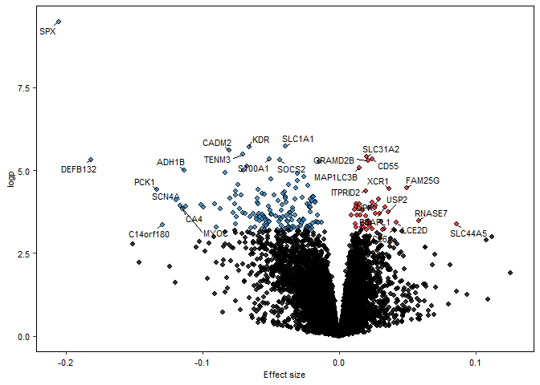
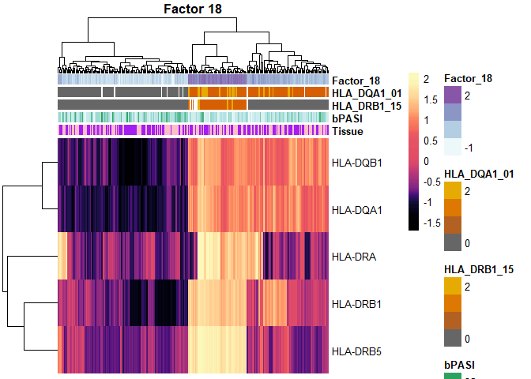
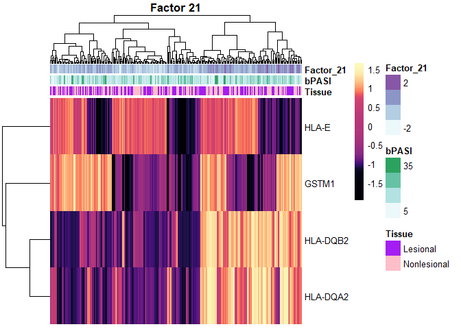
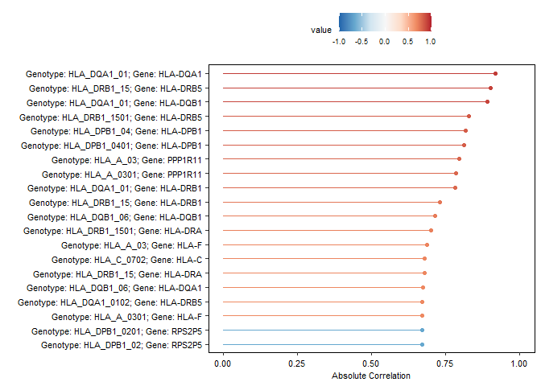
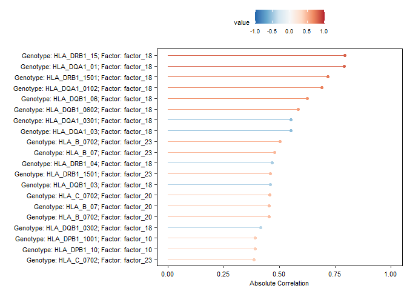

# Introduction

This notebook and associated scripts replicate the estimation of factors
and some of the key related analyses (BMI, HLA) in the PSORT
transcriptomics paper.

# Running factor analysis

Below, we load and process the expression and factor data.

``` r
# Load the ICA results and expression data - see scripts directory for the code that generated these
ica_skin_d <- readRDS("../20230907_run_ica_both_tissues/ica_skin_d.rds")
ica_skin_r <- readRDS("../20230907_run_ica_both_tissues/ica_skin_r.rds")
ica_blood <- readRDS("../20230907_run_ica_both_tissues/ica_blood.rds")

# Convert to FactorisedExperiment objects for manipulation/analysis
skin_d_fe <- FactorisedExperiment(
    assays = list("X" = t(ica_skin_d$X)), 
    loadings=ica_skin_d$S, reduced=ica_skin_d$M, 
    colData=ica_skin_d$sample_data, 
    rowData=ica_skin_d$feature_data, 
    stability=ica_skin_d$vafs
)
skin_r_fe <- FactorisedExperiment(
    assays = list("X" = t(ica_skin_r$X)), 
    loadings=ica_skin_r$S, 
    reduced=ica_skin_r$M, 
    colData=ica_skin_r$sample_data,
    rowData=ica_skin_r$feature_data, 
    stability=ica_skin_r$vafs
)
blood_fe <- FactorisedExperiment(
    assays = list("X" = t(ica_blood$X)), 
    loadings=ica_blood$S, 
    reduced=ica_blood$M, 
    colData=ica_blood$sample_data, 
    rowData=ica_blood$feature_data, 
    stability=ica_blood$vafs
)

# Use ENSEMBL ID where gene symbol unavailable
rowData(skin_d_fe)$gene_id[rowData(skin_d_fe)$gene_id == ""] <- rowData(skin_d_fe)$ensembl_id[rowData(skin_d_fe)$gene_id == ""]
rowData(skin_r_fe)$gene_id[rowData(skin_r_fe)$gene_id == ""] <- rowData(skin_r_fe)$ensembl_id[rowData(skin_r_fe)$gene_id == ""]
rowData(blood_fe)$gene_id[rowData(blood_fe)$gene_id == ""] <- rowData(blood_fe)$ensembl_id[rowData(blood_fe)$gene_id == ""]

# Correct gender variable
skin_r_fe$Gender[skin_r_fe$Patient_id == "P.5035"] <- "M"
skin_r_fe$Gender[skin_r_fe$Patient_id == "P.5036"] <- "F"

# Log PASI
skin_d_fe$log_PASI <- log(skin_d_fe$PASI)
skin_r_fe$log_PASI <- log(skin_r_fe$PASI)
blood_fe$log_PASI <- log(blood_fe$PASI)
```

We estimated factors using the ICA algorithm by running the files in the
scripts/ directory. We then loaded the results and converted them to
FactorisedExperiment objects, from the ReducedExperiment package. These
objects are like SummarizedExperiment objects, but with additional slots
for the ICA results.

We used the maximally stable transcriptome dimension (MSTD) algorithm to
estimate the number of factors. The factor stability plots are shown
below, which we used to estimate the optimal number of factors.

<figure>

<figcaption aria-hidden="true">Skin stability</figcaption>
</figure>

<figure>

<figcaption aria-hidden="true">Blood stability</figcaption>
</figure>

Below, we show a summary of the factor objects for each cohort.

``` r
skin_d_fe
```

    ## class: FactorisedExperiment 
    ## dim: 15358 400 24 
    ## metadata(0):
    ## assays(1): X
    ## rownames(15358): ENSG00000000003 ENSG00000000005 ... ENSG00000281593
    ##   ENSG00000281887
    ## rowData names(4): ensembl_id hgnc_symbol entrezgene_id gene_id
    ## colnames(400): 1001-0006 1001-0105 ... 6041-1205 6041-1206
    ## colData names(596): Patient_id Sample_id ... PASI log_PASI
    ## 24 components

``` r
skin_r_fe
```

    ## class: FactorisedExperiment 
    ## dim: 15358 276 24 
    ## metadata(0):
    ## assays(1): X
    ## rownames(15358): ENSG00000000003 ENSG00000000005 ... ENSG00000281593
    ##   ENSG00000281887
    ## rowData names(4): ensembl_id hgnc_symbol entrezgene_id gene_id
    ## colnames(276): 1015-0006 1015-1205 ... 6071-1205 6071-1206
    ## colData names(596): Patient_id Sample_id ... PASI log_PASI
    ## 24 components

``` r
blood_fe
```

    ## class: FactorisedExperiment 
    ## dim: 17804 318 21 
    ## metadata(0):
    ## assays(1): X
    ## rownames(17804): ENSG00000000003 ENSG00000000419 ... ENSG00000281917
    ##   ENSG00000281922
    ## rowData names(4): ensembl_id hgnc_symbol entrezgene_id gene_id
    ## colnames(318): 1001-0402 1001-0002 ... 64001-1202 64001-0402
    ## colData names(596): Patient_id Sample_id ... PASI log_PASI
    ## 21 components

# BMI analysis

Get the non-lesional data for the BMI analysis.

``` r
# Get SummarizedExperiment for non-lesional tissue
skin_d_se <- as(skin_d_fe[, which(skin_d_fe$Tissue == "Nonlesional")], "SummarizedExperiment")
skin_r_se <- as(skin_r_fe[, which(skin_r_fe$Tissue == "Nonlesional")], "SummarizedExperiment")
```

In this analysis we adjust for age and sex. Sex in particular is a
problematic confounder - BMI is associated with sex, so if we run the
analysis without correction we find very strong associations between BMI
and y-linked genes. Seems unlikely that these associations are directly
relevant to BMI.

We use duplicateCorrelation to deal with the fact we have repeated
measurements from each individual. We apply lmFit to apply models to the
logCPM data.

``` r
apply_diffexp <- function(se_obj, coef = "BMI", suffix = "") {
  # Filter out NA values for BMI and Age
  se_filtered <- se_obj[, which(!is.na(se_obj$BMI) & !is.na(se_obj$Age))]
  
  # Create design matrix, adjust for sex and age
  design <- model.matrix(~ BMI + Gender + Age, 
                        data = data.frame(colData(se_filtered)))
  
  # Estimate correlation structure
  dupcor <- duplicateCorrelation(assay(se_filtered, 1), 
                                design, 
                                block = factor(se_filtered$Patient_id))
  
  # Fit the model
  fit <- lmFit(assay(se_filtered, 1), 
               design, 
               block = factor(se_filtered$Patient_id), 
               correlation = dupcor$consensus)
  fit <- eBayes(fit)
  
  # Get results for the BMI variable
  tt <- topTable(fit, coef = coef, number = Inf)
  
  # Add suffix to column names if specified
  if (suffix != "") {
    colnames(tt) <- paste0(colnames(tt), suffix)
  }
  
  # Add ensembl IDs and join with row data
  tt$ensembl_id <- rownames(tt)
  tt <- dplyr::left_join(tt, 
                         data.frame(rowData(se_filtered)), 
                         by = c("ensembl_id" = "ensembl_id"))
  
  return(tt)
}

# Differential expression in discovery
skin_d_tt <- apply_diffexp(skin_d_se)
head(skin_d_tt)
```

    ##         logFC    AveExpr         t      P.Value    adj.P.Val         B
    ## 1 -0.20561717 -0.2629704 -6.706675 3.340830e-10 5.130847e-06 12.217275
    ## 2 -0.03913497  1.5077595 -4.949572 1.887646e-06 7.026349e-03  3.782164
    ## 3 -0.06617591  3.8191949 -4.940124 1.968598e-06 7.026349e-03  3.741546
    ## 4 -0.08040329  0.2974978 -4.889792 2.459882e-06 7.026349e-03  3.526129
    ## 5 -0.07033799  2.0553959 -4.820523 3.334186e-06 7.026349e-03  3.232327
    ## 6  0.01997131  5.9307713  4.781191 3.957478e-06 7.026349e-03  3.066892
    ##        ensembl_id hgnc_symbol entrezgene_id gene_id
    ## 1 ENSG00000134548         SPX         80763     SPX
    ## 2 ENSG00000106688      SLC1A1          6505  SLC1A1
    ## 3 ENSG00000128052         KDR          3791     KDR
    ## 4 ENSG00000175161       CADM2        253559   CADM2
    ## 5 ENSG00000218336       TENM3         55714   TENM3
    ## 6 ENSG00000136867     SLC31A2          1318 SLC31A2

We can visualise these data as a volcano plot.

``` r
tt_volcano_plot <- function(tt, fc_col = "logFC", de_p_cutoff = 0.05, n_pos_fc = 8, n_neg_fc = n_pos_fc, n_pos_pval = n_pos_fc, n_neg_pval = n_pos_pval) {
    colnames(tt) <- gsub("adj_p", "adj.P.Val", colnames(tt))
    colnames(tt) <- gsub("pval", "P.Value", colnames(tt))
    colnames(tt) <- gsub("term_id", "gene_id", colnames(tt))
    
    # prepare colouring
    tt$de_col <- mapply(tt$adj.P.Val, tt[[fc_col]], FUN = function(adj_p, fc) {
        if (adj_p < de_p_cutoff) {
            if (fc > 0) {
                return("upreg")
            } else {
                return("downreg")
            }
        } else {
            return("non_sig")
        }
    })
    
    tt$de_col <- factor(tt$de_col, c("downreg", "non_sig", "upreg"))
    
    # label the top up and downregulated genes
    top_pos_fc <- Rfast::nth(tt[[fc_col]][tt$adj.P.Val < de_p_cutoff], n_pos_fc, descending = TRUE)
    top_neg_fc <- Rfast::nth(tt[[fc_col]][tt$adj.P.Val < de_p_cutoff], n_neg_fc, descending = FALSE)
    top_pos_pval <- Rfast::nth(tt$P.Value[tt[[fc_col]] > 0 & tt$adj.P.Val < de_p_cutoff], n_pos_pval, descending = FALSE)
    top_neg_pval <- Rfast::nth(tt$P.Value[tt[[fc_col]] < 0 & tt$adj.P.Val < de_p_cutoff], n_neg_pval, descending = FALSE)
    
    tt_to_label <- tt$adj.P.Val <= de_p_cutoff & (
        tt[[fc_col]] >= top_pos_fc |
            tt[[fc_col]] <= top_neg_fc |
            (tt$P.Value <= top_pos_pval & tt[[fc_col]] > 0) |
            (tt$P.Value <= top_neg_pval & tt[[fc_col]] < 0))
    
    tt$logp <- -log10(tt$P.Value)
    
    # make the ggplot
    volcano_plot <- ggplot(tt, aes_string(fc_col, "logp", fill = "de_col")) +
        geom_point(size = 2, alpha = 0.8, color = "black", pch = 21, stroke = 0.05) +
        scale_color_manual(values = c("downreg" = "#2C7BB6", "non_sig" = "black", "upreg" = "#D7191C")) +
        scale_fill_manual(values = c("downreg" = "#2C7BB6", "non_sig" = "black", "upreg" = "#D7191C")) +
        geom_text_repel(aes(label = gene_id), size = 3, color = "black", data = subset(tt, tt_to_label), min.segment.length = 0.1) +
        theme(legend.position = "none") +
        xlab("Effect size")
    
    return(volcano_plot)
}

tt_volcano_plot(skin_d_tt)
```



We also apply the models to the replication cohort, permitting us to
compare the results between the two cohorts.

``` r
# Replication
skin_r_tt <- apply_diffexp(skin_r_se, suffix = "_r")
combined_tt <- dplyr::left_join(skin_d_tt, dplyr::select(skin_r_tt, logFC_r, P.Value_r, adj.P.Val_r, ensembl_id), by = c("ensembl_id" = "ensembl_id"))
head(combined_tt)
```

    ##         logFC    AveExpr         t      P.Value    adj.P.Val         B
    ## 1 -0.20561717 -0.2629704 -6.706675 3.340830e-10 5.130847e-06 12.217275
    ## 2 -0.03913497  1.5077595 -4.949572 1.887646e-06 7.026349e-03  3.782164
    ## 3 -0.06617591  3.8191949 -4.940124 1.968598e-06 7.026349e-03  3.741546
    ## 4 -0.08040329  0.2974978 -4.889792 2.459882e-06 7.026349e-03  3.526129
    ## 5 -0.07033799  2.0553959 -4.820523 3.334186e-06 7.026349e-03  3.232327
    ## 6  0.01997131  5.9307713  4.781191 3.957478e-06 7.026349e-03  3.066892
    ##        ensembl_id hgnc_symbol entrezgene_id gene_id      logFC_r   P.Value_r
    ## 1 ENSG00000134548         SPX         80763     SPX -0.092964204 0.001428266
    ## 2 ENSG00000106688      SLC1A1          6505  SLC1A1 -0.010666031 0.166447695
    ## 3 ENSG00000128052         KDR          3791     KDR -0.024594255 0.052294238
    ## 4 ENSG00000175161       CADM2        253559   CADM2 -0.039614889 0.002469435
    ## 5 ENSG00000218336       TENM3         55714   TENM3 -0.018662149 0.142334468
    ## 6 ENSG00000136867     SLC31A2          1318 SLC31A2  0.005601738 0.197461275
    ##   adj.P.Val_r
    ## 1   0.1605407
    ## 2   0.4454030
    ## 3   0.2984232
    ## 4   0.1765844
    ## 5   0.4190624
    ## 6   0.4801023

Below, we replicate the summary plot for the factor 9 / lightyellow
BMI-related genes (3B).

``` r
# Get PASI results for each drug
pasi_res <- read.csv("../20231113_bmi_dexp/pasi_genes/LS_vp_sig_fc_genes_module_anno.splinedf3.tsv", sep = "\t")
pasi_res <- pasi_res[which(pasi_res$adj.P.Val < 0.05) ,]

ada_pasi_res <- pasi_res[which(pasi_res$Drug == "ADA") ,]
ust_pasi_res <- pasi_res[which(pasi_res$Drug == "UST") ,]
ada_pasi_res$signed_fit_range_ada <- ada_pasi_res$signed_fit_range
ust_pasi_res$signed_fit_range_ust <- ust_pasi_res$signed_fit_range

# Get lightyellow module information
lightyellow <- read.csv("../../data/20230911_wgcna_eigengenes/Skin_modules/lightyellow_module_genes.txt", sep = "\t")
lightyellow <- dplyr::left_join(lightyellow, dplyr::select(skin_d_tt, ensembl_id, logFC, P.Value, adj.P.Val, gene_id), by = c("EnsemblID" = "ensembl_id"))
lightyellow_signif <- lightyellow[which(lightyellow$adj.P.Val < 0.05) ,]

# Get module centrality results
module_centrality <- read.csv("../../data/20240228_module_centrality/Skin_MM 1.txt", sep = "\t")
all_factor_9_genes <- data.frame(ensembl_id = rownames(skin_d_fe), coef = loadings(skin_d_fe)[,9])

# Combine results
combined_res <- dplyr::select(skin_d_tt[skin_d_tt$adj.P.Val < 0.05, ], ensembl_id, gene_id, adj.P.Val, logFC)
combined_res$in_lightyellow <- combined_res$ensembl_id %in% lightyellow$EnsemblID
combined_res$lightyellow_centrality <- sapply(combined_res$ensembl_id, function(ensembl_id) {
    
    if (ensembl_id %in% lightyellow$EnsemblID) {
        mc_gene <- module_centrality[which(module_centrality$EnsemblID == ensembl_id & module_centrality$Module == "lightyellow") ,]
        stopifnot(nrow(mc_gene) == 1)
        return(mc_gene$Cor_d)
    } else {
        return(NA)
    }
})

combined_res <- dplyr::left_join(combined_res, dplyr::select(all_factor_9_genes, ensembl_id, coef), by = "ensembl_id")
combined_res <- dplyr::left_join(combined_res, dplyr::select(ada_pasi_res, EnsemblID, signed_fit_range_ada), by = c("ensembl_id" = "EnsemblID"))
combined_res <- dplyr::left_join(combined_res, dplyr::select(ust_pasi_res, EnsemblID, signed_fit_range_ust), by = c("ensembl_id" = "EnsemblID"))
combined_res <- combined_res[which(combined_res$in_lightyellow | combined_res$coef > 5) ,]

# Make the individual plots
module_plot <- ggplot(combined_res, aes(x = 1, y = reorder(gene_id, logFC, decreasing=TRUE), fill = lightyellow_centrality)) +
    geom_tile() +
    scale_fill_distiller(palette = "OrRd", direction = 1) +
    xlab("Lightyellow\nmodule\ncentrality") +
    theme(legend.position = "none", axis.text.x = element_blank(), axis.ticks.x = element_blank(), axis.title.y = element_blank())

factor_plot <- ggplot(combined_res, aes(x = 1, y = reorder(gene_id, logFC, decreasing=TRUE), fill = coef)) +
    geom_tile() +
    colorspace::scale_fill_continuous_divergingx(palette = "RdBu", mid = 0, rev = TRUE, n_interp = 101) +
    xlab("Factor 9\nalignment") +
    theme(legend.position = "none", axis.text.x = element_blank(), axis.ticks.x = element_blank(), axis.text.y = element_blank(), axis.ticks.y = element_blank(), axis.title.y = element_blank())

dexp_plot <- ggplot(combined_res, aes(x = 1, y = reorder(gene_id, logFC, decreasing=TRUE), fill = logFC)) +
    geom_tile() +
    colorspace::scale_fill_continuous_divergingx(palette = "RdBu", mid = 0, rev = TRUE, n_interp = 101) +
    xlab("BMI\nassociation\n(None, NL)") +
    theme(legend.position = "none", axis.text.x = element_blank(), axis.ticks.x = element_blank(), axis.text.y = element_blank(), axis.ticks.y = element_blank(), axis.title.y = element_blank())

ada_pasi_plot <- ggplot(combined_res, aes(x = 1, y = reorder(gene_id, logFC, decreasing=TRUE), fill = signed_fit_range_ada)) +
    geom_tile() +
    colorspace::scale_fill_continuous_divergingx(palette = "RdBu", mid = 0, rev = TRUE, n_interp = 101) +
    xlab("PASI\nassociation\n(ADA, L)") +
    theme(legend.position = "none", axis.text.x = element_blank(), axis.ticks.x = element_blank(), axis.text.y = element_blank(), axis.ticks.y = element_blank(), axis.title.y = element_blank())

ust_pasi_plot <- ggplot(combined_res, aes(x = 1, y = reorder(gene_id, logFC, decreasing=TRUE), fill = signed_fit_range_ust)) +
    geom_tile() +
    colorspace::scale_fill_continuous_divergingx(palette = "RdBu", mid = 0, rev = TRUE, n_interp = 101) +
    xlab("PASI\nassociation\n(UST, L)") +
    theme(legend.position = "none", axis.text.x = element_blank(), axis.ticks.x = element_blank(), axis.text.y = element_blank(), axis.ticks.y = element_blank(), axis.title.y = element_blank())

# Make the combined plot
plotlist <- list("module" = module_plot, "factor" = factor_plot, "dexp" = dexp_plot, "ada_pasi" = ada_pasi_plot, "ust_pasi" = ust_pasi_plot)
patchwork::wrap_plots(plotlist, nrow = 1) + patchwork::plot_layout(guides = "collect", widths = c(2, 2, 2, 2, 2))
```


# HLA analysis

Get the baseline data for the HLA analysis. Combine the discovery and
replication cohorts using batch correction and scaling.

``` r
# Remove columns that are only in one cohort
colData(skin_d_fe) <- colData(skin_d_fe)[, which(colnames(colData(skin_d_fe)) %in% colnames(colData(skin_r_fe)))]
colData(skin_r_fe) <- colData(skin_r_fe)[, which(colnames(colData(skin_r_fe)) %in% colnames(colData(skin_d_fe)))]

# Combine the data into one object for the baseline samples
skin_fe <- cbind(skin_d_fe, skin_r_fe)
skin_fe <- skin_fe[, skin_fe$Time == "wk00"]
skin_features <- getAlignedFeatures(skin_fe)

# Perform batch correction and scaling across cohorts
# 1 - Gene expression
assay(skin_fe, "batch_corrected") <- limma::removeBatchEffect(assay(skin_fe), batch = skin_fe$Cohort, design = model.matrix(~ Tissue + PASI, data = colData(skin_fe))[,-1])
assay(skin_fe, "batch_corrected_scaled") <- t(scale(t(assay(skin_fe, "batch_corrected"))))

# 2 - Factors
reduced(skin_fe) <- t(limma::removeBatchEffect(t(reduced(skin_fe)), batch = skin_fe$Cohort, design = model.matrix(~ Tissue + PASI, data = colData(skin_fe))[,-1]))
reduced(skin_fe) <- scale(reduced(skin_fe))

skin_fe$bPASI <- skin_fe$PASI

# Set decimal (imputed) HLA genotypes to NA
for (which_hla_cname in which(grepl("HLA_", colnames(colData(skin_fe))))) skin_fe[[which_hla_cname]][which(!skin_fe[[which_hla_cname]] %in% c(0, 1, 2))] <- NA
```

Below, we replicate the heatmaps shown in Fig. 5A for factors 18 and 21.

``` r
quantile_breaks <- function(xs, n = 10) {
    breaks <- quantile(xs, probs = seq(0, 1, length.out = n))
    breaks[!duplicated(breaks)]
}

n_cols <- 100

expr <- assay(skin_fe[rowData(skin_fe)$gene_id %in% c("HLA-DRA", "HLA-DQB1", "HLA-DQA1", "HLA-DRB1", "HLA-DRB5"), ], "batch_corrected_scaled")
rownames(expr) <- sapply(rownames(expr), function(x) {
    return(rowData(skin_fe)$gene_id[rownames(skin_fe) == x])
})

annot_col <- dplyr::select(data.frame(colData(skin_fe)), Tissue, bPASI, HLA_DRB1_15, HLA_DQA1_01)
annot_col$Factor_18 <- reduced(skin_fe)[, "factor_18"]

annot_cols <- list(
    Tissue = c("Lesional" = "#a41df2ff", "Nonlesional" = "#fdbec9ff"), 
    HLA_DRB1_15 = c("0" = "#666666", "1" = "#D95F02", "2" = "#E6AB02"), 
    HLA_DQA1_01 = c("0" = "#666666", "1" = "#D95F02", "2" = "#E6AB02")
)

pheatmap::pheatmap(
    expr, 
    scale = "none", 
    color = viridis::magma(n_cols),
    breaks = quantile_breaks(expr, n_cols), 
    show_colnames = FALSE, 
    border_color = NA, annotation_col = annot_col, annotation_colors = annot_cols,
    height = 2 + nrow(expr) * 0.15, na_col = "grey",
    main = "Factor 18"
)
```



``` r
# Factor 21 heatmap
expr <- assay(skin_fe[rowData(skin_fe)$gene_id %in% c("HLA-E", "GSTM1", "HLA-DQB2", "HLA-DQA2"), ], "batch_corrected_scaled")
rownames(expr) <- sapply(rownames(expr), function(x) {
    return(rowData(skin_fe)$gene_id[rownames(skin_fe) == x])
})

annot_col <- dplyr::select(data.frame(colData(skin_fe)), Tissue, bPASI)
annot_col$Factor_21 <- reduced(skin_fe)[, "factor_21"]

pheatmap::pheatmap(
    expr, 
    scale = "none", 
    color = viridis::magma(n_cols),
    breaks = quantile_breaks(expr, n_cols), 
    show_colnames = FALSE, 
    border_color = NA, annotation_col = annot_col, annotation_colors = annot_cols,
    height = 1.5 + nrow(expr) * 0.15, na_col = "grey", 
    main = "Factor 21"
)
```



We then replicate the genotype associations, starting at gene-level
(Fig. 5B).

``` r
# Get genotypes
hla_genotypes <- as.matrix(colData(skin_fe)[which(skin_fe$Tissue == "Lesional"), which(grepl("HLA_", colnames(colData(skin_fe))))])
hla_genotypes <- hla_genotypes[, which(apply(hla_genotypes, 2, sd, na.rm = TRUE) > 0)]
hla_genotypes <- data.frame(hla_genotypes)

# Correlate with genes and plot results
gene_cors <- cor(hla_genotypes, t(assay(skin_fe[, which(skin_fe$Tissue == "Lesional")])), use = "pairwise.complete.obs")
gene_cors_long <- tidyr::pivot_longer(tibble::rownames_to_column(data.frame(gene_cors), "row"), -row)
gene_cors_long <- dplyr::left_join(gene_cors_long, data.frame(rowData(skin_fe)), by = c("name" = "ensembl_id"))

gene_cors_long$genotype_gene <- paste0("Genotype: ", gene_cors_long$row, "; Gene: ", gene_cors_long$gene_id)
ggplot(gene_cors_long[order(abs(gene_cors_long$value), decreasing = TRUE) ,][1:20 ,], aes(abs(value), reorder(genotype_gene,  abs(value)), col = value)) +
    geom_point() +
    geom_segment(aes(yend = genotype_gene), xend=0) +
    xlim(c(0, 1)) +
    xlab("Absolute Correlation") +
    ylab("") +
    scale_color_distiller(palette = "RdBu", type = "div", limits=c(-1,1))
```



And now we look at associations with factors, finding that factor 18 has
particularly strong associations.

``` r
# Correlate with factors and plot results
factor_cors <- cor(hla_genotypes, reduced(skin_fe)[which(skin_fe$Tissue == "Lesional") ,], use = "pairwise.complete.obs")
factor_cors_long <- tidyr::pivot_longer(tibble::rownames_to_column(data.frame(factor_cors), "row"), -row)

factor_cors_long$genotype_factor <- paste0("Genotype: ", factor_cors_long$row, "; Factor: ", factor_cors_long$name)
ggplot(factor_cors_long[order(abs(factor_cors_long$value), decreasing = TRUE) ,][1:20 ,], aes(abs(value), reorder(genotype_factor,  abs(value)), col = value)) +
    geom_point() +
    geom_segment(aes(yend = genotype_factor), xend=0) +
    xlim(c(0, 1)) +
    xlab("Absolute Correlation") +
    ylab("") +
    scale_color_distiller(palette = "RdBu", type = "div", limits=c(-1,1))
```



# Replicating the manuscript

Check that the factors are the same as in the Supplementary Data.

``` r
# Read data from the supplementary file
skin_reduced <- readxl::read_excel("../../data/20241128_supp_data/supplementary_file_factor_tables.xlsx", sheet = "1 - skin_reduced")
blood_reduced <- readxl::read_excel("../../data/20241128_supp_data/supplementary_file_factor_tables.xlsx", sheet = "2 - blood_reduced")
skin_loadings <- readxl::read_excel("../../data/20241128_supp_data/supplementary_file_factor_tables.xlsx", sheet = "3 - skin_loadings")
blood_loadings <- readxl::read_excel("../../data/20241128_supp_data/supplementary_file_factor_tables.xlsx", sheet = "4 - blood_loadings")
skin_aligned_features <- readxl::read_excel("../../data/20241128_supp_data/supplementary_file_factor_tables.xlsx", sheet = "5 - skin_aligned_features")
blood_aligned_features <- readxl::read_excel("../../data/20241128_supp_data/supplementary_file_factor_tables.xlsx", sheet = "6 - blood_aligned_features")

# Check metagenes and loadings are the same
stopifnot(all.equal(data.frame(skin_reduced)[,-1], data.frame(rbind(reduced(skin_d_fe), reduced(skin_r_fe))), check.attributes = FALSE))
stopifnot(all.equal(data.frame(blood_reduced)[,-1], data.frame(reduced(blood_fe)), check.attributes = FALSE))
stopifnot(all.equal(data.frame(skin_loadings)[,-1], data.frame(loadings(skin_d_fe)), check.attributes = FALSE))
stopifnot(all.equal(data.frame(blood_loadings)[,-1], data.frame(loadings(blood_fe)), check.attributes = FALSE))

# Get and check the aligned features
skin_aligned_features <- skin_aligned_features[order(skin_aligned_features$`Skin factor`, skin_aligned_features$`Ensembl ID`),]
new_aligned_features <- data.frame(getAlignedFeatures(skin_fe, format = "data.frame"))[, c("component", "feature")]
new_aligned_features <- new_aligned_features[order(new_aligned_features$component, new_aligned_features$feature),]
stopifnot(all.equal(data.frame(skin_aligned_features)[, c("Skin.factor", "Ensembl.ID")], new_aligned_features, check.attributes = FALSE))

blood_aligned_features <- blood_aligned_features[order(blood_aligned_features$`Blood factor`, blood_aligned_features$`Ensembl ID`),]
new_aligned_features <- data.frame(getAlignedFeatures(blood_fe, format = "data.frame"))[, c("component", "feature")]
new_aligned_features <- new_aligned_features[order(new_aligned_features$component, new_aligned_features$feature),]
stopifnot(all.equal(data.frame(blood_aligned_features)[, c("Blood.factor", "Ensembl.ID")], new_aligned_features, check.attributes = FALSE))
```

Check that the notebook replicates the manuscript results.

``` r
original_d_res <- read.csv("../20231113_bmi_dexp/skin_d_res.csv")
original_c_res <- read.csv( "../20231113_bmi_dexp/combined_res.csv")

# Check differential expression results match
stopifnot(all.equal(original_d_res, skin_d_tt, check.attributes = FALSE))
stopifnot(all.equal(original_c_res, combined_tt, check.attributes = FALSE))

# Check consistency of results with venn (3A)
stopifnot(sum(combined_tt$adj.P.Val < 0.05) == (157 + 3 + 21 + 11))
```

# Session information

``` r
sessionInfo()
```

    ## R version 4.4.0 (2024-04-24 ucrt)
    ## Platform: x86_64-w64-mingw32/x64
    ## Running under: Windows 11 x64 (build 22631)
    ## 
    ## Matrix products: default
    ## 
    ## 
    ## locale:
    ## [1] LC_COLLATE=English_United Kingdom.utf8 
    ## [2] LC_CTYPE=English_United Kingdom.utf8   
    ## [3] LC_MONETARY=English_United Kingdom.utf8
    ## [4] LC_NUMERIC=C                           
    ## [5] LC_TIME=English_United Kingdom.utf8    
    ## 
    ## time zone: Europe/London
    ## tzcode source: internal
    ## 
    ## attached base packages:
    ## [1] stats4    stats     graphics  grDevices utils     datasets  methods  
    ## [8] base     
    ## 
    ## other attached packages:
    ##  [1] ggrepel_0.9.5               ggpubr_0.6.0               
    ##  [3] ggplot2_3.5.1               ReducedExperiment_0.99.0   
    ##  [5] readxl_1.4.3                limma_3.60.2               
    ##  [7] SummarizedExperiment_1.34.0 Biobase_2.64.0             
    ##  [9] GenomicRanges_1.56.0        GenomeInfoDb_1.40.1        
    ## [11] IRanges_2.38.0              S4Vectors_0.42.0           
    ## [13] BiocGenerics_0.50.0         MatrixGenerics_1.16.0      
    ## [15] matrixStats_1.3.0          
    ## 
    ## loaded via a namespace (and not attached):
    ##   [1] DBI_1.2.2               gridExtra_2.3           httr2_1.0.1            
    ##   [4] biomaRt_2.60.0          rlang_1.1.3             magrittr_2.0.3         
    ##   [7] compiler_4.4.0          RSQLite_2.3.7           png_0.1-8              
    ##  [10] vctrs_0.6.5             RcppZiggurat_0.1.6      stringr_1.5.1          
    ##  [13] pkgconfig_2.0.3         crayon_1.5.2            fastmap_1.2.0          
    ##  [16] backports_1.5.0         dbplyr_2.5.0            XVector_0.44.0         
    ##  [19] labeling_0.4.3          utf8_1.2.4              rmarkdown_2.27         
    ##  [22] UCSC.utils_1.0.0        nloptr_2.0.3            purrr_1.0.2            
    ##  [25] bit_4.0.5               Rfast_2.1.0             xfun_0.44              
    ##  [28] zlibbioc_1.50.0         cachem_1.1.0            jsonlite_1.8.8         
    ##  [31] progress_1.2.3          blob_1.2.4              highr_0.11             
    ##  [34] DelayedArray_0.30.1     BiocParallel_1.38.0     broom_1.0.6            
    ##  [37] parallel_4.4.0          prettyunits_1.2.0       R6_2.5.1               
    ##  [40] ica_1.0-3               RColorBrewer_1.1-3      stringi_1.8.4          
    ##  [43] car_3.1-2               boot_1.3-30             cellranger_1.1.0       
    ##  [46] numDeriv_2016.8-1.1     Rcpp_1.0.12             knitr_1.47             
    ##  [49] Matrix_1.7-0            splines_4.4.0           tidyselect_1.2.1       
    ##  [52] viridis_0.6.5           rstudioapi_0.16.0       abind_1.4-5            
    ##  [55] yaml_2.3.8              codetools_0.2-20        curl_5.2.1             
    ##  [58] lattice_0.22-6          tibble_3.2.1            lmerTest_3.1-3         
    ##  [61] withr_3.0.0             KEGGREST_1.44.0         evaluate_0.23          
    ##  [64] moments_0.14.1          RcppParallel_5.1.7      BiocFileCache_2.12.0   
    ##  [67] xml2_1.3.6              Biostrings_2.72.0       pillar_1.9.0           
    ##  [70] filelock_1.0.3          carData_3.0-5           generics_0.1.3         
    ##  [73] hms_1.1.3               munsell_0.5.1           scales_1.3.0           
    ##  [76] minqa_1.2.7             glue_1.7.0              pheatmap_1.0.12        
    ##  [79] tools_4.4.0             lme4_1.1-35.3           ggsignif_0.6.4         
    ##  [82] grid_4.4.0              tidyr_1.3.1             AnnotationDbi_1.66.0   
    ##  [85] colorspace_2.1-0        nlme_3.1-164            GenomeInfoDbData_1.2.12
    ##  [88] patchwork_1.2.0         cli_3.6.2               rappdirs_0.3.3         
    ##  [91] fansi_1.0.6             viridisLite_0.4.2       S4Arrays_1.4.1         
    ##  [94] dplyr_1.1.4             gtable_0.3.5            rstatix_0.7.2          
    ##  [97] digest_0.6.35           SparseArray_1.4.8       farver_2.1.2           
    ## [100] memoise_2.0.1           htmltools_0.5.8.1       lifecycle_1.0.4        
    ## [103] httr_1.4.7              statmod_1.5.0           bit64_4.0.5            
    ## [106] MASS_7.3-61
