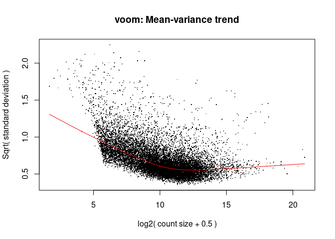
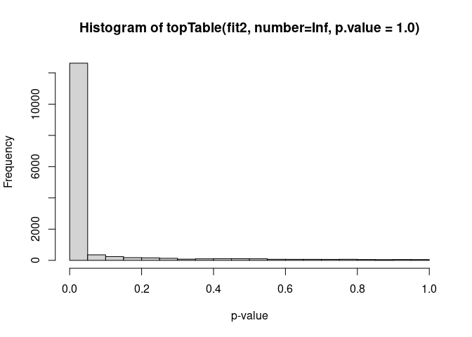
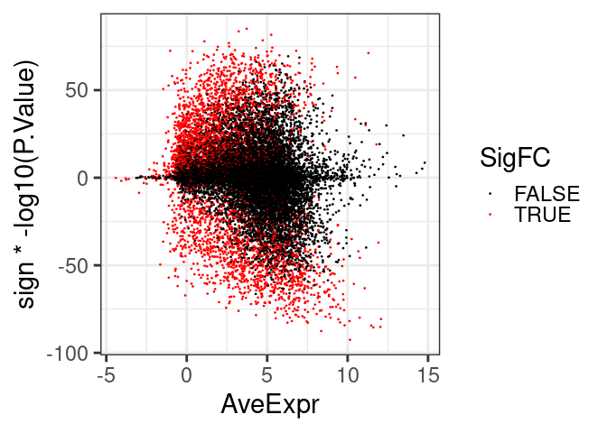

DE Analysis (Lesional Skin, fig 5) I: get DEGs
================
Graham R Smith
29 October 2024

Split Samples by Tissue. Normalize Ustekinumab and Adalimumab together
and fit together, irrespective of Drug, combining Discovery and
Replication (call cohort=“Both”).

<!-- ## libraries ---- -->

Load libraries

``` r
library(tidyverse)
library(edgeR)
library(limma)
library(splines)
library(reshape2)
library(qvalue)
```

### disease severity analysis (gene exp vs PASI) —- keep both drugs but just do one tissue

Set vars and read data in . Cohort “both” means both R and D

``` r
# set tissue 

tissue <-  "Lesional"

  
  # change cohort to cohort_out to make clear is just used in file names; var Cohort is used in models
  cohort_out <- "Both"
    
  # set directory where output will be put 
  outd_base <- "../de_Rmd/02_5/" 
    
    if (!dir.exists(outd_base))
      dir.create(outd_base, recursive = TRUE)
    
    #datad <- "/data/ngrs2/PSORT/data/"
    #annofile <- file.path(datad, "Hs.anno.csv")  This had 61593 rows
    datad <- "/data/ngrs2/PSORT/data/"
    annofile <- file.path(datad, "Hs.anno.csv")
    
    dfile <-  file.path(datad, "AR", "cnts_d_r_lnb.rds")
    clinfile <- file.path(datad, "AR", "clin_d_r_lnb_rev.txt")
    
    
    # read annotation 
    ad <- read_csv(annofile)
    # remove the [Source:HGNC Symbol;Acc:HGNC:48404] stuff
    ad$Description <- sub(" \\[Source.*", "", ad$Description)
    
    # read clinical data 
    d <- read_tsv(clinfile)
    # recode ... drug names are different .. keep cohorts
    d <- mutate(d, Patient_id = gsub("P.", "P", Patient_id), 
                Drug = recode(Drug, "Adalimumab"="A", "Ustekinumab"="U" ))
    
    
    drug_out <- list(A = "ADA", U = "UST")
    d <- mutate(d,  Time = recode(Time, "wk00"="0w","wk01"="1w","wk04"="4w","wk12"="12w")) %>% 
      mutate(Time = factor(Time, levels = c("0w", "1w", "4w", "12w")))
    

    # read expression data
    edata <- read_rds(dfile)
    cat("n genes", nrow(edata), "\n")
```

    ## n genes 34507

process (select) data and fit with limma to PASI using a spline with 3
degrees of freedom, with repeated measures treated by duplicate
correlation (25 min on one cpu). Show mean-variance plot.

``` r
    keep_samp <- d %>% filter (Tissue == tissue )

    # check for PCA outliers (though there are none in Lesional samples) or missing PASI values and remove samples 
    to_rm <- c("PSORT-P1-18", "PSORT-P1-71", "PSORT-P1-UHR", "PSORT-P2-UHR-1", "PSORT-P2-UHR-2", "PSORT-P3-06", "PSORT-P3-07", "PSORT-P4-23")
    # and this is a duplicate sample for P6001 wk4 blood 
    to_rm <- c(to_rm, "PSORT-P1-52")
    keep_samp <- filter(keep_samp, ! Sample_id %in% to_rm) %>% filter(! is.na(PASI))
    

    dim(keep_samp)
```

    ## [1] 402 596

``` r
    # select the expression data, using only those with annotation, and
    # using sample ID to make sure it's in the right order, then filter to keep high expression and normalize
    gene_ids <- tibble(EnsemblID = rownames(edata)) %>%
      inner_join(ad, by = 'EnsemblID') %>%
      dplyr::select(EnsemblID, GeneSymbol)
    this_data <- DGEList(edata[gene_ids$EnsemblID, keep_samp$Sample_id])
    n <- nrow(keep_samp)
    keep_gene <- rowSums(cpm(this_data) >= 1) >= n /(length(unique(keep_samp$Cohort)) * length(unique(keep_samp$Drug)))
    this_data <- DGEList(this_data[keep_gene, ])
    this_data <- calcNormFactors(this_data)
    dim(this_data)
```

    ## [1] 14720   402

``` r
    # output norm factors
    nf_data <- select(keep_samp, Sample_id, Cohort, Drug, Time, PASI)
    nf_data$norm.factors <- this_data$samples$norm.factors
    write_tsv(nf_data, file = file.path(outd_base, paste0(tissue,"_norm_factors.tsv")))
    
    
    
    cat("number of patients", length(table(keep_samp$Patient_id)), "\n")
```

    ## number of patients 139

``` r
    cat("number of samples", ncol(this_data), "\n")
```

    ## number of samples 402

``` r
    cat("number of genes", nrow(this_data), "\n")
```

    ## number of genes 14720

``` r
    ## set up design and do fit ----
    
    # design loop 
    # model type loop ; linear seems OK as long as you do it first 
    # model_type <- "splinedf3"  # "constant"  ... constant isn't very interesting
    # for (model_type in c("linear")) {#
    # for (model_type in c("splinedf3" , "splinedf2", "linear")) {#
    #  for (model_type in c("splinedf3", "splinedf2")) {
    model_type <- "splinedf3"
      cat("doing tissue", tissue, "\tcohort", cohort_out, "\tmodel_type",model_type,"\n\n")
```

    ## doing tissue Lesional    cohort Both     model_type splinedf3

``` r
        coeft <- ns(keep_samp$PASI, df = 3)
        design <- model.matrix( ~ 0 + Cohort + coeft, data = keep_samp)
        c0 <- first(grep("coeft", colnames(design)))
        allselcft <- c0:(ncol(design))
        plotformula <- "y ~ ns(x, df=3)"
        
        contrast.str <- NULL

      colnames(design) <- gsub(":", "_", colnames(design))
      

      # keep fitted model. If rerunning, load the fit if it exists to save time
      
      fitsd <- file.path(outd_base, "Fits")
      if (file.exists(file.path(fitsd, paste0(tissue, "_", cohort_out, "_", model_type, '_fit.02_5_2.rds')))) {
        
        cat("reloading existing fit ... \n")
        fit2 <- read_rds(file.path(fitsd, paste0(tissue, "_", cohort_out, "_", model_type, '_fit.02_5_2.rds')))
        vdata2 <- read_rds(file.path(fitsd, paste0(tissue, "_", cohort_out, "_", model_type, '_mat.02_5_2.rds')))
        
      } else {
   
        vdata <- voom(this_data, design)
        fit <- lmFit(vdata, design)
        fit <- eBayes(fit)
        
        # duplicate correlation takes a couple of minutes
        
        cat("starting duplicate correlation calculation 1...\n")
        corrfit <- duplicateCorrelation(vdata, design, block = keep_samp$Patient_id)
        cat("duplicate correlation:", corrfit$cor, "\n")
        # 
        # voom a second time
        vdata2 <- voom(this_data, design, correlation = corrfit$cor,
            block = keep_samp$Patient_id,    plot = TRUE)
        cat("starting duplicate correlation calculation 2...\n")
        corrfit2 <-
          duplicateCorrelation(vdata2, design, block = keep_samp$Patient_id)
        cat("duplicate correlation (refined):",   corrfit2$cor,  ", doing lmfit\n")
        # 
        #
        fit2 <- lmFit(vdata2, design,
                block = keep_samp$Patient_id,
                correlation = corrfit2$cor)
        fit2 <- eBayes(fit2)
        
        # Export results
        fitsd <- file.path(outd_base, "Fits")
        if (!dir.exists(fitsd))
          dir.create(fitsd, recursive = TRUE)
        saveRDS(fit2, file.path(fitsd, paste0(tissue, "_", cohort_out, "_", model_type, '_fit.02_5_2.rds')))
        saveRDS(vdata2, file.path(fitsd, paste0(tissue, "_", cohort_out, "_", model_type, '_mat.02_5_2.rds')))
        cat("done fit\n")
      }
```

    ## starting duplicate correlation calculation 1...
    ## duplicate correlation: 0.337881

<!-- -->

    ## starting duplicate correlation calculation 2...
    ## duplicate correlation (refined): 0.3378351 , doing lmfit
    ## done fit

Show p-value histogram and MA-plot. Extract DEGs, calculate effect size
(max to min of range of fitted spline) and output

``` r
      ## get toptables tt2 and pasi_genes_c ----
      
      # both drugs at once 
      drug_out = "UA"
      
        cat(" doing drug",drug_out, "cohort", cohort_out, "\n")
```

    ##  doing drug UA cohort Both

``` r
        outd <- file.path(outd_base, paste0(cohort_out, "_", drug_out,"_",tissue), model_type)
        if (!dir.exists(outd))
          dir.create(outd, recursive = TRUE)
        
        # look up the coefficients 
        # easy here cos with no drug variation can just do: 
          selcft <- allselcft
          drcol <- allselcft
        
        cat("doing coefficients", selcft, "names", colnames(design)[selcft], "\n")
```

    ## doing coefficients 3 4 5 names coeft1 coeft2 coeft3

``` r
        # will also need an index for the current drug 
        dridx <- rep(TRUE, nrow(keep_samp)  )
        # for plotting 
        # plot_samp <- filter(keep_samp, Drug == drug)
        plot_samp <- keep_samp
        vdata_p = vdata2[, plot_samp$Sample_id]
        
        tt2 <- topTable(fit2,
                        coef = selcft,
                        number = Inf,
                        p.value = 1.0)
        #  hist(tt2$P.Value)
        #  hist(tt2$P.Value, ylim=c(0,1500))
        
        tt2$EnsemblID <- rownames(tt2)
        tt2 <- left_join(tt2, ad)
        
        # change sign of coeft so makes more sense in output
        # For "constant" get integer(0)and the loop does nothing. For "linear" need to use col1 (logFC)
        # in practice tt2 is not used much 
        if (model_type == "linear"){
          fix_col <- 1 
        } else {
          fix_col <- grep("coeft", names(tt2)) 
        }
        for (i in fix_col) {
          tt2[, i] <- -1 * tt2[, i]
        }
        
        
        # with duplicate correl
        pasi_genes_c <-
          topTable(fit2,  coef = selcft,
                   number = Inf, p.value = 1.0)
        # if only one coefficient, first name of output will be changed to LogFG, which we don't want
        if (length(selcft) == 1)
          names(pasi_genes_c)[1] <- colnames(design)[selcft]
        
        # p value histogram
        hist(pasi_genes_c$P.Value, xlab = "p-value", main = "Histogram of topTable(fit2, number=Inf, p.value = 1.0)")
```

<!-- -->

``` r
        png(file.path(outd, "pvalue_hist_ttfit_dupc_coef_lesional.png"), h = 480,  w = 480)
        hist(pasi_genes_c$P.Value, xlab = "p-value", main = "Histogram of topTable(fit2, number=Inf, p.value = 1.0)")
        dev.off()
```

    ## png 
    ##   2

``` r
        q_out = qvalue(pasi_genes_c$P.Value)
        pasi_genes_c$q.value = q_out$qvalue
        pasi_genes_c$lfdr = q_out$lfdr
        
        pasi_genes_c$EnsemblID = rownames(pasi_genes_c)
        pasi_genes_c = left_join(pasi_genes_c, ad)
        
        nrow(filter(pasi_genes_c, P.Value <= 0.05))
```

    ## [1] 12625

``` r
        nrow(filter(pasi_genes_c, adj.P.Val <= 0.05))
```

    ## [1] 12537

``` r
        nrow(filter(pasi_genes_c, q.value <= 0.05))
```

    ## [1] 14448

``` r
        nrow(filter(pasi_genes_c, lfdr <= 0.05))
```

    ## [1] 12235

``` r
        # again change sign of coeft 1 and coeft2 - only 2 this time
        fix_col = grep("coeft", names(pasi_genes_c))
        for (i in fix_col) {
          pasi_genes_c[, i] = -1 * pasi_genes_c[, i]
        }
        
        
        ## effect size using fitted() ----
        # note! fit2 not in order of pasi_genes_c (toptable output)
        
        myfitted <- function(object, cft, sidx) {
          # look up only those given coefficents cft (integers) appropriate to the current drug, and return values only for those samples treated with that drug (sidx, logical)
          if (!is.null(object$contrasts))
            stop(
              "Object contains contrasts rather than coefficients, so fitted values cannot be computed."
            )
          mat <- object$coefficients[, cft] %*% t(object$design[, cft])
          mat[, sidx]
        }
        
        fr2 <-
          t(apply(myfitted(fit2, drcol, dridx) , MARGIN = 1, FUN = range)) %>% as.data.frame() %>%
          rownames_to_column(var = "EnsemblID")
        names(fr2)[2:3] <- c("fit_min", "fit_max")
        pasi_genes_c <- left_join(pasi_genes_c, fr2)
        pasi_genes_c  <-
          mutate(pasi_genes_c , fit_range = fit_max - fit_min)
        if (model_type != "constant") {
          idx <- grep("coeft1", names(pasi_genes_c))
          pasi_genes_c  <- mutate(pasi_genes_c,
                                  signed_fit_range = sign(pasi_genes_c[, idx]) * fit_range)
        } else {
          pasi_genes_c  <- mutate(pasi_genes_c,
                                  signed_fit_range = fit_range)
        }
        
        
        # call pasi genes "responsive genes" and select the ones done including duplicate correlation
        responsive_genes <- pasi_genes_c
        

        
        # get FC criteron from fit_range now
        # filter by coeft: fold-change 2
        if (model_type == "constant") {
          fold_change <- 1
        } else {
          fold_change <- 2
        }
        responsive_genes2 <-
          filter(responsive_genes,
                 q.value <= 0.05 & abs(fit_range) >= log2(fold_change))
        
# took out genes with fit range > log2fc and cofft1-coeft2 plot blocks
        
        # took out "nr_de_genes_vs_p_mxmn_cutoffs.png" - plot of DF for nr DE vs coeft cutoff for diff pvalues (colour) and diff methods (linetype) 
        
        
        # make m-pval plot
        plot_rgdata <- responsive_genes
        plot_rgdata <- mutate(plot_rgdata, SigFC = q.value <= 0.05 & abs(fit_range) >= log2(fold_change))
        plot_rgdata <- mutate(plot_rgdata, Signif = q.value <= 0.05 )
        # 0 < q.value < 0.159 which introduces funny looking empty bands near x axis 
        p <- ggplot(aes(x = AveExpr, y = sign(signed_fit_range) * -log10(P.Value), color = SigFC), data = plot_rgdata) + 
          geom_point(size = 0.3) + ylab("sign * -log10(P.Value)") + scale_color_manual(values = c("black","red")) + 
          theme_bw(base_size = 22)
        p 
```

<!-- -->

``` r
        ggsave(file.path(outd, "MA_plot.png"))

# took out simple volcano plot 

        
        ##  output ------
        outf <- file.path(outd, paste0(drug_out, "_responsive_genes.txt"))
        write.table(
          responsive_genes2,
          file = outf,
          quote = F,
          sep = "\t",
          row.names = F
        )
        cat("\n")
```

``` r
        cat(
          "after filtering to p <= 0.05 and |effect size| >=",
          fold_change,
          ":",
          nrow(responsive_genes2),
          "\n"
        )
```

    ## after filtering to p <= 0.05 and |effect size| >= 2 : 3449

``` r
        cat("made", outf, "\n")
```

    ## made ../de_Rmd/02_5//Both_UA_Lesional/splinedf3/UA_responsive_genes.txt

``` r
        outf <- file.path(outd, paste0(drug_out, "_all_genes.txt"))
        write.table(
          responsive_genes,
          file = outf,
          quote = F,
          sep = "\t",
          row.names = F
        )
        cat("\n")
```

``` r
        cat("all genes :", nrow(responsive_genes), "\n")
```

    ## all genes : 14720

``` r
        cat("made", outf, "\n")
```

    ## made ../de_Rmd/02_5//Both_UA_Lesional/splinedf3/UA_all_genes.txt

``` r
sessionInfo()
```

    ## R version 4.2.2 Patched (2022-11-10 r83330)
    ## Platform: x86_64-pc-linux-gnu (64-bit)
    ## Running under: Ubuntu 22.04.1 LTS
    ## 
    ## Matrix products: default
    ## BLAS:   /usr/lib/x86_64-linux-gnu/blas/libblas.so.3.10.0
    ## LAPACK: /usr/lib/x86_64-linux-gnu/lapack/liblapack.so.3.10.0
    ## 
    ## locale:
    ##  [1] LC_CTYPE=en_US.UTF-8       LC_NUMERIC=C              
    ##  [3] LC_TIME=en_US.UTF-8        LC_COLLATE=en_US.UTF-8    
    ##  [5] LC_MONETARY=en_US.UTF-8    LC_MESSAGES=en_US.UTF-8   
    ##  [7] LC_PAPER=en_US.UTF-8       LC_NAME=C                 
    ##  [9] LC_ADDRESS=C               LC_TELEPHONE=C            
    ## [11] LC_MEASUREMENT=en_US.UTF-8 LC_IDENTIFICATION=C       
    ## 
    ## attached base packages:
    ## [1] splines   stats     graphics  grDevices utils     datasets  methods  
    ## [8] base     
    ## 
    ## other attached packages:
    ##  [1] qvalue_2.30.0   reshape2_1.4.4  edgeR_3.40.2    limma_3.54.2   
    ##  [5] lubridate_1.9.3 forcats_1.0.0   stringr_1.5.1   dplyr_1.1.4    
    ##  [9] purrr_1.0.2     readr_2.1.4     tidyr_1.3.0     tibble_3.2.1   
    ## [13] ggplot2_3.4.4   tidyverse_2.0.0
    ## 
    ## loaded via a namespace (and not attached):
    ##  [1] statmod_1.5.0     tidyselect_1.2.0  locfit_1.5-9.8    xfun_0.41        
    ##  [5] lattice_0.20-45   colorspace_2.1-0  vctrs_0.6.5       generics_0.1.3   
    ##  [9] htmltools_0.5.7   yaml_2.3.8        utf8_1.2.4        rlang_1.1.2      
    ## [13] pillar_1.9.0      glue_1.6.2        withr_2.5.2       bit64_4.0.5      
    ## [17] lifecycle_1.0.4   plyr_1.8.9        munsell_0.5.0     gtable_0.3.4     
    ## [21] ragg_1.2.7        evaluate_0.23     labeling_0.4.3    knitr_1.45       
    ## [25] tzdb_0.4.0        fastmap_1.1.1     parallel_4.2.2    fansi_1.0.6      
    ## [29] highr_0.10        Rcpp_1.0.11       scales_1.3.0      vroom_1.6.5      
    ## [33] systemfonts_1.0.5 farver_2.1.1      bit_4.0.5         textshaping_0.3.6
    ## [37] hms_1.1.3         digest_0.6.33     stringi_1.8.3     grid_4.2.2       
    ## [41] cli_3.6.2         tools_4.2.2       magrittr_2.0.3    crayon_1.5.2     
    ## [45] pkgconfig_2.0.3   timechange_0.2.0  rmarkdown_2.25    rstudioapi_0.15.0
    ## [49] R6_2.5.1          compiler_4.2.2

``` r
date()
```

    ## [1] "Tue Oct 29 13:16:54 2024"
