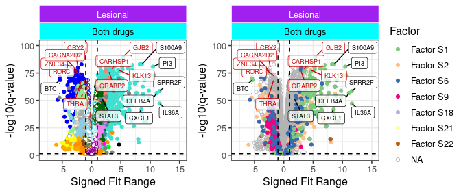

DE Analysis (Lesional Skin, fig 6) II: Make Volcano plots
================
Graham R Smith
04 February 2025

# Volcano Plots

Makes WGCNA module- and ICA factor-coloured volcano plots with labels

### Load libraries

``` r
library(dplyr)
library(readr)
library(ggplot2)
library(ggrepel)
library(tidyr)
library(tibble)
library(plotly)
# library(gplots) # if want to plot venn diagram
source("functions/get_modules.R")
source("functions/reload_factors.R")
library(ggh4x)
library(RColorBrewer)
# for ggarrange 
library(ggpubr)
```

### Declare Functions

``` r
get_labels_2 <- function(rgenes, outd, tissue){
  # rgenes is agenesf or whatever
  
  # (A) get interesting genes from signed_fit_range , which is == signed_fit_range except for tissue == pasizero
  cat("function get_labels_2 has been called")
  stop()
  cat("top genes by fit-range \n")
  topn = 10
  topn3 = 5

  glist <- filter(rgenes, q.value <= 0.05 & !is.na(GeneSymbol) & !duplicated(GeneSymbol)) %>% 
    arrange(effect_size) %>% head(n = topn) %>% select(GeneSymbol) %>% mutate(Type = "Most_signif")
  glist <- bind_rows(glist, filter(rgenes, q.value <= 0.05 & !is.na(GeneSymbol) & !duplicated(GeneSymbol)) %>% 
                       arrange(desc(effect_size)) %>% head(n = topn) %>% select(GeneSymbol) %>% mutate(Type = "Most_signif")
          )


  #add labels to genes not in opentargets (sthg like UA_positive_resp_not_in_opentargets.txt)
  ict = 0
  for (inf in list.files(outd, "not_in_opentargets.txt", full.names = TRUE)) {
    cat(" reading genes to label from", inf, "\n")
    thesedat <- read_tsv(inf) %>% filter(!is.na(GeneSymbol) & !duplicated(GeneSymbol) & !grepl("orf", GeneSymbol)) 
    glist <- bind_rows(glist, tibble(GeneSymbol = head(thesedat$GeneSymbol, n = topn3), Type = "Novel_PASI_rel"))
    ict <- ict + 1
    # cat(" ", head(thesedat$GeneSymbol, n = topn2), "\n")
  }
  glist <- glist[rev(1:nrow(glist)), ]
  glist <- filter(glist, !duplicated(GeneSymbol) & !is.na(GeneSymbol))
  glist <- left_join(glist, select(rgenes, GeneSymbol, q.value, effect_size, Tissue, Drug)) %>% 
               filter(!is.na(effect_size))

  return(glist)
  
}


get_labels <- function(rgenes, outd, tissue){
  # rgenes is agenesf or whatever
  cat("function get_labels has been called") ; stop()
  # (A) get interesting genes from coeft +- etc 
  
  cat("top genes by q,r2,coeft magnitude \n")
  topn = 6
  # known genes not in open targets 
  topn2 = 22   
  # "new" genes not in open targets 
  topn3 = 8 
  
  if (tissue == "pasizero") {
    dirlist = c("scar_sig", "scar+", "scar-") 
  } else {
    dirlist = c("topq", "topr2", "coeft1_plus", "coeft1_minus", "fit_range_minus", "fit_range_plus") #"coeft2+", "coeft2-"
  }
  
  glist <- NULL
  for (dir in dirlist) {  
    inf <- file.path(outd, dir, "example_genes.txt")
    if (file.exists(inf)){
      thesedat <- read_tsv(inf)
      glist <- bind_rows(glist, tibble(GeneSymbol = head(thesedat$GeneSymbol, n = topn), Type = "Most_signif"))
    }
  }
  glist <- filter(glist, !duplicated(GeneSymbol)) %>% filter(!is.na(GeneSymbol))

  # (B) add anything in any plain text file (no header) in outd called volcano_plot_to_label* 
  ict = 1
  for (inf in list.files(outd, "volcano_plot_to_label", full.names = TRUE)) {
    cat(" reading genes to label from", inf, "\n")
    thesedat <- read_lines(inf)
    glist <- bind_rows(glist, tibble(GeneSymbol = head(thesedat, n = topn2), Type = "Known_PASI_rel"))
    ict <- ict + 1
  }
  glist <- filter(glist, !duplicated(GeneSymbol)) %>% filter(!is.na(GeneSymbol))
    
  
  # (C) add labels to genes not in opentargets (sthg like UA_positive_resp_not_in_opentargets.txt)
  ict = 1
  for (inf in list.files(outd, "not_in_opentargets.txt", full.names = TRUE)) {
    cat(" reading genes to label from", inf, "\n")
    thesedat <- read_tsv(inf)
    glist <- bind_rows(glist, tibble(GeneSymbol = head(thesedat$GeneSymbol, n = topn3), Type = "Novel_PASI_rel"))
    ict <- ict + 1
    # cat(" ", head(thesedat$GeneSymbol, n = topn2), "\n")
  }
  glist <- filter(glist, !duplicated(GeneSymbol)) %>% filter(!is.na(GeneSymbol))
  glist <- left_join(glist, select(rgenes, GeneSymbol, q.value, effect_size))
  glist <- filter(glist, !is.na(effect_size))
  return(glist)
  
}
```

### Set variables

Set variables: RNG seed to make code reproducible and to remove WGCNA
“grey” module genes (which are not assigned to any module)

``` r
# version string put in output files 
outext <- "_vp6_"

remove_grey_module_genes <- TRUE

# to show individual panels of fig 6C
show_indiv_panels <- FALSE
set.seed(2002)
```

Declare data structures to run for different tissues, including setting
output folders

``` r
stissues <- list(Lesional = "LS", "Nonlesional" = "NL", "Blood" = "BL", "pasizero" = "pasizero")
drug_lookup <- list("A" = "Adalimumab", "U" = "Ustekinumab", "UA" = "Both drugs")

# parameter df 
# add lesional U and A as well as UA (both drugs)
# 16/1/24 add NL 02_5 (both D+R) as well as 02_4 (just D)
df <- tibble(mod = c("skin", "skin", "skin", "skin", "blood"),
            tissue = c("Lesional", "Lesional", "Nonlesional", "Nonlesional", "Blood"),
            drugs = list(c("UA"), c("U", "A"), c("U", "A"), c("U", "A"), c("U", "A")), 
            ods = c("../de_Rmd/02_5", "../de_Rmd/02_5", "../de_Rmd/02_4", "../de_Rmd/02_5", "../de_Rmd/02_4"), 
            vpds = c("../de_Rmd/02_5/Both_UA_Lesional", "../de_Rmd/02_5/comparisons_LS", 
                     "../de_Rmd/02_4/comparisons_NL", "../de_Rmd/02_5/comparisons_NL", "../de_Rmd/02_4/comparisons_BL"), 
            xexp = c(1.3, 1.3, 1.2, 1.2, 1.05), 
            ymax = c(100, 50, 12.5, 12.5, 4.4),
            fact = list(c("Factor S1", "Factor S2", "Factor S6", "Factor S9", "Factor S18", "Factor S21", "Factor S22"),
                        c("Factor S1", "Factor S2", "Factor S6", "Factor S9", "Factor S18", "Factor S21", "Factor S22"),
                        c("Factor S1"),  c("Factor S1"),  c("Factor B1"))
            )
n <- nrow(df)
```

lists of genes to label in each plot

``` r
# either get from effect size (false) or just use the list given_labels
#
override_genelabels <- TRUE 

Les_gl = bind_rows(tibble(GeneSymbol = c("S100A9", "SPRR2F", "IL-17A"), # no FOXM1?
                          Type = "Most_signif"), 
                   tibble(GeneSymbol = c("BTC", "STAT3", "CXCL1", "DEFB4A", "IL36A", "PI3"),
                          Type = "Most_signif" ))

# for machine learning (ML_) 
# full list CARHSP1, KLK13, THRA, CRABP2, GJB2, ZNF34, RORC, CRY2, CACNA2D2
ML_gl = bind_rows(tibble(GeneSymbol = c("KLK13", "CARHSP1", "GJB2", "CRABP2"), Type = "Most_signif"),
                  tibble(GeneSymbol = c("CRY2", "THRA", "RORC", "ZNF34", "CACNA2D2"), Type = "Most_signif"))

# just a dummy
MLnl_gl = bind_rows(tibble(GeneSymbol = c(""), Type = "Most_signif", Drug = "Ustekinumab"),
                  tibble(GeneSymbol = c(""), Type = "Most_signif", Drug = "Adalimumab"))
MLbl_gl = MLnl_gl


Les_gl2 = bind_rows(tibble(GeneSymbol = c("KY", "TUBB3", "ANXA1", "CXCR5", "ASGR1", "MAPRE3" ,
                                          "ECT2", "SFXN2", "SUCNR1", "WNT10B", "RAPGEFL1"),
                 Type = "Most_signif", Drug = "Ustekinumab"), 
          tibble(GeneSymbol = c("KRT79", "NKG7", "CD5", "TF", "TRIM69", "RDH12", "SFXN2", "GOLGA8B", 
                                "ZBTB20", "SCN3B", "ACTG2", "CSMD1", "SCHIP1", "PFN1P2"), 
                 Type = "Most_signif", Drug = "Adalimumab")
)


Nl_gl = bind_rows(tibble(GeneSymbol = c("S100A7", "UGT1A7", "SPRR2G", 
                                        "PI3"),
                         Type = "Most_signif", Drug = "Ustekinumab"), 
                  tibble(GeneSymbol = c("S100A7", "UGT1A7", "SPRR2G", "S100A9", 
                                        "LTF", "PI3", "RELB"), 
                         Type = "Most_signif", Drug = "Adalimumab")
)


Bl_gl = bind_rows(tibble(GeneSymbol = c(""),  Type = "Most_signif", Drug = "Ustekinumab"), 
                  tibble(GeneSymbol = c("MTCO3P5",  "S100P", "S100A9", "ADGRG3",
                                        "DSC2",  "PADI4", "VNN1"), 
                         Type = "Most_signif", Drug = "Adalimumab")
)


given_labels <- list(Les_gl, Les_gl2, Nl_gl, Nl_gl, Bl_gl)
ml_labels <- list(ML_gl, ML_gl, MLnl_gl, MLnl_gl, MLbl_gl)
output_files2 <- c()
```

Read annotation data

``` r
datad <- "/data/ngrs2/PSORT/data/"
annofile <- file.path(datad, "Hs.anno.csv")
ad <- read_csv(annofile)

# either skip or force in the genes in the overlap region of the drug venn diagram, when you have 2 drugs
filter_by_overlap_genes = FALSE
```

### Lesional Skin

Run for Lesional skin.

Comment first line and uncomment line below To run for Nonlesional skin
and Blood as well,

``` r
# just do LS here - or uncomment line below to do NL and BL too
for (i in c(1)) {
#  for (i in c(1,4,5)) {
  run_ar = df$mod[i]
  

  tmp <- reload_modules( tissue = run_ar) 
  acr_mods <- tmp$mod_df %>% rename(ACR_mod_color = Module)
  factors_of_interest <- df$fact[[i]]

  factor_alignment <- 4 
  
  factor_info <- reload_factors( tissue = run_ar, factor_alignment = factor_alignment, 
                                 factors_of_interest = factors_of_interest)
  jg_facts <- factor_info$factors
  jg_genes <- factor_info$genes
  
  cat("reloaded modules and factors\n")
  # these contain duplicates so remove 
  fx <- jg_genes$EnsemblID
  fx <- fx[!duplicated(fx)]
  
  # uncomment to see venn diags of overlapping genes in WGCNA modules and factors
  #gplots::venn(list(factors = fx,
  #                  modules = acr_mods$EnsemblID))
  #gplots::venn(list(factors = fx, 
  #                  modules_excl_grey = filter(acr_mods, ACR_mod_color != "grey") %>% pull(EnsemblID)))

  
  tissue <- df$tissue[i]
  
  stis <- stissues[[tissue]]
  if (tissue == "pasizero") {
    model_type <- "splinedf2"
  } else {
    model_type <- "splinedf3"
    # to expt with fit type model_type <- "linear"
  }
  outd_base <- df$ods[i]
  
  # put the vp here 
  vp_outd <- file.path(df$vpds[i], model_type)
  
  output_files <- c()
  
  cohort <- "Both"
  
  
  # see recalc of calcNormFactors(this_data) around line 86!
  if (!dir.exists(outd_base))
    dir.create(outd_base, recursive = TRUE)
  if (!dir.exists(vp_outd))
    dir.create(vp_outd, recursive = TRUE)
  
  # g I think you can delete this block reading ad <- read_csv(annofile)) 
  
  fold_change <- 2
  
  ## start of first drug loop to make factor coloured VP ----
  
  agenesf_plot <- NULL
  genelabels <- NULL
  for (drug in df$drugs[[i]]) {
        
      cat(" doing cohort", cohort, "tissue", tissue, "drug",drug,"\n")
        
      # get the toptable output back 
      # col_types = cols() makes read_tsv work silently 
      outd <- file.path(outd_base, paste0(cohort, "_", drug,"_",tissue), model_type)
      if (tissue  == "pasizero") {
          toptf <- file.path(outd, "cf_TissueLesional_all.txt")
      } else {
          toptf <- file.path(outd, paste0(drug, "_all_genes.txt"))
      }
      agenes <- read_tsv(toptf, col_types = cols())
      # only coexpressed genes 
      agenesf <- filter(agenes, EnsemblID %in% acr_mods$EnsemblID)
      # remove grey module 
      if (remove_grey_module_genes ) {
        grey_module <- filter(acr_mods, ACR_mod_color == "grey")
        agenesf <- filter(agenesf, ! EnsemblID %in% grey_module$EnsemblID)
      }
      if (tissue  == "pasizero") {
        toptf <- file.path(outd, "cf_TissueLesional_sig_fc_genes.txt")
      } else {
        toptf <- file.path(outd, paste0(drug, "_responsive_genes.txt"))
      }

        
      ldrug = drug_lookup[[drug]]

 
      ## Volcano plots ##
        
      # make sure pick right column below 
      if (tissue  == "pasizero") {
        agenesf <- mutate(agenesf, effect_size = logFC)
        xlab <- "log2(Expr ratio (LS/NL) at PASI==0)"
      } else {
        agenesf <- mutate(agenesf, effect_size = -signed_fit_range)
        xlab <- "Signed Fit Range"
      }
      
      agenesf <- mutate(agenesf, Sig_group = 
                          ifelse(q.value <= 0.05 & abs(effect_size) >= log2(fold_change),
                                 "Q-value <= 0.05", "Not significant"))
      ## Interp volcano plot Mar 24 -
      
      #  JG factors - trick to make list into DF by applying length
      max_len <- max(sapply(jg_facts, length))
      jg_fdf <- list2DF(lapply(jg_facts, `length<-`, max_len))
      jg_fdfl <- pivot_longer(jg_fdf, cols = 1:ncol(jg_fdf), names_to = "Factor", values_to = "EnsemblID") %>% filter(!is.na(EnsemblID))

      agenesf <- full_join(agenesf, jg_fdfl)  %>% add_count(Factor, name = "fact_n") %>% arrange(desc(fact_n))
      
      agenesf$Drug <- drug_lookup[[drug]]
      agenesf$Tissue <- tissue 
      agenesf_plot <- bind_rows(agenesf_plot, agenesf)
      

      
  }
  ## end of 1st loop over drugs ----
      #agenesf_plot <- mutate(agenesf_plot, 
       #                      mod_fac_color = ifelse(selected_factor %in% factors_of_interest, 
        #                                            selected_factor, ACR_9mod_color))
      # order factors
      agenesf_plot <- mutate(agenesf_plot, Factor = factor(Factor, levels = factors_of_interest)) 
      # set limits , sizes...
    # base_size = 18 # for png output figure same as paper
      base_size = 12
      # label_font_size = 3.6 #for png output figure same as paper
      label_font_size = 2.4
      delta_x = 2
      delta_y = 5
      x_expand = df$xexp[i]   
      y_expand = 1.1
      ## v old xlim = c(min(agenesf$effect_size) * x_expand, max(agenesf$effect_size) * x_expand)
      xlim = c(min(agenesf_plot$effect_size, na.rm = TRUE) * x_expand, max(agenesf_plot$effect_size, na.rm = TRUE) * x_expand)
      ## ylim = c(0, max(-log10(agenesf$q.value)) * y_expand)
      ylim = c(0, df$ymax[i])
      # get Rcolorbrewer
      if(run_ar == "skin") {
        if (length(factors_of_interest) == 6)
          mycols <- brewer.pal(n=6, name = "Accent")[c(1,3,5,6,2,4)] 
        else
          mycols <- brewer.pal(n=7, name = "Accent")[c(1,3,5,6,2,4,7)]  
      } else {
        mycols <- c("#D81B60" ) # <- #D8.. is not a brewer palette colour. was brewer.pal(n=6, name = "Accent")[c(1,3)] 
      }
      p <- ggplot(agenesf_plot, aes(x = effect_size, y = -log10(q.value), ID = GeneSymbol, 
                                    color = Factor, fill = Factor)) + 
                                                           geom_point(pch = 21) +
        xlim(xlim) + ylim(ylim) + 
        geom_vline(xintercept = c(-1, 1), linetype = "dashed") +
        geom_hline(yintercept = c(-log10(0.05)), linetype = "dashed") +
        # ggtitle(paste0("Factor alignment max/", factor_alignment)) + 
        scale_fill_manual(values = mycols, na.value = "transparent") + 
        scale_color_manual(values = mycols, na.value = "gray70") + 
        #scale_fill_brewer(type = "qual", palette = 1, na.value = "transparent") + 
        #scale_color_brewer(type = "qual", palette = 1, na.value = "grey70") + 
      #    scale_fill_viridis(discrete = TRUE, na.value = "transparent") + 
      #   scale_color_viridis(discrete = TRUE, na.value = "grey70") + 
        labs(y = "-log10(q-value)", x = xlab) + 
        theme_bw(base_size = base_size)
      if(show_indiv_panels)
        show(p)
      
      
      # plot 
      # strip labels
      tissue_bg_col <- c(Lesional = "purple", Nonlesional = "pink", Blood = "red")
      tissue_txt_col <- c(Lesional = "white", Nonlesional = "black", Blood = "black")
      drug_bg_col <- c(`Both drugs` = "cyan", Ustekinumab = "darkslategray4", Adalimumab = "darkorange3") 
      drug_txt_col <- c(`Both drugs` = "black", Ustekinumab = "white", Adalimumab = "white")
      
      formula = as.formula(".~Tissue+Drug")
      strip_fun <- strip_nested(
        background_x = elem_list_rect(fill = c(tissue_bg_col[tissue], drug_bg_col[unique(agenesf_plot$Drug)]),
                                      color = rep("white", 3)),
        text_x = elem_list_text(color = c(tissue_txt_col[tissue], drug_txt_col[unique(agenesf_plot$Drug)], "white")),
        by_layer_x = F
      )
      # end strip labels
      
     genelabels <- given_labels[[i]]
     mllabels <- ml_labels[[i]]
    #  if("Drug" %in% names(genelabels)) {
    #    genelabels <- left_join(genelabels, agenesf_plot, by = c("GeneSymbol", "Drug"))
    #  } else {
    #    genelabels <- left_join(genelabels, agenesf_plot, by = "GeneSymbol")
    #  }
      # this looks up the genes to label and adds to_label fields; also annotates from agenesf to have q.value and effect_size
      if (override_genelabels) {
        genelabels <- given_labels[[i]]
        mllabels <- ml_labels[[i]]
        if("Drug" %in% names(genelabels)) {
          genelabels <- left_join(genelabels, agenesf_plot, by = c("GeneSymbol", "Drug"))
          mllabels <- left_join(mllabels, agenesf_plot, by = c("GeneSymbol", "Drug"))
        } else {
          genelabels <- left_join(genelabels, agenesf_plot, by = "GeneSymbol")
          mllabels <- left_join(mllabels, agenesf_plot, by = c("GeneSymbol"))
        }
        tempv <- NULL
      } else {
        genelabels <- bind_rows(genelabels, get_labels_2(agenesf, outd, tissue))
      }
      # at this point I loose genes not in factors 
      genelabels <- genelabels %>% 
       mutate(GeneS.D = paste0(GeneSymbol, Drug)) %>%   filter(!duplicated(GeneS.D))
      
      # do colours this way not how I have been 19/08/24
      labelcolors <- c(rep("black", nrow(genelabels)), rep("red3", nrow(mllabels)) ) 
      genelabels <- bind_rows(genelabels, mllabels)
      genelabels$labelcolours <- labelcolors
      genelabels_minus <- subset(genelabels, effect_size < 0)
      genelabels_plus <- subset(genelabels, effect_size > 0)
      #genelabels <- filter(genelabels, Factor %in% factors_of_interest) %>% 
      #  mutate(GeneS.D = paste0(GeneSymbol, Drug)) %>%   filter(!duplicated(GeneS.D))
      p2 <- p  + 
        geom_label_repel(data = genelabels_minus, seed = 51, 
                         force_pull = 0.5, force = 50, max.overlaps = 50, fill = alpha("white", 0.75),
                         min.segment.length = unit(0, 'lines'), 
                         xlim = c(NA, (-log(1.5))), box.padding = 0.15, 
                         aes(label = GeneSymbol), color = genelabels_minus$labelcolours, size = label_font_size) +
        geom_label_repel(data = genelabels_plus, seed = 51,
                         force_pull = 0.5, force = 50, max.overlaps = 50, fill = alpha("white", 0.75),
                         min.segment.length = unit(0, 'lines'), 
                         xlim = c(log(1.5), NA), box.padding = 0.15, 
                         aes(label = GeneSymbol) , color = genelabels_plus$labelcolours, size = label_font_size) +
        facet_nested(formula, strip = strip_fun) 
      
      # ggplotly(p)
      if(show_indiv_panels)
        show(p2)
      # did have if (tissue == "Lesional")  but better to use nr of drugs 
      if (length(df$drugs[[i]]) == 1) {
        width = 7.5
      } else {
        width = 12.5
      }
      outfile2.2 <- file.path(vp_outd, paste0("factors_", run_ar, outext, stis, "_align2_Volcano_plot.png"))
      ggsave(plot = p2, outfile2.2, w = width, h = 6, dpi = 300, type = "cairo")
      #                                     fill = factor(ifelse(Sig_group == "Not significant", "white",jg_fac))
      cat("made", outfile2.2,"\n")
      # remove version that did one-factor-at-a time
      
      # and output gene info 
      outfile2 <- file.path(vp_outd, paste0("factors_", run_ar, outext, "align_max", factor_alignment , ".csv"))
      write_tsv(left_join(jg_genes, ad), file = outfile2)
      cat("made", outfile2,"\n")
      
      #stop()
      ## end interp mar24 
      
      # second section to make the module coloured vp ----
      ## start of 2nd drug loop to make module coloured VP ----
      
      agenesf_plot <- NULL
      genelabels <- NULL
      for (drug in df$drugs[[i]]) {
        
        cat(" doing cohort", cohort, "tissue", tissue, "drug",drug,"\n")
        
        # get the toptable output back 
        # col_types = cols() makes read_tsv work silently 
        outd <- file.path(outd_base, paste0(cohort, "_", drug,"_",tissue), model_type)
        if (tissue  == "pasizero") {
          toptf <- file.path(outd, "cf_TissueLesional_all.txt")
        } else {
          toptf <- file.path(outd, paste0(drug, "_all_genes.txt"))
        }
        agenes <- read_tsv(toptf, col_types = cols())
        # only coexpressed genes 
        agenesf <- filter(agenes, EnsemblID %in% acr_mods$EnsemblID)
        # remove grey module 
        if (remove_grey_module_genes ) {
          grey_module <- filter(acr_mods, ACR_mod_color == "grey")
          agenesf <- filter(agenesf, ! EnsemblID %in% grey_module$EnsemblID)
        }
        if (tissue  == "pasizero") {
          toptf <- file.path(outd, "cf_TissueLesional_sig_fc_genes.txt")
        } else {
          toptf <- file.path(outd, paste0(drug, "_responsive_genes.txt"))
        }
        
        
        ldrug = drug_lookup[[drug]]
        #g oct 22 - venn was here, taken out 
        
        ## Volcano plots ##
        
        # make sure pick right column below 
        if (tissue  == "pasizero") {
          agenesf <- mutate(agenesf, effect_size = logFC)
          xlab <- "log2(Expr ratio (LS/NL) at PASI==0)"
        } else {
          agenesf <- mutate(agenesf, effect_size = -signed_fit_range)
          xlab <- "Signed Fit Range"
        }
        
        agenesf <- mutate(agenesf, Sig_group = 
                            ifelse(q.value <= 0.05 & abs(effect_size) >= log2(fold_change),
                                   "Q-value <= 0.05", "Not significant"))
        ## Interp volcano plot Mar 24
        
      
      # arranging by size of module enables small modules to be plotted last and show up better
      agenesf <- left_join(agenesf, acr_mods) %>% add_count(ACR_mod_color, name = "mod_n") %>% arrange(desc(mod_n))
      agenesf$Drug <- drug_lookup[[drug]]
      agenesf$Tissue <- tissue 
      agenesf_plot <- bind_rows(agenesf_plot, agenesf)
      
      # this looks up the genes to label and adds to_label fields; also annotates from agenesf to have q.value and effect_size
      # if (override_genelabels) {
      #   genelabels <- given_labels[[i]]
      #   mllabels <- ml_labels[[i]]
      #   if("Drug" %in% names(genelabels)) {
      #     genelabels <- left_join(genelabels, agenesf_plot, by = c("GeneSymbol", "Drug"))
      #     mllabels <- left_join(mllabels, agenesf_plot, by = c("GeneSymbol", "Drug"))
      #   } else {
      #     genelabels <- left_join(genelabels, agenesf, by = "GeneSymbol")
      #     mllabels <- left_join(mllabels, agenesf_plot, by = c("GeneSymbol"))
      #   }
      #   tempv <- NULL
      # } else {
      #   genelabels <- bind_rows(genelabels, get_labels_2(agenesf, outd, tissue))
      # }
      # 
      # for top effect and p-val quadrants - first points in rectangles coming in from top left/top right
      # pos effect first .. 
      x <- dplyr::filter(agenes, signed_fit_range > 0) %>% rename(ef = signed_fit_range) %>% mutate(lp = -log10(q.value))
      efmax = max(x$ef) ; def = efmax - min(x$ef) ; pmax = max(x$lp);  dp = pmax - min(x$lp)
      x <- mutate(x, fdash = (efmax -ef)/def, pdash = (pmax - lp)/dp)
      x <- mutate(x, tparam = pmax(fdash, pdash)) %>% arrange(tparam) %>% head(n = 20) %>% mutate(Type = "Up") %>% 
        select(-ef, -lp, -fdash, -pdash, -tparam ) 
      #head(x)
      
      # for top quadrants - neg effect 
      x2 <- dplyr::filter(agenes, signed_fit_range < 0) %>% rename(ef = signed_fit_range) %>% mutate(lp = -log10(q.value))
      efmin= min(x2$ef) ; def = max(x2$ef) - efmin; pmax = max(x2$lp);  dp = pmax - min(x2$lp)
      x2 <- mutate(x2, fdash = (ef - efmin)/def, pdash = (pmax - lp)/dp)
      x2 <- mutate(x2, tparam = pmax(fdash, pdash)) %>% arrange(tparam) %>% head(n = 20)  %>% mutate(Type = "Down") %>%
        select(-ef, -lp, -fdash, -pdash, -tparam )  
      
      # add a link to the output table 
      xout <- bind_rows(x,x2) %>% 
        mutate(Link = paste0("https://www.genecards.org/cgi-bin/carddisp.pl?gene=", GeneSymbol, "#function"))
      class(xout$Link) <- "hyperlink"
      
  }
  # end of loop over drugs -----
  # strip labels block was here 

  
  # Hand edit while chatting to Henry 20/11/23 - 
  # either skip or force in the genes in the overlap region of the venn diagram

  if (filter_by_overlap_genes) {
    #get a table of signif genes and count whether are signif in both genes (n=2, don't want to show them) or just one
    subt = filter(agenesf_plot, Sig_group == "Q-value <= 0.05") %>% 
      select(EnsemblID, GeneSymbol, Drug, q.value, signed_fit_range, ACR_mod_color) %>% 
      add_count(EnsemblID)
    ensid_to_skip = filter(subt, n==2) %>% pull(EnsemblID)
    # ensid_to_skip = c("ENSG00000244122", "ENSG00000179913", "ENSG00000197353", "ENSG00000196805", "ENSG00000163216", "ENSG00000159516", "ENSG00000103534", "ENSG00000128203", "ENSG00000203785", "ENSG00000143556", "ENSG00000062096", "ENSG00000163202", "ENSG00000178776", "ENSG00000241794", "ENSG00000198074", "ENSG00000023445", "ENSG00000180720", "ENSG00000064886", "ENSG00000184330")
    agenesf_plot = filter(agenesf_plot, ! EnsemblID %in% ensid_to_skip)
    
  }
  
  # todo: rm Feb 2024 - mix up ACR modules and JG factors
  #agenesf_plot <- left_join(agenesf_plot, jg_facts) 
  #agenesf_plot <- mutate(agenesf_plot, 
  #                       mod_fac_color = ifelse(selected_factor %in% c("factor_0", "factor_1", "factor_2", "factor_9", "factor_18", "factor_21"), 
  #                                      selected_factor, ACR_mod_color))
  #                       

  # set limits , sizes...
  # set in panel 2 indep of panel 1 base_size = 18 
  delta_x = 2
  delta_y = 5
  x_expand = df$xexp[i]   
  y_expand = 1.1
  ## xlim = c(min(agenesf$effect_size) * x_expand, max(agenesf$effect_size) * x_expand)
  xlim = c(min(agenesf_plot$effect_size) * x_expand, max(agenesf_plot$effect_size) * x_expand)
  ## ylim = c(0, max(-log10(agenesf$q.value)) * y_expand)
  ylim = c(0, df$ymax[i])
  
  # module colours 
  module_colors <- unique(acr_mods$ACR_mod_color)
  names(module_colors) <- module_colors
  module_colors_ext <- c(unique(acr_mods$ACR_mod_color), "white")
  names(module_colors_ext) <- module_colors_ext
   # todo: rm - factors again  n <- length(unique(jg_facts$max_factor))
  #f.colours <- c("grey", scales::hue_pal(l = 30)(n))
  #names(f.colours) <- paste0("factor_", 0:n)
  #module_colors <- c(module_colors, f.colours)
  # odule_colors_ext <- c(module_colors_ext, f.colours)
  
  # some points very hard to see, fix that a bit 
  agenesf_plot$ACR_mod_color_visible <- agenesf_plot$ACR_mod_color
  idxx <- which(agenesf_plot$ACR_mod_color %in% c("lightyellow", "lightcyan"))
  agenesf_plot$ACR_mod_color_visible[idxx] <-"grey"
    
  # try gene labels here instead 
  genelabels <- given_labels[[i]]
  mllabels <- ml_labels[[i]]

  # this looks up the genes to label and adds to_label fields; also annotates from agenesf to have q.value and effect_size
  if (override_genelabels) {
    genelabels <- given_labels[[i]]
    mllabels <- ml_labels[[i]]
    if("Drug" %in% names(genelabels)) {
      genelabels <- left_join(genelabels, agenesf_plot, by = c("GeneSymbol", "Drug"))
      mllabels <- left_join(mllabels, agenesf_plot, by = c("GeneSymbol", "Drug"))
    } else {
      genelabels <- left_join(genelabels, agenesf_plot, by = "GeneSymbol")
      mllabels <- left_join(mllabels, agenesf_plot, by = c("GeneSymbol"))
    }
    tempv <- NULL
  } else {
    genelabels <- bind_rows(genelabels, get_labels_2(agenesf, outd, tissue))
  }
  # at this point I loose genes not in factors 
  genelabels <- genelabels %>% 
    mutate(GeneS.D = paste0(GeneSymbol, Drug)) %>%   filter(!duplicated(GeneS.D))
  
  # do colours this way not how I have been 19/08/24
  labelcolors <- c(rep("black", nrow(genelabels)), rep("red3", nrow(mllabels)) ) 
  genelabels <- bind_rows(genelabels, mllabels)
  genelabels$labelcolours <- labelcolors
  genelabels_minus <- subset(genelabels, effect_size < 0)
  genelabels_plus <- subset(genelabels, effect_size > 0) 
  
  
  
  # text colours to combine with them 
  label_colors = c("Most_signif" = "black",    
                   "Known_PASI_rel" = "black", "Novel_PASI_rel" = "blue")
  p <- ggplot(agenesf_plot, aes(x = effect_size, y = -log10(q.value), ID = GeneSymbol, 
                                color = factor(ACR_mod_color_visible), 
                                fill = factor(ifelse(Sig_group == "Not significant", 
                                                     "white", ACR_mod_color)))) + 
                                                       geom_point(pch = 21) +
    scale_fill_manual(values = module_colors_ext) +
    scale_color_manual(values = c(module_colors, label_colors)) + 
    xlim(xlim) + ylim(ylim) + 
    geom_vline(xintercept = c(-1, 1), linetype = "dashed") +
    geom_hline(yintercept = c(-log10(0.05)), linetype = "dashed") 
  
  dummyvar <- 0
  
 
  # should be poss to do this without loop and putting colour within aes for geom_label_repel, but doesn't work 
  # force_pull = 1e-2, force = 4e1, max.overlaps = 50, box.padding = 0.2
  add_given_labels = TRUE
  if (add_given_labels) {
    p <- p  + 
      geom_label_repel(data = genelabels_minus, seed = 51, 
                       force_pull = 0.5, force = 50, max.overlaps = 50, fill = alpha("white", 0.75),
                       min.segment.length = unit(0, 'lines'), 
                       xlim = c(NA, (-log(1.5))), box.padding = 0.15, 
                       aes(label = GeneSymbol), colour = genelabels_minus$labelcolours, size = label_font_size) +
      geom_label_repel(data = genelabels_plus, seed = 51,
                       force_pull = 0.5, force = 50, max.overlaps = 50, fill = alpha("white", 0.75),
                       min.segment.length = unit(0, 'lines'), 
                       xlim = c(log(1.5), NA), box.padding = 0.15, 
                       aes(label = GeneSymbol), colour = genelabels_plus$labelcolours , size = label_font_size)

  }
  p <- p  + labs(y = "-log10(q-value)", x = xlab) + 
    facet_nested(formula, strip = strip_fun) +
    theme_bw(base_size = base_size) + 
    theme(legend.position = NULL,
          legend.title = element_blank())  

    # panel.border = element_blank(),           axis.ticks = element_blank(),
    # could put this into theme( ) command above:
  #plot.title=element_text(size = 24),
  #axis.text=element_text(size = 24),
  #axis.title=element_text(size = 30)) 
  
  p <- p +  
    guides(color = "none", fill = "none")
  #        ggtitle(paste(tissue, ldrug)) +      
  #show(ggplotly(p))
  if(show_indiv_panels)
    show(p)
  
  # did have if (tissue == "Lesional")  but better to use nr of drugs 
  # remember version with factors has a key, so width neednt be same 
  ndrug <- length(df$drugs[[i]]) 
  height <- 5
  if (ndrug == 1) {
    width = 6
  } else {
    width = 12
  }
  outfile2 <- file.path(vp_outd, paste0("wgcna_", run_ar, outext, "modules_Volcano_plot.png"))
  ggsave(plot = p, outfile2, w = width, h = height, dpi = 300, type = "cairo") 
  
  
  # both module and factor plot put together ----
  width <- 12
  if (ndrug == 1) {
    height = 5
  } else {
    height = 10
  }
  p_1_and_2 <- ggarrange(p, p2, nrow = ndrug, common.legend = TRUE, legend = "right")
  show(p_1_and_2)
  outfile_both <- file.path(vp_outd, paste0("wgcna_and_factors_", run_ar, outext, stis, "_align2_Volcano_plot.png"))
  ggsave(plot = p_1_and_2 , outfile_both, w = width, h = height, dpi = 300, type = "cairo")
  
  cat("also made output file", outfile_both, "\n")
  
  # xx <- readline("next")      
  if (file.exists(outfile2))
    output_files2 <- c(output_files2, outfile2)
  
  
}
```

    ## factor alignment 4  :  897  genes, of which  155  duplicated
    ## reloaded modules and factors
    ##  doing cohort Both tissue Lesional drug UA

    ## made ../de_Rmd/02_5/Both_UA_Lesional/splinedf3/factors_skin_vp6_LS_align2_Volcano_plot.png 
    ## made ../de_Rmd/02_5/Both_UA_Lesional/splinedf3/factors_skin_vp6_align_max4.csv 
    ##  doing cohort Both tissue Lesional drug UA



    ## also made output file ../de_Rmd/02_5/Both_UA_Lesional/splinedf3/wgcna_and_factors_skin_vp6_LS_align2_Volcano_plot.png

Package details etc

``` r
sessionInfo()
```

    ## R version 4.2.2 Patched (2022-11-10 r83330)
    ## Platform: x86_64-pc-linux-gnu (64-bit)
    ## Running under: Ubuntu 22.04.1 LTS
    ## 
    ## Matrix products: default
    ## BLAS:   /usr/lib/x86_64-linux-gnu/blas/libblas.so.3.10.0
    ## LAPACK: /usr/lib/x86_64-linux-gnu/lapack/liblapack.so.3.10.0
    ## 
    ## locale:
    ##  [1] LC_CTYPE=en_US.UTF-8       LC_NUMERIC=C              
    ##  [3] LC_TIME=en_US.UTF-8        LC_COLLATE=en_US.UTF-8    
    ##  [5] LC_MONETARY=en_US.UTF-8    LC_MESSAGES=en_US.UTF-8   
    ##  [7] LC_PAPER=en_US.UTF-8       LC_NAME=C                 
    ##  [9] LC_ADDRESS=C               LC_TELEPHONE=C            
    ## [11] LC_MEASUREMENT=en_US.UTF-8 LC_IDENTIFICATION=C       
    ## 
    ## attached base packages:
    ## [1] stats     graphics  grDevices utils     datasets  methods   base     
    ## 
    ## other attached packages:
    ##  [1] ggpubr_0.6.0       RColorBrewer_1.1-3 ggh4x_0.2.6        plotly_4.10.3     
    ##  [5] tibble_3.2.1       tidyr_1.3.0        ggrepel_0.9.4      ggplot2_3.4.4     
    ##  [9] readr_2.1.4        dplyr_1.1.4       
    ## 
    ## loaded via a namespace (and not attached):
    ##  [1] tidyselect_1.2.0   xfun_0.41          purrr_1.0.2        carData_3.0-5     
    ##  [5] colorspace_2.1-0   vctrs_0.6.5        generics_0.1.3     htmltools_0.5.7   
    ##  [9] viridisLite_0.4.2  yaml_2.3.8         utf8_1.2.4         rlang_1.1.2       
    ## [13] pillar_1.9.0       glue_1.6.2         withr_2.5.2        bit64_4.0.5       
    ## [17] lifecycle_1.0.4    munsell_0.5.0      ggsignif_0.6.4     gtable_0.3.4      
    ## [21] ragg_1.2.7         htmlwidgets_1.6.4  evaluate_0.23      labeling_0.4.3    
    ## [25] knitr_1.45         tzdb_0.4.0         fastmap_1.1.1      parallel_4.2.2    
    ## [29] fansi_1.0.6        highr_0.10         broom_1.0.5        Rcpp_1.0.11       
    ## [33] scales_1.3.0       backports_1.4.1    vroom_1.6.5        jsonlite_1.8.8    
    ## [37] abind_1.4-5        systemfonts_1.0.5  farver_2.1.1       bit_4.0.5         
    ## [41] gridExtra_2.3      textshaping_0.3.6  hms_1.1.3          digest_0.6.33     
    ## [45] rstatix_0.7.2      cowplot_1.1.2      grid_4.2.2         cli_3.6.2         
    ## [49] tools_4.2.2        magrittr_2.0.3     lazyeval_0.2.2     crayon_1.5.2      
    ## [53] car_3.1-2          pkgconfig_2.0.3    data.table_1.14.10 rmarkdown_2.25    
    ## [57] httr_1.4.7         rstudioapi_0.15.0  R6_2.5.1           compiler_4.2.2

``` r
date()
```

    ## [1] "Tue Feb  4 22:45:53 2025"
