PSORT Analysis
================

All analysis was conducted in R version 4.0.2 using the following
script. Computations were performed on a MacBook Pro with 16GB of RAM
and an i7 quad-core processor.

If you haven’t already installed the `bioplotr` package, you’ll need to
do so to reproduce the figures below.

``` r
# Install bioplotr
devtools::install_github('dswatson/bioplotr')

# Load libraries, register cores
library(bioplotr)
library(data.table)
library(limma)
library(edgeR)
library(splines)
library(qvalue)
library(tidyverse)
library(ggsci)
library(doMC)
registerDoMC(8)
```

# Preliminaries

Following RNA-seqencing of all samples, reads were pseudo-aligned using
kallisto ([Bray et
al., 2016](http://www.nature.com/nbt/journal/v34/n5/full/nbt.3519.html)).
Our reference genome was
[GRCh38.p10](http://dec2017.archive.ensembl.org/index.html), Ensembl
version 91. Transcript-level reads were aggregated to gene-level using
the `tximport` package ([Soneson et
al., 2015](https://f1000research.com/articles/4-1521/v2)). We save the
raw count matrix for later use.

``` r
# Load data
anno <- fread('./Data/Hs.anno.csv')
clin <- fread('./Data/clinical_samples.csv')
t2g <- readRDS('./Data/Hs91.t2g.rds')
files <- file.path('./Aligned', clin$Sample_id, 'abundance.tsv')
txi <- tximport(files, type = 'kallisto', tx2gene = t2g, importer = fread, 
                countsFromAbundance = 'lengthScaledTPM')

# Export counts
cnts <- txi$counts
saveRDS(cnts, 'cnts.rds')
```

## Clinical Exploratory Data Analysis (EDA)

Before examining the transcriptomic data, we analyse the clinical data.
Our goal here is to get a sense for general trends in PASI trajectories
for patients, as well as to compare performance by drug and check for
potential outliers.

Close inspection by our colleagues in Newcastle has revealed mislabelled
samples for one patient, whose lesional and nonlesional samples were
swapped. We correct the mistake before running EDA or DEA.

``` r
# Relabel mislabelled samples
clin[Sample_id %in% c('006041-0005', '023012-1205'), Tissue := 'Nonlesional'
  ][Sample_id %in% c('006041-0006', '023012-1206'), Tissue := 'Lesional']
```

### Baseline vs. 12 Week PASI

One helpful way to visualise the study’s results is with a baseline
vs. 12 week PASI scatterplot. We include a black line of equality as
well as zero-intercept regression lines for each drug. A perfect
treatment would have a horizontal best fit line at \(y = 0\),
representing full improvement regardless of baseline PASI; a completely
ineffectual treatment would have a best fit line of \(45^{\circ}\),
representing no improvement over the course of the study.

``` r
# Load patient-level clinical data
df <- fread('./Data/clinical_patients.csv')

# Regress 12 week PASI on baseline for each drug
m_a <- lm(PASI_wk12 ~ 0 + PASI_wk00, data = df[Drug == 'Adalimumab'])
m_u <- lm(PASI_wk12 ~ 0 + PASI_wk00, data = df[Drug == 'Ustekinumab'])

# Plot results
cols <- pal_d3()(2)
ggplot(df, aes(PASI_wk00, PASI_wk12, colour = Drug)) + 
  geom_point(size = 1) + 
  geom_abline(intercept = 0, slope = 1) + 
  geom_abline(intercept = 0, slope = coef(m_a), colour = cols[1]) + 
  geom_abline(intercept = 0, slope = coef(m_u), colour = cols[2]) + 
  xlim(0, 35) + ylim(0, 35) + 
  labs(title = 'Baseline vs. 12 Week PASI',
           x = 'Baseline PASI',
           y = '12 Week PASI') + 
  theme_bw() + 
  theme(plot.title = element_text(hjust = .5)) + 
  scale_color_d3()
```

<p align='center'>
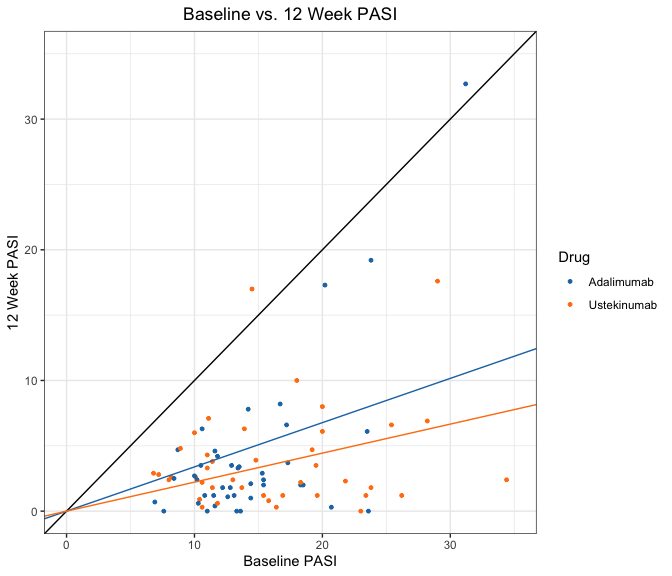
</p>

This plot reveals several a couple of interesting points. First of all,
two patients appear to have gotten worse over the course of study.
Second, there are a number of high leverage points among the adalimumab
patients that increase the slope of their regression line. This is why
ustekinumab appears to be the more effective treatment according to a
least squares estimate.

### Box Plot

Compare this plot with the more conventional box plot, in which we
simply visualise the spread of delta PASI scores for patients under both
treatments.

``` r
ggplot(df, aes(Drug, DeltaPASI, fill = Drug)) + 
  geom_boxplot() + 
  geom_jitter(position = position_jitter(0.2)) +
  labs(title = 'Response by Drug',
           y = 'Delta PASI') + 
  theme_bw() + 
  theme(plot.title = element_text(hjust = .5)) + 
  scale_fill_d3()
```

<p align='center'>
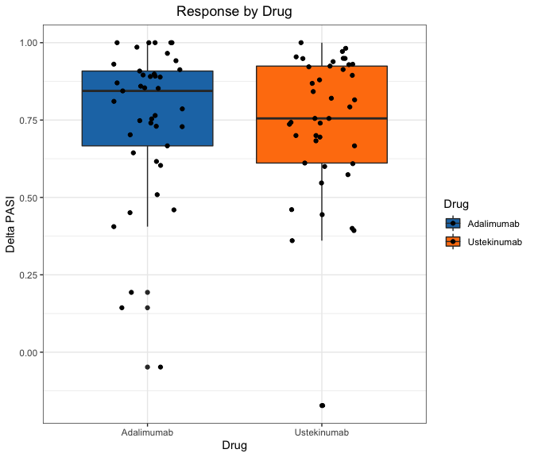
</p>

This plot suggests that adalimumab, rather than ustekinumab, is in fact
the more effective treatment. Numbers bear this intuition out:

``` r
expand.grid(
  Treatment = c('Adalimumab', 'Ustekinumab'),
   Estimate = c('Least_Squares', 'Maximum_Likelihood')
) %>%
  mutate(Improvement = c(1 - coef(m_a), 
                         1 - coef(m_u),
                         df[Drug == 'Adalimumab', mean(DeltaPASI)],
                         df[Drug == 'Ustekinumab', mean(DeltaPASI)]))
```

    ##     Treatment           Estimate Improvement
    ## 1  Adalimumab      Least_Squares   0.6612239
    ## 2 Ustekinumab      Least_Squares   0.7778583
    ## 3  Adalimumab Maximum_Likelihood   0.7512050
    ## 4 Ustekinumab Maximum_Likelihood   0.7372463

Note that differences are not especially large under either method of
estimation, but it is interesting to see that our evaluation of which
drug performs better in this study is at least partially determined by
which measurement we use.

# Transcriptomic EDA

Before conducting transcriptomic EDA, we merge counts with gene-level
annotation data and remove probes with less than one count per million
(CPM) in at least 20 libraries. This ensures that every probe is
expressed in at least 5% of all samples. Counts are then TMM normalised
prior to modelling ([Robinson &
Oshlack, 2010](https://genomebiology.biomedcentral.com/articles/10.1186/gb-2010-11-3-r25)).
See the extensive `edgeR` [package
vignette](https://www.bioconductor.org/packages/3.3/bioc/vignettes/edgeR/inst/doc/edgeRUsersGuide.pdf)
for more details.

``` r
# Gene-level annotations 
gene_idx <- tibble(EnsemblID = rownames(cnts)) %>%
  inner_join(anno, by = 'EnsemblID') %>%
  select(EnsemblID, GeneSymbol)
cnts <- cnts[gene_idx$EnsemblID, clin$Sample_id]
y <- DGEList(cnts, genes = gene_idx)

# Filter genes
keep <- rowSums(cpm(y) > 1) >= 20  
y <- DGEList(y[keep, ])
y <- calcNormFactors(y)

# Check dimensionality
dim(y)
```

    ## [1] 16172   400

The analysis will proceed with 16,172 probes. We use diagnostic plots
and dimensionality reduction techniques to check for outliers, validate
our preprocessing pipeline, and search for unsupervised clusters.

## Mean-Variance

We begin by examining the data’s mean-variance trend. With this plot, we
can examine the relationship between the first two moments of the
transriptomic data and visually inspect for outlying probes. The shape
of the curve is especially important for RNA-seq data analysed using
`limma::voom`, as results from this LOWESS regression are used to fit
weighted least squares models in subsequent differential expression
tests ([Law et
al., 2014](https://genomebiology.biomedcentral.com/articles/10.1186/gb-2014-15-2-r29)).

``` r
plot_voom(y)
```

<p align='center'>
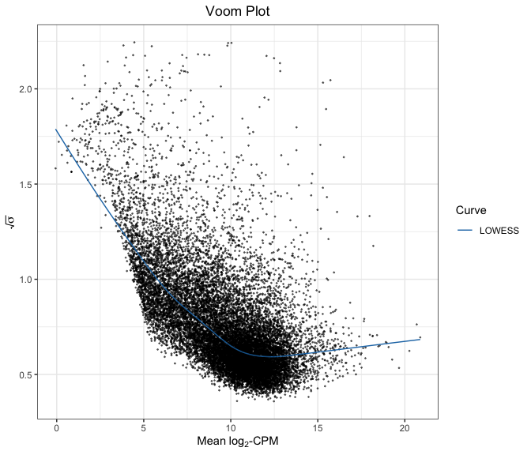
</p>

This mean-variance trend looks about right for these data. The trend is
as expected and no clear outliers emerge from this figure.

For the remaining plots, we conduct EDA on the log2-CPM scale of the
normalised count matrix. We add 1 to all counts to avoid taking the
logarithm of 0.

``` r
# Transform counts
mat <- cpm(y, log = TRUE, prior.count = 1)

# Save output
saveRDS(mat, './Data/lcpm_mat.rds')
```

## Density Plot

Plotting expression densities for all samples is a good way to evaluate
the overall skew of the data and visually inspect for outlying samples.
We color the curves by tissue type to observe potential transcriptomic
variation by tissue.

``` r
plot_density(mat, group = list(Tissue = clin$Tissue),  
             xlab = expression(log[2]*'-CPM'))
```

<p align='center'>
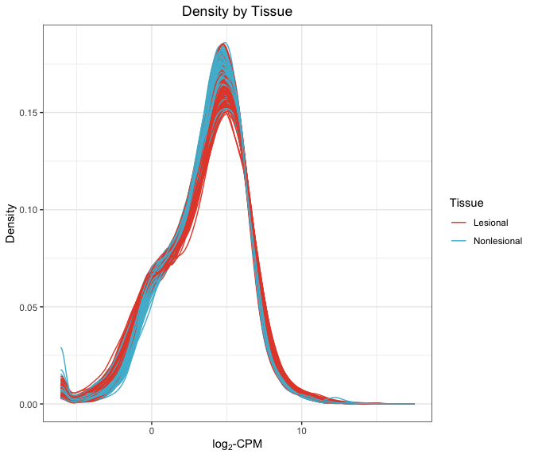
</p>

These sample-wise densities look exceptionally clean, and approximately
symmetric under log2-CPM transform. The slight kink in the low end of
the spectrum is common with count data, and there appears to be some
systematic variation by tissue type, as we would expect.

## Subject Similarity Matrix

We build a subject similarity matrix by calculating the [pairwise
Euclidean
distance](https://en.wikipedia.org/wiki/Euclidean_distance_matrix)
between all samples in the data. This matrix can then be visualised as a
heatmap and used to build a [hierarchical
clustering](https://en.wikipedia.org/wiki/Hierarchical_clustering)
dendrogram. We annotate the plot with phenotypic information to see if
the unsupervised clusters track known clinical groupings.

``` r
plot_similarity(mat, group = list(Tissue = clin$Tissue, 
                                    Drug = clin$Drug,
                                    Time = clin$Time), 
                covar = list(PASI = clin$PASI))
```

<p align='center'>
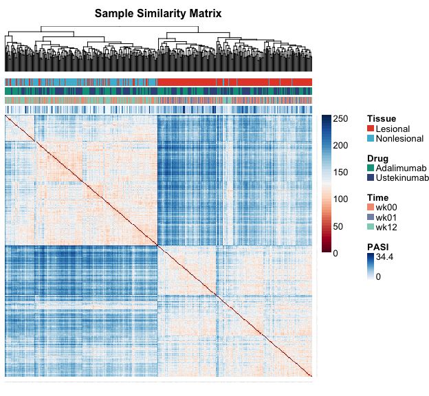
</p>

Once again, we find systematic variation by tissue type. Differences by
other phenotypic markers are considerably less pronounced. For a more
informative visualisation, we should probably look within tissue type.
We leave that for later, however, as our goal here is simply to confirm
overall data quality.

## Drivers Plot

Another way to visualise clinical drivers of transcriptomic variation is
a drivers plot. To create this figure, we perform a [principal component
analysis
(PCA)](https://en.wikipedia.org/wiki/Principal_component_analysis) of
the log2-CPM matrix. We then test associations between principal
components of the data and individual clinical features.

``` r
plot_drivers(mat, select(clin, -Sample_id, Patient_id, -outcome), 
             alpha = 0.05, p_adj = 'fdr')
```

<p align='center'>
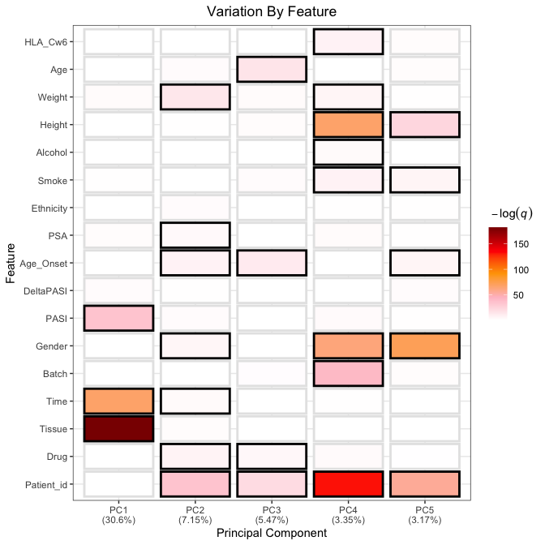
</p>

We find here that tissue is the overwhelming driver of variation in the
first principal component, which accounts for nearly a third of all
variation in the transcriptomic data. Time and PASI are also major
drivers. Fortunately, it looks like there are little or no batch effects
to speak of in these data, which is reassuring. Also note that Drug does
not appear to be a major source of variation, which suggests that there
was no confounding between omic markers and treatment assignment.

## Principal Component Analysis

We plot the samples in a two-dimensional space defined by the first two
principal components. This projection allows us to visually inspect for
outliers and unsupervised clustering effects. We mark the samples by
tissue type and
time.

``` r
plot_pca(mat, group = list(Tissue = clin$Tissue, Time = clin$Time), size = 2)
```

<p align='center'>
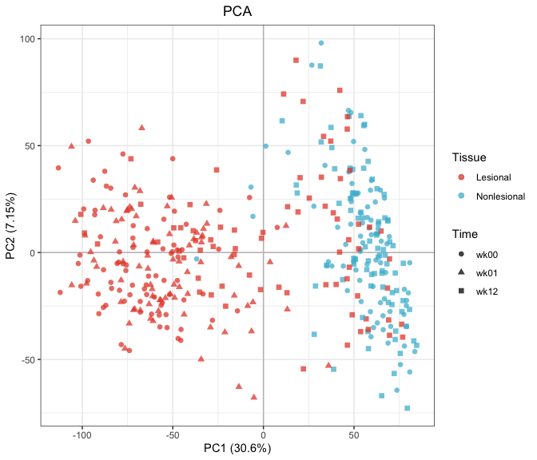
</p>

Once again, we find a nice separation between lesional and nonlesional
samples, although the boundary between the two is not perfectly linear.
Note, however, that the areas of apparent overlap tend to occur in week
12, suggesting that effective treatment has blurred the distinction
between the two tissue types.

## Kernel PCA

Kernel PCA (KPCA) is a nonlinear variant of PCA that uses a Gaussian
radial basis function (RBF) kernel to reweight the samples. For details,
see [Schölkopf et
al., 1998](https://www.mitpressjournals.org/doi/abs/10.1162/089976698300017467).
This transformation is designed to preserve local structure, capturing
some interactions in the feature space that cannot be captured by linear
combinations of the input
variables.

``` r
plot_kpca(mat, group = list(Tissue = clin$Tissue, Time = clin$Time), size = 2)
```

<p align='center'>
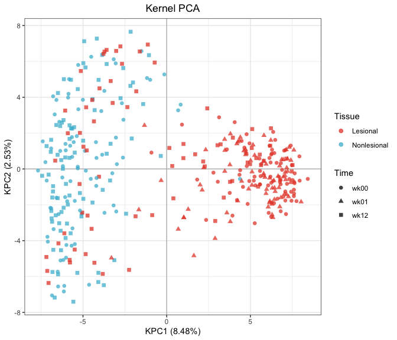
</p>

This plot once again demonstrates some decent segregation between tissue
types along the first PC. There is evidently greater variation among
nonlesional samples than lesional samples, as they fan out across the
second PC. Note that one baseline nonlesional sample appears somewhat
stranded in a sea of lesional points, suggesting possible mislabelling.

## t-SNE

Another popular embedding technique is [t-distributed stochastic
neighbour embedding
(t-SNE)](https://en.wikipedia.org/wiki/T-distributed_stochastic_neighbor_embedding).
This method, originally developed by [van der Maaten & Hinton
(2008)](http://www.jmlr.org/papers/volume9/vandermaaten08a/vandermaaten08a.pdf),
explicitly attempts to preserve local structure when mapping a large
matrix onto a low-dimensional subspace. It is therefore ideal for
unsupervised cluster
detection.

``` r
plot_tsne(mat, group = list(Tissue = clin$Tissue, Time = clin$Time), size = 2)
```

<p align='center'>
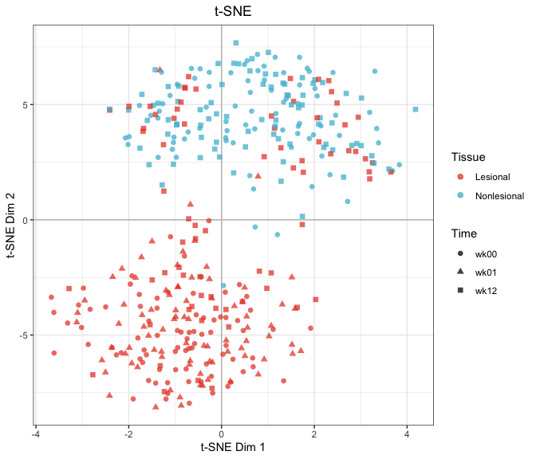
</p>

This plot shows even neater separation between lesional and nonlesional
samples across opposing quadrants of the Cartesian plane. Once again, a
single nonlesional sample appears to be potentially mislabelled.

# Differential Expression Analysis (DEA)

We examine between-subject variation across tissue types and time points
by fitting a linear model, shrinking residual variance using empirical
Bayes methods, and extracting the appropriate contrasts
([Smyth, 2004](http://www.statsci.org/smyth/pubs/ebayes.pdf)). As noted
above, we use the `limma::voom` pipeline, which extends the original
`limma` framework to RNA-seq data using heteroskedastic model fits on
the log2-CPM scale ([Law et
al., 2014](https://genomebiology.biomedcentral.com/articles/10.1186/gb-2014-15-2-r29)).

## Defining Response

The first step in our design is to define the response metric. We use
the somewhat confusingly labelled “delta PASI” as our clinical outcome
of interest. This variable actually measures the percent change in PASI
score for a given individual over the course of study. We begin by
defining this variable and observing its distribution.

``` r
# Define response
clin[, DeltaPASI := (.SD[Time == 'wk00', PASI[1]] - .SD[Time == 'wk12', PASI[1]])/
       .SD[Time == 'wk00', PASI[1]], by = Patient_id]

# One patient has no week-12 sample, but still has a PASI score
na_sample <- clin[is.na(DeltaPASI), unique(Patient_id)]
clin[Patient_id == na_sample, DeltaPASI := df[Patient == na_sample, DeltaPASI]]

# Align samples in clinical and omic data
y <- y[, clin$Sample_id]

# Visualise a histogram of the DeltaPASI distribution
ggplot(clin, aes(DeltaPASI)) +
  geom_histogram(bins = 20, color = 'black') + 
  theme_bw()
```

<p align='center'>
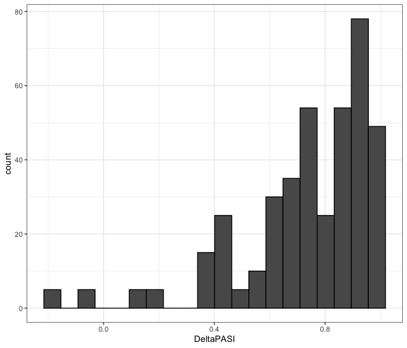
</p>

It appears the DeltaPASI distribution has an extreme negative skew.
Ideally, all samples would be strictly on the unit interval, in which
case we could apply a logit transform. But some patients had a DeltaPASI
of 1, while others got worse over the course of study (i.e., have
negative DeltaPASI scores). Given these facts, we try an exponential
transformation to mitigate the skew.

``` r
# Apply exponential transform
clin[, outcome := exp(DeltaPASI)]

# Visualise a histogram of the transformed distribution
ggplot(clin, aes(outcome)) +
  geom_histogram(bins = 20, color = 'black') + 
  theme_bw()
```

<p align='center'>
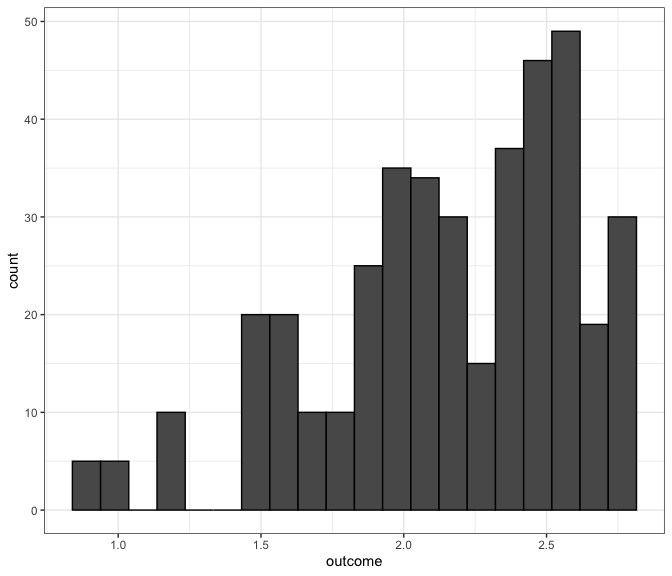
</p>

We see here that the skew has not been removed altogether, but it has
been improved. Perhaps a double-exponential will do the trick.

``` r
# Apply exponential transform
clin[, outcome := exp(exp(DeltaPASI))]

# Visualise a histogram of the transformed distribution
ggplot(clin, aes(outcome)) +
  geom_histogram(bins = 20, color = 'black') + 
  theme_bw()
```

<p align='center'>
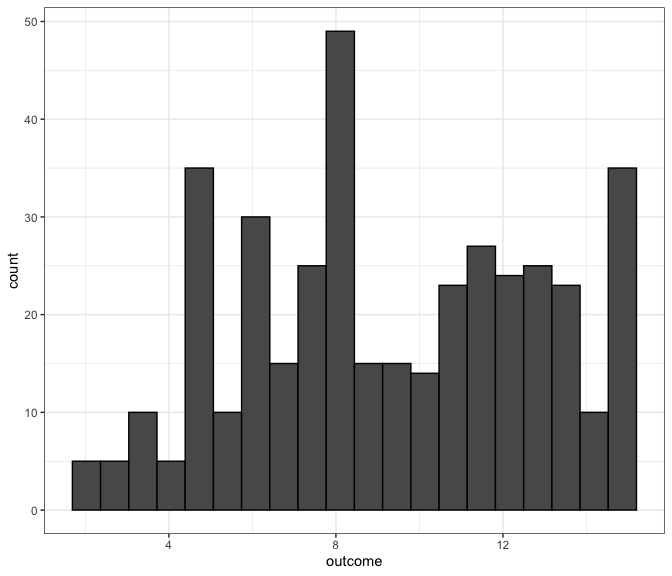
</p>

That looks almost symmetric now. This should improve the performance of
subsequent linear models, and can easily be back-transformed for
downstream interpretation.

## Design

This portion of the experiment has three goals, each of which will
require a unique model design:

1.  Identify genes associated with positive response to treatment at
    each drug-tissue-time.
2.  Identify genes that show the greatest differential expression
    between baseline and week 1 in lesional samples.
3.  Identify genes that show the biggest reduction in tissue-driven
    differential expression between baseline and week 12.

Goal (1) is conceptually straightforward, if somewhat tricky to design.
Goal (2) is a simple before-and-after comparison. Goal (3) is arguably
the most confusing. We are looking for the genes that saw the greatest
convergence in expression levels between lesional and nonlesional
samples across the course of treatment. The idea here is that effective
treatment may minimise transcriptomic differences between lesional and
nonlesional tissue.

We build and test each model in turn.

### Response

Each tissue will be analysed separately, as tissue type is a major
source of omic variation. First, we create drug-time interaction
variable, which will help to identify the right samples for each
hypothesis test. Other interaction variables are required for goal (3).
See below.

``` r
# Create interaction variable
clin[, Drug_Time := paste(Drug, Time, sep = '_')]
```

Through extensive trial and error, we found that linear models were
insufficiently complex to capture the biological signal of interest in
this dataset. Cubic splines offer a more flexible class of basis
functions that can detect nonmonotonic effects. The basic structure of
our model can be understood by viewing the design matrix. We use
lesional skin as an example.

``` r
# Create design matrix
des <- model.matrix(~ 0 + Drug_Time + Drug_Time:ns(outcome, df = 3), 
                    data = clin[Tissue == 'Lesional'])

# View coefficients
gsub('Drug_Time', '', colnames(des))
```

    ##  [1] "Adalimumab_wk00"                      
    ##  [2] "Adalimumab_wk01"                      
    ##  [3] "Adalimumab_wk12"                      
    ##  [4] "Ustekinumab_wk00"                     
    ##  [5] "Ustekinumab_wk01"                     
    ##  [6] "Ustekinumab_wk12"                     
    ##  [7] "Adalimumab_wk00:ns(outcome, df = 3)1" 
    ##  [8] "Adalimumab_wk01:ns(outcome, df = 3)1" 
    ##  [9] "Adalimumab_wk12:ns(outcome, df = 3)1" 
    ## [10] "Ustekinumab_wk00:ns(outcome, df = 3)1"
    ## [11] "Ustekinumab_wk01:ns(outcome, df = 3)1"
    ## [12] "Ustekinumab_wk12:ns(outcome, df = 3)1"
    ## [13] "Adalimumab_wk00:ns(outcome, df = 3)2" 
    ## [14] "Adalimumab_wk01:ns(outcome, df = 3)2" 
    ## [15] "Adalimumab_wk12:ns(outcome, df = 3)2" 
    ## [16] "Ustekinumab_wk00:ns(outcome, df = 3)2"
    ## [17] "Ustekinumab_wk01:ns(outcome, df = 3)2"
    ## [18] "Ustekinumab_wk12:ns(outcome, df = 3)2"
    ## [19] "Adalimumab_wk00:ns(outcome, df = 3)3" 
    ## [20] "Adalimumab_wk01:ns(outcome, df = 3)3" 
    ## [21] "Adalimumab_wk12:ns(outcome, df = 3)3" 
    ## [22] "Ustekinumab_wk00:ns(outcome, df = 3)3"
    ## [23] "Ustekinumab_wk01:ns(outcome, df = 3)3"
    ## [24] "Ustekinumab_wk12:ns(outcome, df = 3)3"

This design provides an intercept term and three outcome coefficients
for each drug-time in the data, effectively fitting six sub-models
within one large model. To account for the intra-subject correlations
inherent to our study’s repeated measures design, we use the
`duplicateCorrelation` function. This approximates a mixed model in
which a blocking variable, in this case the interaction between subject
and tissue type, becomes a random effect
([Smyth, 2005](http://www.statsci.org/smyth/pubs/dupcor.pdf)). Following
the [advice of the package
authors](https://support.bioconductor.org/p/59700/), we estimate `voom`
weights and block correlations twice each.

Because samples from different tissue types are analysed separately, we
create a wrapper function that allows us to loop through the data. Among
other things, this code chunk replaces the classic [Benjamini-Hochberg
FDR](https://www.jstor.org/stable/2346101) with [Storey’s
*q*-values](http://people.eecs.berkeley.edu/~jordan/sail/readings/storey-annals-05.pdf),
which offer greater power for measuring [genomewide
significance](http://www.pnas.org/content/100/16/9440.full). We will use
*q*-values throughout to control the false discovery rate.

In addition to exporting the results file, we also save the final
voom-transformed matrix and model object to disk for later use. This
will save time when clustering and plotting figures.

``` r
analyse <- function(tissue) {
  # Subset the data
  tmp <- clin[Tissue == tissue]
  n <- nrow(tmp)
  # Filter, normalize
  mat <- DGEList(cnts[, tmp$Sample_id])
  keep <- rowSums(cpm(mat) >= 1) >= n / length(unique(tmp$Drug_Time))
  mat <- DGEList(mat[keep, ])
  mat <- calcNormFactors(mat)
  # Design matrix
  des <- model.matrix(~ 0 + Drug_Time + Drug_Time:ns(y, df = 3), data = tmp)
  colnames(des) <- gsub('Drug_Time', '', colnames(des))
  coefs <- lapply(tmp[, unique(Drug_Time)], function(j) {
    which(grepl(paste0(j, ':ns'), colnames(des)))
  })
  names(coefs) <- tmp[, unique(Drug_Time)]
  # Build the model
  v <- voom(mat, des)
  icc <- duplicateCorrelation(v, des, block = tmp$Patient_id)
  v <- voom(mat, des, correlation = icc$cor, block = tmp$Patient_id)
  icc <- duplicateCorrelation(v, des, block = tmp$Patient_id)  
  fit <- lmFit(v, des, correlation = icc$cor, block = tmp$Patient_id)
  fit <- eBayes(fit)
  # Export results
  saveRDS(fit, paste0('./Results/Response/', tissue, '_fit.rds'))
  saveRDS(v$E, paste0('./Results/Response/', tissue, '_mat.rds'))
  for (j in seq_along(coefs)) {
    topTable(fit, coef = coefs[[j]], number = Inf, sort.by = 'none') %>%
      rename(AvgExpr = AveExpr, p.value = P.Value) %>%
      mutate(q.value = qvalue(p.value)$qvalues, EnsemblID = rownames(v)) %>%
      inner_join(anno, by = 'EnsemblID') %>%
      arrange(p.value) %>%
      select(EnsemblID, GeneSymbol, Description, AvgExpr, p.value, q.value) %>%
      fwrite(paste0('./Results/Response/Response_', tissue, '_',
                    names(coefs)[j], '_cs.txt'), sep = '\t')
  }
}
```

We execute in parallel to speed up computations.

``` r
# Execute in parallel
foreach(x = clin[, unique(Tissue)]) %dopar% analyse(x)
```

### One Week Change

For goal (2), we implement a simple paired design between lesional
samples at baseline and week 1. All other tissue-times are removed so we
can focus on this contrast without requiring extra covariates or
intra-class correlations.

``` r
analyse <- function(drug) {
  # Subset the data
  tmp <- clin[Drug == drug & Tissue == 'Lesional' & Time != 'wk12']
  n <- nrow(tmp)
  # Filter, normalize
  mat <- DGEList(cnts[, tmp$Sample_id])
  keep <- rowSums(cpm(mat) >= 1) >= n / length(unique(tmp$Time))
  mat <- DGEList(mat[keep, ])
  mat <- calcNormFactors(mat)
  # Design matrix
  des <- model.matrix(~ Time, data = tmp)
  # Build the model
  v <- voom(mat, des)
  fit <- eBayes(lmFit(v, des))
  # Save files
  saveRDS(v$E, paste0('./Data/', drug, '/oneweek_mat.rds'))
  saveRDS(fit, paste0('./Data/', drug, '/oneweek_fit.rds'))
  # Export results
  topTable(fit, coef = 2, number = Inf, sort.by = 'none') %>%
    rename(p.value = P.Value, AvgExpr = AveExpr) %>%
    mutate(q.value = qvalue(p.value)$qvalues, EnsemblID = rownames(v)) %>%
    inner_join(anno, by = 'EnsemblID') %>%
    arrange(p.value) %>%
    select(EnsemblID, GeneSymbol, Description, 
           AvgExpr, logFC, p.value, q.value) %>%
    fwrite(paste0('./Results/', drug, '/OneWeek.txt'), sep = '\t')
}

# Execute in parallel
foreach(x = clin[, unique(Drug)]) %dopar% analyse(x)
```

### Cross-Tissue Convergence

For goal (3), our contrast matrix is a bit more complex, as we’re
testing a difference-of-differences hypothesis that pits
`(Lesional.Wk00-Nonlesional.Wk00)` against
`(Lesional.Wk12-Nonlesional.Wk12)`. Because we are only interested in
cross-tissue *convergence*, not *divergence*, we must also impose a
one-sided *t*-test, overriding `limma`’s default behaviour for *p*-value
calculation. First, we need some new interaction variables.

``` r
# Create interaction variables
clin[, Tissue_Time := paste(Tissue, Time, sep = '_')]
clin[, Patient_Tissue := paste(Patient_id, Tissue, sep = '_')]
```

Next, we build the wrapper function.

``` r
analyse <- function(drug) {
  # Subset the data
  tmp <- clin[Drug == drug]
  n <- nrow(tmp)
  # Filter, normalize
  mat <- DGEList(cnts[, tmp$Sample_id])
  keep <- rowSums(cpm(mat) >= 1) >= n / length(unique(tmp$Tissue_Time))
  mat <- DGEList(mat[keep, ])
  mat <- calcNormFactors(mat)
  # Design matrix
  des <- model.matrix(~ 0 + Tissue_Time + Patient_id, data = tmp)
  colnames(des) <- gsub('Tissue_Time', '', colnames(des))
  # Build the model
  v <- voom(mat, des) 
  fit <- lmFit(v, des)
  # Build contrast matrix
  cm <- makeContrasts((Lesional_wk00 - Nonlesional_wk00) - 
                      (Lesional_wk12 - Nonlesional_wk12),
                      levels = des)
  fit <- eBayes(contrasts.fit(fit, cm))
  # Save files
  saveRDS(v$E, paste0('./Data/', drug, '/convergence_mat.rds'))
  saveRDS(fit, paste0('./Data/', drug, '/convergence_fit.rds'))
  # Export results
  topTable(fit, coef = 1, number = Inf, sort.by = 'none') %>%
    rename(AvgExpr = AveExpr) %>%
    # Note the one-sided p-value
    mutate(p.value = pt(t, df = fit$df.total, lower = FALSE), 
           q.value = qvalue(p.value)$qvalues, EnsemblID = rownames(v)) %>%
    inner_join(anno, by = 'EnsemblID') %>%
    arrange(p.value) %>%
    select(EnsemblID, GeneSymbol, Description, 
           AvgExpr, logFC, p.value, q.value) %>%
    fwrite(paste0('./Results/', drug, '/Convergence.txt'), sep = '\t')
}

# Execute across drugs in pararallel
foreach(x = clin[, unique(Drug)]) %dopar% analyse(x)
```

### Results

To get a sense for the results, we will just look at a few summary
figures. Below are spline fits for top lesional genes.

``` r
# Load expression matrix and model fit
mat <- readRDS('./Results/Response/Lesional_mat.rds')
fit <- readRDS('./Results/Response/Lesional_fit.rds')

# Plot top 16 genes per drug
plot_fn <- function(drug) {
  # Subset data
  tmp <- clin[Time == 'wk00' & Tissue == 'Lesional' & Drug == drug]
  n <- nrow(tmp)
  p <- 16
  # Extract top genes
  genes <- merge(data.table(
    EnsemblID = fread(paste0('./Results/Response/Response_Lesional_',
                             drug, '_wk00_cs.txt'))[seq_len(p), EnsemblID]
  ), anno, by = 'EnsemblID')
  # Build data frame
  sample_idx <- which(colnames(mat) %in% tmp$Sample_id)
  df <- data.frame(
    'Observed' = as.numeric(mat[genes$EnsemblID, sample_idx]),
    'Expected' = as.numeric(fitted(fit)[genes$EnsemblID, sample_idx]),
        'Gene' = factor(rep(genes$GeneSymbol, times = n), 
                        levels = genes$GeneSymbol),
    'Response' = rep(tmp$outcome, each = p)
  )
  # Plot
  ggplot(df) + 
    geom_point(aes(Response, Observed), size = 1) + 
    geom_smooth(aes(Response, Expected), 
                method = 'lm', formula = y ~ ns(x, df = 3)) +
    theme_bw() + 
    facet_wrap(~ Gene, nrow = 4, scales = 'free_y') + 
    labs(y = 'Expression', title = paste('Top Genes: Baseline Lesional,', drug)) + 
    theme(plot.title = element_text(hjust = 0.5))
}
foreach(x = clin[, unique(Drug)]) %do% plot_fn(x)
```

<p align='center'>
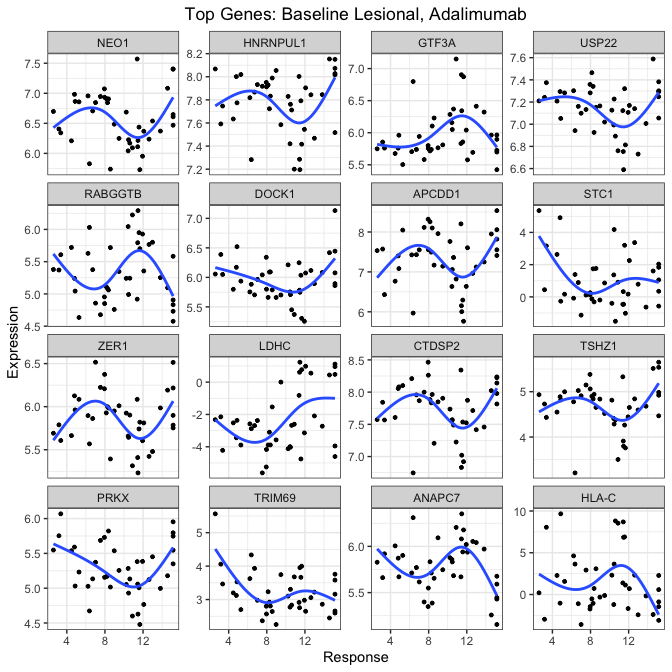
</p>

The concept of “fold changes”, so central to differential expression
analysis, does not apply in the case of spline fits. There is no single
coefficient in the model to visualize, no linear slope to plot. That
means some classic figures, like volcano plots and mean-difference
plots, are inapplicable for our response analysis. They can be used for
other hypotheses, however, like our one-week change model.

``` r
volc_fn <- function(drug) {
  df <- fread(paste0('./Results/', drug, '/OneWeek.txt'))
  plot_volcano(df, probes = 'EnsemblID', y = 'p', fdr = 0.1,
               title = paste('One Week Change, Lesional', drug, 'Samples'))
}
foreach(x = clin[, unique(Drug)]) %do% volc_fn(x)
```

<p align='center'>
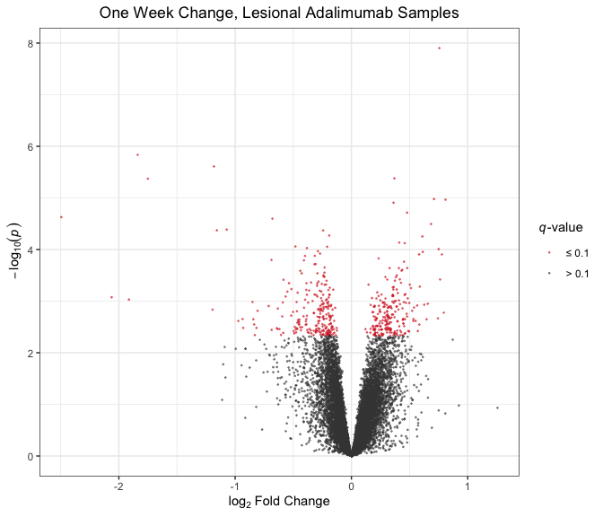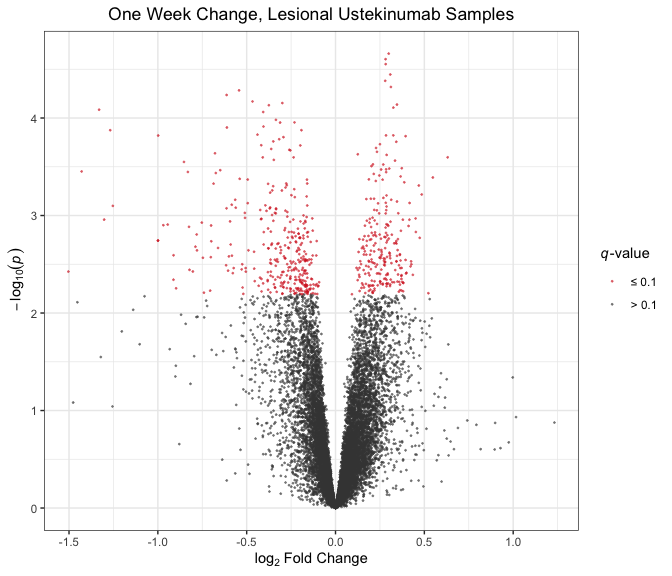
</p>

These plots indicate a fair degree of differential expression at the 10%
FDR threshold, although effect sizes are generally small. Interestingly,
adalimumab samples appear to be generally downregulated at one week in
lesional samples, while ustekinumab samples show more symmetric effects.
