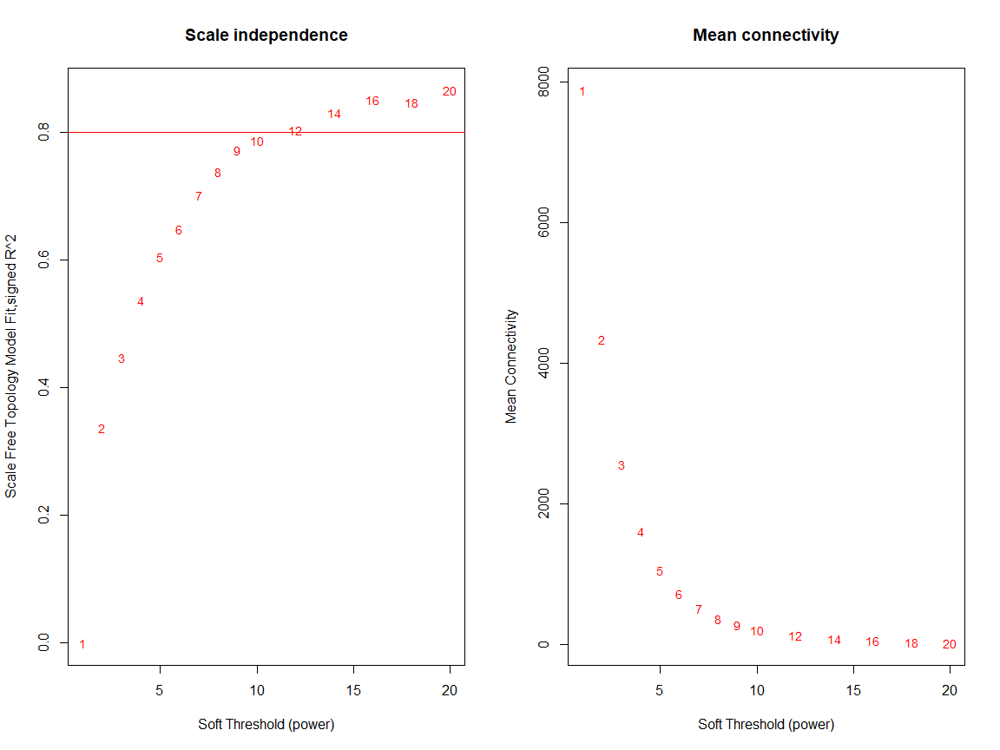
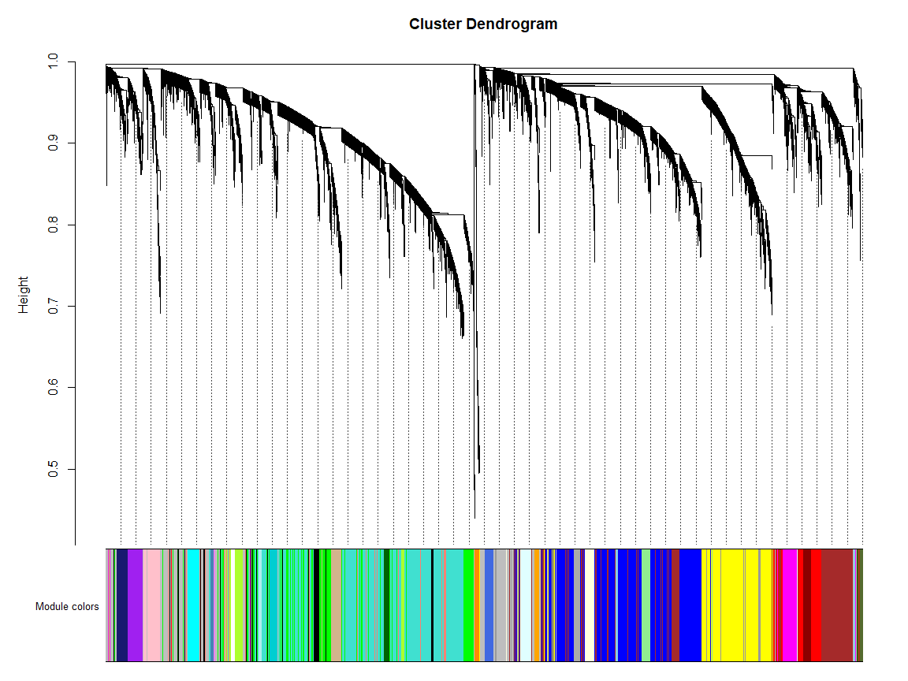
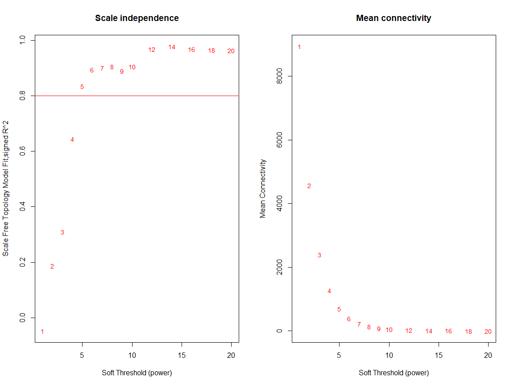
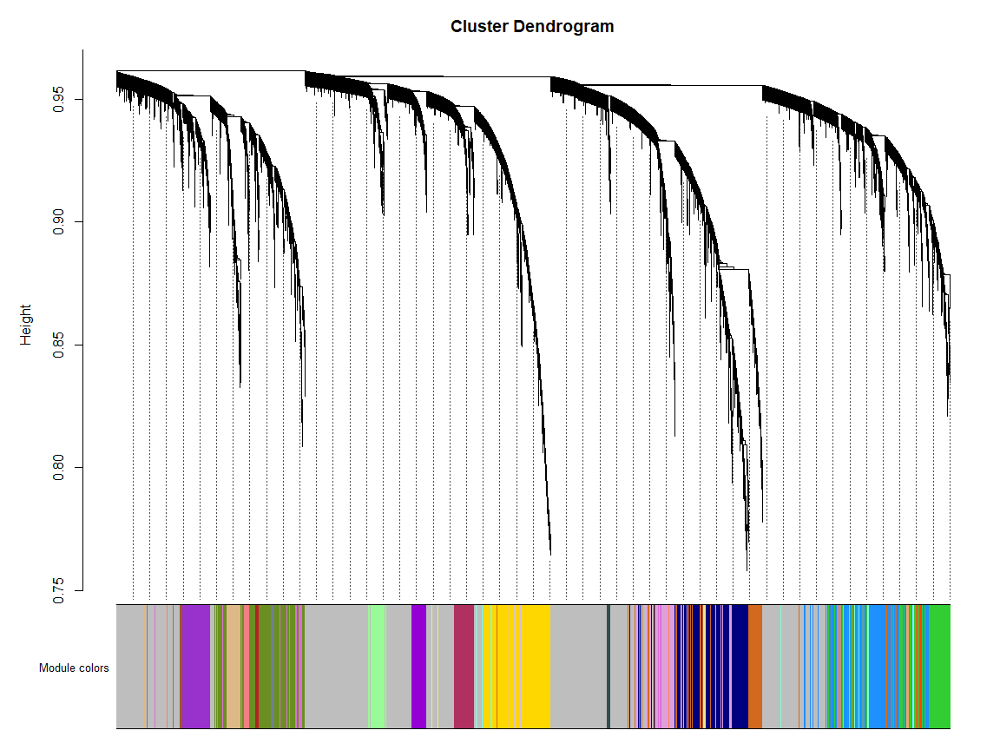

Identification of co-expressed gene modules in skin and blood
================
Ashley Rider
2024-10-04

- <a href="#preliminaries" id="toc-preliminaries">Preliminaries</a>
  - <a href="#load-packages" id="toc-load-packages">Load packages</a>
  - <a href="#load-gene-annotation-data"
    id="toc-load-gene-annotation-data">Load gene annotation data</a>
  - <a href="#create-output-directory"
    id="toc-create-output-directory">Create output directory</a>
- <a href="#skin" id="toc-skin">Skin</a>
  - <a href="#create-output-sub-directory"
    id="toc-create-output-sub-directory">Create output sub-directory</a>
  - <a href="#load-data" id="toc-load-data">Load data</a>
    - <a href="#clinical-data" id="toc-clinical-data">Clinical data</a>
    - <a href="#gene-level-counts" id="toc-gene-level-counts">Gene-level
      counts</a>
  - <a href="#filter-and-normalise-counts"
    id="toc-filter-and-normalise-counts">Filter and normalise counts</a>
  - <a href="#choose-soft-thresholding-power"
    id="toc-choose-soft-thresholding-power">Choose soft-thresholding
    power</a>
  - <a href="#module-assignments" id="toc-module-assignments">Module
    assignments</a>
  - <a href="#module-eigengenes" id="toc-module-eigengenes">Module
    eigengenes</a>
  - <a href="#module-membership" id="toc-module-membership">Module
    membership</a>
- <a href="#blood" id="toc-blood">Blood</a>
  - <a href="#create-output-sub-directory-1"
    id="toc-create-output-sub-directory-1">Create output sub-directory</a>
  - <a href="#load-data-1" id="toc-load-data-1">Load data</a>
    - <a href="#clinical-data-1" id="toc-clinical-data-1">Clinical data</a>
    - <a href="#gene-level-counts-1" id="toc-gene-level-counts-1">Gene-level
      counts</a>
  - <a href="#filter-and-normalise-counts-1"
    id="toc-filter-and-normalise-counts-1">Filter and normalise counts</a>
  - <a href="#choose-soft-thresholding-power-1"
    id="toc-choose-soft-thresholding-power-1">Choose soft-thresholding
    power</a>
  - <a href="#module-assignments-1" id="toc-module-assignments-1">Module
    assignments</a>
  - <a href="#module-eigengenes-1" id="toc-module-eigengenes-1">Module
    eigengenes</a>
  - <a href="#module-membership-1" id="toc-module-membership-1">Module
    membership</a>
- <a href="#session-information" id="toc-session-information">Session
  information</a>

Here, we use WGCNA, or **W**eighted **G**ene **C**o-expression
**N**etwork **A**nalysis ([Langfelder & Horvath,
2008](https://bmcbioinformatics.biomedcentral.com/articles/10.1186/1471-2105-9-559)),
to identify co-expressed gene modules in skin and blood.

# Preliminaries

## Load packages

``` r
library(tidyverse)
library(edgeR)
library(limma)
library(WGCNA)
library(reshape2)
```

## Load gene annotation data

``` r
anno <- read.delim("data/gene_annotation_data/Hs.anno.csv", sep = ",") %>%
  # Drop Description column
  select(EnsemblID, GeneSymbol) %>%
  # Replace gene symbols that are "" with corresponding Ensembl ID
  mutate(GeneSymbol = if_else(GeneSymbol == "", EnsemblID, GeneSymbol))

head(anno)
```

    ##         EnsemblID      GeneSymbol
    ## 1 ENSG00000252303       RNU6-280P
    ## 2 ENSG00000281771 ENSG00000281771
    ## 3 ENSG00000281256 ENSG00000281256
    ## 4 ENSG00000280864 ENSG00000280864
    ## 5 ENSG00000280792 ENSG00000280792
    ## 6 ENSG00000281822        RNU1-62P

## Create output directory

``` r
output_directory <- "results/WGCNA/01_Module_identification"
dir.create(output_directory)
```

# Skin

We’ll start by analysing the skin data.

## Create output sub-directory

``` r
output_directory2 <- paste0(output_directory,"/Skin")
dir.create(output_directory2)
```

## Load data

### Clinical data

We load the clinical data for each cohort.

``` r
# Load clinical data for PSORT-D (Discovery) and PSORT-R (Replication) and add to list
clin <- list()
clin$Discovery_skin <- read.delim("data/clinical_data/PSORT-D_Skin_Clinical_Data_01-Apr-20.txt") %>%
  select(Patient_id, Sample_id, Drug, Tissue, Time)
clin$Replication_skin <- read.delim("data/clinical_data/PSORT-R_Skin_Clinical_Data_01-Apr-20.txt") %>%
  select(Patient_id, Sample_id, Drug, Tissue, Time) %>% 
  dplyr::filter(!Sample_id %in% c("3A", "3B", "4A", "4B"))

dim(clin$Discovery_skin)
```

    ## [1] 400   5

``` r
head(clin$Discovery_skin)
```

    ##   Patient_id Sample_id       Drug      Tissue Time
    ## 1     P.1001 1001-0006 Adalimumab Nonlesional wk00
    ## 2     P.1001 1001-0105 Adalimumab    Lesional wk01
    ## 3     P.1001 1001-1206 Adalimumab Nonlesional wk12
    ## 4     P.1001 1001-1205 Adalimumab    Lesional wk12
    ## 5     P.1001 1001-0005 Adalimumab    Lesional wk00
    ## 6     P.1002 1002-0005 Adalimumab    Lesional wk00

``` r
dim(clin$Replication_skin)
```

    ## [1] 276   5

``` r
head(clin$Replication_skin)
```

    ##   Patient_id Sample_id        Drug      Tissue Time
    ## 1     P.1015 1015-0006  Adalimumab Nonlesional wk00
    ## 2     P.1015 1015-1205  Adalimumab    Lesional wk12
    ## 3     P.1015 1015-0105  Adalimumab    Lesional wk01
    ## 4     P.1015 1015-1206  Adalimumab Nonlesional wk12
    ## 5     P.1015 1015-0005  Adalimumab    Lesional wk00
    ## 6     P.1016 1016-0006 Ustekinumab Nonlesional wk00

Preliminary analysis revealed mislabelling of some lesional and
non-lesional samples, which were swapped for several patients. We
correct these swaps here.

``` r
# Sample swaps based on consensus of S100A7 and S100A9 expression
clin$Discovery_skin <- clin$Discovery_skin %>%
  mutate(Tissue = if_else(Sample_id %in% c("6041-0005", "23012-1205"), "Nonlesional", Tissue)) %>%
  mutate(Tissue = if_else(Sample_id %in% c("6041-0006", "23012-1206"), "Lesional", Tissue))
clin$Replication_skin <- clin$Replication_skin %>%
  mutate(Tissue = if_else(Sample_id %in% c("5033-0005", "5031-1205", "6049-1205"), "Nonlesional", Tissue)) %>%
  mutate(Tissue = if_else(Sample_id %in% c("5033-0006", "5031-1206", "6049-1206"), "Lesional", Tissue))
```

### Gene-level counts

We also load gene-level counts for each cohort.

``` r
# Load counts for PSORT-D (Discovery) and PSORT-R (Replication) and add to list
cnts <- list()
cnts$Discovery_skin <- readRDS("data/gene_level_counts/PSORT-D_Skin_counts_01-Apr-2020-13-00-07.rds")
cnts$Replication_skin <- readRDS("data/gene_level_counts/PSORT-R_Skin_counts_13-Mar-2020-15-35-24.rds")

dim(cnts$Discovery_skin)
```

    ## [1] 34947   400

``` r
cnts$Discovery_skin[1:5, 1:5]
```

    ##                  1001-0005 1002-0005 1003-0005 1005-0005 1013-0005
    ## ENSG00000000003 1175.44411 1562.9835 1252.3025 1361.3136  821.4603
    ## ENSG00000000005   24.27478  291.7607   14.9610  352.9931  198.2883
    ## ENSG00000000419 2669.42467 2493.0064 2185.6786 2649.1577 1656.7727
    ## ENSG00000000457  720.88201  950.2264 1023.5560  632.5259  777.8005
    ## ENSG00000000460  340.11979  375.3907  358.9917  335.8198  179.4848

``` r
dim(cnts$Replication_skin)
```

    ## [1] 39297   280

``` r
cnts$Replication_skin[1:5, 1:5]
```

    ##                  1015-0005 1022-1206 5045-0006 5045-0105 5045-1205
    ## ENSG00000000003 1324.26564 2870.1355 1547.0102 1260.4806 1137.9581
    ## ENSG00000000005   37.50147  146.5253  161.0882  231.0615  412.8736
    ## ENSG00000000419 3216.75517 2261.0516 1820.7281 1678.0153 1980.3527
    ## ENSG00000000457 1258.47998 1952.3299 1420.5515 1421.3044 1495.6756
    ## ENSG00000000460  477.45813  547.8123  403.2949  399.3427  473.1268

The PSORT-R counts contain some extra genes that are not present in the
PSORT-D counts. We’ll proceed with just the genes that are present in
both datasets.

``` r
intersect_genes <- intersect(rownames(cnts$Discovery_skin), rownames(cnts$Replication_skin))

cnts$Replication_skin <- cnts$Replication_skin[intersect_genes,]

dim(cnts$Discovery_skin)
```

    ## [1] 34947   400

``` r
dim(cnts$Replication_skin)
```

    ## [1] 34947   280

## Filter and normalise counts

We now filter and normalise the counts. We use a filtering threshold
that requires at least 1 CPM in at least *n/k* samples, where *n* equals
the number of samples and *k* equals the number of unique combinations
of drug, tissue type (i.e. lesional and non-lesional) and time point. We
then normalise the counts using the trimmed mean of m-values (TMM)
method from [Robinson & Oshlack,
2010](https://genomebiology.biomedcentral.com/articles/10.1186/gb-2010-11-3-r25).
We wrap this workflow in a function and apply it to the PSORT-D and
PSORT-R data separately.

``` r
normCounts <- function(cnts_dat, clin_dat, anno_dat){
  # Add Drug-Tissue-Time interaction variable to clinical data
  clin_dat <- clin_dat %>%
    mutate(Drug.Tissue.Time = paste(Drug, Tissue, Time, sep = "."))
  # Filter counts
  gene_ids <- tibble(EnsemblID = rownames(cnts_dat)) %>%
    inner_join(anno_dat, by = 'EnsemblID') %>%
    dplyr::select(EnsemblID, GeneSymbol)
  cnts_dat <- cnts_dat[gene_ids$EnsemblID, clin_dat$Sample_id]
  y <- DGEList(cnts_dat, genes = gene_ids)
  keep <- rowSums(cpm(y) >= 1) >= nrow(clin_dat) / length(unique(clin_dat$Drug.Tissue.Time))
  y <- DGEList(y[keep,])
  # TMM normalisation
  y <- calcNormFactors(y)
  return(y)
}

cnts$Discovery_skin <- normCounts(
  cnts_dat = cnts$Discovery_skin, 
  clin_dat = clin$Discovery_skin,
  anno_dat = anno
)

cnts$Replication_skin <- normCounts(
  cnts_dat = cnts$Replication_skin, 
  clin_dat = clin$Replication_skin,
  anno_dat = anno
)

dim(cnts$Discovery_skin)
```

    ## [1] 15735   400

``` r
dim(cnts$Replication_skin)
```

    ## [1] 15429   276

Analysis will be conducted using log2-CPM counts, which we derive using
the voom function from the limma package.

``` r
cnts$Discovery_skin <- voom(cnts$Discovery_skin)$E

cnts$Replication_skin <- voom(cnts$Replication_skin)$E
```

The WGCNA R package requires that the count data have samples as rows
and genes as columns; therefore, we transpose the count matrices here.

``` r
cnts$Discovery_skin <- t(cnts$Discovery_skin)

cnts$Replication_skin <- t(cnts$Replication_skin)

cnts$Discovery_skin[1:5, 1:5]
```

    ##           ENSG00000000003 ENSG00000000005 ENSG00000000419 ENSG00000000457
    ## 1001-0006        3.872374       1.5328183        4.938926        4.164867
    ## 1001-0105        4.192085      -2.0081068        5.431613        4.290204
    ## 1001-1206        3.756471       0.9733382        4.974131        4.350640
    ## 1001-1205        4.276544      -1.7347028        5.291387        4.184797
    ## 1001-0005        4.316933      -1.2518701        5.499913        3.611949
    ##           ENSG00000000460
    ## 1001-0006        2.011209
    ## 1001-0105        2.816057
    ## 1001-1206        2.013973
    ## 1001-1205        2.394531
    ## 1001-0005        2.529348

``` r
cnts$Replication_skin[1:5, 1:5]
```

    ##           ENSG00000000003 ENSG00000000005 ENSG00000000419 ENSG00000000457
    ## 1015-0006        3.749805       3.3425601        4.650359        4.249973
    ## 1015-1205        4.325278      -4.5804179        5.428434        4.174427
    ## 1015-0105        3.760117      -0.6610615        4.676236        4.300760
    ## 1015-1206        3.853376       2.5817732        4.270075        4.062006
    ## 1015-0005        4.128241      -0.9952970        5.408334        4.054759
    ##           ENSG00000000460
    ## 1015-0006        2.070617
    ## 1015-1205        2.406546
    ## 1015-0105        2.388510
    ## 1015-1206        1.957059
    ## 1015-0005        2.657460

We’ll save the normalised counts for use in downstream analyses.

``` r
saveRDS(cnts, paste0(output_directory2,"/cnts.rds"))
```

## Choose soft-thresholding power

Module identification will be carried out using the PSORT-D data. Prior
to this we need to identify an appropriate soft-thresholding power.
We’ll do this by plotting the candidate values 1-20 against R2, a
measure of scale-free topology, and mean connectivity. We’ll choose the
lowest value that reaches an R2 threshold of 0.8.

``` r
# Choose a set of soft-thresholding powers
powers <- c(c(1:10), seq(from = 12, to = 20, by = 2))
# Call the network topology analysis function
sft <- pickSoftThreshold(
  cnts$Discovery_skin, 
  powerVector = powers, 
  verbose = 5, 
  networkType = "signed", 
  corFnc = WGCNA::cor
)
```

    ## pickSoftThreshold: will use block size 2843.
    ##  pickSoftThreshold: calculating connectivity for given powers...
    ##    ..working on genes 1 through 2843 of 15735
    ##    ..working on genes 2844 through 5686 of 15735
    ##    ..working on genes 5687 through 8529 of 15735
    ##    ..working on genes 8530 through 11372 of 15735
    ##    ..working on genes 11373 through 14215 of 15735
    ##    ..working on genes 14216 through 15735 of 15735
    ##    Power SFT.R.sq slope truncated.R.sq mean.k. median.k. max.k.
    ## 1      1 0.000208 -1.95          0.916  7880.0    7870.0   8040
    ## 2      2 0.337000 -8.78          0.816  4330.0    4300.0   4980
    ## 3      3 0.448000 -3.29          0.857  2560.0    2500.0   3510
    ## 4      4 0.537000 -2.48          0.890  1610.0    1540.0   2690
    ## 5      5 0.605000 -2.08          0.914  1060.0     985.0   2160
    ## 6      6 0.649000 -1.91          0.920   726.0     651.0   1780
    ## 7      7 0.702000 -1.80          0.943   514.0     442.0   1500
    ## 8      8 0.738000 -1.76          0.953   375.0     306.0   1290
    ## 9      9 0.772000 -1.74          0.961   280.0     216.0   1110
    ## 10    10 0.787000 -1.75          0.959   214.0     155.0    974
    ## 11    12 0.804000 -1.79          0.955   131.0      83.7    762
    ## 12    14 0.831000 -1.80          0.963    84.9      47.0    610
    ## 13    16 0.851000 -1.80          0.970    57.4      27.3    497
    ## 14    18 0.848000 -1.81          0.964    40.2      16.4    410
    ## 15    20 0.866000 -1.79          0.974    28.9      10.1    343

``` r
# Plot the results
par(mfrow = c(1, 2))
cex1 = 0.9
# Scale-free topology fit index as a function of the soft-thresholding power
plot(
  sft$fitIndices[,1], 
  -sign(sft$fitIndices[,3])*sft$fitIndices[,2],
  xlab="Soft Threshold (power)",
  ylab="Scale Free Topology Model Fit,signed R^2",
  type="n",
  main = paste("Scale independence")
)
text(
  sft$fitIndices[,1], 
  -sign(sft$fitIndices[,3])*sft$fitIndices[,2], 
  labels = powers, 
  cex = cex1, 
  col="red"
)
# This line corresponds to using an R^2 cut-off of h
abline(h = 0.80, col = "red")
# Mean connectivity as a function of the soft-thresholding power
plot(
  sft$fitIndices[,1], 
  sft$fitIndices[,5],
  xlab="Soft Threshold (power)",
  ylab="Mean Connectivity", 
  type="n",
  main = paste("Mean connectivity")
)
text(
  sft$fitIndices[,1], 
  sft$fitIndices[,5], 
  labels = powers, 
  cex = cex1, 
  col = "red"
)
```

<!-- -->

Based on these plots, we’ll choose a soft-thresholding power of 12. \##
One-step network construction and module detection

Now we can construct the co-expression network and identify modules
using the blockwiseModules function from the WGCNA R package. In brief,
here we calculate the pearson correlations between each pair of genes
and raise these estimates to the selected soft-thresholding power of 12;
this amplifies the differences between high and low correlations. These
correlations are then used to generate a topological overlap matrix
(TOM) and hierarchical clustering of this matrix is used to group genes
with similar expression profiles into modules. We specify a minimum
module size of 30, and a dendrogram cut height (for merging of similar
modules) of 0.1. We also use a signed network so that the correlations
between genes are scaled to lie between 0 and 1.

``` r
net <- blockwiseModules(
  cnts$Discovery_skin, 
  power = 12, 
  networkType = "signed",
  corType = "pearson", 
  maxPOutliers = 0.1,
  TOMType = "signed", 
  minModuleSize = 30,
  reassignThreshold = 0, 
  mergeCutHeight = 0.1,
  numericLabels = TRUE, 
  pamRespectsDendro = FALSE,
  stabilityCriterion = "Individual fraction",
  saveTOMs = FALSE,
  verbose = 3, 
  maxBlockSize = ncol(cnts$Discovery_skin)
)
```

    ##  Calculating module eigengenes block-wise from all genes
    ##    Flagging genes and samples with too many missing values...
    ##     ..step 1
    ##  ..Working on block 1 .
    ##     TOM calculation: adjacency..
    ##     ..will not use multithreading.
    ##      Fraction of slow calculations: 0.000000
    ##     ..connectivity..
    ##     ..matrix multiplication (system BLAS)..
    ##     ..normalization..
    ##     ..done.
    ##  ....clustering..
    ##  ....detecting modules..
    ##  ....calculating module eigengenes..
    ##  ....checking kME in modules..
    ##      ..removing 520 genes from module 1 because their KME is too low.
    ##      ..removing 302 genes from module 2 because their KME is too low.
    ##      ..removing 190 genes from module 3 because their KME is too low.
    ##      ..removing 208 genes from module 4 because their KME is too low.
    ##      ..removing 87 genes from module 5 because their KME is too low.
    ##      ..removing 42 genes from module 7 because their KME is too low.
    ##      ..removing 47 genes from module 8 because their KME is too low.
    ##      ..removing 11 genes from module 9 because their KME is too low.
    ##      ..removing 34 genes from module 11 because their KME is too low.
    ##      ..removing 1 genes from module 12 because their KME is too low.
    ##      ..removing 5 genes from module 13 because their KME is too low.
    ##      ..removing 2 genes from module 16 because their KME is too low.
    ##      ..removing 2 genes from module 18 because their KME is too low.
    ##      ..removing 4 genes from module 19 because their KME is too low.
    ##      ..removing 5 genes from module 20 because their KME is too low.
    ##      ..removing 5 genes from module 21 because their KME is too low.
    ##      ..removing 2 genes from module 23 because their KME is too low.
    ##      ..removing 2 genes from module 27 because their KME is too low.
    ##      ..removing 15 genes from module 29 because their KME is too low.
    ##      ..removing 3 genes from module 33 because their KME is too low.
    ##  ..merging modules that are too close..
    ##      mergeCloseModules: Merging modules whose distance is less than 0.1
    ##        Calculating new MEs...

``` r
# Save
saveRDS(net, paste0(output_directory2,"/net.rds"))
```

Now we can visualise the module dendrogram.

``` r
# Convert labels to colors for plotting
moduleColors <- labels2colors(net$colors)

# Plot the dendrogram and the module colors underneath
plotDendroAndColors(
  net$dendrograms[[1]], 
  moduleColors[net$blockGenes[[1]]],
  "Module colors",
  dendroLabels = FALSE, 
  hang = 0.03,
  addGuide = TRUE, 
  guideHang = 0.05
)
```

<!-- -->

## Module assignments

Next, we record the assignments of genes to modules and save this to
file.

``` r
modules <- bind_rows(lapply(
  X = unique(moduleColors),
  FUN = function(x) anno %>% 
    filter(EnsemblID %in% colnames(cnts$Discovery_skin)[moduleColors == x]) %>%
    mutate(Module = x)
))

head(modules)
```

    ##         EnsemblID      GeneSymbol Module
    ## 1 ENSG00000228253         MT-ATP8   grey
    ## 2 ENSG00000212907         MT-ND4L   grey
    ## 3 ENSG00000176142         TMEM39A   grey
    ## 4 ENSG00000214189          ZNF788   grey
    ## 5 ENSG00000005961          ITGA2B   grey
    ## 6 ENSG00000276256 ENSG00000276256   grey

``` r
# Save
write.table(modules, paste0(output_directory2,"/modules.txt"), sep = "\t", row.names = F, quote = F)
```

We can also examine the size of each module.

``` r
table(modules$Module)
```

    ## 
    ##          black           blue          brown           cyan      darkgreen 
    ##            431           2073           1473            244            165 
    ##       darkgrey    darkmagenta darkolivegreen     darkorange        darkred 
    ##            149             34             42             94            188 
    ##  darkturquoise          green    greenyellow           grey         grey60 
    ##            163           1076            305           1487            219 
    ##      lightcyan     lightgreen    lightyellow        magenta   midnightblue 
    ##            220            210            205            331            228 
    ##         orange  paleturquoise           pink         purple            red 
    ##            107             61            358            317            436 
    ##      royalblue    saddlebrown         salmon        skyblue      steelblue 
    ##            190             66            253             69             66 
    ##            tan      turquoise         violet          white         yellow 
    ##            264           2677             43             86           1405

## Module eigengenes

Now we can use the module assignments to calculate module eigengenes for
each module.

``` r
eigen <- moduleEigengenes(cnts$Discovery_skin, moduleColors)$eigengenes %>%
  rownames_to_column(var = "Sample_id") %>%
  rename_with(~ gsub("ME", "", .x, fixed = TRUE))

eigen[1:5, 1:5]
```

    ##   Sample_id        black        blue       brown        cyan
    ## 1 1001-0006 -0.044908185  0.05575403  0.02789530 -0.03969100
    ## 2 1001-0105  0.087755555 -0.07389727 -0.06439677 -0.04547213
    ## 3 1001-1206 -0.004993831  0.06897210 -0.03843748  0.06503201
    ## 4 1001-1205  0.094690119 -0.05167118 -0.11877423  0.04273352
    ## 5 1001-0005  0.167476218 -0.06296502 -0.22290252  0.21400648

``` r
# Save
write.table(eigen, paste0(output_directory2,"/eigengenes.txt"), sep = "\t", row.names = F, quote = F)
```

We also do this for the PSORT-R cohort (using module assignments defined
in the PSORT-D cohort). The number of genes retained in the filtered
counts is different between PSORT-D and PSORT-R; therefore, we use the
overlapping genes to calculate eigengenes for the PSORT-R cohort.

``` r
# Module labels for PSORT-R data
moduleColors_r <- net$colors[intersect(colnames(cnts$Replication_skin), names(net$colors))]

# Subset counts
cnts$Replication_skin <- cnts$Replication_skin[,names(moduleColors_r)]

# Convert labels to colors
moduleColors_r <- labels2colors(moduleColors_r)

# Calculate eigengenes
eigen_r <- moduleEigengenes(cnts$Replication_skin, moduleColors_r)$eigengenes %>%
  rownames_to_column(var = "Sample_id") %>%
  rename_with(~ gsub("ME", "", .x, fixed = TRUE))

eigen_r[1:5, 1:5]
```

    ##   Sample_id        black        blue       brown       cyan
    ## 1 1015-0006 -0.051226842  0.05816323  0.04360283 0.03165985
    ## 2 1015-1205  0.122463539 -0.07655628 -0.13290216 0.09457733
    ## 3 1015-0105  0.001116809 -0.05565823 -0.09042460 0.11881295
    ## 4 1015-1206 -0.113901330  0.06094812  0.01083996 0.09346227
    ## 5 1015-0005  0.111458161 -0.09478127 -0.17241548 0.11631525

``` r
# Save
write.table(eigen_r, paste0(output_directory2,"/eigengenes_r.txt"), sep = "\t", row.names = F, quote = F)
```

## Module membership

Here we will calculate module membership for each gene with every
module; this is defined as the correlation of a gene’s expression values
with a module eigengene.

``` r
# Performs gene-module correlation
geneModuleCor <- function(cnts_dat, eigen_dat){
  eigen_dat <- eigen_dat %>% 
    remove_rownames %>% 
    column_to_rownames("Sample_id")
  eigen_dat <- eigen_dat[rownames(cnts_dat),]
  # Calculate gene eigengene correlations and associated p-values
  cp = WGCNA::corAndPvalue(cnts_dat, eigen_dat)
  # Merge correlation coefficients and p-values for each gene-eigen_datgene pair into one data frame
  cor_dat <- melt(cp$cor)
  p_dat <- melt(cp$p)
  dat <- merge(cor_dat, p_dat, by = c("Var1", "Var2"))
  colnames(dat) <- c("EnsemblID", "Module", "Cor", "P.Value")
  # Convert factor columns to character columns
  dat$EnsemblID <- as.character(dat$EnsemblID)
  dat$Module <- as.character(dat$Module)
  return(dat)
}

mm <- geneModuleCor(cnts_dat = cnts$Discovery_skin, eigen_dat = eigen)

head(mm)
```

    ##         EnsemblID    Module         Cor      P.Value
    ## 1 ENSG00000000003     black  0.28078771 1.106597e-08
    ## 2 ENSG00000000003      blue -0.16604098 8.573110e-04
    ## 3 ENSG00000000003     brown -0.06263365 2.113068e-01
    ## 4 ENSG00000000003      cyan -0.37262442 1.272768e-14
    ## 5 ENSG00000000003 darkgreen  0.03814206 4.468180e-01
    ## 6 ENSG00000000003  darkgrey -0.18569712 1.878241e-04

``` r
# Save
write.table(mm, paste0(output_directory2,"/mm.txt"), sep = "\t", row.names = F, quote = F)
```

We’ll also do this for the PSORT-R data.

``` r
mm_r <- geneModuleCor(cnts_dat = cnts$Replication_skin, eigen_dat = eigen_r)

head(mm_r)
```

    ##         EnsemblID    Module         Cor      P.Value
    ## 1 ENSG00000000003     black  0.29073104 8.894884e-07
    ## 2 ENSG00000000003      blue -0.21918288 2.429938e-04
    ## 3 ENSG00000000003     brown -0.20661671 5.516331e-04
    ## 4 ENSG00000000003      cyan -0.17399568 3.735623e-03
    ## 5 ENSG00000000003 darkgreen  0.09953784 9.889337e-02
    ## 6 ENSG00000000003  darkgrey -0.27281068 4.240363e-06

``` r
# Save
write.table(mm_r, paste0(output_directory2,"/mm_r.txt"), sep = "\t", row.names = F, quote = F)
```

# Blood

Now we will analyse the blood data.

## Create output sub-directory

``` r
output_directory2 <- paste0(output_directory,"/Blood")
dir.create(output_directory2)
```

## Load data

### Clinical data

We load the clinical data for each cohort.

``` r
# Load clinical data for PSORT-D blood samples
clin <- read.delim("data/clinical_data/PSORT-D_Blood_Clinical_Data_01-Apr-20.txt") %>%
  select(Patient_id, Sample_id, Drug, Tissue, Time)

dim(clin)
```

    ## [1] 359   5

``` r
head(clin)
```

    ##   Patient_id Sample_id       Drug Tissue Time
    ## 1     P.1001 1001-0402 Adalimumab  Blood wk04
    ## 2     P.1001 1001-0002 Adalimumab  Blood wk00
    ## 3     P.1001 1001-1202 Adalimumab  Blood wk12
    ## 4     P.1001 1001-0102 Adalimumab  Blood wk01
    ## 5     P.1002 1002-0102 Adalimumab  Blood wk01
    ## 6     P.1002 1002-0402 Adalimumab  Blood wk04

Preliminary analysis revealed some outlier samples in the blood data
that we don’t want to include in the analysis. There are also some
smaples from other cohorts that we don’t want to include. Here we will
read in a file containing the IDs of samples that we want to analyse;
we’ll use this to subset the clinical data.

``` r
samples <- read.delim("data/clinical_data/PSORT-D_Blood_analysis_samples.txt")

clin <- clin %>% filter(Sample_id %in% samples$Sample_id)

dim(clin)
```

    ## [1] 318   5

### Gene-level counts

We also load gene-level counts for each cohort.

``` r
# Load counts for PSORT-D blood samples
cnts <- readRDS("data/gene_level_counts/PSORT-D_Blood_counts_01-Apr-2020-13-00-10.rds")

# Subset
cnts <- cnts[,clin$Sample_id]

dim(cnts)
```

    ## [1] 39297   318

``` r
cnts[1:5, 1:5]
```

    ##                  1001-0402 1001-0002 1002-0402 1002-0002 1002-1202
    ## ENSG00000000003   2.016627  11.33637  14.46149  23.45518  28.89144
    ## ENSG00000000005   0.000000   0.00000   0.00000   0.00000   0.00000
    ## ENSG00000000419 103.082183  98.23528 187.80659 262.94291  83.61555
    ## ENSG00000000457 674.521505 450.22619 550.54629 606.99661 470.46657
    ## ENSG00000000460  51.573043 102.87762 142.45990 173.60843  70.81069

## Filter and normalise counts

We now filter and normalise the counts using the function defined in the
skin section above.

``` r
cnts <- normCounts(cnts_dat = cnts, clin_dat = clin,anno_dat = anno)
```

And we derive log2-CPM counts using the coom function.

``` r
cnts <- voom(cnts)$E
```

We also need to transpose the counts.

``` r
cnts <- t(cnts)

cnts[1:5, 1:5]
```

    ##           ENSG00000000003 ENSG00000000419 ENSG00000000457 ENSG00000000460
    ## 1001-0402     -1.89288603        3.470255        6.174412        2.478088
    ## 1001-0002      0.47642820        3.536768        5.727381        3.603054
    ## 1002-0402      0.08386964        3.737627        5.286717        3.340154
    ## 1002-0002      0.69818450        4.157265        5.362651        3.559761
    ## 1002-1202      1.22584000        2.742816        5.227997        2.504562
    ##           ENSG00000000938
    ## 1001-0402        9.130931
    ## 1001-0002        9.778699
    ## 1002-0402        8.754341
    ## 1002-0002        8.989905
    ## 1002-1202        8.762682

Again, we’ll save the normalised counts for use in downstream analyses.

``` r
saveRDS(cnts, paste0(output_directory2,"/cnts.rds"))
```

## Choose soft-thresholding power

Again, we need to define an appropriate soft-thresholding power.

``` r
# Choose a set of soft-thresholding powers
powers <- c(c(1:10), seq(from = 12, to = 20, by = 2))
# Call the network topology analysis function
sft <- pickSoftThreshold(
  cnts, 
  powerVector = powers, 
  verbose = 5, 
  networkType = "signed", 
  corFnc = WGCNA::cor
)
```

    ## pickSoftThreshold: will use block size 2512.
    ##  pickSoftThreshold: calculating connectivity for given powers...
    ##    ..working on genes 1 through 2512 of 17804
    ##    ..working on genes 2513 through 5024 of 17804
    ##    ..working on genes 5025 through 7536 of 17804
    ##    ..working on genes 7537 through 10048 of 17804
    ##    ..working on genes 10049 through 12560 of 17804
    ##    ..working on genes 12561 through 15072 of 17804
    ##    ..working on genes 15073 through 17584 of 17804
    ##    ..working on genes 17585 through 17804 of 17804
    ##    Power SFT.R.sq  slope truncated.R.sq mean.k. median.k. max.k.
    ## 1      1   0.0469  15.60          0.906 8940.00  8950.000 9220.0
    ## 2      2   0.1870 -14.80          0.875 4580.00  4560.000 5000.0
    ## 3      3   0.3100  -9.49          0.760 2390.00  2360.000 2870.0
    ## 4      4   0.6440  -7.99          0.865 1280.00  1240.000 1750.0
    ## 5      5   0.8340  -6.48          0.941  698.00   664.000 1130.0
    ## 6      6   0.8930  -5.06          0.961  390.00   360.000  774.0
    ## 7      7   0.9010  -4.21          0.958  223.00   198.000  561.0
    ## 8      8   0.9040  -3.54          0.954  132.00   110.000  424.0
    ## 9      9   0.8890  -3.10          0.939   79.90    62.400  331.0
    ## 10    10   0.9050  -2.70          0.946   50.10    35.600  266.0
    ## 11    12   0.9680  -2.10          0.991   21.80    12.200  181.0
    ## 12    14   0.9770  -1.84          0.999   10.90     4.380  136.0
    ## 13    16   0.9680  -1.74          0.993    6.11     1.700  113.0
    ## 14    18   0.9640  -1.67          0.988    3.79     0.690   96.9
    ## 15    20   0.9630  -1.63          0.980    2.53     0.285   85.0

``` r
# Plot the results
par(mfrow = c(1, 2))
cex1 = 0.9
# Scale-free topology fit index as a function of the soft-thresholding power
plot(
  sft$fitIndices[,1], 
  -sign(sft$fitIndices[,3])*sft$fitIndices[,2],
  xlab="Soft Threshold (power)",
  ylab="Scale Free Topology Model Fit,signed R^2",
  type="n",
  main = paste("Scale independence")
)
text(
  sft$fitIndices[,1], 
  -sign(sft$fitIndices[,3])*sft$fitIndices[,2], 
  labels = powers, 
  cex = cex1, 
  col="red"
)
# This line corresponds to using an R^2 cut-off of h
abline(h = 0.80, col = "red")
# Mean connectivity as a function of the soft-thresholding power
plot(
  sft$fitIndices[,1], 
  sft$fitIndices[,5],
  xlab="Soft Threshold (power)",
  ylab="Mean Connectivity", 
  type="n",
  main = paste("Mean connectivity")
)
text(
  sft$fitIndices[,1], 
  sft$fitIndices[,5], 
  labels = powers, 
  cex = cex1, 
  col = "red"
)
```

<!-- -->

Based on these plots, we’ll choose a soft-thresholding power of 12. \##
One-step network construction and module detection

``` r
net <- blockwiseModules(
  cnts, 
  power = 5, 
  networkType = "signed",
  corType = "pearson", 
  maxPOutliers = 0.1,
  TOMType = "signed", 
  minModuleSize = 30,
  reassignThreshold = 0, 
  mergeCutHeight = 0.1,
  numericLabels = TRUE, 
  pamRespectsDendro = FALSE,
  stabilityCriterion = "Individual fraction",
  saveTOMs = FALSE,
  verbose = 3, 
  maxBlockSize = ncol(cnts)
)
```

    ##  Calculating module eigengenes block-wise from all genes
    ##    Flagging genes and samples with too many missing values...
    ##     ..step 1
    ##  ..Working on block 1 .
    ##     TOM calculation: adjacency..
    ##     ..will not use multithreading.
    ##      Fraction of slow calculations: 0.000000
    ##     ..connectivity..
    ##     ..matrix multiplication (system BLAS)..
    ##     ..normalization..
    ##     ..done.
    ##  ....clustering..
    ##  ....detecting modules..
    ##  ....calculating module eigengenes..
    ##  ....checking kME in modules..
    ##      ..removing 1768 genes from module 1 because their KME is too low.
    ##      ..removing 1624 genes from module 2 because their KME is too low.
    ##      ..removing 1505 genes from module 3 because their KME is too low.
    ##      ..removing 733 genes from module 4 because their KME is too low.
    ##      ..removing 898 genes from module 5 because their KME is too low.
    ##      ..removing 124 genes from module 6 because their KME is too low.
    ##      ..removing 302 genes from module 7 because their KME is too low.
    ##      ..removing 1 genes from module 8 because their KME is too low.
    ##      ..removing 126 genes from module 9 because their KME is too low.
    ##      ..removing 58 genes from module 11 because their KME is too low.
    ##      ..removing 20 genes from module 15 because their KME is too low.
    ##      ..removing 21 genes from module 16 because their KME is too low.
    ##      ..removing 26 genes from module 17 because their KME is too low.
    ##      ..removing 53 genes from module 18 because their KME is too low.
    ##      ..removing 1 genes from module 22 because their KME is too low.
    ##  ..merging modules that are too close..
    ##      mergeCloseModules: Merging modules whose distance is less than 0.1
    ##        Calculating new MEs...

``` r
# Save
saveRDS(net, paste0(output_directory2,"/net.rds"))
```

Now we can visualise the module dendrogram. We will also rename the
blood modules to make them distinct from the skin modules.

``` r
# Convert labels to colors for plotting
moduleColors <- labels2colors(net$colors)

table(moduleColors)
```

    ## moduleColors
    ##         black          blue         brown          cyan     darkgreen 
    ##           580          1317          1294           135            69 
    ##      darkgrey    darkorange       darkred darkturquoise         green 
    ##            64            50            69            65           801 
    ##   greenyellow          grey        grey60     lightcyan    lightgreen 
    ##           354          7260            98           105            84 
    ##   lightyellow       magenta  midnightblue        orange          pink 
    ##            81           416           106            55           472 
    ##        purple           red     royalblue        salmon           tan 
    ##           395           794            71           315           323 
    ##     turquoise        yellow 
    ##          1333          1098

``` r
# Create data frame that maps between old names and new names
new_names <- c(
  "darkorchid" = "black",
  "dodgerblue" = "blue",
  "gold" = "brown",
  "aquamarine" = "cyan",
  "sienna" = "darkgreen",
  "darkslategrey" = "darkgrey",
  "coral" = "darkorange",
  "firebrick" = "darkred",
  "khaki" = "darkturquoise",
  "limegreen" = "green",
  "palegreen" = "greenyellow",
  "grey" = "grey",
  "slategrey" = "grey60",
  "thistle" = "lightcyan",
  "rosybrown" = "lightgreen",
  "sandybrown" = "lightyellow",
  "maroon" = "magenta",
  "lightcoral" = "midnightblue",
  "orangered" = "orange",
  "plum" = "pink",
  "orchid" = "purple",
  "chocolate" = "red",
  "cadetblue" = "royalblue",
  "burlywood" = "salmon",
  "darkviolet" = "tan",
  "navy" = "turquoise",
  "olivedrab" = "yellow"
)
new_names <- data.frame(Old = new_names, New = names(new_names), row.names = NULL)

# Rename modules
for(i in 1:length(moduleColors)){
  moduleColors[i] <- new_names$New[which(new_names$Old == moduleColors[i])]
}

# Plot the dendrogram and the module colors underneath
plotDendroAndColors(
  net$dendrograms[[1]], 
  moduleColors[net$blockGenes[[1]]],
  "Module colors",
  dendroLabels = FALSE, 
  hang = 0.03,
  addGuide = TRUE, 
  guideHang = 0.05
)
```

<!-- -->

## Module assignments

Next, we record the assignments of genes to modules and save this to
file.

``` r
modules <- bind_rows(lapply(
  X = unique(moduleColors),
  FUN = function(x) anno %>% 
    filter(EnsemblID %in% colnames(cnts)[moduleColors == x]) %>%
    mutate(Module = x)
))

head(modules)
```

    ##         EnsemblID GeneSymbol Module
    ## 1 ENSG00000281309      SURF6   grey
    ## 2 ENSG00000281894    ZKSCAN7   grey
    ## 3 ENSG00000280661     ZNF660   grey
    ## 4 ENSG00000280627      SURF1   grey
    ## 5 ENSG00000281306      ZNF35   grey
    ## 6 ENSG00000281448     ZNF502   grey

``` r
# Save
write.table(modules, paste0(output_directory2,"/modules.txt"), sep = "\t", row.names = F, quote = F)
```

We can also examine the size of each module.

``` r
table(modules$Module)
```

    ## 
    ##    aquamarine     burlywood     cadetblue     chocolate         coral 
    ##           135           315            71           794            50 
    ##    darkorchid darkslategrey    darkviolet    dodgerblue     firebrick 
    ##           580            64           323          1317            69 
    ##          gold          grey         khaki    lightcoral     limegreen 
    ##          1294          7260            65           106           801 
    ##        maroon          navy     olivedrab     orangered        orchid 
    ##           416          1333          1098            55           395 
    ##     palegreen          plum     rosybrown    sandybrown        sienna 
    ##           354           472            84            81            69 
    ##     slategrey       thistle 
    ##            98           105

## Module eigengenes

Now we can use the module assignments to calculate module eigengenes for
each module.

``` r
eigen <- moduleEigengenes(cnts, moduleColors)$eigengenes %>%
  rownames_to_column(var = "Sample_id") %>%
  rename_with(~ gsub("ME", "", .x, fixed = TRUE))

eigen[1:5, 1:5]
```

    ##   Sample_id  aquamarine   burlywood   cadetblue     chocolate
    ## 1 1001-0402 -0.06715100  0.13443663 -0.15147044 -0.0288192514
    ## 2 1001-0002 -0.04982215  0.15818958 -0.07232415  0.0739055677
    ## 3 1002-0402  0.04815457 -0.01673204 -0.04798442 -0.0008529649
    ## 4 1002-0002  0.06563886 -0.03557682 -0.09936406  0.0176598506
    ## 5 1002-1202  0.02209031 -0.01232559 -0.13029164 -0.0512439537

``` r
# Save
write.table(eigen, paste0(output_directory2,"/eigengenes.txt"), sep = "\t", row.names = F, quote = F)
```

## Module membership

Here we will calculate module membership for each gene with every
module.

``` r
mm <- geneModuleCor(cnts_dat = cnts, eigen_dat = eigen)

head(mm)
```

    ##         EnsemblID     Module         Cor    P.Value
    ## 1 ENSG00000000003 aquamarine -0.02423443 0.66681514
    ## 2 ENSG00000000003  burlywood -0.11161346 0.04673066
    ## 3 ENSG00000000003  cadetblue  0.02237153 0.69105753
    ## 4 ENSG00000000003  chocolate  0.01007014 0.85803685
    ## 5 ENSG00000000003      coral -0.08432668 0.13348179
    ## 6 ENSG00000000003 darkorchid -0.11011478 0.04977822

``` r
# Save
write.table(mm, paste0(output_directory2,"/mm.txt"), sep = "\t", row.names = F, quote = F)
```

# Session information

``` r
sessionInfo()
```

    ## R version 4.2.3 (2023-03-15 ucrt)
    ## Platform: x86_64-w64-mingw32/x64 (64-bit)
    ## Running under: Windows 10 x64 (build 19045)
    ## 
    ## Matrix products: default
    ## 
    ## locale:
    ## [1] LC_COLLATE=English_United Kingdom.utf8 
    ## [2] LC_CTYPE=English_United Kingdom.utf8   
    ## [3] LC_MONETARY=English_United Kingdom.utf8
    ## [4] LC_NUMERIC=C                           
    ## [5] LC_TIME=English_United Kingdom.utf8    
    ## 
    ## attached base packages:
    ## [1] stats     graphics  grDevices utils     datasets  methods   base     
    ## 
    ## other attached packages:
    ##  [1] reshape2_1.4.4        WGCNA_1.72-1          fastcluster_1.2.3    
    ##  [4] dynamicTreeCut_1.63-1 edgeR_3.40.2          limma_3.54.2         
    ##  [7] lubridate_1.9.2       forcats_1.0.0         stringr_1.5.0        
    ## [10] dplyr_1.1.0           purrr_1.0.1           readr_2.1.4          
    ## [13] tidyr_1.3.0           tibble_3.2.0          ggplot2_3.4.2        
    ## [16] tidyverse_2.0.0      
    ## 
    ## loaded via a namespace (and not attached):
    ##  [1] bitops_1.0-7           matrixStats_0.63.0     bit64_4.0.5           
    ##  [4] doParallel_1.0.17      httr_1.4.5             rprojroot_2.0.3       
    ##  [7] GenomeInfoDb_1.34.9    backports_1.4.1        tools_4.2.3           
    ## [10] utf8_1.2.3             R6_2.5.1               rpart_4.1.19          
    ## [13] Hmisc_5.0-1            DBI_1.1.3              BiocGenerics_0.44.0   
    ## [16] colorspace_2.1-0       nnet_7.3-18            withr_2.5.0           
    ## [19] gridExtra_2.3          tidyselect_1.2.0       preprocessCore_1.60.2 
    ## [22] bit_4.0.5              compiler_4.2.3         cli_3.6.0             
    ## [25] Biobase_2.58.0         htmlTable_2.4.1        checkmate_2.1.0       
    ## [28] scales_1.2.1           digest_0.6.31          foreign_0.8-84        
    ## [31] rmarkdown_2.20         XVector_0.38.0         base64enc_0.1-3       
    ## [34] pkgconfig_2.0.3        htmltools_0.5.4        highr_0.10            
    ## [37] fastmap_1.1.1          htmlwidgets_1.6.2      rlang_1.1.0           
    ## [40] impute_1.72.3          rstudioapi_0.14        RSQLite_2.3.0         
    ## [43] generics_0.1.3         RCurl_1.98-1.10        magrittr_2.0.3        
    ## [46] GO.db_3.16.0           GenomeInfoDbData_1.2.9 Formula_1.2-5         
    ## [49] Matrix_1.6-1.1         Rcpp_1.0.10            munsell_0.5.0         
    ## [52] S4Vectors_0.36.2       fansi_1.0.4            lifecycle_1.0.3       
    ## [55] stringi_1.7.12         yaml_2.3.7             zlibbioc_1.44.0       
    ## [58] plyr_1.8.8             grid_4.2.3             blob_1.2.4            
    ## [61] parallel_4.2.3         crayon_1.5.2           lattice_0.20-45       
    ## [64] Biostrings_2.66.0      splines_4.2.3          hms_1.1.2             
    ## [67] KEGGREST_1.38.0        locfit_1.5-9.7         knitr_1.42            
    ## [70] pillar_1.8.1           codetools_0.2-19       stats4_4.2.3          
    ## [73] glue_1.6.2             evaluate_0.20          data.table_1.14.8     
    ## [76] png_0.1-8              vctrs_0.6.0            tzdb_0.3.0            
    ## [79] foreach_1.5.2          gtable_0.3.2           cachem_1.0.7          
    ## [82] xfun_0.39              survival_3.5-3         iterators_1.0.14      
    ## [85] AnnotationDbi_1.60.2   memoise_2.0.1          IRanges_2.32.0        
    ## [88] cluster_2.1.4          timechange_0.2.0       ellipsis_0.3.2
