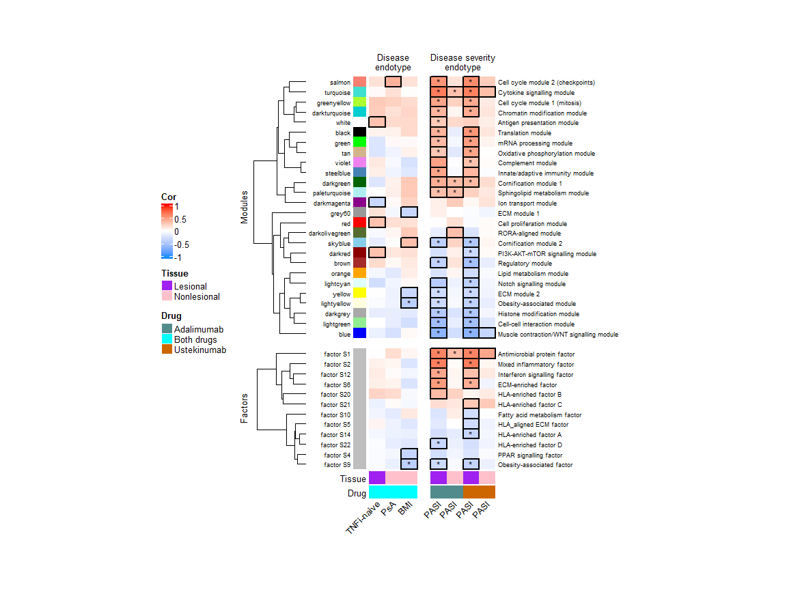
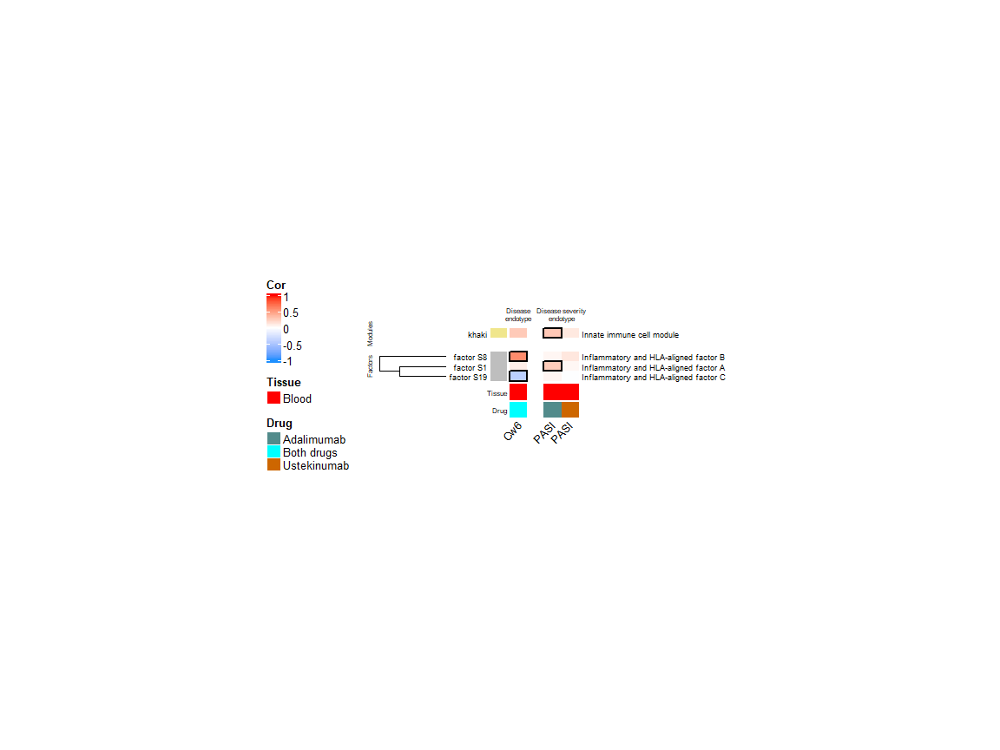

Trait correlation heatmaps
================
Ashley Rider
2024-10-04

- <a href="#preliminaries" id="toc-preliminaries">Preliminaries</a>
  - <a href="#load-packages" id="toc-load-packages">Load packages</a>
  - <a href="#create-output-directory"
    id="toc-create-output-directory">Create output directory</a>
- <a href="#skin" id="toc-skin">Skin</a>
- <a href="#blood" id="toc-blood">Blood</a>
- <a href="#session-information" id="toc-session-information">Session
  information</a>

Here we will visualise the module and latent factor-trait correlations
identified earlier using heatmaps.

# Preliminaries

## Load packages

``` r
library(tidyverse)
library(ComplexHeatmap)
library(circlize)
```

## Create output directory

``` r
output_directory <- "results/WGCNA/06_Trait_correlation_heatmaps"
dir.create(output_directory)
```

# Skin

We’ll start by drawing a heatmap for the skin modules and factors. First
we need to load the module and factor trait correlation data and bind
this together into one data frame.

``` r
mod_traits <- list()
mod_traits[[1]] <- read.delim(
  "results/WGCNA/03_Get_disease_and_disease_severity_correlations/Skin/Module-trait_correlations.txt"
)
mod_traits[[1]]$Group <- "Modules"
mod_traits[[2]] <- read.delim(
  "results/WGCNA/03_Get_disease_and_disease_severity_correlations/Skin/Factor-trait_correlations.txt"
)
mod_traits[[2]]$Group <- "Factors"
mod_traits <- bind_rows(mod_traits)
```

We’ll define significant trait correlations as those with an FDR \<=
0.05 in the discovery cohort, p-value \<= 0.05 in the replication
cohort, and correlation coefficient of same sign in discovery and
replication cohorts.

``` r
mod_traits <- mod_traits %>%
  mutate(Disc = ifelse(padj_all_d <= 0.05, T, F)) %>%
  mutate(Rep = ifelse(padj_all_d <= 0.05 & P.Value_r <= 0.05 & sign(Cor_d) == sign(Cor_r), T, F))
```

We also need to load the trait annotation data, which give information
about which samples correspond to which traits.

``` r
trait_anno <- read.delim(
  "results/WGCNA/03_Get_disease_and_disease_severity_correlations/Skin/Traits_anno.txt"
)
```

We also need to load the module and factor names, which are based on
their functional annotations.

``` r
anno_names <- bind_rows(list(
  read.delim("results/WGCNA/05_Module_factor_names/Skin_module_names.txt"),
  read.delim("results/WGCNA/05_Module_factor_names/Skin_factor_names.txt")
))

mod_traits$Module <- gsub("_", " S", mod_traits$Module)
anno_names$Module <- gsub("_", " S", anno_names$Module)
mod_traits$Type <- paste0(mod_traits$Type,"\nendotype")
trait_anno$Type <- paste0(trait_anno$Type,"\nendotype")
```

We’ll exclude sex from the heatmap as this is of less interest.

``` r
mod_traits <- mod_traits %>% 
  filter(!Trait %in% c("LS_wk00_Gender", "NL_wk00_Gender", "BL_wk00_Gender"))
```

Now we define a function that can construct a correlation heatmap from
all this data…

``` r
drawPeriodicTable <- function(mod_traits, trait_anno, anno_names, cor_thresh, keep_traits, rep,
                              rownames_size = 6.5, colnames_size = 9.5, split_title_size = 6.5, 
                              cell_width = 7, cell_height = 4){
  # Don't show grey module
  mod_traits <- mod_traits %>% dplyr::filter(Module != "grey")
  # Filter out modules that don't have at least one significant trait association
  # with an absolute correlation coefficient equal to or greater than the provided threshold (cor_thresh)
  keep_modules <- c()
  for(i in 1:length(unique(mod_traits$Module))){
    module <- unique(mod_traits$Module)[i]
    module_dat <- mod_traits %>% dplyr::filter(Module == module)
    module_dat <- module_dat %>% dplyr::filter(Disc == T)
    module_dat <- module_dat %>% dplyr::filter(Cor_d >= cor_thresh | Cor_d <= -cor_thresh)
    if(nrow(module_dat) > 0){
      keep_modules <- c(keep_modules, module)
    }
  }
  mod_traits <- mod_traits %>% dplyr::filter(Module %in% keep_modules)
  # Filter out traits that don't have at least one significant module association
  # with an absolute correlation coefficient equal to or greater than the provided threshold (cor_thresh)
  for(i in 1:length(unique(mod_traits$Trait))){
    trait <- unique(mod_traits$Trait)[i]
    trait_dat <- mod_traits %>% dplyr::filter(Trait == trait)
    trait_dat <- trait_dat %>% dplyr::filter(Disc == T)
    trait_dat <- trait_dat %>% dplyr::filter(Cor_d >= cor_thresh | Cor_d <= -cor_thresh)
    if(nrow(trait_dat) > 0){
      keep_traits <- c(keep_traits, trait)
    }
  }
  mod_traits <- mod_traits %>% dplyr::filter(Trait %in% keep_traits)
  # Matrix of correlations
  cor_dat <- tidyr::spread(mod_traits[,c("Module", "Trait", "Cor_d")], Trait, Cor_d)
  rownames(cor_dat) <- cor_dat$Module
  cor_dat$Module <- NULL
  cor_dat <- data.matrix(cor_dat)
  # Matrix of significance groups (for drawing borders)
  disc_dat <- tidyr::spread(mod_traits[,c("Module", "Trait", "Disc")], Trait, Disc)
  rownames(disc_dat) <- disc_dat$Module
  disc_dat$Module <- NULL
  disc_dat <- as.matrix(disc_dat)
  # Matrix of significance groups (for asterisks)
  if(rep == T){
    rep_dat <- tidyr::spread(mod_traits[,c("Module", "Trait", "Rep")], Trait, Rep)
    rownames(rep_dat) <- rep_dat$Module
    rep_dat$Module <- NULL
    rep_dat <- as.matrix(rep_dat)
    rep_dat[rep_dat == T] <- "*"
    rep_dat[rep_dat != "*"] <- ""
  }else if(rep == F){
    rep_dat <- matrix(
      data = "", 
      nrow = nrow(disc_dat), ncol = ncol(disc_dat), 
      dimnames = list(rownames(disc_dat), colnames(disc_dat))
    )
  }
  # Column annotation data
  trait_anno <- trait_anno %>% filter(Name %in% colnames(cor_dat))
  trait_anno$Type <- factor(trait_anno$Type, levels = c("Disease\nendotype", 
                                                        "Disease severity\nendotype", 
                                                        "Response\nendotype", 
                                                        "Treatment\nendotype"))
  # Data for row split
  mod_anno <- mod_traits[!duplicated(mod_traits$Module), c("Module", "Group")]
  mod_anno$Group <- factor(mod_anno$Group, levels = c("Modules", "Factors"))
  rownames(mod_anno) <- mod_anno$Module
  # Ensure rows and columns are in same order
  cor_dat <- cor_dat[mod_anno$Module, trait_anno$Name]
  disc_dat <- disc_dat[mod_anno$Module, trait_anno$Name]
  rep_dat <- rep_dat[mod_anno$Module, trait_anno$Name]
  # Column annotation object
  anno_col <- list(
    "Tissue" = c("Lesional" = "purple", "Nonlesional" = "pink", "Blood" = "red"),
    "Drug" = c("Adalimumab" = "darkslategray4", "Ustekinumab" = "darkorange3", "Both drugs" = "cyan")
  )
  bottom_anno = HeatmapAnnotation(
    Tissue = trait_anno$Tissue,
    Drug = trait_anno$Drug,
    Name = anno_text(trait_anno$Short_name, rot = 45, gp = gpar(fontsize = colnames_size)),
    col = anno_col, 
    show_annotation_name = TRUE,
    annotation_name_side = "left",
    border = F,
    annotation_name_gp = gpar(fontsize = split_title_size)
  )
  # Side annotation = module colours
  anno_col <- rownames(cor_dat)
  names(anno_col) <- rownames(cor_dat)
  anno_col[grep("factor", anno_col)] <- "grey"
  side_anno = rowAnnotation(
    Module = rownames(cor_dat),
    col = list(Module = anno_col),
    show_legend = F,
    show_annotation_name = F
  )
  # Side annotation = descriptive names
  rownames(anno_names) <- anno_names$Module
  anno_names <- anno_names[rownames(cor_dat),]
  side_anno2 <- rowAnnotation(
    Name = anno_text(anno_names$Name, gp = gpar(fontsize = rownames_size))
  )
  # Heatmap
  hm = Heatmap(cor_dat,
               width = ncol(cor_dat)*unit(cell_width,"mm"),
               height = nrow(cor_dat)*unit(cell_height,"mm"),
               bottom_annotation = bottom_anno,
               left_annotation = side_anno,
               right_annotation = side_anno2,
               column_split = trait_anno[["Type"]],
               column_title_gp = gpar(fontsize = split_title_size),
               column_gap = unit(5,"mm"),
               column_names_rot = 45,
               
               row_split = mod_anno[["Group"]],
               row_gap = unit(4,"mm"),
               cluster_row_slices = F,
               row_title_gp = gpar(fontsize = split_title_size),
               
               col = colorRamp2(breaks = c(-1, 0, 1), colors = c("dodgerblue", "white", "red")),
               heatmap_legend_param = list(title = "Cor",legend_direction = "vertical"),
               cluster_rows = T, 
               cluster_columns = F, 
               column_title_side = "top", 
               show_column_names = F,
               show_row_names = T, 
               show_row_dend = T, 
               clustering_method_rows = "average",
               clustering_method_columns = "average", 
               column_dend_height = unit(2, "cm"),
               row_dend_width = unit(2, "cm"),
               border = F, 
               row_names_gp = gpar(fontsize = rownames_size), 
               row_names_side = "left",
               cell_fun = function(j, i, x, y, w, h, col){
                 if(disc_dat[i, j] == T){
                   grid.rect(x = x, y = y, width = w, height = h, gp = gpar(lwd = 2, fill = "transparent", col = "black"))
                 }
                 grid.text(rep_dat[i, j], x, y, gp = gpar(fontsize = 10, col = "black"))
               })
  return(hm)
}
```

…and use it to draw a heatmap for the skin modules and factors.

``` r
hm <- drawPeriodicTable(
  mod_traits = mod_traits,
  anno_names = anno_names,
  trait_anno = trait_anno,
  rep = T,
  cor_thresh = 0, 
  rownames_size = 6.5, 
  colnames_size = 9.5, 
  split_title_size = 9.5, 
  cell_width = 7, 
  cell_height = 4,
  keep_traits = NULL
)

draw(hm, merge_legends = T, heatmap_legend_side = "left", padding = unit(c(0, 0, 0, 0), "mm"))
```

<!-- -->

``` r
# Save
png(paste0(output_directory,"/Skin_heatmap.png"), width = 8, height = 7.5, units = "in", res = 300)
draw(hm, merge_legends = T, heatmap_legend_side = "left", padding = unit(c(0, 0, 0, 0), "mm"))
dev.off()
```

    ## png 
    ##   2

``` r
pdf(paste0(output_directory,"/Skin_heatmap.pdf"), width = 8, height = 7.5)
draw(hm, merge_legends = T, heatmap_legend_side = "left", padding = unit(c(0, 0, 0, 0), "mm"))
dev.off()
```

    ## png 
    ##   2

# Blood

Now we can make a heatmap for the blood data.

``` r
mod_traits <- list()
mod_traits[[1]] <- read.delim(
  "results/WGCNA/03_Get_disease_and_disease_severity_correlations/Blood/Module-trait_correlations.txt"
)
mod_traits[[1]]$Group <- "Modules"
mod_traits[[2]] <- read.delim(
  "results/WGCNA/03_Get_disease_and_disease_severity_correlations/Blood/Factor-trait_correlations.txt"
)
mod_traits[[2]]$Group <- "Factors"
mod_traits <- bind_rows(mod_traits)

mod_traits <- mod_traits %>%
  mutate(Disc = ifelse(padj_all_d <= 0.05, T, F))

trait_anno <- read.delim(
  "results/WGCNA/03_Get_disease_and_disease_severity_correlations/Blood/Traits_anno.txt"
)

anno_names <- bind_rows(list(
  read.delim("results/WGCNA/05_Module_factor_names/Blood_module_names.txt"),
  read.delim("results/WGCNA/05_Module_factor_names/Blood_factor_names.txt")
))

mod_traits$Module <- gsub("_", " S", mod_traits$Module)

anno_names$Module <- gsub("_", " S", anno_names$Module)

mod_traits$Type <- paste0(mod_traits$Type,"\nendotype")
trait_anno$Type <- paste0(trait_anno$Type,"\nendotype")

mod_traits <- mod_traits %>% 
  filter(!Trait %in% c("BL_wk00_Gender"))

hm <- drawPeriodicTable(
  mod_traits = mod_traits,
  anno_names = anno_names,
  trait_anno = trait_anno,
  rep = F,
  cor_thresh = 0, 
  rownames_size = 6.5, 
  colnames_size = 9.5, 
  split_title_size = 6, 
  cell_width = 7, 
  cell_height = 4,
  keep_traits = c("BL_wk00_Cw6_PosNeg", "BL_ADA_PASI", "BL_UST_PASI")
)

draw(hm, merge_legends = T, heatmap_legend_side = "left", padding = unit(c(0, 0, 0, 0), "mm"))
```

<!-- -->

``` r
png(paste0(output_directory,"/Blood_heatmap.png"), width = 8, height = 3, units = "in", res = 300)
draw(hm, merge_legends = T, heatmap_legend_side = "left", padding = unit(c(0, 0, 0, 0), "mm"))
dev.off()
```

    ## png 
    ##   2

``` r
pdf(paste0(output_directory,"/Blood_heatmap.pdf"), width = 8, height = 3)
draw(hm, merge_legends = T, heatmap_legend_side = "left", padding = unit(c(0, 0, 0, 0), "mm"))
dev.off()
```

    ## png 
    ##   2

# Session information

``` r
sessionInfo()
```

    ## R version 4.2.3 (2023-03-15 ucrt)
    ## Platform: x86_64-w64-mingw32/x64 (64-bit)
    ## Running under: Windows 10 x64 (build 19045)
    ## 
    ## Matrix products: default
    ## 
    ## locale:
    ## [1] LC_COLLATE=English_United Kingdom.utf8 
    ## [2] LC_CTYPE=English_United Kingdom.utf8   
    ## [3] LC_MONETARY=English_United Kingdom.utf8
    ## [4] LC_NUMERIC=C                           
    ## [5] LC_TIME=English_United Kingdom.utf8    
    ## 
    ## attached base packages:
    ## [1] grid      stats     graphics  grDevices utils     datasets  methods  
    ## [8] base     
    ## 
    ## other attached packages:
    ##  [1] circlize_0.4.15       ComplexHeatmap_2.14.0 lubridate_1.9.2      
    ##  [4] forcats_1.0.0         stringr_1.5.0         dplyr_1.1.0          
    ##  [7] purrr_1.0.1           readr_2.1.4           tidyr_1.3.0          
    ## [10] tibble_3.2.0          ggplot2_3.4.2         tidyverse_2.0.0      
    ## 
    ## loaded via a namespace (and not attached):
    ##  [1] shape_1.4.6         GetoptLong_1.0.5    tidyselect_1.2.0   
    ##  [4] xfun_0.39           colorspace_2.1-0    vctrs_0.6.0        
    ##  [7] generics_0.1.3      stats4_4.2.3        htmltools_0.5.4    
    ## [10] yaml_2.3.7          utf8_1.2.3          rlang_1.1.0        
    ## [13] pillar_1.8.1        glue_1.6.2          withr_2.5.0        
    ## [16] RColorBrewer_1.1-3  BiocGenerics_0.44.0 matrixStats_0.63.0 
    ## [19] foreach_1.5.2       lifecycle_1.0.3     munsell_0.5.0      
    ## [22] gtable_0.3.2        GlobalOptions_0.1.2 codetools_0.2-19   
    ## [25] evaluate_0.20       knitr_1.42          tzdb_0.3.0         
    ## [28] IRanges_2.32.0      fastmap_1.1.1       Cairo_1.6-0        
    ## [31] doParallel_1.0.17   parallel_4.2.3      fansi_1.0.4        
    ## [34] highr_0.10          scales_1.2.1        S4Vectors_0.36.2   
    ## [37] rjson_0.2.21        hms_1.1.2           png_0.1-8          
    ## [40] digest_0.6.31       stringi_1.7.12      clue_0.3-64        
    ## [43] rprojroot_2.0.3     cli_3.6.0           tools_4.2.3        
    ## [46] magrittr_2.0.3      cluster_2.1.4       crayon_1.5.2       
    ## [49] pkgconfig_2.0.3     ellipsis_0.3.2      timechange_0.2.0   
    ## [52] rmarkdown_2.20      rstudioapi_0.14     iterators_1.0.14   
    ## [55] R6_2.5.1            compiler_4.2.3
