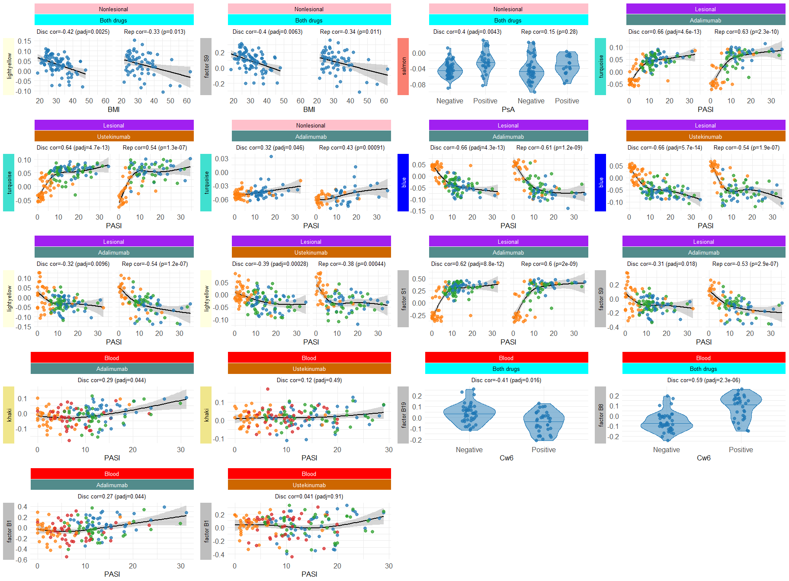

Trait correlation plots
================
Ashley Rider
2024-10-04

- <a href="#preliminaries" id="toc-preliminaries">Preliminaries</a>
  - <a href="#load-packages" id="toc-load-packages">Load packages</a>
  - <a href="#create-output-directory"
    id="toc-create-output-directory">Create output directory</a>
- <a href="#skin" id="toc-skin">Skin</a>
  - <a href="#load-data" id="toc-load-data">Load data</a>
    - <a href="#clinical-data" id="toc-clinical-data">Clinical data</a>
    - <a href="#eigengenes" id="toc-eigengenes">Eigengenes</a>
    - <a href="#latent-factors" id="toc-latent-factors">Latent factors</a>
    - <a href="#module-and-factor-trait-correlations"
      id="toc-module-and-factor-trait-correlations">Module and factor-trait
      correlations</a>
  - <a href="#plots" id="toc-plots">Plots</a>
- <a href="#blood" id="toc-blood">Blood</a>
  - <a href="#load-data-1" id="toc-load-data-1">Load data</a>
    - <a href="#clinical-data-1" id="toc-clinical-data-1">Clinical data</a>
    - <a href="#eigengenes-1" id="toc-eigengenes-1">Eigengenes</a>
    - <a href="#latent-factors-1" id="toc-latent-factors-1">Latent factors</a>
    - <a href="#module-and-factor-trait-correlations-1"
      id="toc-module-and-factor-trait-correlations-1">Module and factor-trait
      correlations</a>
  - <a href="#plots-1" id="toc-plots-1">Plots</a>
- <a href="#assemble-plot-panel" id="toc-assemble-plot-panel">Assemble
  plot panel</a>
- <a href="#session-information" id="toc-session-information">Session
  information</a>

Here, we’ll plot some exemplar module and factor-tait correlations.

# Preliminaries

## Load packages

``` r
library(tidyverse)
library(gridExtra)
library(ggh4x)
library(scales)
library(splines)
```

## Create output directory

``` r
output_directory <- "results/WGCNA/07_Trait_correlation_plots"
dir.create(output_directory)
```

# Skin

We’ll start by creating some plots for significant associations with the
skin modules and factors. First, we need to load the data.

## Load data

### Clinical data

We’ll load the clinical data for the PSORT-D and PSORT-R cohorts and
bind it together.

``` r
clin <- list(
  read.delim("results/WGCNA/03_Get_disease_and_disease_severity_correlations/Skin/clin.txt"),
  read.delim("results/WGCNA/03_Get_disease_and_disease_severity_correlations/Skin/clin_r.txt")
)
clin[[1]]$Cohort <- "Discovery"
clin[[2]]$Cohort <- "Replication"
clin <- bind_rows(clin)
```

### Eigengenes

We’ll do the same for the module eigengenes…

``` r
eigen <- rbind(
  read.delim("results/WGCNA/01_Module_identification/Skin/eigengenes.txt"),
  read.delim("results/WGCNA/01_Module_identification/Skin/eigengenes_r.txt")
)
```

### Latent factors

And the latent factors…

``` r
factors <- rbind(
  read.delim("data/latent_factors/skin_d_m.csv", sep = ","),
  read.delim("data/latent_factors/skin_r_m.csv", sep = ",")
)
colnames(factors)[1] <- "Sample_id"
```

### Module and factor-trait correlations

We’ll also load the module/factor-trait correlation data.

``` r
cor_dat <- rbind(
 read.delim("results/WGCNA/03_Get_disease_and_disease_severity_correlations/Skin/Module-trait_correlations.txt"),
 read.delim("results/WGCNA/03_Get_disease_and_disease_severity_correlations/Skin/Factor-trait_correlations.txt")
)
```

## Plots

Below we define a function that assembles all the above data into a
correlation plot and use it to plot some exemplars in skin.

``` r
plotModuleTrait <- function(module, trait, cohort, tissue, time, drug, clin, eigen, x_title, cohort_facet, text_size = 12){
  # Assemble data
  clin <- clin[,c("Sample_id", "Cohort", "Tissue", "Time", "Drug", trait)] %>%
    filter(Cohort %in% cohort, Tissue %in% tissue, Time %in% time, Drug %in% drug)
  eigen <- eigen[,c("Sample_id", module)]
  dat <- merge(clin, eigen) 
  if(trait != "Time"){
    dat <- dat %>% rename(all_of(c(Trait = trait, Eigengene = module)))
  }else{
    dat <- dat %>% rename(Trait = Time.1) %>% rename(all_of(c(Eigengene = module)))
  }
  # Module facet variable
  if(grepl("factor",module)){
    if(unique(dat$Tissue) %in% c("Lesional", "Nonlesional")){
      dat$Module_facet <- gsub("_", " S", module)
    }else if(unique(dat$Tissue) == "Blood"){
      dat$Module_facet <- gsub("_", " B", module)
    }
  }else{
    dat$Module_facet <- module
  }
  # Drug facet variable
  dat$Drug_facet <- dat$Drug
  if(length(drug) == 2){
    dat$Drug_facet <- "Both drugs"
  }
  # Cohort facet variable
  dat$Cohort_facet <- NA
  dat$Cohort_facet[which(dat$Cohort == "Discovery")] <- cohort_facet["Discovery"]
  dat$Cohort_facet[which(dat$Cohort == "Replication")] <- cohort_facet["Replication"]
  # Facet strip colours
  if(unique(dat$Tissue) == "Lesional"){
    tissue_strip_col <- "purple"
    tissue_text_col <- "white"
  }else if(unique(dat$Tissue) == "Nonlesional"){
    tissue_strip_col <- "pink"
    tissue_text_col <- "black"
  }else if(unique(dat$Tissue) == "Blood"){
    tissue_strip_col <- "red"
    tissue_text_col <- "white"
  }
  if(unique(dat$Drug_facet) == "Adalimumab"){
    drug_strip_col <- "darkslategray4"
    drug_text_col <- "white"
  }else if(unique(dat$Drug_facet) == "Ustekinumab"){
    drug_strip_col <- "darkorange3"
    drug_text_col <- "white"
  }else if(unique(dat$Drug_facet) == "Both drugs"){
    drug_strip_col <- "cyan"
    drug_text_col <- "black"
  }
  if(grepl("factor", module)){
    module_fill_col <- "grey"
    module_col <- "grey"
    module_text_col <- "black"
  }else if(module == "white"){
    module_fill_col <- "white"
    module_col <- "black"
    module_text_col <- "black"
  }else if(module %in% c("black", "blue", "darkred", "navy", "darkslategrey", "firebrick", "darkorchid", "purple",
                         "darkmagenta")){
    module_fill_col <- module
    module_col <- module
    module_text_col <- "white"
  }else{
    module_fill_col <- module
    module_col <- module
    module_text_col <- "black"
  }
  # Assemble facet strips
  strip_fun <- strip_nested(
    # Horizontal strips
    background_x = elem_list_rect(fill = c(tissue_strip_col, drug_strip_col, "white"), color = c("white", "white", "white")),
    text_x = elem_list_text(color = c(tissue_text_col, drug_text_col, "black")),
    by_layer_x = TRUE,
    # Vertical strips
    background_y = elem_list_rect(fill = module_fill_col, color = module_col),
    text_y = elem_list_text(color = module_text_col),
    by_layer_y = FALSE
  )
  # Plot
  p <- ggplot(data = dat, aes(x = Trait, y = Eigengene)) +
    scale_fill_manual(values = c("wk00" = "#1F77B4FF", "wk01" = "#2CA02CFF", "wk04" = "#D62728FF", "wk12" = "#FF7F0EFF")) +
    scale_color_manual(values = c("wk00" = "#1F77B4FF", "wk01" = "#2CA02CFF", "wk04" = "#D62728FF", "wk12" = "#FF7F0EFF")) +
    labs(x = x_title) +
    theme_minimal() +
    theme(text = element_text(size = text_size),
          axis.text = element_text(size = text_size),
          strip.placement = "outside",
          axis.title.y = element_blank(),
          legend.position = "none") +
    facet_nested(Module_facet ~ Tissue + Drug_facet + Cohort_facet, strip = strip_fun, switch = "y")
  if(is.numeric(dat$Trait)){
    if(grepl("PASI", trait)){
      p <- p + stat_smooth(method="lm", formula = "y ~ ns(x, df=3)", color = "black")
    }else{
      p <- p + geom_smooth(method = "lm", formula = y ~ x, color = "black")
    }
    p <- p + geom_point(aes(color = Time), size = 2.5, alpha = 0.75)
  }else{
    p <- p + 
      geom_violin(aes(fill = Time, color = Time), width = 0.7, alpha = 0.5, draw_quantiles = 0.5, lwd = 0.5) +
      geom_point(aes(fill = Time, color = Time), position = position_jitter(0.1), size = 2.5, alpha = 0.75)
  }
  return(p)
}

plot_list <- list()

# Module and trait
module <- "lightyellow"
trait <- "NL_wk00_BMI"
# Cohort facet strips
cor_d <- cor_dat %>% filter(Module == module, Trait == trait) %>% pull(Cor_d) %>% signif(2)
padj_d <- cor_dat %>% filter(Module == module, Trait == trait) %>% pull(padj_all_d) %>% signif(2)
cor_r <- cor_dat %>% filter(Module == module, Trait == trait) %>% pull(Cor_r) %>% signif(2)
p_r <- cor_dat %>% filter(Module == module, Trait == trait) %>% pull(P.Value_r) %>% signif(2)
facet_d <- paste0("Disc cor=",cor_d," (padj=",padj_d,")")
facet_r <- paste0("Rep cor=",cor_r," (p=",p_r,")")
# Plot
p <- plotModuleTrait(module = module, trait = "BMI",
                     cohort = c("Discovery", "Replication"),
                     tissue = "Nonlesional",
                     time = "wk00",
                     drug = c("Adalimumab", "Ustekinumab"),
                     clin = clin,
                     eigen = eigen,
                     x_title = "BMI",
                     cohort_facet = c(Discovery = facet_d, Replication = facet_r))
plot_list[[length(plot_list) + 1]] <- p

# Module and trait
module <- "factor_9"
trait <- "NL_wk00_BMI"
# Cohort facet strips
cor_d <- cor_dat %>% filter(Module == module, Trait == trait) %>% pull(Cor_d) %>% signif(2)
padj_d <- cor_dat %>% filter(Module == module, Trait == trait) %>% pull(padj_all_d) %>% signif(2)
cor_r <- cor_dat %>% filter(Module == module, Trait == trait) %>% pull(Cor_r) %>% signif(2)
p_r <- cor_dat %>% filter(Module == module, Trait == trait) %>% pull(P.Value_r) %>% signif(2)
facet_d <- paste0("Disc cor=",cor_d," (padj=",padj_d,")")
facet_r <- paste0("Rep cor=",cor_r," (p=",p_r,")")
# Plot
p <- plotModuleTrait(module = module, trait = "BMI",
                     cohort = c("Discovery", "Replication"),
                     tissue = "Nonlesional",
                     time = "wk00",
                     drug = c("Adalimumab", "Ustekinumab"),
                     clin = clin,
                     eigen = factors,
                     x_title = "BMI",
                     cohort_facet = c(Discovery = facet_d, Replication = facet_r))
plot_list[[length(plot_list) + 1]] <- p

# Module and trait
module <- "salmon"
trait <- "NL_wk00_Psoriatic_Arthritis"
# Cohort facet strips
cor_d <- cor_dat %>% filter(Module == module, Trait == trait) %>% pull(Cor_d) %>% signif(2)
padj_d <- cor_dat %>% filter(Module == module, Trait == trait) %>% pull(padj_all_d) %>% signif(2)
cor_r <- cor_dat %>% filter(Module == module, Trait == trait) %>% pull(Cor_r) %>% signif(2)
p_r <- cor_dat %>% filter(Module == module, Trait == trait) %>% pull(P.Value_r) %>% signif(2)
facet_d <- paste0("Disc cor=",cor_d," (padj=",padj_d,")")
facet_r <- paste0("Rep cor=",cor_r," (p=",p_r,")")
# Plot
p <- plotModuleTrait(module = module, trait = "Psoriatic_Arthritis",
                     cohort = c("Discovery", "Replication"),
                     tissue = "Nonlesional",
                     time = "wk00",
                     drug = c("Adalimumab", "Ustekinumab"),
                     clin = clin,
                     eigen = eigen,
                     x_title = "PsA",
                     cohort_facet = c(Discovery = facet_d, Replication = facet_r))
plot_list[[length(plot_list) + 1]] <- p

# Module and trait
module <- "turquoise"
trait <- "LS_ADA_PASI"
# Cohort facet strips
cor_d <- cor_dat %>% filter(Module == module, Trait == trait) %>% pull(Cor_d) %>% signif(2)
padj_d <- cor_dat %>% filter(Module == module, Trait == trait) %>% pull(padj_all_d) %>% signif(2)
cor_r <- cor_dat %>% filter(Module == module, Trait == trait) %>% pull(Cor_r) %>% signif(2)
p_r <- cor_dat %>% filter(Module == module, Trait == trait) %>% pull(P.Value_r) %>% signif(2)
facet_d <- paste0("Disc cor=",cor_d," (padj=",padj_d,")")
facet_r <- paste0("Rep cor=",cor_r," (p=",p_r,")")
# Plot
p <- plotModuleTrait(module = module, trait = "PASI",
                     cohort = c("Discovery", "Replication"),
                     tissue = "Lesional",
                     time = c("wk00", "wk01", "wk12"),
                     drug = "Adalimumab",
                     clin = clin,
                     eigen = eigen,
                     x_title = "PASI",
                     cohort_facet = c(Discovery = facet_d, Replication = facet_r))
plot_list[[length(plot_list) + 1]] <- p

# Module and trait
module <- "turquoise"
trait <- "LS_UST_PASI"
# Cohort facet strips
cor_d <- cor_dat %>% filter(Module == module, Trait == trait) %>% pull(Cor_d) %>% signif(2)
padj_d <- cor_dat %>% filter(Module == module, Trait == trait) %>% pull(padj_all_d) %>% signif(2)
cor_r <- cor_dat %>% filter(Module == module, Trait == trait) %>% pull(Cor_r) %>% signif(2)
p_r <- cor_dat %>% filter(Module == module, Trait == trait) %>% pull(P.Value_r) %>% signif(2)
facet_d <- paste0("Disc cor=",cor_d," (padj=",padj_d,")")
facet_r <- paste0("Rep cor=",cor_r," (p=",p_r,")")
# Plot
p <- plotModuleTrait(module = module, trait = "PASI",
                     cohort = c("Discovery", "Replication"),
                     tissue = "Lesional",
                     time = c("wk00", "wk01", "wk12"),
                     drug = "Ustekinumab",
                     clin = clin,
                     eigen = eigen,
                     x_title = "PASI",
                     cohort_facet = c(Discovery = facet_d, Replication = facet_r))
plot_list[[length(plot_list) + 1]] <- p

# Module and trait
module <- "turquoise"
trait <- "NL_ADA_PASI"
# Cohort facet strips
cor_d <- cor_dat %>% filter(Module == module, Trait == trait) %>% pull(Cor_d) %>% signif(2)
padj_d <- cor_dat %>% filter(Module == module, Trait == trait) %>% pull(padj_all_d) %>% signif(2)
cor_r <- cor_dat %>% filter(Module == module, Trait == trait) %>% pull(Cor_r) %>% signif(2)
p_r <- cor_dat %>% filter(Module == module, Trait == trait) %>% pull(P.Value_r) %>% signif(2)
facet_d <- paste0("Disc cor=",cor_d," (padj=",padj_d,")")
facet_r <- paste0("Rep cor=",cor_r," (p=",p_r,")")
# Plot
p <- plotModuleTrait(module = module, trait = "PASI",
                     cohort = c("Discovery", "Replication"),
                     tissue = "Nonlesional",
                     time = c("wk00", "wk12"),
                     drug = "Adalimumab",
                     clin = clin,
                     eigen = eigen,
                     x_title = "PASI",
                     cohort_facet = c(Discovery = facet_d, Replication = facet_r))
plot_list[[length(plot_list) + 1]] <- p

# Module and trait
module <- "turquoise"
trait <- "NL_UST_PASI"
# Cohort facet strips
cor_d <- cor_dat %>% filter(Module == module, Trait == trait) %>% pull(Cor_d) %>% signif(2)
padj_d <- cor_dat %>% filter(Module == module, Trait == trait) %>% pull(padj_all_d) %>% signif(2)
cor_r <- cor_dat %>% filter(Module == module, Trait == trait) %>% pull(Cor_r) %>% signif(2)
p_r <- cor_dat %>% filter(Module == module, Trait == trait) %>% pull(P.Value_r) %>% signif(2)
facet_d <- paste0("Disc cor=",cor_d," (padj=",padj_d,")")
facet_r <- paste0("Rep cor=",cor_r," (p=",p_r,")")
# Plot
p <- plotModuleTrait(module = module, trait = "PASI",
                     cohort = c("Discovery", "Replication"),
                     tissue = "Nonlesional",
                     time = c("wk00", "wk12"),
                     drug = "Ustekinumab",
                     clin = clin,
                     eigen = eigen,
                     x_title = "PASI",
                     cohort_facet = c(Discovery = facet_d, Replication = facet_r))
plot_list[[length(plot_list) + 1]] <- p

# Module and trait
module <- "blue"
trait <- "LS_ADA_PASI"
# Cohort facet strips
cor_d <- cor_dat %>% filter(Module == module, Trait == trait) %>% pull(Cor_d) %>% signif(2)
padj_d <- cor_dat %>% filter(Module == module, Trait == trait) %>% pull(padj_all_d) %>% signif(2)
cor_r <- cor_dat %>% filter(Module == module, Trait == trait) %>% pull(Cor_r) %>% signif(2)
p_r <- cor_dat %>% filter(Module == module, Trait == trait) %>% pull(P.Value_r) %>% signif(2)
facet_d <- paste0("Disc cor=",cor_d," (padj=",padj_d,")")
facet_r <- paste0("Rep cor=",cor_r," (p=",p_r,")")
# Plot
p <- plotModuleTrait(module = module, trait = "PASI",
                     cohort = c("Discovery", "Replication"),
                     tissue = "Lesional",
                     time = c("wk00", "wk01", "wk12"),
                     drug = "Adalimumab",
                     clin = clin,
                     eigen = eigen,
                     x_title = "PASI",
                     cohort_facet = c(Discovery = facet_d, Replication = facet_r))
plot_list[[length(plot_list) + 1]] <- p

# Module and trait
module <- "blue"
trait <- "LS_UST_PASI"
# Cohort facet strips
cor_d <- cor_dat %>% filter(Module == module, Trait == trait) %>% pull(Cor_d) %>% signif(2)
padj_d <- cor_dat %>% filter(Module == module, Trait == trait) %>% pull(padj_all_d) %>% signif(2)
cor_r <- cor_dat %>% filter(Module == module, Trait == trait) %>% pull(Cor_r) %>% signif(2)
p_r <- cor_dat %>% filter(Module == module, Trait == trait) %>% pull(P.Value_r) %>% signif(2)
facet_d <- paste0("Disc cor=",cor_d," (padj=",padj_d,")")
facet_r <- paste0("Rep cor=",cor_r," (p=",p_r,")")
# Plot
p <- plotModuleTrait(module = module, trait = "PASI",
                     cohort = c("Discovery", "Replication"),
                     tissue = "Lesional",
                     time = c("wk00", "wk01", "wk12"),
                     drug = "Ustekinumab",
                     clin = clin,
                     eigen = eigen,
                     x_title = "PASI",
                     cohort_facet = c(Discovery = facet_d, Replication = facet_r))
plot_list[[length(plot_list) + 1]] <- p

# Module and trait
module <- "lightyellow"
trait <- "LS_ADA_PASI"
# Cohort facet strips
cor_d <- cor_dat %>% filter(Module == module, Trait == trait) %>% pull(Cor_d) %>% signif(2)
padj_d <- cor_dat %>% filter(Module == module, Trait == trait) %>% pull(padj_all_d) %>% signif(2)
cor_r <- cor_dat %>% filter(Module == module, Trait == trait) %>% pull(Cor_r) %>% signif(2)
p_r <- cor_dat %>% filter(Module == module, Trait == trait) %>% pull(P.Value_r) %>% signif(2)
facet_d <- paste0("Disc cor=",cor_d," (padj=",padj_d,")")
facet_r <- paste0("Rep cor=",cor_r," (p=",p_r,")")
# Plot
p <- plotModuleTrait(module = module, trait = "PASI",
                     cohort = c("Discovery", "Replication"),
                     tissue = "Lesional",
                     time = c("wk00", "wk01", "wk12"),
                     drug = "Adalimumab",
                     clin = clin,
                     eigen = eigen,
                     x_title = "PASI",
                     cohort_facet = c(Discovery = facet_d, Replication = facet_r))
plot_list[[length(plot_list) + 1]] <- p

# Module and trait
module <- "lightyellow"
trait <- "LS_UST_PASI"
# Cohort facet strips
cor_d <- cor_dat %>% filter(Module == module, Trait == trait) %>% pull(Cor_d) %>% signif(2)
padj_d <- cor_dat %>% filter(Module == module, Trait == trait) %>% pull(padj_all_d) %>% signif(2)
cor_r <- cor_dat %>% filter(Module == module, Trait == trait) %>% pull(Cor_r) %>% signif(2)
p_r <- cor_dat %>% filter(Module == module, Trait == trait) %>% pull(P.Value_r) %>% signif(2)
facet_d <- paste0("Disc cor=",cor_d," (padj=",padj_d,")")
facet_r <- paste0("Rep cor=",cor_r," (p=",p_r,")")
# Plot
p <- plotModuleTrait(module = module, trait = "PASI",
                     cohort = c("Discovery", "Replication"),
                     tissue = "Lesional",
                     time = c("wk00", "wk01", "wk12"),
                     drug = "Ustekinumab",
                     clin = clin,
                     eigen = eigen,
                     x_title = "PASI",
                     cohort_facet = c(Discovery = facet_d, Replication = facet_r))
plot_list[[length(plot_list) + 1]] <- p

# Module and trait
module <- "factor_1"
trait <- "LS_ADA_PASI"
# Cohort facet strips
cor_d <- cor_dat %>% filter(Module == module, Trait == trait) %>% pull(Cor_d) %>% signif(2)
padj_d <- cor_dat %>% filter(Module == module, Trait == trait) %>% pull(padj_all_d) %>% signif(2)
cor_r <- cor_dat %>% filter(Module == module, Trait == trait) %>% pull(Cor_r) %>% signif(2)
p_r <- cor_dat %>% filter(Module == module, Trait == trait) %>% pull(P.Value_r) %>% signif(2)
facet_d <- paste0("Disc cor=",cor_d," (padj=",padj_d,")")
facet_r <- paste0("Rep cor=",cor_r," (p=",p_r,")")
# Plot
p <- plotModuleTrait(module = module, trait = "PASI",
                     cohort = c("Discovery", "Replication"),
                     tissue = "Lesional",
                     time = c("wk00", "wk01", "wk12"),
                     drug = "Adalimumab",
                     clin = clin,
                     eigen = factors,
                     x_title = "PASI",
                     cohort_facet = c(Discovery = facet_d, Replication = facet_r))
plot_list[[length(plot_list) + 1]] <- p

# Module and trait
module <- "factor_1"
trait <- "LS_UST_PASI"
# Cohort facet strips
cor_d <- cor_dat %>% filter(Module == module, Trait == trait) %>% pull(Cor_d) %>% signif(2)
padj_d <- cor_dat %>% filter(Module == module, Trait == trait) %>% pull(padj_all_d) %>% signif(2)
cor_r <- cor_dat %>% filter(Module == module, Trait == trait) %>% pull(Cor_r) %>% signif(2)
p_r <- cor_dat %>% filter(Module == module, Trait == trait) %>% pull(P.Value_r) %>% signif(2)
facet_d <- paste0("Disc cor=",cor_d," (padj=",padj_d,")")
facet_r <- paste0("Rep cor=",cor_r," (p=",p_r,")")
# Plot
p <- plotModuleTrait(module = module, trait = "PASI",
                     cohort = c("Discovery", "Replication"),
                     tissue = "Lesional",
                     time = c("wk00", "wk01", "wk12"),
                     drug = "Ustekinumab",
                     clin = clin,
                     eigen = factors,
                     x_title = "PASI",
                     cohort_facet = c(Discovery = facet_d, Replication = facet_r))
plot_list[[length(plot_list) + 1]] <- p

# Module and trait
module <- "factor_9"
trait <- "LS_ADA_PASI"
# Cohort facet strips
cor_d <- cor_dat %>% filter(Module == module, Trait == trait) %>% pull(Cor_d) %>% signif(2)
padj_d <- cor_dat %>% filter(Module == module, Trait == trait) %>% pull(padj_all_d) %>% signif(2)
cor_r <- cor_dat %>% filter(Module == module, Trait == trait) %>% pull(Cor_r) %>% signif(2)
p_r <- cor_dat %>% filter(Module == module, Trait == trait) %>% pull(P.Value_r) %>% signif(2)
facet_d <- paste0("Disc cor=",cor_d," (padj=",padj_d,")")
facet_r <- paste0("Rep cor=",cor_r," (p=",p_r,")")
# Plot
p <- plotModuleTrait(module = module, trait = "PASI",
                     cohort = c("Discovery", "Replication"),
                     tissue = "Lesional",
                     time = c("wk00", "wk01", "wk12"),
                     drug = "Adalimumab",
                     clin = clin,
                     eigen = factors,
                     x_title = "PASI",
                     cohort_facet = c(Discovery = facet_d, Replication = facet_r))
plot_list[[length(plot_list) + 1]] <- p

# Module and trait
module <- "factor_9"
trait <- "LS_UST_PASI"
# Cohort facet strips
cor_d <- cor_dat %>% filter(Module == module, Trait == trait) %>% pull(Cor_d) %>% signif(2)
padj_d <- cor_dat %>% filter(Module == module, Trait == trait) %>% pull(padj_all_d) %>% signif(2)
cor_r <- cor_dat %>% filter(Module == module, Trait == trait) %>% pull(Cor_r) %>% signif(2)
p_r <- cor_dat %>% filter(Module == module, Trait == trait) %>% pull(P.Value_r) %>% signif(2)
facet_d <- paste0("Disc cor=",cor_d," (padj=",padj_d,")")
facet_r <- paste0("Rep cor=",cor_r," (p=",p_r,")")
# Plot
p <- plotModuleTrait(module = module, trait = "PASI",
                     cohort = c("Discovery", "Replication"),
                     tissue = "Lesional",
                     time = c("wk00", "wk01", "wk12"),
                     drug = "Ustekinumab",
                     clin = clin,
                     eigen = factors,
                     x_title = "PASI",
                     cohort_facet = c(Discovery = facet_d, Replication = facet_r))
plot_list[[length(plot_list) + 1]] <- p
```

# Blood

Now we’ll do the same as above for blood.

## Load data

### Clinical data

``` r
clin <- read.delim("results/WGCNA/03_Get_disease_and_disease_severity_correlations/Blood/clin.txt")
clin$Cohort <- "Discovery"
```

### Eigengenes

``` r
eigen <- read.delim("results/WGCNA/01_Module_identification/Blood/eigengenes.txt")
```

### Latent factors

``` r
factors <- read.delim("data/latent_factors/blood_m.csv", sep = ",")
colnames(factors)[1] <- "Sample_id"
```

### Module and factor-trait correlations

``` r
cor_dat <- rbind(
  read.delim("results/WGCNA/03_Get_disease_and_disease_severity_correlations/Blood/Module-trait_correlations.txt"),
  read.delim("results/WGCNA/03_Get_disease_and_disease_severity_correlations/Blood/Factor-trait_correlations.txt")
)
```

## Plots

``` r
# Module and trait
module <- "khaki"
trait <- "BL_ADA_PASI"
# Cohort facet strips
cor_d <- cor_dat %>% filter(Module == module, Trait == trait) %>% pull(Cor_d) %>% signif(2)
padj_d <- cor_dat %>% filter(Module == module, Trait == trait) %>% pull(padj_all_d) %>% signif(2)
facet_d <- paste0("Disc cor=",cor_d," (padj=",padj_d,")")
# Plot
p <- plotModuleTrait(module = module, trait = "PASI",
                     cohort = "Discovery",
                     tissue = "Blood",
                     time = c("wk00", "wk01", "wk04", "wk12"),
                     drug = "Adalimumab",
                     clin = clin,
                     eigen = eigen,
                     x_title = "PASI",
                     cohort_facet = c(Discovery = facet_d))
plot_list[[length(plot_list) + 1]] <- p

# Module and trait
module <- "khaki"
trait <- "BL_UST_PASI"
# Cohort facet strips
cor_d <- cor_dat %>% filter(Module == module, Trait == trait) %>% pull(Cor_d) %>% signif(2)
padj_d <- cor_dat %>% filter(Module == module, Trait == trait) %>% pull(padj_all_d) %>% signif(2)
facet_d <- paste0("Disc cor=",cor_d," (padj=",padj_d,")")
# Plot
p <- plotModuleTrait(module = module, trait = "PASI",
                     cohort = "Discovery",
                     tissue = "Blood",
                     time = c("wk00", "wk01", "wk04", "wk12"),
                     drug = "Ustekinumab",
                     clin = clin,
                     eigen = eigen,
                     x_title = "PASI",
                     cohort_facet = c(Discovery = facet_d))
plot_list[[length(plot_list) + 1]] <- p

# Module and trait
module <- "factor_19"
trait <- "BL_wk00_Cw6_PosNeg"
# Cohort facet strips
cor_d <- cor_dat %>% filter(Module == module, Trait == trait) %>% pull(Cor_d) %>% signif(2)
padj_d <- cor_dat %>% filter(Module == module, Trait == trait) %>% pull(padj_all_d) %>% signif(2)
facet_d <- paste0("Disc cor=",cor_d," (padj=",padj_d,")")
# Plot
p <- plotModuleTrait(module = module, trait = "Cw6_PosNeg",
                     cohort = "Discovery",
                     tissue = "Blood",
                     time = "wk00",
                     drug = c("Adalimumab", "Ustekinumab"),
                     clin = clin[!is.na(clin$Cw6_PosNeg),],
                     eigen = factors,
                     x_title = "Cw6",
                     cohort_facet = c(Discovery = facet_d))
plot_list[[length(plot_list) + 1]] <- p

# Module and trait
module <- "factor_8"
trait <- "BL_wk00_Cw6_PosNeg"
# Cohort facet strips
cor_d <- cor_dat %>% filter(Module == module, Trait == trait) %>% pull(Cor_d) %>% signif(2)
padj_d <- cor_dat %>% filter(Module == module, Trait == trait) %>% pull(padj_all_d) %>% signif(2)
facet_d <- paste0("Disc cor=",cor_d," (padj=",padj_d,")")
# Plot
p <- plotModuleTrait(module = module, trait = "Cw6_PosNeg",
                     cohort = "Discovery",
                     tissue = "Blood",
                     time = "wk00",
                     drug = c("Adalimumab", "Ustekinumab"),
                     clin = clin[!is.na(clin$Cw6_PosNeg),],
                     eigen = factors,
                     x_title = "Cw6",
                     cohort_facet = c(Discovery = facet_d))
plot_list[[length(plot_list) + 1]] <- p

# Module and trait
module <- "factor_1"
trait <- "BL_ADA_PASI"
# Cohort facet strips
cor_d <- cor_dat %>% filter(Module == module, Trait == trait) %>% pull(Cor_d) %>% signif(2)
padj_d <- cor_dat %>% filter(Module == module, Trait == trait) %>% pull(padj_all_d) %>% signif(2)
facet_d <- paste0("Disc cor=",cor_d," (padj=",padj_d,")")
# Plot
p <- plotModuleTrait(module = module, trait = "PASI",
                     cohort = "Discovery",
                     tissue = "Blood",
                     time = c("wk00", "wk01", "wk04", "wk12"),
                     drug = "Adalimumab",
                     clin = clin,
                     eigen = factors,
                     x_title = "PASI",
                     cohort_facet = c(Discovery = facet_d))
plot_list[[length(plot_list) + 1]] <- p

# Module and trait
module <- "factor_1"
trait <- "BL_UST_PASI"
# Cohort facet strips
cor_d <- cor_dat %>% filter(Module == module, Trait == trait) %>% pull(Cor_d) %>% signif(2)
padj_d <- cor_dat %>% filter(Module == module, Trait == trait) %>% pull(padj_all_d) %>% signif(2)
facet_d <- paste0("Disc cor=",cor_d," (padj=",padj_d,")")
# Plot
p <- plotModuleTrait(module = module, trait = "PASI",
                     cohort = "Discovery",
                     tissue = "Blood",
                     time = c("wk00", "wk01", "wk04", "wk12"),
                     drug = "Ustekinumab",
                     clin = clin,
                     eigen = factors,
                     x_title = "PASI",
                     cohort_facet = c(Discovery = facet_d))
plot_list[[length(plot_list) + 1]] <- p
```

# Assemble plot panel

Finally, we’ll assemble the skin and blood plots into one panel and
save.

``` r
grid.arrange(grobs = plot_list, ncol = 5)
```

<!-- -->

``` r
# Save
png(paste0(output_directory,"/Skin_Blood_trait_plots.png"), width = 23, height = 16, units = "in", res = 300)
grid.arrange(grobs = plot_list, ncol = 5)
dev.off()
```

    ## png 
    ##   2

``` r
pdf(paste0(output_directory,"/Skin_Blood_trait_plots.pdf"), width = 23, height = 16)
grid.arrange(grobs = plot_list, ncol = 5)
dev.off()
```

    ## png 
    ##   2

# Session information

``` r
sessionInfo()
```

    ## R version 4.2.3 (2023-03-15 ucrt)
    ## Platform: x86_64-w64-mingw32/x64 (64-bit)
    ## Running under: Windows 10 x64 (build 19045)
    ## 
    ## Matrix products: default
    ## 
    ## locale:
    ## [1] LC_COLLATE=English_United Kingdom.utf8 
    ## [2] LC_CTYPE=English_United Kingdom.utf8   
    ## [3] LC_MONETARY=English_United Kingdom.utf8
    ## [4] LC_NUMERIC=C                           
    ## [5] LC_TIME=English_United Kingdom.utf8    
    ## 
    ## attached base packages:
    ## [1] splines   stats     graphics  grDevices utils     datasets  methods  
    ## [8] base     
    ## 
    ## other attached packages:
    ##  [1] scales_1.2.1    ggh4x_0.2.4     gridExtra_2.3   lubridate_1.9.2
    ##  [5] forcats_1.0.0   stringr_1.5.0   dplyr_1.1.0     purrr_1.0.1    
    ##  [9] readr_2.1.4     tidyr_1.3.0     tibble_3.2.0    ggplot2_3.4.2  
    ## [13] tidyverse_2.0.0
    ## 
    ## loaded via a namespace (and not attached):
    ##  [1] highr_0.10       pillar_1.8.1     compiler_4.2.3   tools_4.2.3     
    ##  [5] digest_0.6.31    lattice_0.20-45  nlme_3.1-162     timechange_0.2.0
    ##  [9] evaluate_0.20    lifecycle_1.0.3  gtable_0.3.2     mgcv_1.8-42     
    ## [13] pkgconfig_2.0.3  rlang_1.1.0      Matrix_1.6-1.1   cli_3.6.0       
    ## [17] rstudioapi_0.14  yaml_2.3.7       xfun_0.39        fastmap_1.1.1   
    ## [21] withr_2.5.0      knitr_1.42       generics_0.1.3   vctrs_0.6.0     
    ## [25] hms_1.1.2        rprojroot_2.0.3  grid_4.2.3       tidyselect_1.2.0
    ## [29] glue_1.6.2       R6_2.5.1         fansi_1.0.4      rmarkdown_2.20  
    ## [33] farver_2.1.1     tzdb_0.3.0       magrittr_2.0.3   htmltools_0.5.4 
    ## [37] ellipsis_0.3.2   colorspace_2.1-0 labeling_0.4.2   utf8_1.2.3      
    ## [41] stringi_1.7.12   munsell_0.5.0
