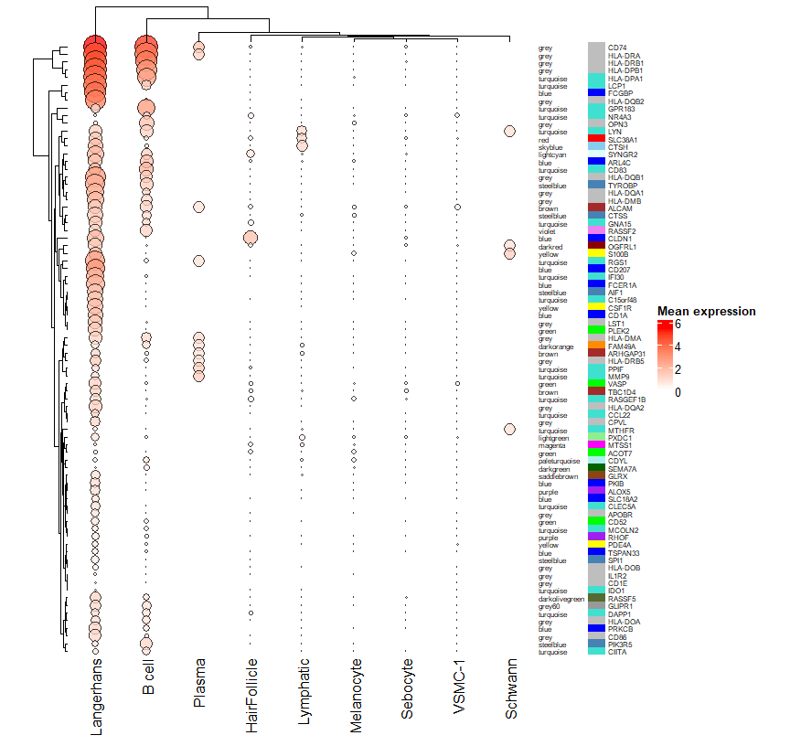
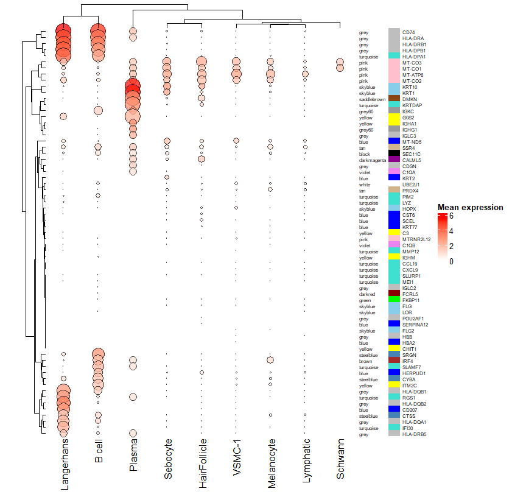
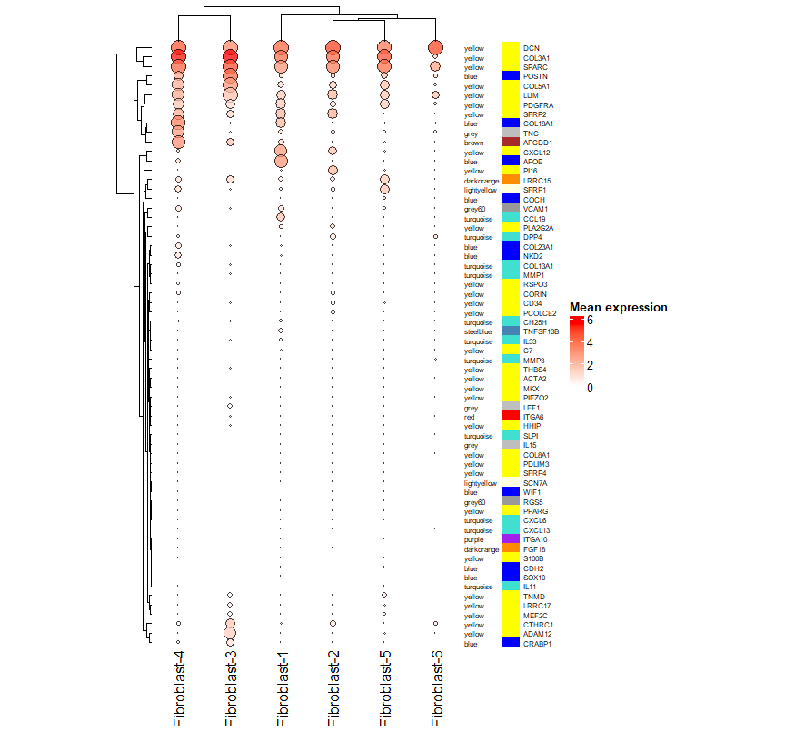

Cross-referencing with Broad single cell data
================
Ashley Rider
2025-07-01

- <a href="#preliminaries" id="toc-preliminaries">Preliminaries</a>
  - <a href="#load-packages" id="toc-load-packages">Load packages</a>
  - <a href="#load-data" id="toc-load-data">Load data</a>
- <a href="#heatmaps" id="toc-heatmaps">Heatmaps</a>
  - <a href="#kc" id="toc-kc">KC</a>
  - <a href="#fibro" id="toc-fibro">Fibro</a>
  - <a href="#t-cells" id="toc-t-cells">T-cells</a>
  - <a href="#myeloid" id="toc-myeloid">Myeloid</a>
  - <a href="#endo" id="toc-endo">Endo</a>
  - <a href="#mast" id="toc-mast">Mast</a>
  - <a href="#vsmc" id="toc-vsmc">VSMC</a>
  - <a href="#b-cells" id="toc-b-cells">B-cells</a>
  - <a href="#hair-follicle" id="toc-hair-follicle">Hair follicle</a>
  - <a href="#langerhans" id="toc-langerhans">Langerhans</a>
  - <a href="#lymphatic" id="toc-lymphatic">Lymphatic</a>
  - <a href="#melanocyte" id="toc-melanocyte">Melanocyte</a>
  - <a href="#plasma" id="toc-plasma">Plasma</a>
  - <a href="#schwann" id="toc-schwann">Schwann</a>
  - <a href="#sebocyte" id="toc-sebocyte">Sebocyte</a>
  - <a href="#fibro-new-differentiating-markers"
    id="toc-fibro-new-differentiating-markers">Fibro (new differentiating
    markers)</a>
- <a href="#session-information" id="toc-session-information">Session
  information</a>

# Preliminaries

## Load packages

``` r
library(tidyverse)
library(WGCNA)
library(gridExtra)
library(reshape2)
library(ComplexHeatmap)
library(circlize)
library(RColorBrewer)
library(mgsub)
library(readxl)
library(data.table)
```

## Load data

``` r
options(stringsAsFactors = F)

# Path to Broad SC data
file_path <- "C:/Users/b6054775A/Documents/PhD/data/Data_12-Mar-20/Broad_single_cell"

# Load expression file
dat <- fread(paste0(file_path,"/ExpressionFile.txt"))

# Load metadata
meta <- fread(paste0(file_path,"/MetadataUploadFinal.txt"))
meta <- meta[2:nrow(meta),]

# Skin modules
modules <- read.delim("results/WGCNA/01_Module_identification/Skin/modules.txt")
```

# Heatmaps

``` r
# Output directory
output_path <- "results/WGCNA/09_Broad_single_cell_heatmaps"
dir.create(output_path)

# Function to draw heatmaps
drawHeatmap <- function(expr_dat, meta_dat, pcnt_dat, circle_factor = 0.025){
  # Melt expression data
  expr_dat <- reshape2::melt(expr_dat)
  colnames(expr_dat) <- c("GENE", "NAME", "Expression")
  # Merge with metadata
  expr_dat <- merge(expr_dat, meta_dat, by = "NAME")
  # Calculate average expression for each gene in each cluster
  expr_dat <- expr_dat %>%
    group_by(GENE, Specific) %>%
    summarise(Mean = mean(Expression), Median = median(Expression))
  # Plot mean
  expr_dat <- tidyr::spread(expr_dat[,c("GENE", "Specific", "Mean")], Specific, Mean)
  # Coerce to matrix
  expr_dat <- as.data.frame(expr_dat)
  rownames(expr_dat) <- expr_dat$GENE
  expr_dat$GENE <- NULL
  expr_dat <- data.matrix(expr_dat)
  
  pcnt_dat <- tidyr::spread(pcnt_dat[,c("GENE", "Specific", "TRUE")], Specific, `TRUE`)
  pcnt_dat <- as.data.frame(pcnt_dat)
  rownames(pcnt_dat) <- pcnt_dat$GENE
  pcnt_dat$GENE <- NULL
  pcnt_dat <- data.matrix(pcnt_dat)
  
  # Module membership of markers
  modules <- modules %>% 
    select(GeneSymbol, Module) %>%
    filter(GeneSymbol %in% rownames(expr_dat))
  rownames(modules) <- modules$GeneSymbol
  # Order/subset rows
  expr_dat <- expr_dat[rownames(modules),]
  pcnt_dat <- pcnt_dat[rownames(modules),]
  # Row annotation to indicate module membership
  anno_col <- unique(modules$Module)
  names(anno_col) <- unique(modules$Module)
  side_anno = rowAnnotation(
    ModuleName = anno_text(modules$Module, gp = gpar(fontsize = 6)),
    ModuleColour = modules$Module,
    col = list(ModuleColour = anno_col),
    show_legend = F,
    show_annotation_name = F
  )
  # Change column names if looking at KT clusters
  colnames(expr_dat)[which(colnames(expr_dat) == "Keratinocyte-1")] <- "KC-1 (spinous)"
  colnames(expr_dat)[which(colnames(expr_dat) == "Keratinocyte-2")] <- "KC-2 (spinous)"
  colnames(expr_dat)[which(colnames(expr_dat) == "Keratinocyte-4")] <- "KC-4 (spinous)"
  colnames(expr_dat)[which(colnames(expr_dat) == "Keratinocyte-6")] <- "KC-6 (suprabasal)"
  colnames(expr_dat)[which(colnames(expr_dat) == "Keratinocyte-3")] <- "KC-3 (suprabasal)"
  colnames(expr_dat)[which(colnames(expr_dat) == "Keratinocyte-7")] <- "KC-7 (basal)"
  colnames(expr_dat)[which(colnames(expr_dat) == "Keratinocyte-8")] <- "KC-8 (basal)"
  colnames(expr_dat)[which(colnames(expr_dat) == "Keratinocyte-5")] <- "KC-5 (supra-spinous)"
  # Change column names if looking at KT clusters
  colnames(pcnt_dat)[which(colnames(pcnt_dat) == "Keratinocyte-1")] <- "KC-1 (spinous)"
  colnames(pcnt_dat)[which(colnames(pcnt_dat) == "Keratinocyte-2")] <- "KC-2 (spinous)"
  colnames(pcnt_dat)[which(colnames(pcnt_dat) == "Keratinocyte-4")] <- "KC-4 (spinous)"
  colnames(pcnt_dat)[which(colnames(pcnt_dat) == "Keratinocyte-6")] <- "KC-6 (suprabasal)"
  colnames(pcnt_dat)[which(colnames(pcnt_dat) == "Keratinocyte-3")] <- "KC-3 (suprabasal)"
  colnames(pcnt_dat)[which(colnames(pcnt_dat) == "Keratinocyte-7")] <- "KC-7 (basal)"
  colnames(pcnt_dat)[which(colnames(pcnt_dat) == "Keratinocyte-8")] <- "KC-8 (basal)"
  colnames(pcnt_dat)[which(colnames(pcnt_dat) == "Keratinocyte-5")] <- "KC-5 (supra-spinous)"
  # Draw heatmap
  col_ramp <- colorRamp2(breaks = c(0, max(expr_dat)), colors = c("white", "red"))
  hm <- Heatmap(
    expr_dat,
    col = col_ramp,
    rect_gp = gpar(type = "none"),
    width = ncol(expr_dat)*unit(15,"mm"),
    right_annotation = side_anno,
    row_names_gp = gpar(fontsize = 6),
    row_dend_side = "left",
    heatmap_legend_param = list(title = "Mean expression", legend_direction = "vertical"),
    cell_fun = function(j, i, x, y, w, h, col){
      grid.circle(x = x, y = y, r = pcnt_dat[i, j] * circle_factor, 
                  gp = gpar(fill = col_ramp(expr_dat[i, j]), col = "black",
                            alpha = 0.75))
    }
  )
  return(hm)
}
```

## KC

``` r
# Choose marker genes to plot
file_path <- "C:/Users/b6054775A/Documents/PhD/data/Data_12-Mar-20/Broad_single_cell"
markers <- read_xlsx(paste0(file_path,"/mmc4.xlsx"), sheet = "GenericSignatures") %>%
  filter(cluster == "KC") %>%
  slice_max(avg_logFC, n = 80) %>%
  pull(gene)
markers <- c(markers, "LTF")
# Subset metadata
meta_dat <- meta %>% filter(CellType1.50 == "KC", Condition == "Psoriasis")
# Subset expression data
cells <- c("GENE", meta_dat$NAME)
expr_dat <- as.data.frame(dat[GENE %in% markers, ..cells])
# Percentage expressed
pcnt_dat <- reshape2::melt(expr_dat)
pcnt_dat <- pcnt_dat %>%
  rename(all_of(c(NAME = "variable", Expression = "value"))) %>%
  left_join(meta_dat, by = "NAME") %>%
  mutate(Expressed = if_else(Expression > 0, T, F))
pcnt_dat <- pcnt_dat %>%
  group_by(Specific, GENE) %>%
  summarise("TRUE" = mean(Expressed),
            "FALSE" = mean(!Expressed)) %>%
  as.data.frame()
# Draw heatmap
hm <- drawHeatmap(expr_dat = expr_dat, meta_dat = meta_dat, pcnt_dat = pcnt_dat)
```

``` r
draw(hm)
```

<!-- -->

``` r
# Save
png(paste0(output_path,"/Broad_KC_markers.png"), 
    width = 9, height = 8.5, units = "in", res = 300)
ComplexHeatmap::draw(hm)
dev.off()
```

    ## png 
    ##   2

## Fibro

``` r
# Choose marker genes to plot
file_path <- "C:/Users/b6054775A/Documents/PhD/data/Data_12-Mar-20/Broad_single_cell"
markers <- read_xlsx(paste0(file_path,"/mmc4.xlsx"), sheet = "GenericSignatures") %>%
  filter(cluster == "Fibro") %>%
  slice_max(avg_logFC, n = 80) %>%
  pull(gene)
# Subset metadata
meta_dat <- meta %>% filter(CellType1.50 == "Fibro", Condition == "Psoriasis")
# Subset expression data
cells <- c("GENE", meta_dat$NAME)
expr_dat <- as.data.frame(dat[GENE %in% markers, ..cells])
# Percentage expressed
pcnt_dat <- melt(expr_dat)
pcnt_dat <- pcnt_dat %>%
  rename(all_of(c(NAME = "variable", Expression = "value"))) %>%
  left_join(meta_dat, by = "NAME") %>%
  mutate(Expressed = if_else(Expression > 0, T, F))
pcnt_dat <- pcnt_dat %>%
  group_by(Specific, GENE) %>%
  summarise("TRUE" = mean(Expressed),
            "FALSE" = mean(!Expressed)) %>%
  as.data.frame()
# Draw heatmap
hm <- drawHeatmap(expr_dat = expr_dat, meta_dat = meta_dat, pcnt_dat = pcnt_dat)
```

``` r
draw(hm)
```

<!-- -->

``` r
# Save
png(paste0(output_path,"/Fibro.png"), 
    width = 9, height = 8.5, units = "in", res = 300)
ComplexHeatmap::draw(hm)
dev.off()
```

    ## png 
    ##   2

## T-cells

``` r
# Choose marker genes to plot
file_path <- "C:/Users/b6054775A/Documents/PhD/data/Data_12-Mar-20/Broad_single_cell"
markers <- read_xlsx(paste0(file_path,"/mmc4.xlsx"), sheet = "GenericSignatures") %>%
  filter(cluster == "T") %>%
  slice_max(avg_logFC, n = 80) %>%
  pull(gene)
# Subset metadata
meta_dat <- meta %>% filter(CellType1.50 == "T", Condition == "Psoriasis")
# Subset expression data
cells <- c("GENE", meta_dat$NAME)
expr_dat <- as.data.frame(dat[GENE %in% markers, ..cells])
# Percentage expressed
pcnt_dat <- melt(expr_dat)
pcnt_dat <- pcnt_dat %>%
  rename(all_of(c(NAME = "variable", Expression = "value"))) %>%
  left_join(meta_dat, by = "NAME") %>%
  mutate(Expressed = if_else(Expression > 0, T, F))
pcnt_dat <- pcnt_dat %>%
  group_by(Specific, GENE) %>%
  summarise("TRUE" = mean(Expressed),
            "FALSE" = mean(!Expressed)) %>%
  as.data.frame()
# Draw heatmap
hm <- drawHeatmap(expr_dat = expr_dat, meta_dat = meta_dat, pcnt_dat = pcnt_dat)
```

``` r
draw(hm)
```

<!-- -->

``` r
# Save
png(paste0(output_path,"/T-cells.png"), 
    width = 9, height = 8.5, units = "in", res = 300)
ComplexHeatmap::draw(hm)
dev.off()
```

    ## png 
    ##   2

## Myeloid

``` r
# Choose marker genes to plot
file_path <- "C:/Users/b6054775A/Documents/PhD/data/Data_12-Mar-20/Broad_single_cell"
markers <- read_xlsx(paste0(file_path,"/mmc4.xlsx"), sheet = "GenericSignatures") %>%
  filter(cluster == "Myeloid") %>%
  slice_max(avg_logFC, n = 80) %>%
  pull(gene)
# Subset metadata
meta_dat <- meta %>% filter(CellType1.50 == "Myeloid", Condition == "Psoriasis")
# Subset expression data
cells <- c("GENE", meta_dat$NAME)
expr_dat <- as.data.frame(dat[GENE %in% markers, ..cells])
# Percentage expressed
pcnt_dat <- melt(expr_dat)
pcnt_dat <- pcnt_dat %>%
  rename(all_of(c(NAME = "variable", Expression = "value"))) %>%
  left_join(meta_dat, by = "NAME") %>%
  mutate(Expressed = if_else(Expression > 0, T, F))
pcnt_dat <- pcnt_dat %>%
  group_by(Specific, GENE) %>%
  summarise("TRUE" = mean(Expressed),
            "FALSE" = mean(!Expressed)) %>%
  as.data.frame()
# Draw heatmap
hm <- drawHeatmap(expr_dat = expr_dat, meta_dat = meta_dat, pcnt_dat = pcnt_dat)
```

``` r
draw(hm)
```

<!-- -->

``` r
# Save
png(paste0(output_path,"/Myeloid.png"), 
    width = 9, height = 8.5, units = "in", res = 300)
ComplexHeatmap::draw(hm)
dev.off()
```

    ## png 
    ##   2

## Endo

``` r
# Choose marker genes to plot
file_path <- "C:/Users/b6054775A/Documents/PhD/data/Data_12-Mar-20/Broad_single_cell"
markers <- read_xlsx(paste0(file_path,"/mmc4.xlsx"), sheet = "GenericSignatures") %>%
  filter(cluster == "Endo") %>%
  slice_max(avg_logFC, n = 80) %>%
  pull(gene)
# Subset metadata
meta_dat <- meta %>% filter(CellType1.50 == "Endo", Condition == "Psoriasis")
# Subset expression data
cells <- c("GENE", meta_dat$NAME)
expr_dat <- as.data.frame(dat[GENE %in% markers, ..cells])
# Percentage expressed
pcnt_dat <- melt(expr_dat)
pcnt_dat <- pcnt_dat %>%
  rename(all_of(c(NAME = "variable", Expression = "value"))) %>%
  left_join(meta_dat, by = "NAME") %>%
  mutate(Expressed = if_else(Expression > 0, T, F))
pcnt_dat <- pcnt_dat %>%
  group_by(Specific, GENE) %>%
  summarise("TRUE" = mean(Expressed),
            "FALSE" = mean(!Expressed)) %>%
  as.data.frame()
# Draw heatmap
hm <- drawHeatmap(expr_dat = expr_dat, meta_dat = meta_dat, pcnt_dat = pcnt_dat)
```

``` r
draw(hm)
```

<!-- -->

``` r
# Save
png(paste0(output_path,"/Endo.png"), 
    width = 9, height = 8.5, units = "in", res = 300)
ComplexHeatmap::draw(hm)
dev.off()
```

    ## png 
    ##   2

## Mast

``` r
# Choose marker genes to plot
file_path <- "C:/Users/b6054775A/Documents/PhD/data/Data_12-Mar-20/Broad_single_cell"
markers <- read_xlsx(paste0(file_path,"/mmc4.xlsx"), sheet = "GenericSignatures") %>%
  filter(cluster == "Mast") %>%
  slice_max(avg_logFC, n = 80) %>%
  pull(gene)
# Subset metadata
meta_dat <- meta %>% filter(CellType1.50 == "Mast", Condition == "Psoriasis")
# Subset expression data
cells <- c("GENE", meta_dat$NAME)
expr_dat <- as.data.frame(dat[GENE %in% markers, ..cells])
# Percentage expressed
pcnt_dat <- melt(expr_dat)
pcnt_dat <- pcnt_dat %>%
  rename(all_of(c(NAME = "variable", Expression = "value"))) %>%
  left_join(meta_dat, by = "NAME") %>%
  mutate(Expressed = if_else(Expression > 0, T, F))
pcnt_dat <- pcnt_dat %>%
  group_by(Specific, GENE) %>%
  summarise("TRUE" = mean(Expressed),
            "FALSE" = mean(!Expressed)) %>%
  as.data.frame()
# Draw heatmap
hm <- drawHeatmap(expr_dat = expr_dat, meta_dat = meta_dat, pcnt_dat = pcnt_dat)
```

``` r
draw(hm)
```

<!-- -->

``` r
# Save
png(paste0(output_path,"/Mast.png"), 
    width = 9, height = 8.5, units = "in", res = 300)
ComplexHeatmap::draw(hm)
dev.off()
```

    ## png 
    ##   2

## VSMC

``` r
# Choose marker genes to plot
file_path <- "C:/Users/b6054775A/Documents/PhD/data/Data_12-Mar-20/Broad_single_cell"
markers <- read_xlsx(paste0(file_path,"/mmc4.xlsx"), sheet = "GenericSignatures") %>%
  filter(cluster == "VSMC") %>%
  slice_max(avg_logFC, n = 80) %>%
  pull(gene)
# Subset metadata
meta_dat <- meta %>% filter(CellType1.50 %in% c("VSMC", "B", "HairFollicle", "Langerhans", "Lymphatic", 
                                                "Melanocyte", "Plasma", "Schwann", "Sebocyte"), 
                            Condition == "Psoriasis")
# Subset expression data
cells <- c("GENE", meta_dat$NAME)
expr_dat <- as.data.frame(dat[GENE %in% markers, ..cells])
# Percentage expressed
pcnt_dat <- melt(expr_dat)
pcnt_dat <- pcnt_dat %>%
  rename(all_of(c(NAME = "variable", Expression = "value"))) %>%
  left_join(meta_dat, by = "NAME") %>%
  mutate(Expressed = if_else(Expression > 0, T, F))
pcnt_dat <- pcnt_dat %>%
  group_by(Specific, GENE) %>%
  summarise("TRUE" = mean(Expressed),
            "FALSE" = mean(!Expressed)) %>%
  as.data.frame()
# Draw heatmap
hm <- drawHeatmap(expr_dat = expr_dat, meta_dat = meta_dat, pcnt_dat = pcnt_dat)
```

``` r
draw(hm)
```

<!-- -->

``` r
# Save
png(paste0(output_path,"/VSMC.png"), 
    width = 9, height = 8.5, units = "in", res = 300)
ComplexHeatmap::draw(hm)
dev.off()
```

    ## png 
    ##   2

## B-cells

``` r
# Choose marker genes to plot
file_path <- "C:/Users/b6054775A/Documents/PhD/data/Data_12-Mar-20/Broad_single_cell"
markers <- read_xlsx(paste0(file_path,"/mmc4.xlsx"), sheet = "GenericSignatures") %>%
  filter(cluster == "B") %>%
  slice_max(avg_logFC, n = 80) %>%
  pull(gene)
# Subset metadata
meta_dat <- meta %>% filter(CellType1.50 %in% c("VSMC", "B", "HairFollicle", "Langerhans", "Lymphatic", 
                                                "Melanocyte", "Plasma", "Schwann", "Sebocyte"), 
                            Condition == "Psoriasis")
# Subset expression data
cells <- c("GENE", meta_dat$NAME)
expr_dat <- as.data.frame(dat[GENE %in% markers, ..cells])
# Percentage expressed
pcnt_dat <- melt(expr_dat)
pcnt_dat <- pcnt_dat %>%
  rename(all_of(c(NAME = "variable", Expression = "value"))) %>%
  left_join(meta_dat, by = "NAME") %>%
  mutate(Expressed = if_else(Expression > 0, T, F))
pcnt_dat <- pcnt_dat %>%
  group_by(Specific, GENE) %>%
  summarise("TRUE" = mean(Expressed),
            "FALSE" = mean(!Expressed)) %>%
  as.data.frame()
# Draw heatmap
hm <- drawHeatmap(expr_dat = expr_dat, meta_dat = meta_dat, pcnt_dat = pcnt_dat)
```

``` r
draw(hm)
```

<!-- -->

``` r
# Save
png(paste0(output_path,"/B-cells.png"), 
    width = 9, height = 8.5, units = "in", res = 300)
ComplexHeatmap::draw(hm)
dev.off()
```

    ## png 
    ##   2

## Hair follicle

``` r
# Choose marker genes to plot
file_path <- "C:/Users/b6054775A/Documents/PhD/data/Data_12-Mar-20/Broad_single_cell"
markers <- read_xlsx(paste0(file_path,"/mmc4.xlsx"), sheet = "GenericSignatures") %>%
  filter(cluster == "HairFollicle") %>%
  slice_max(avg_logFC, n = 80) %>%
  pull(gene)
# Subset metadata
meta_dat <- meta %>% filter(CellType1.50 %in% c("VSMC", "B", "HairFollicle", "Langerhans", "Lymphatic", 
                                                "Melanocyte", "Plasma", "Schwann", "Sebocyte"), 
                            Condition == "Psoriasis")
# Subset expression data
cells <- c("GENE", meta_dat$NAME)
expr_dat <- as.data.frame(dat[GENE %in% markers, ..cells])
# Percentage expressed
pcnt_dat <- melt(expr_dat)
pcnt_dat <- pcnt_dat %>%
  rename(all_of(c(NAME = "variable", Expression = "value"))) %>%
  left_join(meta_dat, by = "NAME") %>%
  mutate(Expressed = if_else(Expression > 0, T, F))
pcnt_dat <- pcnt_dat %>%
  group_by(Specific, GENE) %>%
  summarise("TRUE" = mean(Expressed),
            "FALSE" = mean(!Expressed)) %>%
  as.data.frame()
# Draw heatmap
hm <- drawHeatmap(expr_dat = expr_dat, meta_dat = meta_dat, pcnt_dat = pcnt_dat)
```

``` r
draw(hm)
```

<!-- -->

``` r
# Save
png(paste0(output_path,"/HairFollicle.png"), 
    width = 9, height = 8.5, units = "in", res = 300)
ComplexHeatmap::draw(hm)
dev.off()
```

    ## png 
    ##   2

## Langerhans

``` r
# Choose marker genes to plot
file_path <- "C:/Users/b6054775A/Documents/PhD/data/Data_12-Mar-20/Broad_single_cell"
markers <- read_xlsx(paste0(file_path,"/mmc4.xlsx"), sheet = "GenericSignatures") %>%
  filter(cluster == "Langerhans") %>%
  slice_max(avg_logFC, n = 80) %>%
  pull(gene)
# Subset metadata
meta_dat <- meta %>% filter(CellType1.50 %in% c("VSMC", "B", "HairFollicle", "Langerhans", "Lymphatic", 
                                                "Melanocyte", "Plasma", "Schwann", "Sebocyte"), 
                            Condition == "Psoriasis")
# Subset expression data
cells <- c("GENE", meta_dat$NAME)
expr_dat <- as.data.frame(dat[GENE %in% markers, ..cells])
# Percentage expressed
pcnt_dat <- melt(expr_dat)
pcnt_dat <- pcnt_dat %>%
  rename(all_of(c(NAME = "variable", Expression = "value"))) %>%
  left_join(meta_dat, by = "NAME") %>%
  mutate(Expressed = if_else(Expression > 0, T, F))
pcnt_dat <- pcnt_dat %>%
  group_by(Specific, GENE) %>%
  summarise("TRUE" = mean(Expressed),
            "FALSE" = mean(!Expressed)) %>%
  as.data.frame()
# Draw heatmap
hm <- drawHeatmap(expr_dat = expr_dat, meta_dat = meta_dat, pcnt_dat = pcnt_dat)
```

``` r
draw(hm)
```

<!-- -->

``` r
# Save
png(paste0(output_path,"/Langerhans.png"), 
    width = 9, height = 8.5, units = "in", res = 300)
ComplexHeatmap::draw(hm)
dev.off()
```

    ## png 
    ##   2

## Lymphatic

``` r
# Choose marker genes to plot
file_path <- "C:/Users/b6054775A/Documents/PhD/data/Data_12-Mar-20/Broad_single_cell"
markers <- read_xlsx(paste0(file_path,"/mmc4.xlsx"), sheet = "GenericSignatures") %>%
  filter(cluster == "Lymphatic") %>%
  slice_max(avg_logFC, n = 80) %>%
  pull(gene)
# Subset metadata
meta_dat <- meta %>% filter(CellType1.50 %in% c("VSMC", "B", "HairFollicle", "Langerhans", "Lymphatic", 
                                                "Melanocyte", "Plasma", "Schwann", "Sebocyte"), 
                            Condition == "Psoriasis")
# Subset expression data
cells <- c("GENE", meta_dat$NAME)
expr_dat <- as.data.frame(dat[GENE %in% markers, ..cells])
# Percentage expressed
pcnt_dat <- melt(expr_dat)
pcnt_dat <- pcnt_dat %>%
  rename(all_of(c(NAME = "variable", Expression = "value"))) %>%
  left_join(meta_dat, by = "NAME") %>%
  mutate(Expressed = if_else(Expression > 0, T, F))
pcnt_dat <- pcnt_dat %>%
  group_by(Specific, GENE) %>%
  summarise("TRUE" = mean(Expressed),
            "FALSE" = mean(!Expressed)) %>%
  as.data.frame()
# Draw heatmap
hm <- drawHeatmap(expr_dat = expr_dat, meta_dat = meta_dat, pcnt_dat = pcnt_dat)
```

``` r
draw(hm)
```

<!-- -->

``` r
# Save
png(paste0(output_path,"/Lymphatic.png"), 
    width = 9, height = 8.5, units = "in", res = 300)
ComplexHeatmap::draw(hm)
dev.off()
```

    ## png 
    ##   2

## Melanocyte

``` r
# Choose marker genes to plot
file_path <- "C:/Users/b6054775A/Documents/PhD/data/Data_12-Mar-20/Broad_single_cell"
markers <- read_xlsx(paste0(file_path,"/mmc4.xlsx"), sheet = "GenericSignatures") %>%
  filter(cluster == "Melanocyte") %>%
  slice_max(avg_logFC, n = 80) %>%
  pull(gene)
# Subset metadata
meta_dat <- meta %>% filter(CellType1.50 %in% c("VSMC", "B", "HairFollicle", "Langerhans", "Lymphatic", 
                                                "Melanocyte", "Plasma", "Schwann", "Sebocyte"), 
                            Condition == "Psoriasis")
# Subset expression data
cells <- c("GENE", meta_dat$NAME)
expr_dat <- as.data.frame(dat[GENE %in% markers, ..cells])
# Percentage expressed
pcnt_dat <- melt(expr_dat)
pcnt_dat <- pcnt_dat %>%
  rename(all_of(c(NAME = "variable", Expression = "value"))) %>%
  left_join(meta_dat, by = "NAME") %>%
  mutate(Expressed = if_else(Expression > 0, T, F))
pcnt_dat <- pcnt_dat %>%
  group_by(Specific, GENE) %>%
  summarise("TRUE" = mean(Expressed),
            "FALSE" = mean(!Expressed)) %>%
  as.data.frame()
# Draw heatmap
hm <- drawHeatmap(expr_dat = expr_dat, meta_dat = meta_dat, pcnt_dat = pcnt_dat)
```

``` r
draw(hm)
```

<!-- -->

``` r
# Save
png(paste0(output_path,"/Melanocyte.png"), 
    width = 9, height = 8.5, units = "in", res = 300)
ComplexHeatmap::draw(hm)
dev.off()
```

    ## png 
    ##   2

## Plasma

``` r
# Choose marker genes to plot
file_path <- "C:/Users/b6054775A/Documents/PhD/data/Data_12-Mar-20/Broad_single_cell"
markers <- read_xlsx(paste0(file_path,"/mmc4.xlsx"), sheet = "GenericSignatures") %>%
  filter(cluster == "Plasma") %>%
  slice_max(avg_logFC, n = 80) %>%
  pull(gene)
# Subset metadata
meta_dat <- meta %>% filter(CellType1.50 %in% c("VSMC", "B", "HairFollicle", "Langerhans", "Lymphatic", 
                                                "Melanocyte", "Plasma", "Schwann", "Sebocyte"), 
                            Condition == "Psoriasis")
# Subset expression data
cells <- c("GENE", meta_dat$NAME)
expr_dat <- as.data.frame(dat[GENE %in% markers, ..cells])
# Percentage expressed
pcnt_dat <- melt(expr_dat)
pcnt_dat <- pcnt_dat %>%
  rename(all_of(c(NAME = "variable", Expression = "value"))) %>%
  left_join(meta_dat, by = "NAME") %>%
  mutate(Expressed = if_else(Expression > 0, T, F))
pcnt_dat <- pcnt_dat %>%
  group_by(Specific, GENE) %>%
  summarise("TRUE" = mean(Expressed),
            "FALSE" = mean(!Expressed)) %>%
  as.data.frame()
# Draw heatmap
hm <- drawHeatmap(expr_dat = expr_dat, meta_dat = meta_dat, pcnt_dat = pcnt_dat)
```

``` r
draw(hm)
```

<!-- -->

``` r
# Save
png(paste0(output_path,"/Plasma.png"), 
    width = 9, height = 8.5, units = "in", res = 300)
ComplexHeatmap::draw(hm)
dev.off()
```

    ## png 
    ##   2

## Schwann

``` r
# Choose marker genes to plot
file_path <- "C:/Users/b6054775A/Documents/PhD/data/Data_12-Mar-20/Broad_single_cell"
markers <- read_xlsx(paste0(file_path,"/mmc4.xlsx"), sheet = "GenericSignatures") %>%
  filter(cluster == "Schwann") %>%
  slice_max(avg_logFC, n = 80) %>%
  pull(gene)
# Subset metadata
meta_dat <- meta %>% filter(CellType1.50 %in% c("VSMC", "B", "HairFollicle", "Langerhans", "Lymphatic", 
                                                "Melanocyte", "Plasma", "Schwann", "Sebocyte"), 
                            Condition == "Psoriasis")
# Subset expression data
cells <- c("GENE", meta_dat$NAME)
expr_dat <- as.data.frame(dat[GENE %in% markers, ..cells])
# Percentage expressed
pcnt_dat <- melt(expr_dat)
pcnt_dat <- pcnt_dat %>%
  rename(all_of(c(NAME = "variable", Expression = "value"))) %>%
  left_join(meta_dat, by = "NAME") %>%
  mutate(Expressed = if_else(Expression > 0, T, F))
pcnt_dat <- pcnt_dat %>%
  group_by(Specific, GENE) %>%
  summarise("TRUE" = mean(Expressed),
            "FALSE" = mean(!Expressed)) %>%
  as.data.frame()
# Draw heatmap
hm <- drawHeatmap(expr_dat = expr_dat, meta_dat = meta_dat, pcnt_dat = pcnt_dat)
```

``` r
draw(hm)
```

<!-- -->

``` r
# Save
png(paste0(output_path,"/Schwann.png"), 
    width = 9, height = 8.5, units = "in", res = 300)
ComplexHeatmap::draw(hm)
dev.off()
```

    ## png 
    ##   2

## Sebocyte

``` r
# Choose marker genes to plot
file_path <- "C:/Users/b6054775A/Documents/PhD/data/Data_12-Mar-20/Broad_single_cell"
markers <- read_xlsx(paste0(file_path,"/mmc4.xlsx"), sheet = "GenericSignatures") %>%
  filter(cluster == "Sebocyte") %>%
  slice_max(avg_logFC, n = 80) %>%
  pull(gene)
# Subset metadata
meta_dat <- meta %>% filter(CellType1.50 %in% c("VSMC", "B", "HairFollicle", "Langerhans", "Lymphatic", 
                                                "Melanocyte", "Plasma", "Schwann", "Sebocyte"), 
                            Condition == "Psoriasis")
# Subset expression data
cells <- c("GENE", meta_dat$NAME)
expr_dat <- as.data.frame(dat[GENE %in% markers, ..cells])
# Percentage expressed
pcnt_dat <- melt(expr_dat)
pcnt_dat <- pcnt_dat %>%
  rename(all_of(c(NAME = "variable", Expression = "value"))) %>%
  left_join(meta_dat, by = "NAME") %>%
  mutate(Expressed = if_else(Expression > 0, T, F))
pcnt_dat <- pcnt_dat %>%
  group_by(Specific, GENE) %>%
  summarise("TRUE" = mean(Expressed),
            "FALSE" = mean(!Expressed)) %>%
  as.data.frame()
# Draw heatmap
hm <- drawHeatmap(expr_dat = expr_dat, meta_dat = meta_dat, pcnt_dat = pcnt_dat)
```

``` r
draw(hm)
```

<!-- -->

``` r
# Save
png(paste0(output_path,"/Sebocyte.png"), 
    width = 9, height = 8.5, units = "in", res = 300)
ComplexHeatmap::draw(hm)
dev.off()
```

    ## png 
    ##   2

## Fibro (new differentiating markers)

``` r
# Choose marker genes to plot
markers <- unique(c(
  "DCN", "COL3A1", "SPARC", "APOE", "CXCL12", "COL18A1", "LUM",
  "PDGFRA", "APCDD1", "CCL19", "COL8A1", "DPEP1", "LEF1", "MKX",
  "TNMD", "FGF18", "HHIP", "S100B", "SOX10", "MYL4", "COL5A1",
  "VCAM1", "POSTN", "TNC", "SFRP1", "PI16", "C7", "PLA2G2A",
  "CH25H", "TNFSF13B", "MEF2C", "IL15", "WIF1", "RSPO4", "CRABP1",
  "ITGA6", "PPARG", "COCH", "RGS5", "SLPI", "NKD2", "COL23A1",
  "IL33", "CD34", "PCOLCE2", "RSPO3", "CORIN", "COL13A1", "DPP4",
  "SCN7A", "CCL19", "TNC", "LRRC15", "PDLIM3", "LRRC17", "CTHRC1",
  "ACTA2", "SFRP4", "MMP1", "PIEZO2", "THBS4", "CXCL6", "CXCL5",
  "CXCL13", "ADAM12", "MMP3", "CDH2", "IL24", "ITGA10", "IL11",
  "SFRP1", "SFRP2", "SFRP3", "SFRP4"
))
# Subset metadata
meta_dat <- meta %>% filter(CellType1.50 == "Fibro", Condition == "Psoriasis")
# Subset expression data
cells <- c("GENE", meta_dat$NAME)
expr_dat <- as.data.frame(dat[GENE %in% markers, ..cells])
# Percentage expressed
pcnt_dat <- melt(expr_dat)
pcnt_dat <- pcnt_dat %>%
  rename(all_of(c(NAME = "variable", Expression = "value"))) %>%
  left_join(meta_dat, by = "NAME") %>%
  mutate(Expressed = if_else(Expression > 0, T, F))
pcnt_dat <- pcnt_dat %>%
  group_by(Specific, GENE) %>%
  summarise("TRUE" = mean(Expressed),
            "FALSE" = mean(!Expressed)) %>%
  as.data.frame()
# Draw heatmap
hm <- drawHeatmap(expr_dat = expr_dat, meta_dat = meta_dat, pcnt_dat = pcnt_dat)
```

``` r
draw(hm)
```

<!-- -->

``` r
# Save
png(paste0(output_path,"/Fibro_new_diff_markers.png"), 
    width = 9, height = 8.5, units = "in", res = 300)
ComplexHeatmap::draw(hm)
dev.off()
```

    ## png 
    ##   2

# Session information

``` r
sessionInfo()
```

    ## R version 4.2.3 (2023-03-15 ucrt)
    ## Platform: x86_64-w64-mingw32/x64 (64-bit)
    ## Running under: Windows 10 x64 (build 19045)
    ## 
    ## Matrix products: default
    ## 
    ## locale:
    ## [1] LC_COLLATE=English_United Kingdom.utf8 
    ## [2] LC_CTYPE=English_United Kingdom.utf8   
    ## [3] LC_MONETARY=English_United Kingdom.utf8
    ## [4] LC_NUMERIC=C                           
    ## [5] LC_TIME=English_United Kingdom.utf8    
    ## 
    ## attached base packages:
    ## [1] grid      stats     graphics  grDevices utils     datasets  methods  
    ## [8] base     
    ## 
    ## other attached packages:
    ##  [1] data.table_1.14.8     readxl_1.4.2          mgsub_1.7.3          
    ##  [4] RColorBrewer_1.1-3    circlize_0.4.15       ComplexHeatmap_2.14.0
    ##  [7] reshape2_1.4.4        gridExtra_2.3         WGCNA_1.72-1         
    ## [10] fastcluster_1.2.3     dynamicTreeCut_1.63-1 lubridate_1.9.2      
    ## [13] forcats_1.0.0         stringr_1.5.0         dplyr_1.1.0          
    ## [16] purrr_1.0.1           readr_2.1.4           tidyr_1.3.0          
    ## [19] tibble_3.2.0          ggplot2_3.4.2         tidyverse_2.0.0      
    ## 
    ## loaded via a namespace (and not attached):
    ##  [1] bitops_1.0-7           matrixStats_0.63.0     bit64_4.0.5           
    ##  [4] doParallel_1.0.17      httr_1.4.5             rprojroot_2.0.3       
    ##  [7] GenomeInfoDb_1.34.9    tools_4.2.3            backports_1.4.1       
    ## [10] utf8_1.2.3             R6_2.5.1               rpart_4.1.19          
    ## [13] Hmisc_5.0-1            DBI_1.1.3              BiocGenerics_0.44.0   
    ## [16] colorspace_2.1-0       GetoptLong_1.0.5       nnet_7.3-18           
    ## [19] withr_2.5.0            tidyselect_1.2.0       preprocessCore_1.60.2 
    ## [22] bit_4.0.5              compiler_4.2.3         cli_3.6.0             
    ## [25] Biobase_2.58.0         htmlTable_2.4.1        Cairo_1.6-0           
    ## [28] scales_1.2.1           checkmate_2.1.0        digest_0.6.31         
    ## [31] foreign_0.8-84         rmarkdown_2.20         XVector_0.38.0        
    ## [34] base64enc_0.1-3        pkgconfig_2.0.3        htmltools_0.5.4       
    ## [37] highr_0.10             fastmap_1.1.1          GlobalOptions_0.1.2   
    ## [40] htmlwidgets_1.6.2      rlang_1.1.0            impute_1.72.3         
    ## [43] rstudioapi_0.14        RSQLite_2.3.0          shape_1.4.6           
    ## [46] generics_0.1.3         RCurl_1.98-1.10        magrittr_2.0.3        
    ## [49] GO.db_3.16.0           GenomeInfoDbData_1.2.9 Formula_1.2-5         
    ## [52] Matrix_1.6-1.1         Rcpp_1.0.10            munsell_0.5.0         
    ## [55] S4Vectors_0.36.2       fansi_1.0.4            lifecycle_1.0.3       
    ## [58] stringi_1.7.12         yaml_2.3.7             zlibbioc_1.44.0       
    ## [61] plyr_1.8.8             blob_1.2.4             parallel_4.2.3        
    ## [64] crayon_1.5.2           lattice_0.20-45        Biostrings_2.66.0     
    ## [67] splines_4.2.3          hms_1.1.2              KEGGREST_1.38.0       
    ## [70] knitr_1.42             pillar_1.8.1           rjson_0.2.21          
    ## [73] codetools_0.2-19       stats4_4.2.3           glue_1.6.2            
    ## [76] evaluate_0.20          png_0.1-8              vctrs_0.6.0           
    ## [79] tzdb_0.3.0             foreach_1.5.2          cellranger_1.1.0      
    ## [82] gtable_0.3.2           clue_0.3-64            cachem_1.0.7          
    ## [85] xfun_0.39              survival_3.5-3         iterators_1.0.14      
    ## [88] AnnotationDbi_1.60.2   memoise_2.0.1          IRanges_2.32.0        
    ## [91] cluster_2.1.4          timechange_0.2.0       ellipsis_0.3.2
