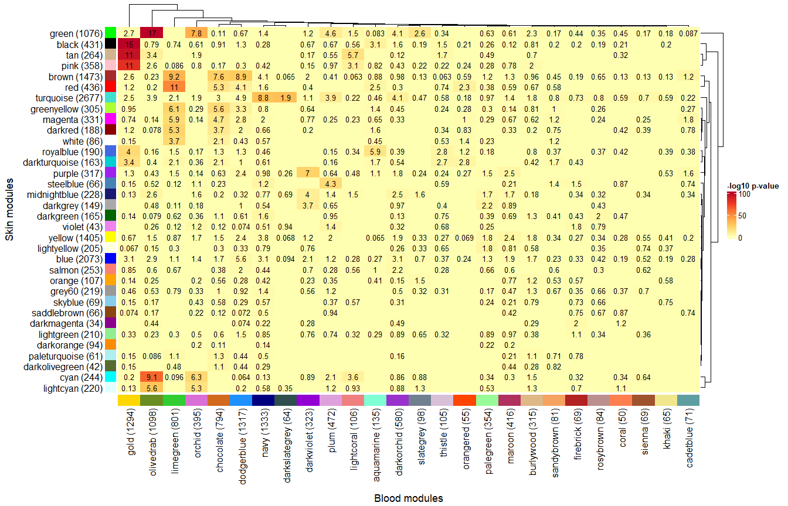
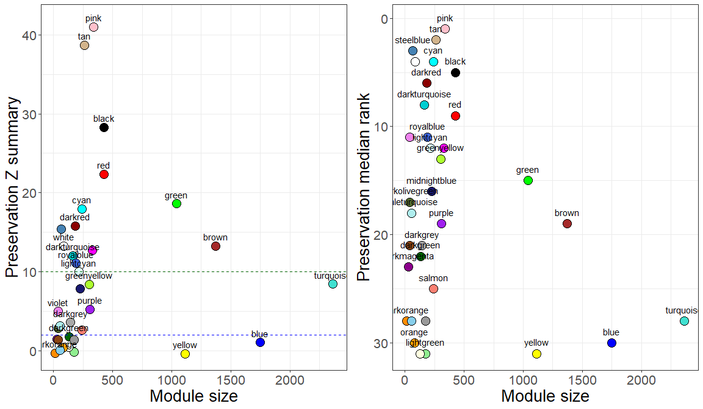
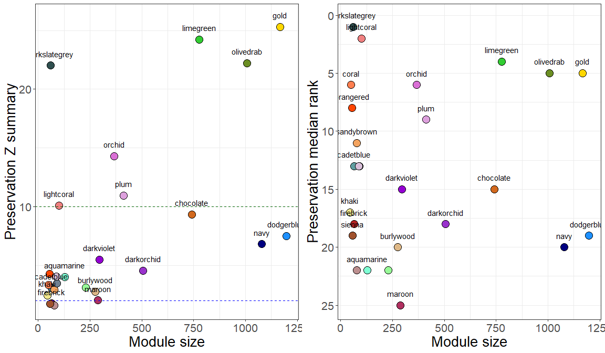

Module preservation plots
================
Ashley Rider
2025-06-11

- <a href="#preliminaries" id="toc-preliminaries">Preliminaries</a>
  - <a href="#load-packages" id="toc-load-packages">Load packages</a>
  - <a href="#load-data" id="toc-load-data">Load data</a>
  - <a href="#output-directory" id="toc-output-directory">Output
    directory</a>
- <a href="#functions" id="toc-functions">Functions</a>
- <a href="#heatmap" id="toc-heatmap">Heatmap</a>
- <a href="#preservation-plots" id="toc-preservation-plots">Preservation
  plots</a>
- <a href="#session-information" id="toc-session-information">Session
  information</a>

# Preliminaries

## Load packages

``` r
library(tidyverse)
library(WGCNA)
library(gridExtra)
library(reshape2)
library(ComplexHeatmap)
library(circlize)
library(RColorBrewer)
library(mgsub)
library(readxl)
```

## Load data

``` r
# Module genes
modules <- list(
  Skin = read.delim("results/WGCNA/01_Module_identification/Skin/modules.txt"),
  Blood = read.delim("results/WGCNA/01_Module_identification/Blood/modules.txt")
)
```

## Output directory

``` r
output_path <- "results/WGCNA/11_Module_preservation_plots"
dir.create(output_path)
```

# Functions

``` r
overlapHeatmap <- function(mods1, mods2, title1, title2, show_grey = F){
  n_mat <- matrix(data = NA, nrow = length(mods1), ncol = length(mods2), dimnames = list(names(mods1), names(mods2)))
  p_mat <- n_mat
  df <- data.frame(EnsemblID = intersect(bind_rows(mods1)$EnsemblID, bind_rows(mods2)$EnsemblID))
  for(i in 1:length(mods1)){
    for(j in 1:length(mods2)){
      # N overlap matrix
      genes1 <- mods1[[rownames(n_mat)[i]]]$EnsemblID
      genes2 <- mods2[[colnames(n_mat)[j]]]$EnsemblID
      n_mat[i, j] <- signif((length(intersect(genes1, genes2))/length(unique(c(genes1, genes2))))*100,2)
      # P-value matrix
      df <- df %>% 
        mutate(Module1 = ifelse(EnsemblID %in% genes1, T, F)) %>%
        mutate(Module2 = ifelse(EnsemblID %in% genes2, T, F))
      p_mat[i, j] <- -log10(fisher.test(table(df$Module1, df$Module2), alternative = "greater")$p.value)
    }
  }
  
  if(show_grey == F){
    p_mat <- p_mat[rownames(p_mat)[rownames(p_mat) != "grey"], colnames(p_mat)[colnames(p_mat) != "grey"]]
    n_mat <- n_mat[rownames(n_mat)[rownames(n_mat) != "grey"], colnames(n_mat)[colnames(n_mat) != "grey"]]
  }
  
  n_mat[which(n_mat == 0)] <- ""
  
  
  # Row annotation
  anno_col <- rownames(p_mat)
  names(anno_col) <- rownames(p_mat)
  row_anno = rowAnnotation(
    Module = rownames(p_mat),
    col = list(Module = anno_col),
    show_legend = F,
    show_annotation_name = F
  )
  # Column annotation
  anno_col <- colnames(p_mat)
  names(anno_col) <- colnames(p_mat)
  column_anno = HeatmapAnnotation(
    Module = colnames(p_mat),
    col = list(Module = anno_col),
    show_legend = F,
    show_annotation_name = F
  )
  
  for(i in 1:nrow(p_mat)){
    rownames(p_mat)[i] <- paste0(
      rownames(p_mat)[i]," (",length(mods1[[rownames(p_mat)[i]]]$EnsemblID),")"
    )
    rownames(n_mat)[i] <- paste0(
      rownames(n_mat)[i]," (",length(mods1[[rownames(n_mat)[i]]]$EnsemblID),")"
    )
  }
  
  for(i in 1:ncol(p_mat)){
    colnames(p_mat)[i] <- paste0(
      colnames(p_mat)[i]," (",length(mods2[[colnames(p_mat)[i]]]$EnsemblID),")"
    )
    colnames(n_mat)[i] <- paste0(
      colnames(n_mat)[i]," (",length(mods2[[colnames(n_mat)[i]]]$EnsemblID),")"
    )
  }
  
  
  # Heatmap
  hm <- Heatmap(
    p_mat,
    col = colorRamp2(seq(0, 100, 25), brewer.pal(name = "YlOrRd", n = 5)),
    #col = colorRamp2(breaks = c(0, 25, 50, 75, 100), colors = c("white", "yellow", "orange", "red", "darkred")),
    heatmap_legend_param = list(title = "-log10 p-value", legend_direction = "vertical"),
    bottom_annotation = column_anno,
    left_annotation = row_anno,
    show_column_names = T,
    show_row_names = T,
    row_names_side = "left",
    row_dend_side = "right",
    row_title = title1,
    row_title_side = "left",
    column_title = title2,
    column_title_side = "bottom",
    cell_fun = function(j, i, x, y, w, h, col){
      grid.text(n_mat[i, j], x, y, gp = gpar(fontsize = 10, col = "black"))
    }
  )
  return(hm)
}

preservationPlots <- function(dat){
  dat <- cbind(dat$preservation$observed$ref.Set1$inColumnsAlsoPresentIn.Set2,
               dat$preservation$Z$ref.Set1$inColumnsAlsoPresentIn.Set2)
  dat <- dat[,!duplicated(colnames(dat))]
  dat <- rownames_to_column(dat, var = "Module")
  dat <- dat %>% filter(!Module %in% c("grey", "random_sample"))
  color_values <- dat$Module
  names(color_values) <- color_values
  p1 <- ggplot(data = dat, aes(x = moduleSize, y = Zsummary.pres, fill = Module, label = Module)) +
    geom_point(shape = 21, size = 5, color = "black") +
    geom_text(check_overlap = T, vjust = 0, nudge_y = 0.75) +
    scale_fill_manual(values = color_values) +
    geom_hline(yintercept = 2, color = "blue", linetype = "dashed", linewidth = 0.7) +
    geom_hline(yintercept = 10, color = "darkgreen", linetype = "dashed", linewidth = 0.7) +
    labs(x = "Module size", y = "Preservation Z summary") +
    theme_bw() +
    theme(legend.position = "none", 
          text = element_text(size = 20))
  p2 <- ggplot(data = dat, aes(x = moduleSize, y = medianRank.pres, fill = Module, label = Module)) +
    geom_point(shape = 21, size = 5, color = "black") +
    geom_text(check_overlap = T, vjust = 0, nudge_y = 0.75) +
    scale_y_reverse() +
    scale_fill_manual(values = color_values) +
    labs(x = "Module size", y = "Preservation median rank") +
    theme_bw() +
    theme(legend.position = "none", 
          text = element_text(size = 20))
  grid.arrange(p1, p2, ncol = 2)
}
```

# Heatmap

``` r
# Reformat module genes for drawing heatmap
modules_list <- list()
modules_list$Skin <- lapply(X = unique(modules$Skin$Module), FUN = function(x){
  modules$Skin %>% filter(Module == x)
})
names(modules_list$Skin) <- unique(modules$Skin$Module)
modules_list$Blood <- lapply(X = unique(modules$Blood$Module), FUN = function(x){
  modules$Blood %>% filter(Module == x)
})
names(modules_list$Blood) <- unique(modules$Blood$Module)

# Draw heatmap
hm <- overlapHeatmap(
  mods1 = modules_list$Skin, 
  mods2 = modules_list$Blood, 
  title1 = "Skin modules", 
  title2 = "Blood modules"
)
```

``` r
draw(hm)
```

<!-- -->

``` r
# Save
png(paste0(output_path,"/heatmap.png"), width = 14, height = 9, units = "in", res = 300)
draw(hm)
dev.off()
```

    ## png 
    ##   2

# Preservation plots

``` r
# Skin-blood
dat <- readRDS("results/WGCNA/10_Module_preservation_analysis/Skin-blood/mp.rds")
```

``` r
preservationPlots(dat = dat)
```

<!-- -->

``` r
# Save
png(paste0(output_path,"/Skin-blood.png"), width = 12, height = 7, units = "in", res = 300)
preservationPlots(dat = dat)
dev.off()
```

    ## png 
    ##   2

``` r
# Blood-skin
dat <- readRDS("results/WGCNA/10_Module_preservation_analysis/Blood-skin/mp.rds")
```

``` r
preservationPlots(dat = dat)
```

<!-- -->

``` r
# Save
png(paste0(output_path,"/Blood-skin.png"), width = 12, height = 7, units = "in", res = 300)
preservationPlots(dat = dat)
dev.off()
```

    ## png 
    ##   2

# Session information

``` r
sessionInfo()
```

    ## R version 4.2.3 (2023-03-15 ucrt)
    ## Platform: x86_64-w64-mingw32/x64 (64-bit)
    ## Running under: Windows 10 x64 (build 19045)
    ## 
    ## Matrix products: default
    ## 
    ## locale:
    ## [1] LC_COLLATE=English_United Kingdom.utf8 
    ## [2] LC_CTYPE=English_United Kingdom.utf8   
    ## [3] LC_MONETARY=English_United Kingdom.utf8
    ## [4] LC_NUMERIC=C                           
    ## [5] LC_TIME=English_United Kingdom.utf8    
    ## 
    ## attached base packages:
    ## [1] grid      stats     graphics  grDevices utils     datasets  methods  
    ## [8] base     
    ## 
    ## other attached packages:
    ##  [1] readxl_1.4.2          mgsub_1.7.3           RColorBrewer_1.1-3   
    ##  [4] circlize_0.4.15       ComplexHeatmap_2.14.0 reshape2_1.4.4       
    ##  [7] gridExtra_2.3         WGCNA_1.72-1          fastcluster_1.2.3    
    ## [10] dynamicTreeCut_1.63-1 lubridate_1.9.2       forcats_1.0.0        
    ## [13] stringr_1.5.0         dplyr_1.1.0           purrr_1.0.1          
    ## [16] readr_2.1.4           tidyr_1.3.0           tibble_3.2.0         
    ## [19] ggplot2_3.4.2         tidyverse_2.0.0      
    ## 
    ## loaded via a namespace (and not attached):
    ##  [1] bitops_1.0-7           matrixStats_0.63.0     bit64_4.0.5           
    ##  [4] doParallel_1.0.17      httr_1.4.5             rprojroot_2.0.3       
    ##  [7] GenomeInfoDb_1.34.9    tools_4.2.3            backports_1.4.1       
    ## [10] utf8_1.2.3             R6_2.5.1               rpart_4.1.19          
    ## [13] Hmisc_5.0-1            DBI_1.1.3              BiocGenerics_0.44.0   
    ## [16] colorspace_2.1-0       GetoptLong_1.0.5       nnet_7.3-18           
    ## [19] withr_2.5.0            tidyselect_1.2.0       preprocessCore_1.60.2 
    ## [22] bit_4.0.5              compiler_4.2.3         cli_3.6.0             
    ## [25] Biobase_2.58.0         htmlTable_2.4.1        Cairo_1.6-0           
    ## [28] labeling_0.4.2         scales_1.2.1           checkmate_2.1.0       
    ## [31] digest_0.6.31          foreign_0.8-84         rmarkdown_2.20        
    ## [34] XVector_0.38.0         base64enc_0.1-3        pkgconfig_2.0.3       
    ## [37] htmltools_0.5.4        highr_0.10             fastmap_1.1.1         
    ## [40] GlobalOptions_0.1.2    htmlwidgets_1.6.2      rlang_1.1.0           
    ## [43] impute_1.72.3          rstudioapi_0.14        RSQLite_2.3.0         
    ## [46] farver_2.1.1           shape_1.4.6            generics_0.1.3        
    ## [49] RCurl_1.98-1.10        magrittr_2.0.3         GO.db_3.16.0          
    ## [52] GenomeInfoDbData_1.2.9 Formula_1.2-5          Matrix_1.6-1.1        
    ## [55] Rcpp_1.0.10            munsell_0.5.0          S4Vectors_0.36.2      
    ## [58] fansi_1.0.4            lifecycle_1.0.3        stringi_1.7.12        
    ## [61] yaml_2.3.7             zlibbioc_1.44.0        plyr_1.8.8            
    ## [64] blob_1.2.4             parallel_4.2.3         crayon_1.5.2          
    ## [67] lattice_0.20-45        Biostrings_2.66.0      splines_4.2.3         
    ## [70] hms_1.1.2              KEGGREST_1.38.0        knitr_1.42            
    ## [73] pillar_1.8.1           rjson_0.2.21           codetools_0.2-19      
    ## [76] stats4_4.2.3           glue_1.6.2             evaluate_0.20         
    ## [79] data.table_1.14.8      png_0.1-8              vctrs_0.6.0           
    ## [82] tzdb_0.3.0             foreach_1.5.2          cellranger_1.1.0      
    ## [85] gtable_0.3.2           clue_0.3-64            cachem_1.0.7          
    ## [88] xfun_0.39              survival_3.5-3         iterators_1.0.14      
    ## [91] AnnotationDbi_1.60.2   memoise_2.0.1          IRanges_2.32.0        
    ## [94] cluster_2.1.4          timechange_0.2.0       ellipsis_0.3.2
